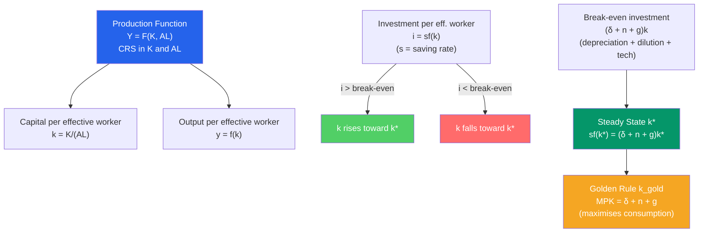

# 🌱 Solow Growth Model

> [!abstract] TL;DR
> The Solow model (Robert Solow, 1956) explains long-run economic growth via capital accumulation, depreciation, population growth, and exogenous technological progress. The key equation $\dot{k} = sf(k) - (\delta + n)k$ shows capital per worker converges to a steady state $k^*$ where investment equals depreciation and dilution. In the long run, only technological progress $g$ drives sustained growth in living standards — making it the most important equation in growth theory.

## Intuition — analogy FIRST

Imagine a fishing village with nets (capital) and fishermen (labour). Every year, villagers spend some of their catch fixing and building new nets (saving/investment). But nets wear out ($\delta$) and the village population grows ($n$), so each fisherman ends up with fewer nets per person unless investment keeps pace.

The Solow insight: at first, each new net adds a lot — fishermen are more productive. But as the village accumulates more and more nets per fisherman, the *marginal* contribution of each additional net falls (diminishing returns to capital). Eventually, investment exactly offsets depreciation and population dilution — that's the **steady state**.

At the steady state, output per fisherman doesn't grow anymore — unless the fishermen *learn to fish better* (technological progress). That's why Solow concluded technology, not capital accumulation, is the engine of sustained long-run growth.

---

## How It Works

---

## Key Concepts / Details

### The Production Function

Solow assumes a neoclassical production function with **constant returns to scale (CRS)** in capital $K$ and effective labour $AL$:

$$Y = F(K, AL)$$

where $A$ = technology level (labour-augmenting) and $L$ = number of workers.

Key properties:
- CRS: doubling both inputs doubles output
- Diminishing marginal products: $F_K > 0$, $F_{KK} < 0$
- Inada conditions: $\lim_{K \to 0} F_K = \infty$, $\lim_{K \to \infty} F_K = 0$

The workhorse functional form is **Cobb-Douglas:**

$$Y = K^\alpha (AL)^{1-\alpha}, \quad 0 < \alpha < 1$$

Typically, $\alpha \approx 1/3$ (capital's share of income), consistent with factor shares data.

### Capital Accumulation — The Core Equation

In intensive form (per effective worker, $k \equiv K/(AL)$, $y \equiv Y/(AL)$):

$$\dot{k} = sf(k) - (\delta + n + g)k$$

| Term | Meaning |
|------|---------|
| $\dot{k}$ | Change in capital per effective worker |
| $sf(k)$ | Actual investment (saving rate × output per eff. worker) |
| $\delta$ | Depreciation rate (~10%/year typical) |
| $n$ | Population growth rate |
| $g$ | Rate of technological progress |
| $(\delta + n + g)k$ | "Break-even investment" — keeps $k$ constant |

### Steady State

At the steady state $k^*$:

$$sf(k^*) = (\delta + n + g)k^*$$

**Key predictions:**
- A higher saving rate $s$ → higher steady-state capital and output, but NOT higher long-run growth rate
- Higher $n$ → lower $k^*$ (more people dilute capital per worker)
- Growth in output per worker in steady state = $g$ (technological progress only)

For Cobb-Douglas: $k^* = \left(\frac{s}{\delta + n + g}\right)^{1/(1-\alpha)}$

### The Golden Rule

The saving rate that maximises **steady-state consumption per effective worker:**

$$s_{\text{gold}}: \quad MPK^* = \delta + n + g$$

where $MPK = f'(k^*)$. If $MPK > \delta + n + g$, the economy is **dynamically efficient** (not over-saving). If $MPK < \delta + n + g$, the economy is **over-accumulating capital** and could consume more by reducing saving.

For Cobb-Douglas, $MPK = \alpha \cdot y/k = \alpha/k$, so: $k_{\text{gold}} = \left(\frac{\alpha}{\delta + n + g}\right)^{1/(1-\alpha)}$.

### Convergence Predictions

**Absolute convergence:** All countries converge to the same steady state — rejected by data.

**Conditional convergence:** Countries converge to *their own* steady states, determined by their $s$, $n$, $g$, $\delta$. Controlling for steady-state determinants, poor countries grow faster — supported by data (Mankiw, Romer & Weil 1992).

**Speed of convergence:** The economy closes ~$(1-\alpha)(n + g + \delta)$ of the gap per year. With $\alpha = 1/3$, $n+g+\delta = 0.06$: the economy closes ~4% of the gap per year → half-life of ~17 years.

### Accounting for Growth: The Solow Residual

From the Cobb-Douglas production function:

$$\frac{\dot{Y}}{Y} = \alpha \frac{\dot{K}}{K} + (1-\alpha)\frac{\dot{L}}{L} + \underbrace{\frac{\dot{A}}{A}}_{\text{TFP growth = Solow Residual}}$$

TFP growth (the Solow residual) is output growth not explained by growth in inputs — it captures technology, efficiency, and institutional improvements. Solow (1957) estimated that ~87% of US output growth per worker between 1909-1949 was due to TFP, not capital accumulation.

| Source of US Growth (1948–2020 avg) | Contribution |
|------------------------------------|-------------|
| Labour (hours × quality) | ~1.3 pp/yr |
| Capital services | ~1.1 pp/yr |
| TFP (Solow residual) | ~0.8 pp/yr |
| Total real GDP growth | ~3.2 pp/yr |

---

## Real-World Notes

- **Asian Tigers (1960-2000):** South Korea, Taiwan, Singapore, and Hong Kong grew at 7-9% per year for 4 decades. Paul Krugman (1994) argued this was largely capital accumulation (high saving rates, labour force growth) rather than TFP gains — confirming Solow: high growth is possible through accumulation, but it must slow as you reach steady state.
- **China's growth (1980-2010):** Investment/GDP rose from ~30% to ~50%, consistent with Solow's prediction that high saving generates high growth. China's conditional convergence (starting from low $k$) was the primary driver, with TFP gains from market reforms adding to it.
- **Nordic model:** Denmark, Sweden have moderate saving rates but high TFP (excellent institutions, education, rule of law), achieving high steady-state incomes without extreme saving rates.
- **Post-Soviet convergence:** Eastern European countries showed rapid conditional convergence after 1990 market reforms — capital-poor economies with access to Western technology grew at 4-6%/yr for two decades.

---

## Common Pitfalls

- **Higher saving permanently raises the growth rate.** False. Higher saving raises the *level* of the steady state but not the long-run *growth rate*. In steady state, growth = $g$ regardless of $s$.
- **Confusing levels and growth rates.** A one-time increase in the saving rate causes a temporary period of faster growth (transition dynamics) before settling back to $g$. The growth rate effect is temporary; the level effect is permanent.
- **Ignoring technology in the basic model.** The version without $g$ ($\dot{k} = sf(k) - (\delta + n)k$) predicts zero long-run growth per capita. Technology is needed for sustained rising living standards.
- **Assuming Solow explains divergence.** The Solow model predicts convergence, yet we observe massive rich-poor divergence. This is its main empirical failure, addressed by [[Development_Economics]] and [[Endogenous_Growth_Theory]].

---

## Related Concepts

- [[_MOC_Economic_Growth|↑ Section MOC]]
- [[Human_Capital_and_Education]] — Mankiw-Romer-Weil: adding $H$ dramatically improves Solow's fit
- [[Technological_Progress]] — The Solow residual and sources of TFP growth
- [[Endogenous_Growth_Theory]] — Makes technology endogenous rather than exogenous
- [[Development_Economics]] — Why conditional convergence hasn't closed the rich-poor gap
- [[GDP_and_Measurement]] — The data the Solow model tries to explain

---

## Review Questions

1. In the Solow model with $Y = K^{1/3}(AL)^{2/3}$, $s = 0.3$, $\delta = 0.05$, $n = 0.02$, $g = 0.02$: calculate the steady-state capital per effective worker $k^*$ and the steady-state output per effective worker $y^*$.
2. The saving rate rises from 30% to 40%. Using Solow's model, describe what happens to the growth rate of output per effective worker (a) in the short run and (b) in the long run. Draw the diagram.
3. The Solow residual attributed ~87% of US growth to TFP. Why does this finding, rather than reassuring policymakers, actually highlight a limitation of growth policy? (Hint: we can't directly control TFP the way we can tax incentives for saving.)

---

## Sources

- Robert M. Solow, "A Contribution to the Theory of Economic Growth," *Quarterly Journal of Economics*, 1956
- N. Gregory Mankiw, *Macroeconomics*, 10th ed., Ch. 8 — Economic Growth I
- N. Gregory Mankiw, David Romer & David N. Weil, "A Contribution to the Empirics of Economic Growth," *QJE*, 1992
- David Romer, *Advanced Macroeconomics*, 4th ed., Ch. 1 — The Solow Growth Model

#macroeconomics #economics #economic-growth #Solow-model #TFP #steady-state
