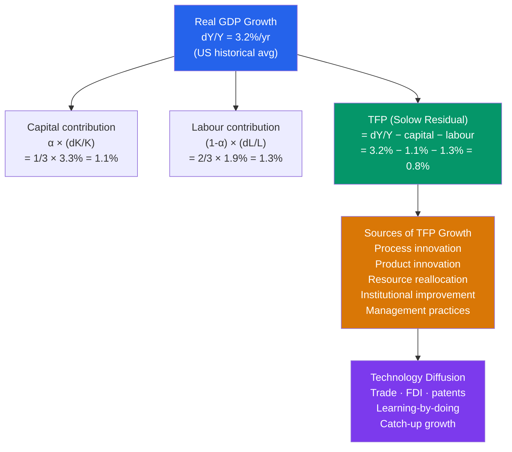

# ⚙️ Technological Progress

> [!abstract] TL;DR
> Technological progress — measured as Total Factor Productivity (TFP) or the Solow Residual — is the only source of sustained long-run growth in living standards in the Solow model. TFP captures the efficiency with which capital and labour are combined. The Solow Residual explains ~50–87% of output growth depending on the country and period. Technology diffuses across borders through trade, FDI, and learning-by-doing, with poorer countries able to grow rapidly by adopting existing technologies.

## Intuition — analogy FIRST

Imagine two factories with identical workers and identical machines. One produces 1,000 widgets per day; the other produces 1,200. The 20% gap is TFP — it captures better management, superior production processes, smarter layout, less waste, faster problem-solving. You can't see TFP in any single input; it's the "magic" of how inputs are combined.

The Solow Residual is TFP calculated by subtraction: you measure output growth, subtract the contributions of capital growth and labour growth (weighted by their income shares), and whatever is left over is attributed to technology. This is why Robert Solow called it a "measure of our ignorance" — it's the part of growth we can't directly explain with observable inputs.

---

## How It Works

---

## Key Concepts / Details

### Growth Accounting

The growth accounting framework decomposes output growth into factor contributions:

$$\frac{\dot{Y}}{Y} = \alpha \frac{\dot{K}}{K} + (1-\alpha)\frac{\dot{L}}{L} + \underbrace{\frac{\dot{A}}{A}}_{\equiv g_{\text{TFP}}}$$

Rearranging for the **Solow Residual**:

$$g_{\text{TFP}} = \frac{\dot{Y}}{Y} - \alpha \frac{\dot{K}}{K} - (1-\alpha)\frac{\dot{L}}{L}$$

With $\alpha = 1/3$:
- Capital contribution = $\frac{1}{3} \times \frac{\dot{K}}{K}$
- Labour contribution = $\frac{2}{3} \times \frac{\dot{L}}{L}$

### Labour-Augmenting Technology in Solow

In the Solow model with technology, the production function is:

$$Y = F(K, AL) = K^\alpha (AL)^{1-\alpha}$$

Technology is **labour-augmenting** (Harrod-neutral): it multiplies the effectiveness of each worker. The assumption of labour-augmenting technology (rather than capital-augmenting or Hicks-neutral) is required for balanced growth — where all per-capita quantities grow at the same rate.

At the steady state, output per worker grows at rate $g$ (the technology growth rate), and capital per worker grows at rate $g$ — consistent with Kaldor's stylised fact that capital-to-output ratios are roughly constant over time.

### Technology Diffusion

Rich countries are at the **technology frontier** — they must innovate to grow. Poor countries can grow by **adopting existing technologies** from frontier countries — often faster than innovation.

$$g_{\text{catch-up}} = g_{\text{frontier}} + \lambda \ln\left(\frac{A_{\text{frontier}}}{A_{\text{domestic}}}\right)$$

The catch-up term $\lambda \ln(A_{\text{frontier}}/A_{\text{domestic}})$ is positive as long as a technology gap exists. This is the theoretical basis for conditional convergence.

**Channels of technology diffusion:**
- **Trade:** Importing capital goods embodies foreign technology (Coe & Helpman 1995)
- **FDI:** Multinational firms bring technology, management, and training
- **Imitation:** Reverse-engineering, R&D directed at adapting foreign technology
- **Migration:** Skilled migrants carry technical knowledge across borders
- **Patents and licensing:** Direct technology transfer for royalties

### Productivity Slowdown and Acceleration

| Period | US TFP growth | Main driver |
|--------|--------------|-------------|
| 1948–73 | ~1.9%/yr | Post-WWII technology adoption, electrification |
| 1973–95 | ~0.6%/yr | Oil shocks, IT investment not yet productive |
| 1995–2004 | ~1.5%/yr | IT revolution, internet, e-commerce |
| 2004–2019 | ~0.6%/yr | "Productivity paradox" — you can see the smartphone everywhere except in the data |
| 2019–2024 | ~1.3%/yr | COVID-era automation, digitalisation |

Robert Gordon argues the post-1973 slowdown reflects exhaustion of "great inventions" (electrification, engines, plumbing). Erik Brynjolfsson argues the recent IT gains will show up in productivity data with a lag — the "adjustment lag."

### Innovation Inputs

Long-run TFP depends on the economy's **innovation system:**

| Input | US 2023 |
|-------|---------|
| R&D spending (% of GDP) | 3.5% |
| Patent grants | ~360,000/yr |
| STEM graduates | ~800,000/yr |
| Venture capital investment | ~$170 bn/yr |

R&D investment is subject to **positive externalities** (knowledge spills over to competitors), justifying subsidies. But it also has diminishing returns at the frontier: the number of researchers required to maintain Moore's Law has grown 18× since 1971 (Bloom et al. 2020).

---

## Real-World Notes

- **Solow paradox (1987):** "You can see the computer age everywhere but in the productivity statistics." Robert Solow noted that massive IT investment in the 1970s-80s hadn't shown up in productivity data. The paradox resolved in the late 1990s as IT-enabled business process transformation took hold.
- **China's productivity deceleration:** As China approached the technology frontier, its TFP growth slowed from ~3%/yr (2001-2010) to ~1%/yr (2010-2019). Innovation spending rose but catch-up gains diminished — the classic transition from imitation to innovation.
- **South Korea's technology leap:** Samsung and TSMC (Taiwan) demonstrate successful technology catch-up — from imitating Japanese electronics in the 1970s to leading-edge semiconductor manufacture by the 2000s. Government industrial policy (DARPA-like agencies, export promotion) played a key role.
- **AI and TFP:** Early studies (Acemoglu 2024) suggest AI may raise TFP by 0.5–1.0% per year if broadly adopted. The distributional question (skill-complementary vs skill-replacing) is unresolved.

---

## Common Pitfalls

- **Treating TFP as a direct policy lever.** TFP is a residual — we can't directly target it. We target its inputs (R&D subsidies, education, rule of law) and hope TFP responds.
- **Double-counting technology and human capital.** If human capital quality improves workers' effectiveness, naive TFP accounting attributes this to the Solow Residual. The MRW model avoids this by explicitly including human capital.
- **Assuming technology diffuses freely.** In practice, technology diffusion requires absorptive capacity (educated workforce, institutional quality), complementary investments, and sometimes political willingness to allow foreign firms.
- **Confusing TFP levels and growth rates.** The US has higher *level* TFP than most countries. Catch-up countries have higher TFP *growth rates*. Both matter but for different questions.

---

## Related Concepts

- [[_MOC_Economic_Growth|↑ Section MOC]]
- [[Solow_Growth_Model]] — TFP enters as the exogenous technology growth rate $g$
- [[Endogenous_Growth_Theory]] — Makes TFP growth endogenous through deliberate R&D investment
- [[Human_Capital_and_Education]] — Human capital and TFP interact: skilled workers adopt and generate technology faster
- [[Development_Economics]] — Technology diffusion as a mechanism for catch-up growth

---

## Review Questions

1. US real GDP grew 3.5%/year in a given period. Capital grew 4.5%/year, labour grew 1.5%/year, and capital's share of income is 1/3. Calculate the Solow Residual (TFP growth). What share of output growth is explained by TFP?
2. South Korea grew at 8%/year from 1960-1990 largely through technology adoption (catch-up). Now it is near the frontier. Using the convergence framework, explain why South Korea's growth should slow and what policy options remain.
3. "The best way to improve TFP is to invest more in R&D." Evaluate this claim. What other policies affect TFP, and why might R&D subsidies be justified even if their direct effect is uncertain?

---

## Sources

- Robert M. Solow, "Technical Change and the Aggregate Production Function," *Review of Economics and Statistics*, 1957
- N. Gregory Mankiw, *Macroeconomics*, 10th ed., Ch. 9 — Economic Growth II
- Nicholas Bloom et al., "Are Ideas Getting Harder to Find?" *American Economic Review*, 2020
- Charles I. Jones, *Introduction to Economic Growth*, 3rd ed.

#macroeconomics #economics #economic-growth #TFP #technological-progress #Solow-residual
