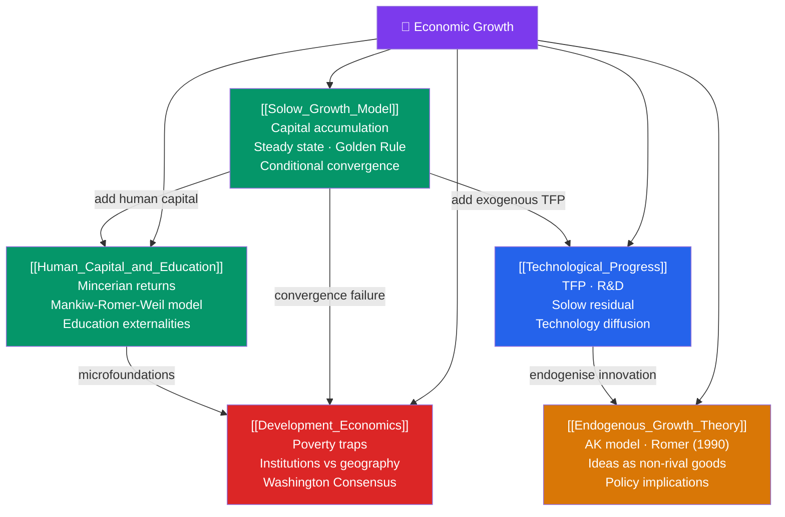

# 🗺️ Economic Growth — Map of Content

> [!abstract] What This Section Covers
> Economic growth theory asks the deepest question in macroeconomics: **why are some countries rich and others poor, and why do living standards rise over time?** The Solow model ([[Solow_Growth_Model]]) is the workhorse — it shows how capital accumulation drives growth but eventually hits diminishing returns, implying a steady state where only technology grows. Human capital ([[Human_Capital_and_Education]]) and technology ([[Technological_Progress]]) extend the model. Endogenous growth theory ([[Endogenous_Growth_Theory]]) makes innovation and knowledge accumulation endogenous to economic decisions. Development economics ([[Development_Economics]]) asks why convergence hasn't closed the rich-poor gap faster and what policies actually accelerate development.

## Concept Map

## Learning Path

1. [[Solow_Growth_Model]] — The $\dot{k} = sf(k) - (\delta + n)k$ steady-state framework, the Golden Rule, and conditional convergence.
2. [[Human_Capital_and_Education]] — Adding human capital $H$ to the production function; Mincerian wage equations; the Mankiw-Romer-Weil extension.
3. [[Technological_Progress]] — The Solow residual as TFP; augmenting Solow with labour-augmenting technology; the role of R&D and diffusion.
4. [[Endogenous_Growth_Theory]] — AK model; Romer's (1990) model of endogenous innovation; ideas as non-rival goods; R&D-driven sustained growth.
5. [[Development_Economics]] — Poverty traps, institutions as determinants of growth, the Washington Consensus, and what actually works in development policy.

## All Notes at a Glance

| Note | Difficulty | What You'll Learn |
|------|------------|-------------------|
| [[Solow_Growth_Model]] | Intermediate | $\dot{k}=sf(k)-(\delta+n)k$; steady state; Golden Rule; convergence |
| [[Human_Capital_and_Education]] | Intermediate | Mankiw-Romer-Weil; Mincerian returns; education investment |
| [[Technological_Progress]] | Intermediate | TFP; Solow residual; technology diffusion; R&D investment |
| [[Endogenous_Growth_Theory]] | Advanced | AK model; Romer 1990; non-rival ideas; sustained growth |
| [[Development_Economics]] | Intermediate | Poverty traps; institutions; Washington Consensus; aid effectiveness |

## Key Questions This Section Answers

- Why do capital-rich countries grow faster in early stages but then slow down?
- What is the "steady state" in the Solow model, and what does "conditional convergence" mean?
- Why does Mankiw-Romer-Weil fit cross-country data so much better than the basic Solow model?
- Why can't capital accumulation alone sustain long-run growth per capita?
- What makes knowledge different from physical capital — and why does it matter for growth?
- Why have many poor countries failed to converge to rich-country income levels?

## Related Sections

- [[_MOC_Macroeconomics_Master|↑ Macroeconomics Master MOC]]
- [[_MOC_National_Accounts|← National Accounts]]
- [[_MOC_IS_LM_AD_AS|→ IS-LM & AD-AS]]
- [[_MOC_Fiscal_Policy|→ Fiscal Policy]]

#MOC #Macroeconomics #EconomicGrowth
