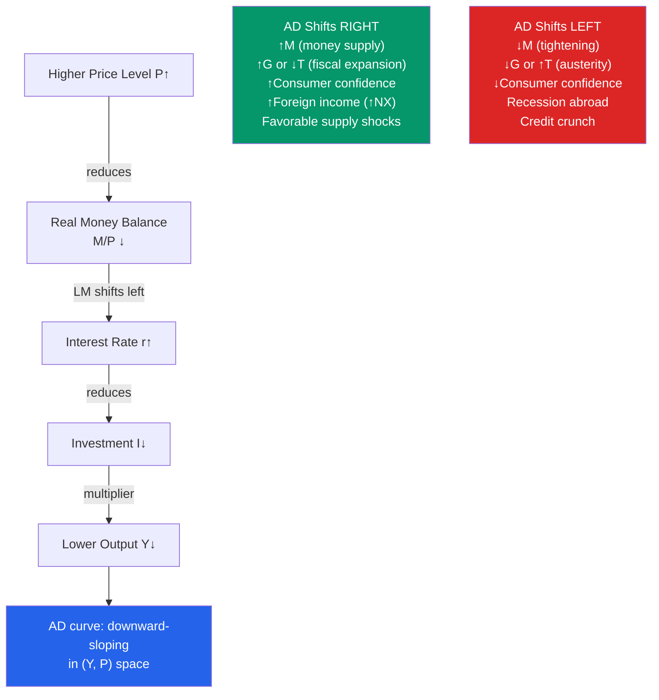

# 📉 Aggregate Demand

> [!abstract] TL;DR
> The Aggregate Demand (AD) curve shows all combinations of the price level ($P$) and output ($Y$) at which both the goods market and money market are in equilibrium — it is derived from IS-LM by varying $P$. AD slopes downward because a higher price level reduces real money balances ($M/P$), shifting LM left and raising $r$, which reduces output. AD shifts right with expansionary fiscal or monetary policy, higher consumer confidence, or rising foreign income.

## Intuition — analogy FIRST

The IS-LM model gives us equilibrium output for a given price level. Now ask: what if the price level changes? Higher prices erode the real value of the money supply (your $1,000 buys fewer goods), which is equivalent to a leftward shift in LM — higher interest rates, less investment, lower output.

The AD curve traces this relationship: at each price level, use IS-LM to find the equilibrium output. Connect the dots — you get a downward-sloping curve in (Y, P) space. It's downward-sloping not because of price effects on consumer behaviour (that's a microeconomic demand curve) but because of the monetary transmission mechanism through real money balances.

---

## How It Works

---

## Key Concepts / Details

### Deriving the AD Curve from IS-LM

From IS-LM equilibrium, output depends on the price level through real money balances:

$$Y^{AD} = Y\left(\frac{M}{P}, G, T, ...\right)$$

**Derivation:**
- IS: $Y = A(G, T) - \frac{b}{1-c}r$
- LM: $r = \frac{k}{h}Y - \frac{1}{h}\frac{M}{P}$
- Substituting and solving: $Y = \frac{h \cdot A + b \cdot M/P}{h(1-c) + bk}$

As $P \uparrow$: $M/P \downarrow$ → Y falls → AD slopes downward.

**AD slope:** More negative when $b$ (investment interest-sensitivity) is large, $h$ (money demand interest-sensitivity) is small, and $k$ (income elasticity of money demand) is large.

### Why AD Slopes Downward: Three Channels

1. **Pigou/Wealth Effect (Keynes effect):** Higher prices reduce the real wealth of households holding money/bonds → consumption falls → $Y$ falls.
2. **Keynes effect (interest rate channel):** Higher prices → lower $M/P$ → LM shifts left → higher $r$ → lower investment → lower $Y$. *Primary mechanism in IS-LM.*
3. **Mundell-Fleming effect (exchange rate):** Higher domestic prices → real exchange rate appreciates → net exports fall → lower $Y$.

### AD Shifts: What Moves the Curve

| Shock | Effect on AD | Channel |
|-------|-------------|---------|
| ↑ Money supply $M$ | Right shift | LM right → lower $r$ → ↑I → ↑Y at any $P$ |
| ↑ Government spending $G$ | Right shift | IS right → ↑Y at any $P$ |
| ↓ Taxes $T$ | Right shift | IS right via ↑C |
| ↑ Consumer confidence | Right shift | ↑autonomous consumption |
| ↑ Business investment expectations | Right shift | ↑autonomous investment |
| ↑ Foreign income | Right shift | ↑exports → ↑NX |
| Credit crunch | Left shift | ↑risk premium → effective $r$ rises |
| ↑ Taxes / spending cuts | Left shift | IS left |

### The AD Multiplier

A shift in autonomous expenditure ($\Delta G$, $\Delta \bar{I}$, etc.) shifts the AD curve **horizontally** by the IS-LM multiplier:

$$\Delta Y_{AD} = \frac{1}{(1-c) + bk/h} \cdot \Delta G$$

Note: this is the IS-LM multiplier, not the simple Keynesian multiplier, because moving *along* the AD curve (as $P$ adjusts) also shifts LM.

### AD and the Quantity Theory

At very low output/employment (deep recession), the price mechanism in AD-AS is slow. The quantity theory of money ($MV = PY$) gives a useful approximation for the AD curve:

$$PY = MV \implies P = \frac{MV}{Y}$$

For constant velocity $V$, the AD curve in $(Y, P)$ space is a rectangular hyperbola — real aggregate demand $Y$ is proportional to $M/P$.

---

## Real-World Notes

- **2008–09 demand collapse:** The financial crisis caused a massive leftward AD shift — through the credit crunch channel (sharp rise in risk spreads, banks stopped lending), the wealth effect (stock market and housing prices fell ~40%), and the confidence channel (consumer confidence fell to record lows). The Fed's response (QE) and fiscal stimulus (ARRA) were intended to shift AD back right.
- **COVID-19 AD collapse and rebound (2020-2021):** Q2 2020 saw perhaps the sharpest AD leftward shock in history (~−10% real GDP annualised). The fiscal response ($3.9 trillion, ~17% of GDP) shifted AD right dramatically — contributing to the 2021-2022 inflation surge when it collided with constrained short-run aggregate supply.
- **1930s Great Depression:** Friedman & Schwartz (1963) argued the Depression was primarily an AD shock caused by the Fed allowing the money supply to contract 30% from 1929–33 (a massive LM leftward / AD leftward shift). Better AD management could have avoided the Depression.
- **1990s "Goldilocks" economy:** Strong productivity growth (rightward AS shift) combined with fiscal consolidation and accommodative monetary policy kept AD growing steadily without overheating — the rare combination of falling unemployment and falling inflation.

---

## Common Pitfalls

- **Confusing AD with individual demand curves.** Macro AD is not the sum of micro demand curves — it represents goods-market + money-market equilibrium at different price levels. It slopes down for a completely different reason (monetary, not substitution, effect).
- **Thinking higher prices shift AD.** A change in $P$ causes a *movement along* the AD curve. Only changes in fiscal/monetary policy, confidence, or foreign factors *shift* the AD curve.
- **Ignoring the price level in IS-LM.** The IS-LM model holds $P$ fixed. When $P$ changes (as in AD-AS), LM shifts, which is captured by the slope of the AD curve.
- **Double-counting channels.** The three reasons AD slopes down (wealth, interest rate, exchange rate) are different transmission channels, not additions. In standard IS-LM, only the interest rate channel is explicit.

---

## Related Concepts

- [[_MOC_IS_LM_AD_AS|↑ Section MOC]]
- [[IS_LM_Model]] — AD is derived by varying $P$ in IS-LM equilibrium
- [[Aggregate_Supply]] — AD and AS together determine equilibrium $Y$ and $P$
- [[Monetary_Policy_Tools]] — How the Fed shifts AD through the money supply/interest rate
- [[Government_Spending_Multiplier]] — The fiscal multiplier determines how much $G$ shifts AD
- [[Taylor_Rule]] — Modern central banks shift AD by responding to inflation and output gaps

---

## Review Questions

1. Explain why a higher price level causes a movement *along* the AD curve rather than a shift of it. What mechanism (in IS-LM terms) causes this movement? Draw the IS-LM and AD diagrams together.
2. In 2020, the US government sent $1,200 checks to most Americans. Using the IS-LM/AD framework, trace the effect of this policy on: (a) the IS curve, (b) the AD curve, and (c) output and the price level, distinguishing the short-run (sticky prices) from the medium-run (flexible prices).
3. Some economists argue the Fed should have allowed prices to fall during the 2008 recession (a deflationary path). Using the AD-AS model, show what happens when P falls: how does the Pigou wealth effect theoretically restore equilibrium? Why might this deflation path be dangerous in practice?

---

## Sources

- N. Gregory Mankiw, *Macroeconomics*, 10th ed., Ch. 11 — Aggregate Demand II
- Olivier Blanchard, *Macroeconomics*, 8th ed., Ch. 7-8 — Putting It All Together
- Milton Friedman & Anna Schwartz, *A Monetary History of the United States*, 1963
- Ben Bernanke, *The Courage to Act*, 2015

#macroeconomics #economics #aggregate-demand #AD-AS #IS-LM #monetary-transmission
