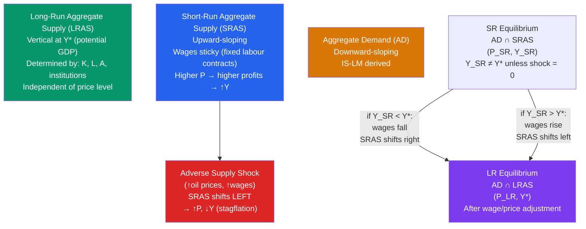

# 📈 Aggregate Supply

> [!abstract] TL;DR
> The Short-Run Aggregate Supply (SRAS) curve is upward-sloping because wages and some prices are sticky in the short run — higher prices unexpectedly raise profits and output. The Long-Run Aggregate Supply (LRAS) curve is vertical at potential GDP $Y^*$ — in the long run all wages and prices adjust and the economy returns to NAIRU. Supply shocks (oil prices, technology) shift SRAS, creating stagflation (adverse) or a supply boom (favourable).

## Intuition — analogy FIRST

Short-run supply behaviour is like a restaurant that has printed menus with fixed prices. When demand surges, the restaurant doesn't immediately reprint its menu — it serves more covers at the existing price, working the kitchen harder. Profits rise and output rises. But in the long run, the restaurant *does* reprint the menu at higher prices, and output returns to the kitchen's normal capacity.

That's SRAS: in the short run, sticky prices mean higher demand (AD) raises output. LRAS: in the long run, all prices adjust, and the economy produces at potential regardless of price level. Stagflation is like a drought that reduces ingredient supply — both prices and the menu get expensive AND the kitchen can't serve as many covers.

---

## How It Works

---

## Key Concepts / Details

### Why SRAS Is Upward-Sloping: Three Models

**1. Sticky-Wage Model** (Keynes, 1936):
- Nominal wages are fixed by contracts in the short run
- If $P$ rises, real wages fall → labour is cheaper → firms hire more → $Y$ rises
- $Y = Y^* + \alpha(P - P^e)$, where $P^e$ = expected price level

**2. Imperfect-Information Model** (Lucas, 1972):
- Producers can't distinguish between relative price changes (which should change their output) and general price level changes (which shouldn't)
- If $P$ rises unexpectedly, producers think their relative price has risen → they supply more
- $Y = Y^* + \alpha(P - P^e)$

**3. Sticky-Price Model** (New Keynesian):
- Firms face menu costs — repricing is costly
- Some firms keep prices fixed even when demand rises → output adjusts more than price
- More consistent with microeconomic evidence

All three models produce the same SRAS equation:

$$Y = Y^* + \alpha(P - P^e), \quad \alpha > 0$$

Higher $P$ relative to expected $P$ raises output above potential. In the long run, $P^e \to P$ and $Y \to Y^*$.

### Long-Run Aggregate Supply (LRAS)

LRAS is **vertical** at potential GDP $Y^*$ — the output level consistent with the natural rate of unemployment (NAIRU). It depends on:
- Factor endowments: $K$, $L$, $H$
- Technology $A$
- Institutions (property rights, rule of law)

LRAS shifts right with:
- Population/labour force growth
- Capital accumulation
- Technological progress
- Improvements in institutions or education

LRAS does NOT shift with the price level. In the long run, money is neutral.

### Short-Run vs Long-Run Adjustment

**Recession (Y < Y*):**
1. Short-run equilibrium below potential: unemployment > NAIRU
2. Wages fall (excess labour supply)
3. Lower wages reduce firm costs → SRAS shifts right
4. Economy returns to LRAS (Y*) at lower $P$ — **automatic stabilisation**

**Expansion (Y > Y*):**
1. Short-run equilibrium above potential: unemployment < NAIRU
2. Wages rise (tight labour market)
3. Higher wages increase costs → SRAS shifts left
4. Economy returns to LRAS (Y*) at higher $P$ — **inflation**

The speed of adjustment determines how long recessions/booms last. Classical economists say fast; Keynesians say slow (wages are sticky downward) — justifying active policy.

### Supply Shocks

Supply shocks shift the SRAS curve directly (not through AD):

| Shock | SRAS | Effect |
|-------|------|--------|
| ↑ Oil prices | Left | Stagflation: ↑P, ↓Y |
| ↓ Oil prices | Right | Favourable: ↓P, ↑Y |
| ↑ Wages (minimum wage) | Left | Higher costs → ↑P, ↓Y |
| Productivity improvement (↑A) | Right | Lower costs → ↓P, ↑Y |
| Agricultural failure | Left | ↑food prices, ↓Y |

**Stagflation** is the simultaneous rise in inflation and unemployment caused by an adverse supply shock — it cannot be explained by AD movements alone, which predict that higher output always comes with higher prices.

### SRAS-LRAS and the Phillips Curve

The SRAS equation $Y = Y^* + \alpha(P - P^e)$ is equivalent to the Phillips curve:

$$\pi = \pi^e - \beta(u - u^*)$$

Both express the same relationship — output above potential (or unemployment below NAIRU) is associated with rising inflation. They are the same model, just expressed in different variables.

---

## Real-World Notes

- **1970s oil shocks (1973, 1979):** OPEC quadrupled oil prices in 1973 (Arab Oil Embargo) and doubled them again in 1979 (Iranian Revolution). Both caused large leftward SRAS shifts — stagflation with CPI inflation reaching 14% and unemployment at 7-10%. The standard Keynesian AD framework had no explanation for this combination.
- **2021-2022 supply chain disruptions:** COVID lockdowns disrupted global supply chains, shifting SRAS left — contributing to inflation alongside the AD surge from fiscal stimulus. The debate: how much of 2021-22 inflation was demand-pull (AD-driven) vs cost-push (SRAS-driven)?
- **1990s productivity boom:** The IT revolution shifted LRAS right and also reduced costs, shifting SRAS right. Output grew rapidly, unemployment fell to 4%, but inflation *fell* — because favourable supply shifts expanded potential output simultaneously with demand.
- **Volcker disinflation (1979-83):** Fed tightened aggressively (leftward AD shift). In AD-AS terms: AD shifted left, moving the economy below LRAS. High unemployment and recession followed. As wages fell (SRAS shifted right), the economy eventually returned to LRAS at a lower price level — the disinflation succeeded.

---

## Common Pitfalls

- **Confusing SRAS shifts with movements along SRAS.** A change in $P$ (from AD-side) causes movement *along* SRAS. A supply shock or wage change *shifts* SRAS.
- **Using one AS curve for all time horizons.** Short run and long run behave differently — always specify which you mean. In the very short run (within a quarter), prices are nearly fixed (SRAS is nearly horizontal). In the long run, LRAS is vertical.
- **Stagflation doesn't fit the simple AD story.** If inflation and recession occur simultaneously, the cause must be an SRAS shift (supply shock), not an AD movement — which moves inflation and output in the *same* direction.
- **LRAS as a ceiling.** LRAS is not a maximum output — it's the sustainable rate. Economies can temporarily exceed LRAS (below NAIRU), but this creates inflationary pressure that eventually pushes them back.

---

## Related Concepts

- [[_MOC_IS_LM_AD_AS|↑ Section MOC]]
- [[Aggregate_Demand]] — AD and SRAS together determine short-run equilibrium $(Y, P)$
- [[Unemployment]] — NAIRU determines the position of LRAS
- [[Price_Indices_Inflation]] — Inflation is generated when output exceeds potential
- [[Taylor_Rule]] — Central bank responds to inflation deviations caused by AD-AS dynamics
- [[Solow_Growth_Model]] — LRAS grows over time as technology and capital accumulate

---

## Review Questions

1. Draw the AD-AS diagram showing an economy in long-run equilibrium at $Y^* = 100$, $P = 1$. Now an oil price shock shifts SRAS left. Show (a) the new short-run equilibrium and (b) the long-run adjustment back to $Y^*$ as wages adjust. What is the final price level relative to the original?
2. The SRAS curve is based on sticky wages. If wages instantly adjusted (perfectly flexible), what would the AS curve look like, and what would this imply for fiscal/monetary policy effectiveness? Why do Keynesians and Classicals disagree on wage flexibility?
3. In 2021-22, US GDP was above pre-COVID potential AND inflation surged. Is this consistent with an AD shock, an AS shock, or both? Use the AD-AS diagram to show each possibility and identify which evidence would help distinguish them.

---

## Sources

- N. Gregory Mankiw, *Macroeconomics*, 10th ed., Ch. 12 — Aggregate Demand in the Open Economy
- Olivier Blanchard, *Macroeconomics*, 8th ed., Ch. 7 — Putting It All Together: The AS-AD Model
- Robert E. Lucas Jr., "Some International Evidence on Output-Inflation Tradeoffs," *American Economic Review*, 1973
- Robert J. Gordon, "Supply Shocks and Monetary Policy Revisited," *American Economic Review*, 1984

#macroeconomics #economics #aggregate-supply #AD-AS #SRAS #LRAS #stagflation
