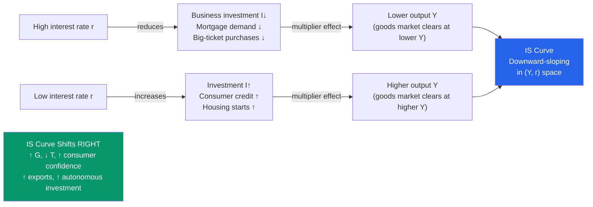

# 📉 IS Curve

> [!abstract] TL;DR
> The IS curve represents all combinations of output ($Y$) and real interest rate ($r$) at which the goods market is in equilibrium — where planned expenditure equals output. It slopes downward because a higher interest rate reduces investment spending, which reduces output via the multiplier. The IS curve shifts right with higher government spending, tax cuts, higher consumer confidence, or higher export demand.

## Intuition — analogy FIRST

Imagine the goods market as a bathtub. Income (output $Y$) flows in. Consumption, investment, government spending, and net exports are the drains. The IS curve traces out all water levels (Y) and water pressure (interest rate $r$) where the tub is exactly in balance — inflows equal outflows.

Turn up the "pressure" (raise the interest rate): businesses borrow less for investment, consumers reduce big-ticket purchases, the housing market cools. This reduces total expenditure, so the water level drops — output falls. That's why the IS curve slopes downward: higher $r$ → lower $Y$.

Open the tap wider (increase government spending): at any given water pressure, the tub fills higher. The whole IS curve shifts right.

---

## How It Works

---

## Key Concepts / Details

### Deriving the IS Curve

Start from the **goods-market equilibrium** (Keynesian cross):

$$Y = C(Y - T) + I(r) + G + NX$$

Assume:
- $C = \bar{C} + c(Y - T)$, where $c$ = marginal propensity to consume (MPC), $0 < c < 1$
- $I = \bar{I} - br$, where $b > 0$ (investment is decreasing in interest rate)
- $G = \bar{G}$, $T = \bar{T}$, $NX = \overline{NX}$

Substitute and solve for $Y$:

$$Y = \frac{1}{1 - c}\left[\bar{C} - cT + \bar{I} - br + \bar{G} + \overline{NX}\right]$$

This is the IS curve — a negative relationship between $Y$ and $r$:

$$Y = \underbrace{\frac{1}{1-c}(\bar{C} - cT + \bar{I} + \bar{G} + \overline{NX})}_{\text{autonomous expenditure × multiplier}} - \underbrace{\frac{b}{1-c}}_{\text{slope coefficient}}r$$

**Slope:** $\frac{dr}{dY} = -\frac{1-c}{b}$ — steeper when:
- $c$ is small (low MPC — multiplier is weak)
- $b$ is small (investment is insensitive to interest rate)

**Flat IS curve** (high $b$, high $c$): monetary policy is highly effective (big output response to interest rate change).  
**Steep IS curve** (low $b$, low $c$): fiscal policy is relatively more powerful.

### The Fiscal Multiplier

A change in autonomous expenditure $\Delta \bar{G}$ shifts the IS curve by:

$$\Delta Y = \underbrace{\frac{1}{1-c}}_{\text{simple multiplier}} \times \Delta \bar{G}$$

With $c = 0.8$: multiplier = 5. With $c = 0.6$: multiplier = 2.5.

The tax multiplier is smaller in magnitude:

$$\Delta Y = \frac{-c}{1-c} \times \Delta T$$

A $1 tax cut raises $Y$ by $c/(1-c)$ — less than the government spending multiplier $1/(1-c)$ because households save a fraction $(1-c)$ of the tax rebate.

**Balanced budget multiplier theorem:** Equal increases in $G$ and $T$ raise output by exactly 1 (the Haavelmo theorem), since the government spending multiplier minus the tax multiplier equals 1.

### IS Curve Shifts

| Factor | Direction | Mechanism |
|--------|-----------|-----------|
| ↑ Government spending $G$ | Right | $\Delta Y = \frac{1}{1-c}\Delta G$ |
| ↓ Taxes $T$ | Right | $\Delta Y = \frac{c}{1-c}\Delta T$ |
| ↑ Consumer confidence | Right | Raises $\bar{C}$, shifts IS right |
| ↑ Export demand (NX) | Right | Direct addition to autonomous expenditure |
| ↓ Business confidence | Left | Falls in $\bar{I}$ shift IS left |
| Debt-deleveraging (households pay down debt) | Left | Reduces autonomous consumption |

### IS Curve in Open Economies

In an open economy, net exports $NX$ depend on the real exchange rate $\varepsilon$ and foreign income $Y_f$:

$$NX = NX(\varepsilon, Y, Y_f) = \bar{X}(\varepsilon, Y_f) - \bar{M} \cdot Y$$

A real depreciation (↑ $\varepsilon$ means domestic currency worth less) improves competitiveness → increases $NX$ → shifts IS right. This is the channel through which exchange rates affect output in the Mundell-Fleming model.

---

## Real-World Notes

- **2008–09 fiscal stimulus:** The US ARRA stimulus package ($787 bn) was designed to shift the IS curve right. The "fiscal multiplier" debate: Romer & Bernstein (2009) estimated multiplier ~1.5; Barro (2009) estimated <1; empirical consensus ~0.8–1.5 depending on the state of the economy and monetary policy regime.
- **COVID-19 fiscal response (2020):** US Congress passed ~$3.9 trillion in fiscal support (CARES, PPP, ARP). The unprecedented scale — IS curve shifted massively right — combined with very low initial interest rates (LM curve flat) produced a rapid recovery but also contributed to the 2021-2023 inflation surge.
- **Japan's lost decade:** Persistent IS-left-shift due to balance sheet recession — firms and households paid down debt rather than investing/consuming. Government attempted to offset with repeated fiscal expansions, but private sector retrenchment was larger.
- **Keynes's "animal spirits":** Keynes argued business investment is driven by "animal spirits" — psychological waves of optimism and pessimism — making $\bar{I}$ volatile and the IS curve prone to large left-shifts in crises, even when interest rates fall.

---

## Common Pitfalls

- **Confusing shifts of IS with movements along IS.** A change in interest rate causes a *movement along* the IS curve. A change in $G$, $T$, or autonomous consumption *shifts* the IS curve.
- **Forgetting the multiplier in fiscal analysis.** A $100B increase in government spending shifts IS right by more than $100B (the multiplier amplifies it). But the actual output effect depends on the LM curve too — if LM is steep, the interest rate rise crowds out investment.
- **Applying IS to the long run.** IS-LM is a short-run model with fixed prices. In the long run, prices adjust and the AD-AS model applies; IS-LM curves shift continuously.
- **Assuming all investment responds to interest rates.** Business investment is also driven by expected future demand (accelerator model) and animal spirits. A deep recession can cause investment collapse even with zero interest rates.

---

## Related Concepts

- [[_MOC_IS_LM_AD_AS|↑ Section MOC]]
- [[LM_Curve]] — The other half of IS-LM: money market equilibrium
- [[IS_LM_Model]] — Combining IS and LM to find equilibrium $(Y^*, r^*)$
- [[National_Income_Identity]] — $Y = C + I + G + NX$ is the identity underlying IS
- [[Government_Spending_Multiplier]] — Detailed analysis of fiscal multiplier effects
- [[Aggregate_Demand]] — The AD curve is derived by varying the price level in IS-LM

---

## Review Questions

1. Derive the IS curve equation with $C = 100 + 0.75(Y-T)$, $I = 200 - 10r$, $G = 300$, $T = 200$, $NX = 50$. Find the slope of the IS curve in $(r, Y)$ space. By how much does the IS curve shift right if $G$ increases by 100?
2. Why is the IS curve *steeper* when the marginal propensity to consume is lower? Draw the diagram showing a steep vs flat IS curve and explain the implications for fiscal policy effectiveness.
3. In 2009, critics argued that the fiscal multiplier was close to zero because "Ricardian consumers" would save any tax rebate anticipating future tax increases. Evaluate this claim using the IS-LM framework. What assumption about consumer behaviour is required for the multiplier to be large?

---

## Sources

- N. Gregory Mankiw, *Macroeconomics*, 10th ed., Ch. 10 — Aggregate Demand I: Building the IS-LM Model
- Olivier Blanchard, *Macroeconomics*, 8th ed., Ch. 5 — Goods and Financial Markets: The IS-LM Model
- John Maynard Keynes, *The General Theory of Employment, Interest and Money*, 1936, Ch. 11–12

#macroeconomics #economics #IS-curve #IS-LM #fiscal-policy #multiplier
