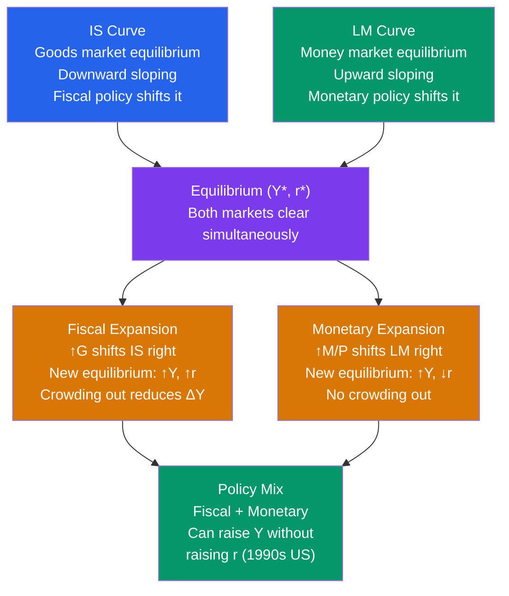

# 📊 IS-LM Model

> [!abstract] TL;DR
> The IS-LM model (Hicks 1937) combines goods-market equilibrium (IS curve) and money-market equilibrium (LM curve) to determine short-run equilibrium output $Y^*$ and interest rate $r^*$. Fiscal policy shifts IS; monetary policy shifts LM. Crowding out occurs when fiscal expansion raises $r$, partially offsetting its output effect. The model is the backbone of short-run macroeconomic analysis and forms the foundation for deriving the AD curve.

## Intuition — analogy FIRST

The economy has two markets that must simultaneously clear: the **goods market** (IS) and the **money market** (LM). Like two pipes in a plumbing system, they are connected — the flow rate and pressure in one affects the other.

The interest rate ($r$) is the connecting valve. It simultaneously:
- Clears the money market: higher $r$ reduces money demand so people are happy holding the fixed money supply
- Clears the goods market: higher $r$ reduces investment spending so output equals planned expenditure

Equilibrium is the single $(Y^*, r^*)$ combination where both markets clear simultaneously. Policies work by shifting one of the pipes, and the new joint equilibrium determines both the new output and the new interest rate.

---

## How It Works

---

## Key Concepts / Details

### Solving the IS-LM Model

IS curve: $Y = A - \frac{b}{1-c}r$ where $A = \frac{1}{1-c}(\bar{C} - cT + \bar{I} + G + NX)$

LM curve: $r = \frac{k}{h}Y - \frac{1}{h}\frac{M}{P}$

Substitute LM into IS and solve for $Y^*$:

$$Y^* = \frac{h}{h(1-c) + bk}\left[A(1-c) + \frac{b}{1}\frac{M}{P}\right] \cdot \frac{1}{...}$$

More intuitively, the IS-LM multiplier for government spending is:

$$\frac{\partial Y^*}{\partial G} = \frac{1}{(1-c) + \frac{bk}{h}}$$

Compare to the simple Keynesian multiplier $\frac{1}{1-c}$. The denominator is larger in IS-LM because the interest rate rise crowds out investment — the $\frac{bk}{h}$ term.

**Crowding out factor:** $\frac{bk/h}{(1-c) + bk/h}$

The more interest-sensitive investment ($b$ large), the larger the transactions demand for money ($k$ large), and the less interest-elastic money demand ($h$ small), the more crowding out — and the smaller the fiscal multiplier.

### Fiscal Policy Analysis

Expansionary fiscal policy ($\uparrow G$ or $\downarrow T$):
1. IS curve shifts *right* by the Keynesian multiplier $\times \Delta G$
2. Movement along the LM curve: output rises, interest rate rises
3. Higher $r$ crowds out private investment $I$
4. Net output effect is less than the simple multiplier

Fiscal multiplier with crowding out:

$$\Delta Y = \frac{1}{1-c} \cdot \Delta G \cdot \underbrace{\frac{h}{h + b \cdot k/(1-c)}}_{\text{crowding-out factor} < 1}$$

**Full crowding out** (classical case): LM is vertical (perfectly inelastic money demand, $h \to 0$) — any fiscal expansion raises $r$ exactly enough to reduce investment by the same amount → $\Delta Y = 0$.

**No crowding out**: LM is horizontal (liquidity trap, $h \to \infty$) — fiscal expansion raises $Y$ by the full multiplier with no $r$ increase.

### Monetary Policy Analysis

Expansionary monetary policy ($\uparrow M$ or $\downarrow$ target rate):
1. LM curve shifts *right* (down)
2. Interest rate falls, stimulating investment
3. Higher investment raises output
4. No crowding out — both $Y$ rises and $r$ falls

Monetary policy effectiveness:
- Most effective when IS is **flat** (investment highly interest-sensitive) — large output response per unit fall in $r$
- Ineffective in liquidity trap (LM horizontal) — $r$ can't fall further
- Most effective when LM is **steep** — monetary expansion produces large interest rate reduction

### The Policy Mix

The Tinbergen principle: with two targets (output $Y$ and interest rate $r$), you need two instruments. The policy mix of fiscal and monetary policy can achieve desired combinations:

| Goal | Fiscal | Monetary | Result |
|------|--------|----------|--------|
| ↑Y, hold r constant | Expand (↑G) | Tighten (↓M) | IS right, LM left → Y up, r stable |
| ↑Y, ↓r | Hold | Expand (↑M) | LM right → Y up, r down |
| Austerity + low r | Contract (↓G) | Expand (↑M) | IS left, LM right → Y ambiguous, r down |

**Reagan-Volcker policy mix (1981-83):** Large fiscal expansion (Reagan tax cuts: IS right) combined with tight monetary policy (Volcker: LM left) → interest rates rose dramatically (prime rate hit 21%), crowding out investment and triggering the 1981-82 recession.

**Clinton-Greenspan mix (1990s):** Fiscal consolidation (Clinton: IS left) combined with accommodative monetary policy (Greenspan: LM right) → low interest rates, strong private investment, the "Great Moderation" boom.

### IS-LM and the AD Curve

The AD curve is derived by allowing the price level $P$ to vary:
- Higher $P$ → lower real money supply $M/P$ → LM shifts left → higher $r$, lower $Y$
- This traces out a downward-sloping AD curve in $(Y, P)$ space

$$\text{AD curve: } Y = f\left(\frac{M}{P}, G, T, ...\right)$$

Any factor that shifts IS or LM (for given $P$) shifts the AD curve.

---

## Real-World Notes

- **2009 Great Recession response:** A textbook IS-LM analysis — deep recession (IS shifted sharply left), interest rates at zero lower bound (LM horizontal), which argued for aggressive fiscal stimulus. The ARRA ($787 bn) was exactly the policy recommended by the model.
- **Euro crisis (2010-12):** Southern European countries facing sovereign debt crises were forced into austerity (IS left shift) while the ECB was constrained from providing monetary accommodation to offset it (unlike the Fed/BoE). The IS-LM model predicted — correctly — that simultaneous fiscal contraction across the Eurozone would be deeply contractionary.
- **2022 Fed tightening:** After COVID, the IS curve shifted sharply right (massive fiscal stimulus, pent-up demand). The Fed hiked rates 525 bps — equivalent to shifting the LM curve sharply left. IS-LM predicts output should have fallen significantly, but robust labour markets and supply-side recovery complicated the picture.
- **Paul Volcker's strategy:** By targeting money supply (rather than interest rates), Volcker allowed the federal funds rate to be "market-determined" — effectively letting LM determine $r$ while fixing $M$. Rates spiked to 20% because the IS curve (Reagan fiscal expansion) needed a very high $r$ to restore equilibrium.

---

## Common Pitfalls

- **IS-LM as a long-run model.** It assumes fixed prices — appropriate only for the short run. In the medium run, prices adjust, and AD-AS supersedes IS-LM.
- **Forgetting both curves shift simultaneously.** A full analysis always asks: does this shock shift IS, LM, or both? And what's the new equilibrium?
- **Assuming monetary policy is always effective.** At the zero lower bound, shifting LM right doesn't reduce $r$ (already at floor) and the model predicts monetary policy has no output effect — fiscal policy dominates.
- **Treating the multiplier as the IS-LM multiplier.** The simple Keynesian multiplier $1/(1-c)$ is the *IS shift*, not the output effect. The IS-LM output multiplier is smaller due to crowding out.

---

## Related Concepts

- [[_MOC_IS_LM_AD_AS|↑ Section MOC]]
- [[IS_Curve]] — Goods-market equilibrium component
- [[LM_Curve]] — Money-market equilibrium component
- [[Aggregate_Demand]] — IS-LM derivation of the AD curve
- [[Monetary_Policy_Tools]] — How the Fed shifts LM in practice
- [[Government_Spending_Multiplier]] — Fiscal multiplier in IS-LM context

---

## Review Questions

1. In IS-LM: IS is $Y = 2000 - 100r$; LM is $Y = 1000 + 50r$ (derived from $M/P = 500$, $k=0.5$, $h=25$). Find equilibrium $Y^*$ and $r^*$. Now the government increases spending by 500 (shifting IS to $Y = 4500 - 100r$). Find the new equilibrium. How much crowding out occurred compared to the simple Keynesian multiplier?
2. Compare the output effect of (a) a $1 billion tax cut vs (b) a $1 billion increase in government spending, using IS-LM. Which has a larger effect on output, and why? Under what conditions are they equal?
3. Draw an IS-LM diagram for Japan's 1990s liquidity trap. Show why: (a) quantitative easing (shifting LM right) was ineffective at raising output, and (b) fiscal stimulus (shifting IS right) was effective. What is the danger of fiscal expansion in this situation from a long-run debt perspective?

---

## Sources

- John R. Hicks, "Mr. Keynes and the Classics; A Suggested Interpretation," *Econometrica*, 1937
- Alvin H. Hansen, *A Guide to Keynes*, 1953 (popularised Hicks's diagram)
- N. Gregory Mankiw, *Macroeconomics*, 10th ed., Ch. 10-11 — IS-LM and Aggregate Demand
- Olivier Blanchard, *Macroeconomics*, 8th ed., Ch. 5 — The IS-LM Model

#macroeconomics #economics #IS-LM #fiscal-policy #monetary-policy #crowding-out
