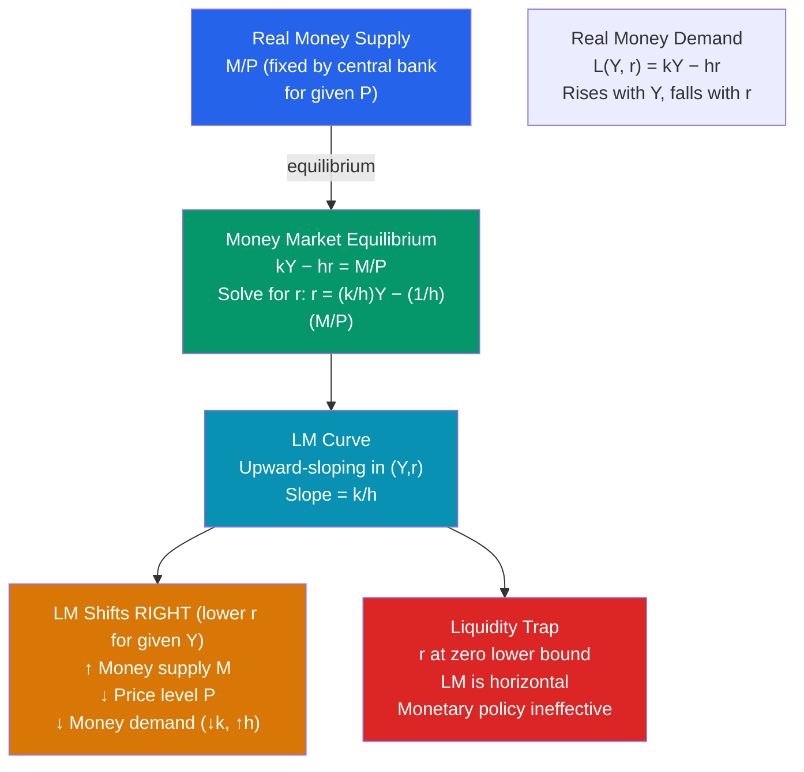

# 💵 LM Curve

> [!abstract] TL;DR
> The LM curve represents all combinations of output ($Y$) and interest rate ($r$) at which the money market is in equilibrium — where real money demand equals real money supply ($L(Y, r) = M/P$). It slopes upward because higher output raises money demand, which — with fixed money supply — requires a higher interest rate to restore equilibrium. The LM curve shifts right when the money supply increases or the price level falls. A liquidity trap arises when the LM curve is horizontal at the zero lower bound.

## Intuition — analogy FIRST

The money market is like a parking garage. The garage has a fixed number of spaces (money supply $M/P$). Cars need to park for two reasons: for their daily errands (transactions demand — proportional to income $Y$) and as a backup when they can't find street parking (speculative demand — higher when the "cost of holding cash" — the interest rate — is low).

If the economy booms (Y rises), more errands are run and more parking spaces are needed. With a fixed garage, spaces become scarce and parking fees (the interest rate) rise until demand equals supply again. The LM curve captures this: higher $Y$ → higher $r$ needed to keep money market in balance.

The central bank opens more garages (increases $M$): parking fees fall — the LM curve shifts right (down in interest rate).

---

## How It Works

---

## Key Concepts / Details

### Money Demand and the LM Curve

Keynes's **liquidity preference** theory: people hold money for three reasons:
1. **Transactions demand:** Proportional to income — $L_T = kY$
2. **Precautionary demand:** Also proportional to income
3. **Speculative demand:** Inversely related to interest rate — $L_S = -hr$

Total real money demand:

$$L(Y, r) = kY - hr$$

Money market equilibrium:

$$kY - hr = \frac{M}{P}$$

Solving for $r$:

$$r = \frac{k}{h}Y - \frac{1}{h}\frac{M}{P}$$

This is the **LM curve** — a positive relationship between $Y$ and $r$.

### Slope of the LM Curve

$$\text{Slope} = \frac{dr}{dY}\bigg|_{LM} = \frac{k}{h}$$

**Steep LM** (high $k$, low $h$): Large income elasticity of money demand, low interest elasticity. A small increase in income requires a large interest rate rise to restore equilibrium. In this case:
- Fiscal policy is *less effective* (crowding out is large)
- Monetary policy is *more effective* (money supply change has large rate effect)

**Flat LM** (low $k$, high $h$): Small income elasticity, high interest elasticity. In this case:
- Fiscal policy is *more effective* (small crowding out)
- Monetary policy is *less effective* (interest rate already very low, hard to reduce further)

### The Liquidity Trap

When the nominal interest rate hits zero (the **zero lower bound**), money and bonds become perfect substitutes — both pay zero. Additional money injected by the central bank is simply hoarded (people are indifferent between holding money and bonds). The LM curve becomes **horizontal** at $r = 0$.

At the liquidity trap:
- **Monetary policy is ineffective**: shifting LM right has no effect on output (already at the flat portion)
- **Fiscal policy is maximally effective**: shifting IS right raises output without crowding out (because $r$ can't rise above zero)

This was Japan's situation from 1999–2006 and much of the world from 2009–2015. The theoretical answer is **forward guidance** and **quantitative easing** (QE) — shifting the IS curve rather than the LM curve.

### LM Curve Shifts

| Factor | Direction | Mechanism |
|--------|-----------|-----------|
| ↑ Money supply $M$ (Fed buys bonds) | Right | More money → lower $r$ for any $Y$ |
| ↓ Price level $P$ | Right | Higher real balances $M/P$ |
| ↑ Money demand (financial panic) | Left | People want more money → $r$ rises |
| Financial innovation (credit cards) | Right | Reduces transactions demand for money ($k$ falls) |
| ↓ Money supply (Fed tightening) | Left | Less money → higher $r$ needed |

### From LM to Money Growth

The LM curve is closely related to the **quantity theory of money** ($MV = PY$). Holding $V$ (velocity) constant and $P$ fixed (short run), a money supply increase ($\uparrow M$) shifts LM right, reducing $r$ and stimulating $Y$.

In the long run with flexible prices, $P$ adjusts and the real money supply $M/P$ returns to its original level — LM shifts back. This is why monetary policy has no long-run real effect in the classical model.

---

## Real-World Notes

- **The 2008–2015 liquidity trap:** The Fed cut the federal funds rate to 0.0–0.25% in December 2008 and kept it there until December 2015. Despite tripling the monetary base (QE1, QE2, QE3), output and inflation remained subdued — consistent with a liquidity trap. The Keynesian prescription of fiscal stimulus (ARRA 2009) was designed precisely for this scenario.
- **Velocity instability:** The Friedman monetarist view assumed stable velocity $V$, making $M$ the key policy lever. After 1980, velocity became highly unstable due to financial innovation (credit cards, money market funds) — weakening the case for simple money supply rules and strengthening interest-rate targeting.
- **Sweden's negative interest rates (2009–2019):** Sweden's Riksbank went below zero (-0.5%) demonstrating that the "zero lower bound" is more precisely an "effective lower bound" — negative rates are possible but cause cash hoarding and bank disintermediation.
- **COVID QE (2020):** The Fed's balance sheet grew from ~$4.2 trillion to ~$9.0 trillion in 2020–2022 (massive LM rightward shift). With the economy in recovery and IS curve also shifting right (fiscal stimulus), the result was strong output growth but — through AD-AS — also the highest inflation in 40 years.

---

## Common Pitfalls

- **Confusing $M$ and $M/P$.** The LM curve depends on *real* money balances $M/P$. A price level increase reduces real balances and shifts LM *left* (higher $r$ for given $Y$) — even if nominal $M$ is unchanged.
- **Thinking the Fed directly sets LM.** The Fed targets the *interest rate* (federal funds rate), which is equivalent to adjusting $M$ to put the desired point on the LM curve. In practice, the Fed steers the overnight rate and the LM curve is largely implicit.
- **Forgetting that LM is a short-run relationship.** With flexible prices, the LM curve shifts back as $P$ adjusts. Only with sticky prices (short run) does monetary easing have a real effect.
- **The liquidity trap as always relevant.** At normal interest rates (2-5%), the LM curve is well-behaved. The liquidity trap is a special case at the zero lower bound — relevant since 2009, but unusual historically.

---

## Related Concepts

- [[_MOC_IS_LM_AD_AS|↑ Section MOC]]
- [[IS_Curve]] — Goods market equilibrium; IS and LM together determine equilibrium
- [[IS_LM_Model]] — Combining IS and LM for policy analysis
- [[Money_and_Banking]] — What money is and how the money supply is determined
- [[Monetary_Policy_Tools]] — How the Fed shifts the LM curve in practice
- [[Quantity_Theory_of_Money]] — $MV = PY$ and its connection to the LM curve

---

## Review Questions

1. Real money demand is $L = 0.5Y - 100r$. The money supply is $M = 1000$ and price level $P = 2$. Derive the LM equation. Find the interest rate when $Y = 2000$. What happens to the interest rate if the central bank raises $M$ to 1200?
2. Explain why the LM curve is horizontal in a liquidity trap. What does this imply for the relative effectiveness of monetary vs fiscal policy? Illustrate with an IS-LM diagram showing the response to: (a) expansionary monetary policy and (b) expansionary fiscal policy.
3. Why does financial innovation (e.g., introduction of credit cards) shift the LM curve to the right? What does this imply for the money supply policy — should the central bank respond to a rightward LM shift from financial innovation?

---

## Sources

- N. Gregory Mankiw, *Macroeconomics*, 10th ed., Ch. 10 — Aggregate Demand I
- Olivier Blanchard, *Macroeconomics*, 8th ed., Ch. 4 — Financial Markets
- John Maynard Keynes, *The General Theory of Employment, Interest and Money*, 1936, Ch. 15 — Liquidity Preference
- Paul Krugman, "It's Baaack: Japan's Slump and the Return of the Liquidity Trap," *Brookings Papers*, 1998

#macroeconomics #economics #LM-curve #IS-LM #money-market #liquidity-trap
