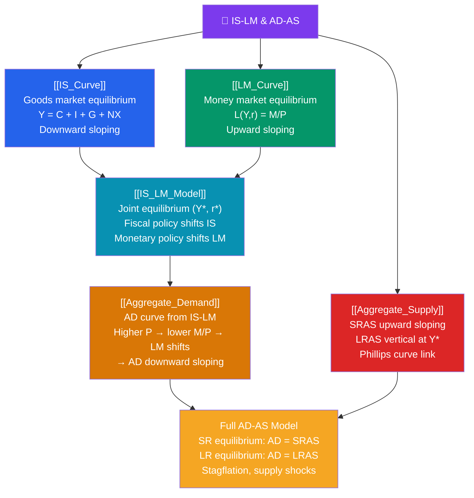

# 🗺️ IS-LM and AD-AS — Map of Content

> [!abstract] What This Section Covers
> The IS-LM and AD-AS frameworks are the core short-run models of macroeconomics. The **IS curve** ([[IS_Curve]]) captures goods-market equilibrium — all combinations of output and interest rates where planned spending equals income. The **LM curve** ([[LM_Curve]]) captures money-market equilibrium — combinations where money demand equals money supply. Together as the **IS-LM model** ([[IS_LM_Model]]) they determine the short-run equilibrium interest rate and output. The **AD-AS model** ([[Aggregate_Demand]], [[Aggregate_Supply]]) extends IS-LM to price level determination and distinguishes short-run from long-run equilibria.

## Concept Map

## Learning Path

1. [[IS_Curve]] — Deriving the downward-sloping IS curve from the goods market; fiscal multiplier; factors that shift IS.
2. [[LM_Curve]] — Deriving the upward-sloping LM curve from the money market; liquidity preference; factors that shift LM.
3. [[IS_LM_Model]] — Joint equilibrium; fiscal policy shifts IS; monetary policy shifts LM; crowding-out; the liquidity trap.
4. [[Aggregate_Demand]] — Deriving the AD curve from IS-LM; demand shocks; the transmission mechanism.
5. [[Aggregate_Supply]] — Short-run vs long-run aggregate supply; price stickiness; the Phillips curve link; supply shocks.

## All Notes at a Glance

| Note | Difficulty | What You'll Learn |
|------|------------|-------------------|
| [[IS_Curve]] | Intermediate | Goods-market equilibrium; downward slope; fiscal multiplier |
| [[LM_Curve]] | Intermediate | Money-market equilibrium; upward slope; liquidity trap |
| [[IS_LM_Model]] | Intermediate | Joint equilibrium; policy analysis; crowding-out |
| [[Aggregate_Demand]] | Intermediate | AD derivation; demand shocks; multiplier-accelerator |
| [[Aggregate_Supply]] | Intermediate | SRAS vs LRAS; price stickiness; stagflation |

## Key Questions This Section Answers

- Why is the IS curve downward-sloping in (Y, r) space?
- Why is the LM curve upward-sloping, and what causes a "liquidity trap"?
- How does expansionary fiscal policy shift the IS curve and why does it partially crowd out investment?
- How does monetary easing shift the LM curve and stimulate output?
- What is the difference between the short-run and long-run aggregate supply curves?
- How do supply shocks (like oil price rises) shift SRAS and create stagflation?

## Related Sections

- [[_MOC_Macroeconomics_Master|↑ Macroeconomics Master MOC]]
- [[_MOC_National_Accounts|← National Accounts]]
- [[_MOC_Monetary_Economics|→ Monetary Economics]]
- [[_MOC_Fiscal_Policy|→ Fiscal Policy]]

#MOC #Macroeconomics #IS-LM #AD-AS
