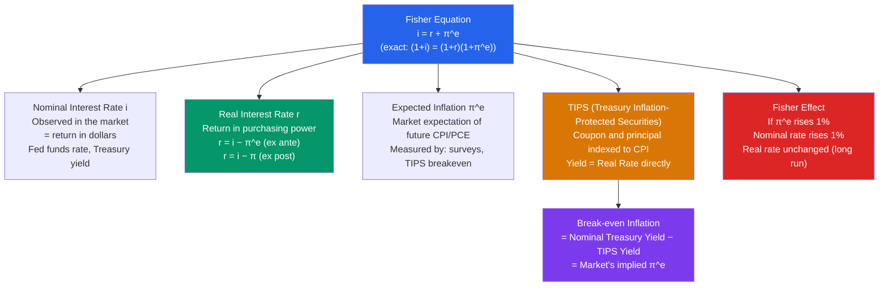

# 📊 Inflation and Interest Rates

> [!abstract] TL;DR
> The Fisher equation states that the nominal interest rate equals the real interest rate plus expected inflation: $i = r + \pi^e$. The **Fisher effect** says a 1% rise in expected inflation raises nominal rates by 1%, leaving the real rate unchanged in the long run. TIPS (Treasury Inflation-Protected Securities) allow direct measurement of real rates; break-even inflation (nominal − TIPS yield) is the market's inflation expectation. Real rates are the cost of borrowing that actually matters for investment decisions.

## Intuition — analogy FIRST

Imagine you lend a friend $100 for a year. If there's 5% inflation, prices will be 5% higher when you're repaid. A $100 repayment buys 5% less than today — you've lost purchasing power. To be fully compensated, you need to charge 5% just to break even, and then add any real return on top.

The nominal rate is the return in dollars. The real rate is the return in purchasing power (goods). The Fisher equation translates between them: if you want a 3% real return and expect 5% inflation, you charge 8% nominal. Simple and profound — it explains why mortgage rates in 1981 were 18% (inflation was 13% + real rate of 5%) and why they were 3% in 2021 (inflation near zero + near-zero real rates).

---

## How It Works

---

## Key Concepts / Details

### The Fisher Equation

Irving Fisher (1896) showed the exact relationship between nominal rate $i$, real rate $r$, and expected inflation $\pi^e$:

**Exact form:**

$$(1 + i) = (1 + r)(1 + \pi^e)$$

**Approximate form (used when $r$ and $\pi^e$ are small):**

$$i \approx r + \pi^e$$

**Ex ante real rate:** $r^{\text{ex ante}} = i - \pi^e$ — using *expected* inflation at the time the loan is made.

**Ex post real rate:** $r^{\text{ex post}} = i - \pi$ — using *actual* inflation that occurred.

These differ when inflation is a surprise. If you lend at 5% expecting 3% inflation (ex ante real rate = 2%), but actual inflation turns out to be 7%, the ex post real rate was only 5% - 7% = -2%. Unexpected inflation transfers wealth from creditors to debtors.

### The Fisher Effect

The long-run **Fisher effect** predicts that a 1% rise in steady-state inflation raises the nominal interest rate by exactly 1%, leaving the real rate unchanged:

$$\frac{di}{d\pi^e} = 1$$

This follows from: in the long run, the real interest rate equals the marginal product of capital, which is determined by technology and time preferences — independent of monetary policy. Monetary policy affects $\pi^e$ but not the long-run $r$.

**Short-run Fisher effect:** The evidence for a 1-for-1 immediate pass-through is weak. Nominal rates are sticky (they move gradually). The "Mundell-Tobin effect" suggests the real rate may fall temporarily when inflation rises (as people shift from money to real assets).

### Measuring Real Interest Rates: TIPS

**Treasury Inflation-Protected Securities (TIPS)** are US government bonds whose principal is indexed to CPI. The coupon is paid on the inflation-adjusted principal, so the yield is directly a real yield.

$$i_{\text{nominal}} = r_{\text{TIPS yield}} + \pi^e_{\text{break-even}}$$

**Break-even inflation** = 10-year nominal Treasury yield − 10-year TIPS yield = market-implied 10-year average inflation expectation.

| Date | 10-yr Nominal | 10-yr TIPS | Break-even π |
|------|-------------|------------|--------------|
| Jan 2021 | 1.1% | −1.0% | 2.1% |
| Jun 2022 | 3.0% | 0.7% | 2.3% |
| Jan 2024 | 4.0% | 1.9% | 2.1% |

The 2022 episode shows: nominal rates rose 2.7% (Federal Reserve hiking), real rates rose 1.7%, and break-even inflation rose only 0.2% — the Fed maintained inflation expectations near 2% despite the inflation surge.

### Real Interest Rates and Macroeconomic Policy

The real interest rate is what matters for economic decisions:
- **Investment:** Firms compare MPK to the real rate ($r$), not the nominal rate
- **Consumption:** Intertemporal substitution depends on $r$ (Fisher's Intertemporal model)
- **Exchange rate:** The real interest rate differential drives real exchange rate dynamics (uncovered interest parity)

The **natural real interest rate ($r^*$ or $r$-star):** The real rate consistent with output at potential and stable inflation. When the Fed sets the FFR, the relevant real policy rate is:

$$r_{\text{policy}} = i_{\text{FFR}} - \pi^e$$

If $r_{\text{policy}} > r^*$: monetary policy is restrictive (contractionary)  
If $r_{\text{policy}} < r^*$: monetary policy is accommodative (expansionary)

The Fed's estimate of $r^*$ has declined from ~2.5% in the 1990s to near 0% by 2019 — the "secular stagnation" hypothesis (Larry Summers, 2013).

### Inflation Risk Premium

In practice, the break-even rate exceeds the pure inflation expectation by an **inflation risk premium** — compensation for the uncertainty around future inflation:

$$i_n - r_n^{\text{TIPS}} = \pi^e + \text{inflation risk premium}$$

This premium is typically 20-50 bps and rises in periods of inflation uncertainty.

---

## Real-World Notes

- **1981 peak nominal rates:** The 30-year mortgage rate hit 18.63% in October 1981 — but with 13% CPI inflation, the real rate was "only" ~5.6%, roughly normal for tight monetary policy. By 2021, mortgage rates were 3% with ~3% inflation → real rate near 0%.
- **Negative real rates (2010–2022):** The Fed held the FFR near zero while inflation averaged 1-2%, producing real FFR of -1 to 0%. Then in 2021-22, inflation surged to 8%+ while the FFR was still near zero → real FFR of -8%, deeply negative. This contributed to the asset price boom and eventually inflation.
- **Japan's interest rate puzzle:** Japan has had near-zero nominal rates for 30 years AND near-zero inflation → real rates have been roughly zero throughout. The Fisher equation holds: very low nominal rates + very low inflation expectations = near-zero real rates.
- **Break-even inflation as recession indicator:** When break-even inflation falls sharply, the market expects deflation — historically associated with recessions. Break-even rates fell below 1% in March 2020 (COVID panic) before recovering rapidly after Fed intervention.

---

## Common Pitfalls

- **Using nominal rates for investment decisions.** Firms should compare the real return on investment projects to the real interest rate, not the nominal rate. During high inflation, nominal returns on investment are high — but so are costs.
- **Forgetting that break-even ≠ pure inflation expectations.** Break-even inflation includes an inflation risk premium of 20-50 bps. It overstates the market's pure inflation forecast.
- **Assuming the Fisher effect is immediate.** Empirically, the 1-for-1 pass-through from inflation expectations to nominal rates operates slowly. In the short run, the central bank can "peg" the real rate through the policy rate.
- **Ignoring ex post vs ex ante distinction.** Lenders care about ex ante (expected) real rates at the time they make loans. Ex post real rates only matter for calculating who benefited from unexpected inflation.

---

## Related Concepts

- [[_MOC_Monetary_Economics|↑ Section MOC]]
- [[Quantity_Theory_of_Money]] — Long-run inflation is determined by money growth; Fisher shows this translates to nominal rates
- [[Taylor_Rule]] — The Taylor Rule targets the real federal funds rate relative to $r^*$
- [[Price_Indices_Inflation]] — The $\pi$ in the Fisher equation is measured by CPI or PCE
- [[IS_Curve]] — The IS curve uses the real interest rate $r$, not the nominal rate $i$
- [[Exchange_Rates]] — Real interest rate differentials drive exchange rate dynamics

---

## Review Questions

1. A 10-year US Treasury yields 4.5%. A 10-year TIPS yields 2.0%. What is the break-even inflation rate? If you believe actual inflation will average 3% over the next 10 years, which bond would you prefer to hold, and why?
2. A borrower takes a 30-year mortgage at 8% nominal. Actual inflation averages 10% over the mortgage life. Who benefits — borrower or lender — and by how much in real terms? What does this illustrate about inflation as a "tax on creditors"?
3. The Fed estimates $r^*$ (the natural real rate) has fallen from 2.5% to 0.5% over 30 years. What are three possible explanations for this decline? What does a lower $r^*$ imply for monetary policy — specifically, for how often the economy will hit the zero lower bound?

---

## Sources

- Irving Fisher, *The Theory of Interest*, 1930
- N. Gregory Mankiw, *Macroeconomics*, 10th ed., Ch. 4 — Money and Inflation
- John Campbell & Robert Shiller, "Stock Prices, Earnings, and Expected Dividends," *JF*, 1988
- US Treasury, TIPS — https://www.treasurydirect.gov/marketable-securities/tips/

#macroeconomics #economics #monetary-economics #Fisher-equation #real-interest-rate #TIPS #Fisher-effect
