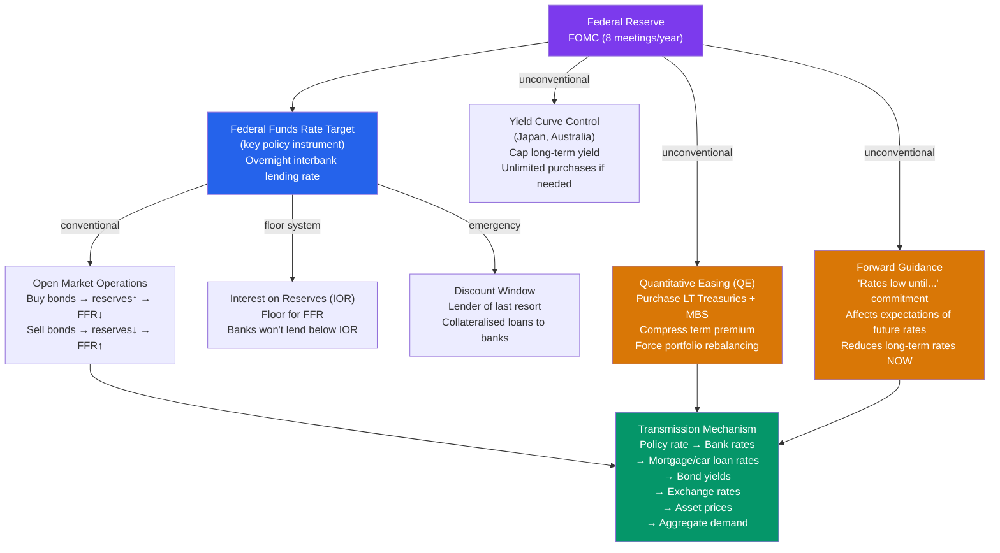

# 🏛️ Monetary Policy Tools

> [!abstract] TL;DR
> Central banks influence the economy through conventional tools (setting the short-term policy rate via open market operations and interest on reserves) and unconventional tools deployed at the zero lower bound (quantitative easing, forward guidance, yield curve control). The transmission mechanism runs from the policy rate → longer-term rates → asset prices → exchange rates → credit conditions → aggregate demand and inflation.

## Intuition — analogy FIRST

The Fed's toolkit is like a thermostat for the economy. The policy rate is the primary dial — turn it up (raise rates) to cool inflation, turn it down to warm up a sluggish economy. But the thermostat only directly controls the overnight temperature (the federal funds rate). Room temperature (long-term rates, mortgage rates, credit card rates) responds with a lag — through the heating/cooling system (the financial system).

When the thermostat hits zero (the lower bound), the Fed must use supplementary heaters — quantitative easing (buying long bonds directly), forward guidance (promising to keep the thermostat low for a long time to lower long-term expectations), and yield curve control (targeting specific long-term rates directly).

---

## How It Works

---

## Key Concepts / Details

### The Federal Funds Rate and the FOMC

The **Federal Open Market Committee (FOMC)** sets the **federal funds rate (FFR)** — the overnight rate at which banks lend reserves to each other. It meets 8 times per year.

The FFR is the *key* monetary policy instrument because:
1. The Fed can control it precisely via IOR (floor) and discount rate (ceiling)
2. It anchors the entire short end of the yield curve
3. It is the rate in the Taylor Rule and money market models

**The corridor vs floor system:**
- **Pre-2008 corridor system:** Fed set a target FFR by adjusting the supply of reserves marginally around a scarce level
- **Post-2008 floor system:** Fed pays IOR on all reserves (currently IOER = IORB); this creates a floor — no bank will lend below the IOR rate. Fed controls FFR by adjusting IOR directly.

### Open Market Operations (OMOs)

The primary tool for changing the monetary base:

| Operation | Fed Action | Effect |
|-----------|-----------|--------|
| **Expansionary** | Buy Treasury bonds | Injects reserves → MB↑ → rates fall |
| **Contractionary** | Sell Treasury bonds | Drains reserves → MB↓ → rates rise |

OMOs are conducted through the **Trading Desk at the NY Fed** with a network of primary dealers.

**Repo and Reverse Repo:**
- **Repo (Repurchase agreement):** Short-term OMO — Fed lends to banks (provides liquidity) with securities as collateral
- **Reverse Repo (RRP):** Fed borrows from money market funds (absorbs excess liquidity) — used to set a soft floor on rates below IOR

### Reserve Requirements

Pre-2020: Banks required to hold 10% of transaction deposits as reserves. Fed reduced this to 0% in March 2020. In the floor system with abundant reserves, the reserve requirement is no longer the binding constraint on money creation.

### The Discount Rate

Banks can borrow directly from the Fed at the **discount rate** (also called primary credit rate), typically set 25-50 bps above the FFR target. This creates a ceiling — banks won't borrow from each other above the discount rate.

The discount window is the **lender of last resort** function — during the 2008 crisis, the Fed extended discount window access to non-banks (through the Primary Dealer Credit Facility) to prevent systemic collapse.

### Quantitative Easing (QE)

When the FFR hits zero, the Fed purchases **long-term assets** (10-year Treasuries, agency mortgage-backed securities) to:
1. **Portfolio rebalancing effect:** Buying long bonds raises their price → lowers their yield → investors shift to riskier assets (equities, corporate bonds, real estate) → wealth effect + lower borrowing costs
2. **Signal effect:** Large purchases signal commitment to easy policy → reduces term premium → flattens yield curve
3. **Bank reserves:** Creates reserves but doesn't directly stimulate lending (if banks hold as excess reserves)

| QE Round | Period | Assets Purchased | Fed Balance Sheet |
|----------|--------|-----------------|-------------------|
| QE1 | Nov 2008–Mar 2010 | $1.7T MBS + $300B Treasuries | $0.9T → $2.3T |
| QE2 | Nov 2010–Jun 2011 | $600B Treasuries | $2.3T → $2.9T |
| QE3 | Sep 2012–Oct 2014 | Open-ended $85B/month | $2.9T → $4.5T |
| COVID QE | Mar 2020–Mar 2022 | $120B/month | $4.2T → $9.0T |

### Forward Guidance

**Forward guidance** shapes expectations about future policy rates, affecting long-term rates *today* through the expectations hypothesis of the term structure:

$$i_n = \frac{1}{n}\sum_{t=0}^{n-1} E[i_{1,t+1}] + \text{term premium}$$

If the Fed credibly commits to keeping rates low for longer, long-term rates fall even without any current rate change.

Types of forward guidance:
- **Open-ended:** "Rates low for an extended period" (Bernanke era)
- **Date-based:** "Rates low until mid-2015" (FOMC 2011)
- **State-contingent:** "Rates low until unemployment < 6.5%" (Evans rule 2012)

**2020 Average Inflation Targeting (AIT):** Fed committed to let inflation run above 2% temporarily to make up for undershoots — a form of forward guidance that lowered rates through the expectations channel.

### The Transmission Mechanism

Policy rate → economy runs through multiple channels:

1. **Interest rate channel:** Lower rates → cheaper borrowing → more investment and consumption
2. **Bank lending channel:** Lower rates → more profitable lending → banks extend more credit
3. **Asset price channel:** Lower rates → higher equity and real estate prices → wealth effect
4. **Exchange rate channel:** Lower rates → capital outflows → weaker currency → more competitive exports
5. **Expectations/confidence channel:** Credible easing → improved business and consumer confidence

The lag from policy change to inflation is typically **12-24 months** — policy operates with "long and variable lags" (Friedman).

---

## Real-World Notes

- **Volcker's monetarist experiment (1979-82):** Volcker targeted money supply growth rather than the FFR — allowing rates to fluctuate freely. FFR reached 20% in June 1981. The experiment was abandoned in 1982 as velocity instability made money targeting unreliable.
- **Bernanke's 2008 response:** Fed cut FFR from 5.25% to 0–0.25% in 15 months (unprecedented pace). Also invoked emergency Section 13(3) authority to lend to non-banks (AIG, Bear Stearns facilities). QE followed — expanding the balance sheet from $900B to $2.3T.
- **2022 rate hiking cycle:** Fed hiked 525 bps from March 2022 to July 2023 — the fastest tightening cycle since Volcker. Also began Quantitative Tightening (QT) — reducing the balance sheet by not reinvesting maturing bonds at ~$95B/month.
- **BoJ Yield Curve Control (YCC, 2016-2023):** Bank of Japan capped the 10-year JGB yield at 0%±0.5%, purchasing unlimited amounts to defend the ceiling. This required massive purchases as global rates rose in 2022-23 and ultimately the BoJ widened/abandoned the cap in 2023.

---

## Common Pitfalls

- **Confusing the policy rate with all interest rates.** The Fed directly controls only the overnight FFR. Mortgage rates (30-year fixed) and corporate bond yields are determined by market expectations of future short rates + term premiums — the Fed influences but doesn't control them.
- **QE as "money printing."** QE creates bank reserves (which are the Fed's liabilities), not cash currency. If banks hold reserves as excess reserves, QE doesn't increase M2. Only when reserves flow into lending do they multiply into money.
- **Forward guidance as unconditional promise.** Forward guidance is conditional on the economic outlook. If inflation surges unexpectedly (as in 2021), the Fed can and will raise rates despite previous guidance — destroying some credibility.
- **Monetary policy lags are irrelevant.** The 12-24 month lag means the Fed must act on *forecasts*, not current data. This makes monetary policy inherently difficult — you're steering by a lagged rearview mirror.

---

## Related Concepts

- [[_MOC_Monetary_Economics|↑ Section MOC]]
- [[Money_and_Banking]] — What the Fed controls (MB) and how banks amplify it
- [[Taylor_Rule]] — The rule that describes how the Fed sets the FFR
- [[IS_LM_Model]] — Monetary policy shifts the LM curve; the IS-LM model predicts output/rate effects
- [[Inflation_and_Interest_Rates]] — The Fisher equation and how policy rates relate to real rates
- [[Global_Financial_Crises]] — The 2008 crisis that required unconventional policy tools

---

## Review Questions

1. Explain the difference between the corridor system and the floor system for monetary policy implementation. Why did the Fed switch systems after 2008, and how does it currently control the federal funds rate?
2. The Fed conducts QE by purchasing $100 billion in 10-year Treasuries. Trace the effects through three transmission channels (interest rate, portfolio rebalancing, and confidence). Why might QE be less effective than conventional rate cuts at equal "stimulus" size?
3. The FOMC announces "interest rates will remain near zero until unemployment falls below 6.5%." How does this state-contingent forward guidance affect long-term interest rates today, even though no rate change has been made? What is the risk of this type of guidance?

---

## Sources

- N. Gregory Mankiw, *Macroeconomics*, 10th ed., Ch. 4 — Money and Inflation, Ch. 11 — Monetary Policy
- Ben Bernanke, "The Federal Reserve's Balance Sheet: An Update," Federal Reserve Speech, 2009
- Ben Bernanke & Mark Gertler, "Inside the Black Box: The Credit Channel of Monetary Policy Transmission," *JEP*, 1995
- Federal Reserve, "Review of Monetary Policy Strategy, Tools, and Communications" (2020 Framework Review)

#macroeconomics #economics #monetary-policy #Fed #QE #forward-guidance #transmission-mechanism
