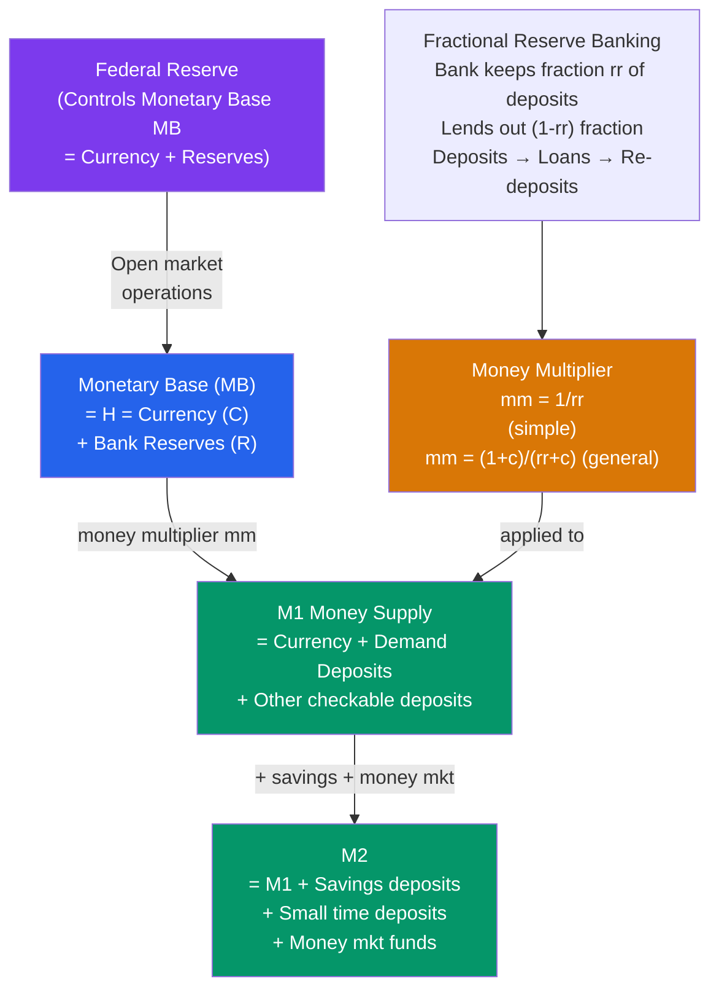

# 🏦 Money and Banking

> [!abstract] TL;DR
> Money serves as a medium of exchange, store of value, and unit of account. Commercial banks create money through fractional-reserve lending — a $100 deposit becomes $1,000 in total deposits when the reserve ratio is 10% (the money multiplier). The Federal Reserve controls the money supply through open market operations, setting reserve requirements, and paying interest on reserves — but since 2008, reserves are abundant and the Fed targets interest rates directly rather than money supply.

## Intuition — analogy FIRST

Imagine a small town with only one bank and $1,000 in gold coins. The bank keeps 10% in its vault ($100) and lends out the rest ($900). The borrower spends the $900, and the recipient deposits it back. The bank keeps $90, lends $810... and so on. By the time the process completes, the town's total deposits are $10,000 — even though there are still only $1,000 in gold coins. That's the **money multiplier**: each gold coin supports $10 of bank deposits.

This is not a trick or fraud — it's how money creation works in a fractional reserve system. The "new" deposits are genuine claims on the banking system, backed by the banks' obligation to repay. The risk is a bank run: if everyone tries to withdraw at once, the fractional reserves can't cover it.

---

## How It Works

---

## Key Concepts / Details

### Functions of Money

1. **Medium of exchange:** Eliminates the double coincidence of wants problem in barter. Everyone accepts money, so trade is frictionless.
2. **Store of value:** Money retains purchasing power over time (unlike perishable goods). Inflation erodes this function.
3. **Unit of account:** Prices are quoted in money, making relative prices easy to compare. Inflation blurs this function when prices change frequently.

Commodity money (gold, silver) had intrinsic value. **Fiat money** (modern currency) has value only because government declares it legal tender and people trust it. The shift from gold standard to fiat was complete globally by 1971 (Nixon closing the gold window).

### Money Supply Measures

The Fed (US) reports multiple monetary aggregates:

| Measure | Includes | US Level (2024) |
|---------|---------|-----------------|
| **M0/MB** | Currency in circulation + bank reserves | ~$5.5 trillion |
| **M1** | Currency + demand deposits + other checkable deposits | ~$18.3 trillion |
| **M2** | M1 + savings deposits + small time deposits + money market funds | ~$21.0 trillion |

Before 2020, M1 and M2 moved slowly and predictably. COVID-era monetary expansion (QE) caused M2 to grow ~27% in 2020-2021 — the fastest growth ever recorded.

### Fractional Reserve Banking and the Money Multiplier

When a bank receives a deposit, it keeps a fraction $rr$ (reserve ratio) and lends $1 - rr$:

| Round | New Deposits | Reserves Kept | New Loans |
|-------|-------------|--------------|-----------|
| 1 | $1,000 | $100 | $900 |
| 2 | $900 | $90 | $810 |
| 3 | $810 | $81 | $729 |
| ... | ... | ... | ... |
| Total | $10,000 | $1,000 | $9,000 |

**Simple money multiplier:**

$$mm = \frac{1}{rr}$$

With $rr = 0.10$: $mm = 10$. A $1,000 monetary base supports $10,000 in M1.

**More realistic money multiplier** (accounting for cash leakage $c = C/D$):

$$mm = \frac{1 + c}{rr + c}$$

If households hold some cash ($c > 0$), the multiplier is smaller than $1/rr$.

### The Monetary Base and the Fed's Balance Sheet

The Fed creates the **monetary base (MB)** — "outside money" — by purchasing assets:
- Buys Treasury bonds → credits bank reserves → MB increases
- Sells Treasury bonds → debits bank reserves → MB decreases

Fed Balance Sheet (simplified):

| Assets | Liabilities |
|--------|-------------|
| Treasury securities | Bank reserves |
| Agency MBS | Currency in circulation |
| Other assets | = Monetary Base |

Before 2008: MB ~ $800 billion, mostly currency.  
After QE (2020): MB ~ $5.5 trillion, mostly excess reserves.

### Excess Reserves and the Post-2008 System

Before 2008, banks held minimal excess reserves (beyond the 10% requirement). After the financial crisis, the Fed began paying **Interest on Reserves (IOR)** — making it attractive for banks to hold excess reserves rather than lend. The system shifted from **corridor** (scarce reserves) to **floor** (abundant reserves):

- **Pre-2008:** Fed controlled the FFR by adjusting reserve supply marginally
- **Post-2008:** Fed controls the FFR by setting the IOR rate — the "floor" system

This is why QE's enormous reserve creation did NOT cause inflation immediately — most reserves sat at the Fed as excess reserves.

### Bank Runs and Deposit Insurance

Fractional reserve banking is inherently fragile: a bank's liabilities (deposits, short-term) are more liquid than its assets (loans, long-term). If depositors lose confidence and all withdraw simultaneously, a solvent bank can become insolvent.

**Diamond-Dybvig model** (1983): bank runs are **self-fulfilling equilibria** — if you believe others will run, it's rational to run yourself. Solution: **deposit insurance** (FDIC up to $250,000 per account in the US) removes the incentive to run.

**2023 Silicon Valley Bank run:** SVB held $200 billion in long-duration bonds that fell in value as rates rose. Social media (Twitter) accelerated the bank run — $42 billion withdrawn in 10 hours. FDIC guarantee was extended beyond $250,000 to prevent broader contagion.

---

## Real-World Notes

- **2008 crisis and the money multiplier collapse:** As banks refused to lend despite abundant reserves, the money multiplier fell sharply — from ~9 to ~3. The "credit channel" of monetary policy broke down.
- **Negative interest rates:** Sweden, Denmark, ECB, and Japan set negative policy rates (-0.5 to -0.75%) post-2014. Theoretically, this should reduce IOR below zero, incentivising banks to lend. In practice, banks partially absorbed negative rates and the effect on lending was modest.
- **Cryptocurrency and "money":** Bitcoin satisfies medium-of-exchange (partially) and store-of-value (partially) but fails as a unit of account (high volatility). It is not counted in official monetary aggregates and is not backed by the central bank.
- **M2 and inflation signal:** Friedman argued M2 growth predicts inflation with an 18-month lag. The 27% M2 surge in 2020-21 predicted inflation; the Fed dismissed it as a "one-time" effect. By mid-2022, CPI hit 9.1%.

---

## Common Pitfalls

- **Banks don't lend out deposits.** Modern banking textbooks (Jakab & Kumhof 2015) argue banks create deposits *when they make loans* — they don't wait for deposits first. The money multiplier narrative runs backward from reality. Yet for aggregate analysis, the multiplier framing remains useful.
- **Confusing M0, M1, and M2.** These are not interchangeable. The Fed controls MB (M0) directly; M1 and M2 depend on bank behavior and public preferences for cash.
- **Reserve requirement as binding constraint.** The Fed reduced the required reserve ratio to 0% in March 2020 — in the floor system with abundant reserves, reserve requirements are no longer the binding constraint on money creation.
- **Assuming QE is inflationary immediately.** QE increases MB, but if reserves stay at the Fed (IOR incentive) or money velocity falls, M2 and inflation may not respond much in the short run.

---

## Related Concepts

- [[_MOC_Monetary_Economics|↑ Section MOC]]
- [[Monetary_Policy_Tools]] — The Fed's instruments for controlling MB and interest rates
- [[Quantity_Theory_of_Money]] — $MV = PY$: how money supply growth links to inflation
- [[LM_Curve]] — The money market equilibrium underpinning IS-LM
- [[Global_Financial_Crises]] — Bank runs, systemic risk, and the 2008 financial crisis

---

## Review Questions

1. A bank receives a $500 deposit. The required reserve ratio is 12% and banks hold no excess reserves. Using T-accounts, trace three rounds of money creation and calculate the total change in M1 if the process runs to completion.
2. Explain the Diamond-Dybvig model of bank runs. Why is deposit insurance an effective solution? What limits its effectiveness (hint: moral hazard)?
3. The Fed doubled its balance sheet from 2019 to 2020. If the money multiplier is 3 and all the new base money is held as excess reserves at the Fed, what happens to M1? What would need to happen for this to become inflationary?

---

## Sources

- N. Gregory Mankiw, *Macroeconomics*, 10th ed., Ch. 4 — Money and Inflation
- Olivier Blanchard, *Macroeconomics*, 8th ed., Ch. 4 — Financial Markets
- Douglas Diamond & Philip Dybvig, "Bank Runs, Deposit Insurance, and Liquidity," *JPE*, 1983
- Zoltan Jakab & Michael Kumhof, "Banks Are Not Intermediaries of Loanable Funds," Bank of England WP, 2015

#macroeconomics #economics #monetary-economics #money-supply #fractional-reserve #money-multiplier
