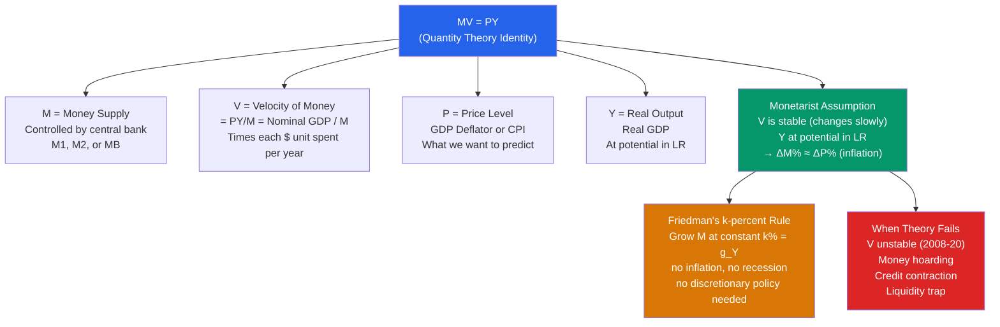

# ⚖️ Quantity Theory of Money

> [!abstract] TL;DR
> The Quantity Theory of Money states $MV = PY$ — the money supply ($M$) times velocity ($V$) equals the price level ($P$) times real output ($Y$). This is an identity, but becomes a theory when $V$ is assumed constant and $Y$ is at potential: money growth determines inflation in the long run. Friedman's monetarism argued for a constant $k$% money growth rule. The theory works well over long horizons but breaks down in the short run as velocity fluctuates.

## Intuition — analogy FIRST

Imagine all the spending in the economy as water flowing through pipes. The total flow equals the price of every transaction times how many transactions happen (nominal GDP, $PY$). The water comes from two sources: the amount of water (money supply, $M$) and how quickly it circulates (velocity, $V$). 

$MV = PY$ simply says: total spending = money × how often it's spent. If you double the amount of water but the pipes are the same size and the flow rate stays constant, the pressure (price level) doubles. That's the quantity theory: in the long run, more money → higher prices, not more real output.

---

## How It Works

---

## Key Concepts / Details

### The Equation of Exchange

The **equation of exchange** is an accounting identity:

$$MV \equiv PY$$

where:
- $M$ = money stock (typically M2 or M1)
- $V$ = velocity of money = $PY/M$ = nominal GDP / money stock
- $P$ = price level (GDP deflator)
- $Y$ = real GDP

**US velocity of M2 (2023):** ~1.35 — each dollar in M2 circulates about 1.35 times per year in nominal GDP spending.

### From Identity to Theory: The Monetarist Assumption

To turn the identity into a theory, monetarists (Friedman, 1956) assume:
1. **$V$ is stable** (changes slowly and predictably over time)
2. **$Y$ is at potential** in the long run (classical dichotomy: money is neutral for real variables)

Under these assumptions:

$$\underbrace{\Delta M}_{\text{control}} + \underbrace{\Delta V}_{\approx 0} = \underbrace{\Delta P}_{\pi \text{ (inflation)}} + \underbrace{\Delta Y}_{g \text{ (real growth)}}$$

Simplifying: $\pi \approx \Delta M - g$

**Prediction:** If money grows at 5% and the economy grows at 2%, inflation will be about 3%.

### Growth Rates Form

Taking percentage changes of $MV = PY$:

$$\frac{\dot{M}}{M} + \frac{\dot{V}}{V} = \pi + g_Y$$

Rearranging for inflation:

$$\pi = \frac{\dot{M}}{M} - g_Y + \frac{\dot{V}}{V}$$

If velocity is constant ($\dot{V}/V = 0$):

$$\pi = \frac{\dot{M}}{M} - g_Y$$

**Long-run empirical support:** Over decades and across countries, high money growth correlates strongly with high inflation. The famous McCandless & Weber (1995) study of 110 countries found a nearly 1-for-1 correlation between M2 growth and inflation over 30 years.

### Velocity and Its Instability

**US velocity of M2 (historical):**
| Period | M2 Velocity | Trend |
|--------|-------------|-------|
| 1960–1980 | ~1.7 | Rising (financial innovation) |
| 1990–2007 | ~2.0 | Fairly stable |
| 2008–2020 | 1.2–1.9 | Falling sharply (QE era, precautionary saving) |
| 2020–2024 | 1.1–1.4 | COVID shock, then partial recovery |

The decline in velocity after 2008 is the main reason QE did not cause immediate inflation despite massive money supply increases. The Fed tripled MB, but V fell by a similar factor — so nominal GDP ($PY$) was little changed initially.

### Friedman's k-Percent Rule

Milton Friedman (1960) proposed that the central bank should grow the money supply at a fixed rate $k$% equal to the long-run real growth rate of the economy:

$$\frac{\dot{M}}{M} = k \approx g_Y^* \approx 3\%$$

This would produce approximately zero inflation and eliminate destabilising discretionary monetary policy. Friedman argued that central banks' attempts to fine-tune the economy — given long and variable lags — made the business cycle *worse*, not better.

**Criticism of the rule:**
- Velocity instability undermines the rule (as post-2008 data showed)
- Technological change and globalisation altered the money-income relationship
- A rigid money rule would have been inappropriate in crises (2008, 2020)

### The Quantity Theory and Hyperinflation

The quantity theory explains hyperinflation: governments that finance deficits by printing money generate explosive money growth → explosive inflation.

**Hyperinflation arithmetic:**
- Zimbabwe 2008: M2 growth reached millions of %/month → CPI inflation reached 79.6 billion %/month
- Weimar Germany 1923: Money supply expanded ~300 billion × from 1919 to 1923 → price level expanded proportionally
- Venezuela 2018: $\frac{\dot{M}}{M} \approx 1,000\%/\text{year}$ → $\pi \approx 1,000,000\%/\text{year}$

The fiscal theory of the price level (Sargent & Wallace 1981): hyperinflation ends only when fiscal deficits are eliminated — printing money to fund deficits is ultimately a fiscal phenomenon.

---

## Real-World Notes

- **Friedman's monetary rule in practice:** The Fed attempted to target money supply growth under Volcker (1979-82) but abandoned it due to velocity instability. No major central bank operates with a money growth rule today; all use inflation targeting with interest rate as the instrument.
- **2021 inflation and M2:** M2 grew 27% in 2020-21. Many monetarists predicted high inflation; the Fed dismissed it. By mid-2022, CPI hit 9.1% — consistent with the quantity theory prediction (with an 18-month lag for velocity adjustment).
- **Japan's QE and the velocity puzzle:** From 2013-2022, the BoJ's balance sheet grew from ~30% to ~130% of GDP under Abenomics QQE. Yet inflation barely moved. Velocity collapsed — suggesting Japan's deflation expectations were so entrenched that money hoarding absorbed the increase.
- **European QE (2015-2018):** ECB's QE of €2.6 trillion barely moved Eurozone inflation from 0.5% to ~2% over 4 years — again, velocity decline offset money supply expansion. The ECB eventually concluded it needed both QE and forward guidance to shift inflation expectations.

---

## Common Pitfalls

- **Confusing the identity with the theory.** $MV = PY$ is always true (definitional). The theory requires the *assumption* that $V$ is stable, which is empirically contested.
- **Short-run vs long-run.** The quantity theory is primarily a *long-run* relationship. In the short run, money changes can affect output ($Y$) and velocity ($V$) changes, making inflation unpredictable from money growth alone.
- **Causality runs one way.** Central banks target interest rates, not money supply. When nominal GDP rises, the money supply expands endogenously (through bank lending) to accommodate. Reverse causality is possible.
- **Applying the theory in financial crises.** During crises, demand for money (precautionary saving, flight to safety) surges — velocity falls. More money does not immediately translate to more spending or inflation.

---

## Related Concepts

- [[_MOC_Monetary_Economics|↑ Section MOC]]
- [[Money_and_Banking]] — What $M$ actually measures (M1, M2) and how it's created
- [[Inflation_and_Interest_Rates]] — Long-run inflation is determined by money growth; the Fisher equation links nominal and real rates
- [[Price_Indices_Inflation]] — $P$ in $MV = PY$ is measured by the GDP deflator or CPI
- [[LM_Curve]] — The LM curve is the short-run version of the quantity theory
- [[Taylor_Rule]] — Modern replacement for Friedman's money growth rule

---

## Review Questions

1. Using $MV = PY$, if money supply grows 6%/year, real GDP grows 3%/year, and velocity grows 1%/year, what is the inflation rate? If the central bank wants to target 2% inflation with 3% real GDP growth and stable velocity, what money growth rate should it set?
2. Milton Friedman advocated a constant k-percent rule for money growth. Identify two specific events in economic history (one before 2008 and one after) where following such a rule would have been problematic, and explain why.
3. Zimbabwe's hyperinflation reached 79.6 billion percent per month in November 2008. Using the quantity theory, explain the mechanism. Why did the hyperinflation end when Zimbabwe adopted the US dollar, and what does this tell us about the fiscal roots of hyperinflation?

---

## Sources

- Irving Fisher, *The Purchasing Power of Money*, 1911
- Milton Friedman, "The Quantity Theory of Money — A Restatement," in *Studies in the Quantity Theory of Money*, 1956
- Milton Friedman, *A Program for Monetary Stability*, 1960
- George McCandless & Warren Weber, "Some Monetary Facts," Federal Reserve Bank of Minneapolis *Quarterly Review*, 1995

#macroeconomics #economics #monetary-economics #MV=PY #quantity-theory #monetarism #velocity
