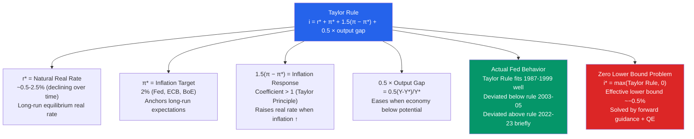

# 🎯 Taylor Rule

> [!abstract] TL;DR
> The Taylor Rule (John Taylor, 1993) is a prescription for setting the nominal policy rate based on the inflation gap and the output gap: $i = r^* + \pi^* + 1.5(\pi - \pi^*) + 0.5(Y - Y^*)/Y^*$. It describes actual Fed behavior surprisingly well and serves as a benchmark for evaluating whether monetary policy is too tight or too loose. The rule's coefficients (1.5 on inflation, 0.5 on output) reflect the Taylor Principle: the nominal rate must rise more than one-for-one with inflation to raise the *real* rate.

## Intuition — analogy FIRST

The Taylor Rule is the thermostat algorithm for a central bank. It says: "If the room is too hot (inflation above target), turn up the cooling (raise rates) more than proportionately. If the economy is running below capacity (output gap), ease up. Combine both signals into one setting."

The key insight is the **Taylor Principle**: to cool inflation, the Fed must raise the nominal rate by *more than* the inflation increase — otherwise the real rate actually *falls*, which is the wrong direction. If inflation rises 1%, the Fed must raise the nominal rate by at least 1% to avoid stimulating the economy further.

Like any thermostat algorithm, the Taylor Rule is a guide, not a straitjacket. The FOMC uses it as one of several inputs, adjusting for unusual circumstances (zero lower bound, financial crises, supply shocks).

---

## How It Works

---

## Key Concepts / Details

### The Taylor Rule Formula

John Taylor (1993) proposed:

$$i_t = r^* + \pi^* + \underbrace{1.5(\pi_t - \pi^*)}_{\text{inflation gap}} + \underbrace{0.5 \times \frac{Y_t - Y^*_t}{Y^*_t}}_{\text{output gap}}$$

where:
- $i_t$ = recommended nominal federal funds rate
- $r^*$ = natural (neutral) real interest rate (Taylor assumed 2%; now estimated ~0.5%)
- $\pi^*$ = inflation target (2%)
- $\pi_t$ = current inflation rate (PCE or GDP deflator)
- $Y_t$ = current real GDP
- $Y^*_t$ = potential GDP

**Taylor's original calibration (1993 paper):**
- $r^* = 2\%$, $\pi^* = 2\%$
- With $\pi = 2\%$ and output gap = 0: $i^* = 2 + 2 + 0 + 0 = 4\%$ (the "neutral" or "long-run equilibrium" FFR)

**Simplified form** (substituting numbers):

$$i_t = 1 + 1.5\pi_t + 0.5 \times \text{output gap}$$

### The Taylor Principle

The most critical feature is the coefficient on the inflation gap: **it must exceed 1**.

If $\pi$ rises by 1% and the Fed raises $i$ by only 0.8%, then:

$$r = i - \pi^e \approx -0.2\%$$

The *real* rate *fell* — the Fed actually eased monetary policy in response to inflation. This is **destabilising** — it feeds more inflation. The Taylor Principle says: raise $i$ by *more than* 1% per 1% rise in $\pi$ to ensure the real rate rises and inflation is cooled.

**Mathematical condition for stability (Taylor Principle):**

$$\frac{\partial i}{\partial \pi} > 1$$

Taylor's 1.5 coefficient satisfies this. The pre-Volcker Fed (1970s) often had coefficients less than 1 — a key explanation for the Great Inflation of the 1970s (Clarida, Galí & Gertler 2000).

### Taylor Rule Variants

**Original Taylor (1993):**
$$i = 2 + \pi + 0.5(\pi - 2) + 0.5 \times \text{output gap}$$

**Balanced approach rule (Fed's preferred):**
$$i = 2.5 + 1.5(\pi - 2) + 1.0 \times \text{output gap}$$

**Inertial Taylor Rule** (accounts for rate smoothing):
$$i_t = \rho \cdot i_{t-1} + (1-\rho)[r^* + \pi^* + 1.5(\pi - \pi^*) + 0.5 \times \text{gap}]$$

where $\rho \approx 0.8$ — the Fed adjusts rates gradually, not all at once.

### Evaluating Fed Policy with the Taylor Rule

| Period | Taylor Rule | Actual FFR | Assessment |
|--------|-------------|------------|------------|
| 1987-1997 | ~6% avg | ~5.9% avg | Close to rule — "Great Moderation" |
| 1999-2000 | ~8% | ~5.5-6.5% | Fed loosened during dot-com boom |
| 2001-2004 | ~3% | ~1-2% | Fed too loose post-9/11 recession |
| 2005-2006 | ~5% | ~5.25% | Roughly on rule |
| 2008-2015 | ~−5% | ~0.125% | ZLB binding — unconventional policy needed |
| 2021 | ~8-10% | ~0.1% | Very large deviation — too loose |
| 2022-2023 | ~5-6% | ~5.25-5.5% | Rapid catch-up to rule |

The 2021 deviation was the largest since the 1970s — the Fed held rates near zero while the Taylor Rule prescribed aggressive hikes.

### The Zero Lower Bound Problem

When the Taylor Rule prescription turns negative (deep recessions with low inflation), the policy rate can't go below (roughly) −0.5%. The "shadow" Taylor rate during the Global Financial Crisis fell to about −5%.

Solutions:
1. **Quantitative Easing:** Equivalent to negative rates via balance sheet expansion
2. **Forward guidance:** Commits to future low rates → lowers long rates today
3. **Negative rates:** Sweden (−0.5%), Japan (−0.1%), ECB (−0.5%) implemented but limited effectiveness
4. **Price level targeting / AIT:** Promise to make up for past inflation shortfalls → more accommodation

### Inflation Targeting Framework

The Taylor Rule is implemented within an **inflation targeting** framework adopted by:
- New Zealand (1990, first) → inflation target 1-3%
- UK (1992) → 2% CPI
- Sweden, Canada, Australia (1993) → 2%
- Eurozone (1999) → below but close to 2%
- US (2012 formal, 1990s informal) → 2% PCE

**Benefits of inflation targeting:**
- Anchors long-term inflation expectations → compresses inflation risk premium → lower borrowing costs
- Improves monetary policy credibility → reduces sacrifice ratio (output loss per unit disinflation)
- Accountability: measurable, transparent, evaluable

**Limitations:**
- Doesn't address financial stability (asset bubbles can form with 2% consumer inflation)
- Symmetric target may cause too much caution about overshooting
- $r^*$ estimation is uncertain and time-varying

---

## Real-World Notes

- **Taylor (1993) original paper:** Taylor showed that his simple rule (with $r^* = 2\%$, $\pi^* = 2\%$) matched actual Fed behavior from 1987-1992 almost exactly — suggesting the Fed was following something like the rule even without knowing it. The paper launched the "rules vs discretion" debate in a new direction.
- **The Great Moderation (1985-2007):** Low inflation + stable output growth. Researchers (including Clarida, Galí & Gertler) argued this was partly because the Fed was following Taylor Rule-like behavior with coefficients satisfying the Taylor Principle — unlike the 1970s.
- **2021-22 "behind the curve" criticism:** The Taylor Rule prescribed rates of 8-10% by mid-2022 when the actual FFR was 0.25%. Critics argued the Fed was repeating the 1970s mistake. The aggressive 2022-23 hike cycle (525 bps in 16 months) was the correction.
- **ECB and the asymmetric target:** Pre-2021, the ECB targeted "below but close to 2%" — interpreted as never exceeding 2%, even briefly. This led to premature rate hikes in 2011 (during Eurozone crisis) and persistently below-target inflation 2013-2021. The 2021 strategy review adopted a symmetric 2% target.

---

## Common Pitfalls

- **Using the rule mechanically.** The Taylor Rule is a benchmark, not a binding commitment. Unusual circumstances (financial crises, supply shocks, ZLB) require deviations. The FOMC uses the rule as one of many inputs.
- **The coefficient choice matters.** Doubling the output gap coefficient (from 0.5 to 1.0) substantially changes the prescribed rate. Different researchers use different calibrations — "the Taylor Rule" is actually a family of rules.
- **Assuming $r^*$ is stable.** The secular decline in $r^*$ from ~2.5% to ~0.5% since 1990 means the "neutral" FFR has fallen substantially. Using $r^* = 2\%$ today overstates the restrictiveness of any given nominal rate.
- **Ignoring the lag between rates and inflation.** The Taylor Rule responds to *current* inflation and output, but policy affects inflation with a 12-24 month lag. Forward-looking versions use forecasts, not current data.

---

## Related Concepts

- [[_MOC_Monetary_Economics|↑ Section MOC]]
- [[Monetary_Policy_Tools]] — The Taylor Rule describes *how* the Fed uses the FFR tool
- [[Inflation_and_Interest_Rates]] — The Fisher equation: $i = r + \pi^e$ underlies the rule
- [[Aggregate_Supply]] — The Phillips curve is the AS-side counterpart to the Taylor Rule on the AD side
- [[Unemployment]] — The output gap is related to the unemployment gap via Okun's Law
- [[IS_LM_Model]] — The Taylor Rule replaces the LM curve in the "New Keynesian IS-MP" model

---

## Review Questions

1. Using the Taylor Rule $i = 2 + \pi + 0.5(\pi - 2) + 0.5 \times \text{gap}$, calculate the prescribed rate when: (a) $\pi = 5\%$, output gap = 0%; (b) $\pi = 1\%$, output gap = −3%; (c) $\pi = 2\%$, output gap = 0%. Interpret each result.
2. Why must the coefficient on the inflation gap in the Taylor Rule exceed 1? Show algebraically what happens to the real interest rate if the Fed raises $i$ by 0.5% in response to a 1% rise in inflation.
3. In 2021, the Taylor Rule prescribed rates of 8-10%, but the Fed held rates near zero. The Fed argued that the inflation was "transitory" and not driven by overheating. Evaluate this reasoning using: (a) the output gap data available in 2021, (b) the Taylor Principle, and (c) what actually happened to inflation in 2022.

---

## Sources

- John B. Taylor, "Discretion versus Policy Rules in Practice," *Carnegie-Rochester Conference Series*, 1993
- Richard Clarida, Jordi Galí & Mark Gertler, "Monetary Policy Rules and Macroeconomic Stability: Evidence and Some Theory," *QJE*, 2000
- John B. Taylor, *Getting Off Track*, 2009 (argues loose policy caused the 2008 crisis)
- Federal Reserve, "Monetary Policy Report," August 2022

#macroeconomics #economics #monetary-economics #Taylor-rule #inflation-targeting #central-bank #Taylor-principle
