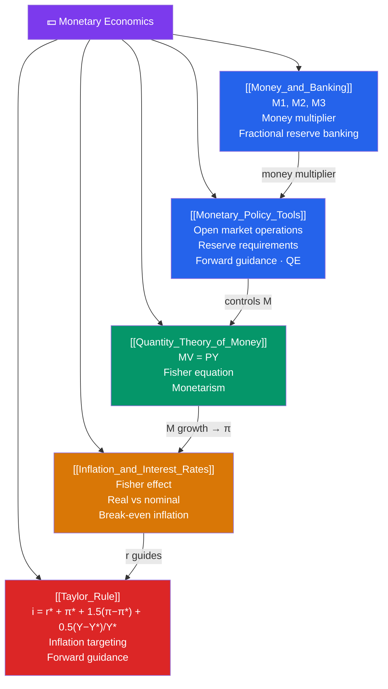

# 🗺️ Monetary Economics — Map of Content

> [!abstract] What This Section Covers
> Monetary economics studies the role of money in the economy — how it is created ([[Money_and_Banking]]), how central banks influence the economy ([[Monetary_Policy_Tools]]), how money growth links to inflation ([[Quantity_Theory_of_Money]]), how inflation and interest rates relate ([[Inflation_and_Interest_Rates]]), and the modern rule-based framework for monetary policy ([[Taylor_Rule]]). This section bridges the short-run IS-LM framework with the long-run price level determination and provides the analytical toolkit for understanding central bank decisions, yield curves, and financial market dynamics.

## Concept Map

## Learning Path

1. [[Money_and_Banking]] — What money is, how banks create it through fractional reserves, and the money multiplier.
2. [[Monetary_Policy_Tools]] — The Fed's toolkit: open market operations, reserve requirements, discount rate, IOR, QE, forward guidance.
3. [[Quantity_Theory_of_Money]] — $MV = PY$; monetarism; the long-run neutrality of money; Friedman's k-percent rule.
4. [[Inflation_and_Interest_Rates]] — The Fisher equation ($i = r + \pi^e$); real vs nominal rates; break-even inflation; the Fisher effect.
5. [[Taylor_Rule]] — The Taylor rule as a framework for interest rate decisions; inflation targeting; the zero lower bound problem.

## All Notes at a Glance

| Note | Difficulty | What You'll Learn |
|------|------------|-------------------|
| [[Money_and_Banking]] | Beginner | M1/M2/M3; fractional reserves; money multiplier; bank runs |
| [[Monetary_Policy_Tools]] | Intermediate | Fed tools; transmission mechanism; QE; unconventional policy |
| [[Quantity_Theory_of_Money]] | Intermediate | $MV=PY$; velocity; monetarism; k-percent rule |
| [[Inflation_and_Interest_Rates]] | Intermediate | Fisher equation; TIPS; real rates; inflation risk premium |
| [[Taylor_Rule]] | Intermediate | Taylor rule formula; inflation targeting; central bank credibility |

## Key Questions This Section Answers

- How do commercial banks create money through lending, and what limits this process?
- How does the Federal Reserve control the money supply and short-term interest rates?
- Why does money growth eventually cause inflation (but not always in the short run)?
- What is the difference between a real and nominal interest rate, and what is the Fisher effect?
- How does the Taylor Rule translate output gaps and inflation gaps into interest rate decisions?

## Related Sections

- [[_MOC_Macroeconomics_Master|↑ Macroeconomics Master MOC]]
- [[_MOC_IS_LM_AD_AS|← IS-LM & AD-AS]]
- [[_MOC_Fiscal_Policy|→ Fiscal Policy]]
- [[_MOC_International_Macro|→ International Macroeconomics]]

#MOC #Macroeconomics #MonetaryEconomics
