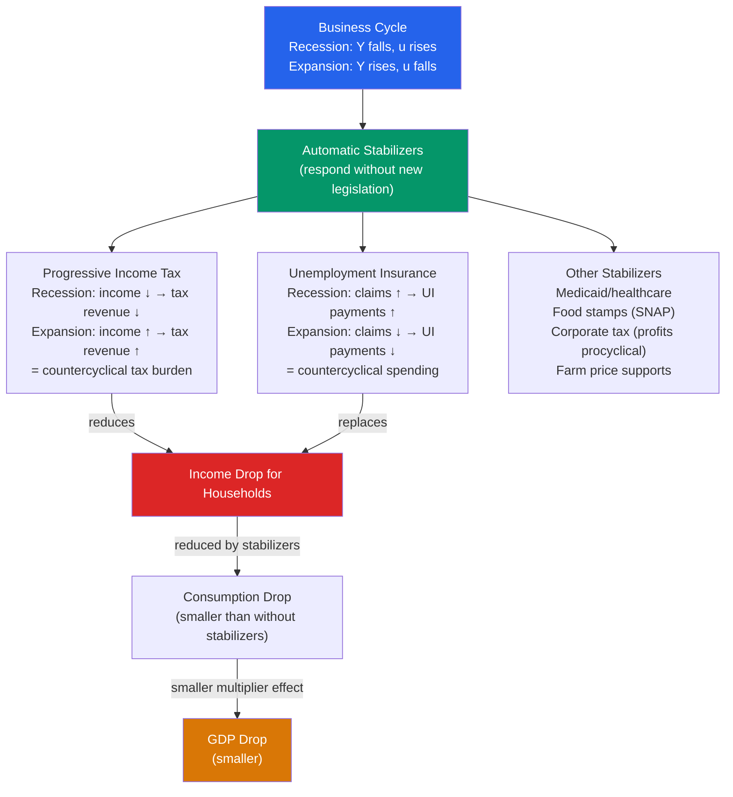

# ⚖️ Automatic Stabilizers

> [!abstract] TL;DR
> Automatic stabilizers are fiscal mechanisms that respond automatically to the business cycle without any new legislation — reducing the amplitude of recessions and preventing overheating. They include progressive income taxes (which collect less in recessions) and unemployment insurance (which pays out more). The US automatic stabilizers offset an estimated 5-10% of an initial income shock, while the Eurozone and Nordic countries — with more generous unemployment systems and higher tax progressivity — offset 20-30%.

## Intuition — analogy FIRST

Imagine the economy as a boat in rough seas. Discretionary fiscal policy is like a crew member who manually adjusts ballast when waves hit — but they have to wake up, assess the situation, debate the response, and implement it (recognition lag, implementation lag, effectiveness lag). By the time they act, the wave may have passed.

Automatic stabilizers are like a boat's keel — they respond *immediately* to waves without anyone having to decide anything. When a recession hits and people lose jobs, unemployment benefits flow automatically. Tax bills fall automatically as incomes drop. These cash flows help households maintain spending through the downturn — cushioning the fall without policy deliberation.

---

## How It Works

---

## Key Concepts / Details

### Mechanism of Automatic Stabilizers

**Progressive income taxes** as stabilizers:
- In a recession, nominal incomes fall. A progressive tax system means more income falls into lower tax brackets → effective tax rate falls → disposable income falls by less than gross income
- In an expansion, incomes and progressivity together raise effective tax rates → disposable income rises less than gross → prevents overheating

**Unemployment insurance (UI):**
- In a recession, UI claims rise automatically → more cash injected into the economy → partially maintains consumer spending
- In an expansion, UI claims fall → automatic withdrawal of stimulus → prevents overheating

**Other automatic stabilizers:**
- Corporate income taxes: profits are highly procyclical → in recession, lower profits → lower corporate taxes → partial offset
- Food stamps (SNAP) and Medicaid: enrollment rises automatically in recessions → additional automatic spending
- Farm income supports: commodity prices fall in global slowdowns → farm support payments rise

### Measuring the Size of Automatic Stabilizers

The **cyclically-adjusted budget balance** separates the automatic stabilizer component from discretionary fiscal policy:

$$\text{Actual deficit} = \underbrace{\text{Structural (discretionary) deficit}}_{\text{policy choice}} + \underbrace{\text{Cyclical deficit}}_{\text{automatic stabilizers}}$$

As a rule of thumb:
- Each 1% fall in GDP → automatic spending rise and revenue fall of **0.3-0.5% of GDP** (US)
- Eurozone: **0.4-0.6% of GDP** per 1% output gap
- Sweden/Denmark: **0.5-0.7% of GDP** per 1% output gap

**Auerbach & Feenberg (2000):** US automatic stabilizers offset approximately 8-10% of a labor income shock through the tax system alone.

**IMF (2009):** During the 2008-09 recession, automatic stabilizers provided significant support — particularly in Europe where:
- Unemployment benefits are more generous (50-80% income replacement vs ~40% in US)
- Labor market institutions provide more income security
- Tax systems are more progressive

### Fiscal Multiplier of Automatic Stabilizers

The automatic stabilizer reduces the Keynesian multiplier effect of a shock:

$$\text{Effective multiplier} = \frac{1}{1 - c(1-t)}$$

where $t$ = marginal tax rate. This is smaller than $1/(1-c)$ because each round of spending generates less disposable income (taxes are collected each time).

With $c = 0.75$, $t = 0.25$: Effective multiplier $= 1/(1 - 0.75 \times 0.75) = 1/0.4375 \approx 2.3$ — lower than the $1/(1-c) = 4$ without taxes.

The shock-absorbing property: automatic stabilizers reduce the multiplier effect of negative shocks (reduce the recession) AND of positive shocks (reduce overheating).

### Cyclical vs Structural Budget Balance

The IMF/OECD compute the **cyclically-adjusted primary balance (CAPB)** to assess underlying fiscal stance:

$$\text{CAPB} = \text{Actual Primary Balance} - \text{Cyclical Component}$$

The cyclical component is estimated using output gap and elasticities of revenue/expenditure to the cycle. This tells you whether government is actively tight or loose, independent of where the economy is in the cycle.

**Example (2009 US):**
- Actual budget deficit: 10% of GDP
- Cyclical component: ~6% of GDP (recession deepened deficit automatically)
- Structural deficit: ~4% of GDP (discretionary policy, including ARRA)

### International Comparison

| Country | Auto-stabilizer offset of GDP shock | Key mechanism |
|---------|------------------------------------|----|
| US | 5-10% | Progressive income tax, modest UI |
| Germany | 20-25% | Generous UI, Kurzarbeit (short-time work) |
| Sweden | 30-35% | Very generous UI, highly progressive taxes |
| Japan | 10-15% | Moderate UI, lower tax progressivity |
| Emerging markets | 2-5% | Limited UI, less progressive taxes |

Germany's **Kurzarbeit** (short-time work) is a particularly powerful automatic stabilizer: instead of laying workers off, firms reduce hours and the government pays workers for the lost hours. In 2020, ~6 million Germans were on Kurzarbeit at peak — keeping unemployment from spiking the way it did in the US (+11 percentage points) with only a +3 pp rise.

---

## Real-World Notes

- **US automatic stabilizers in 2020:** The recession of February-April 2020 triggered $600+ billion in automatic fiscal support — unemployment insurance, Medicaid, SNAP. This was ON TOP of the ~$3.9T in discretionary stimulus. The combination was extremely powerful — income actually ROSE in Q2 2020 for the bottom 60% of households despite the worst recession in history.
- **Eurozone "no backstop" problem (2010-12):** The Eurozone had automatic stabilizers (generous UI, progressive taxes) but lacked a fiscal union — each country had to finance its own automatic stabilizer spending. In a simultaneous recession, this required austerity exactly when the automatic stabilizers demanded more borrowing. Greece's automatic stabilizers deepened its deficit, triggering a funding crisis, forcing austerity, deepening the recession further — a vicious cycle.
- **Sweden 2020:** Swedish automatic stabilizers (60-80% income replacement in UI) cushioned the COVID shock so effectively that Sweden's private consumption fell by less than the US despite a less aggressive lockdown policy.
- **The ARRA (2009) interaction:** The $787B ARRA was a discretionary response on top of ~$400B in automatic stabilizer support. Understanding which part of the deficit was "automatic" and which was "discretionary" matters for evaluating fiscal multipliers.

---

## Common Pitfalls

- **Confusing automatic stabilizers with discretionary policy.** Automatic stabilizers require no legislative action — they kick in automatically. ARRA, CARES, PPP were discretionary (required votes). The distinction matters for understanding policy lags and design.
- **Thinking automatic stabilizers prevent recessions.** They cushion recessions but don't prevent them. An economy with perfect automatic stabilizers would still experience recessions — just shallower ones.
- **Ignoring the structural balance.** The actual budget deficit includes both automatic and discretionary components. During a deep recession, a large deficit can be mostly automatic — not an indication of reckless fiscal policy.
- **The pro-cyclical trap.** Countries with fiscal rules targeting the *actual* (not structural) deficit are forced to cut spending in recessions (when the deficit automatically widens) — this is pro-cyclical and counterproductive. Germany's constitutional debt brake can have this effect; the EU's Stability and Growth Pact has been suspended multiple times for this reason.

---

## Related Concepts

- [[_MOC_Fiscal_Policy|↑ Section MOC]]
- [[Government_Spending_Multiplier]] — Automatic stabilizers reduce the effective multiplier but provide built-in countercyclical support
- [[Budget_Deficits_and_Debt]] — Cyclically-adjusted balance separates automatic from structural deficit
- [[Unemployment]] — Unemployment insurance is the primary automatic stabilizer on the spending side
- [[Business_Cycle_Indicators]] — Automatic stabilizers respond to the same indicators that define the business cycle

---

## Review Questions

1. An economy has a marginal income tax rate of $t = 0.30$ and an MPC of $c = 0.80$. Calculate the effective multiplier with automatic stabilizers. Compare to the simple multiplier without taxes. By what percentage does the tax system reduce the impact of a spending shock?
2. Germany's Kurzarbeit kept unemployment from rising above 6% in 2020, while US unemployment spiked to 14.7%. Both experienced similar GDP drops. Explain how Kurzarbeit functions as an automatic stabilizer, and discuss its potential long-run drawbacks (hint: efficiency vs insurance).
3. A country following a fiscal rule that requires a balanced budget *in every year* (not just structurally). In a recession, the automatic stabilizers cause the deficit to widen. Under this rule, the government must then raise taxes or cut spending to restore balance. Use the IS-LM or AD-AS framework to show why this rule is destabilising.

---

## Sources

- N. Gregory Mankiw, *Macroeconomics*, 10th ed., Ch. 10 — Aggregate Demand I
- Alan Auerbach & Daniel Feenberg, "The Significance of Federal Taxes as Automatic Stabilizers," *JEP*, 2000
- IMF, "Fiscal Monitor: Navigating the Fiscal Challenges Ahead," May 2010
- Mathias Dolls, Clemens Fuest & Andreas Peichl, "Automatic Stabilizers and Economic Crisis," *European Economic Review*, 2012

#macroeconomics #economics #fiscal-policy #automatic-stabilizers #unemployment-insurance #cyclical-budget
