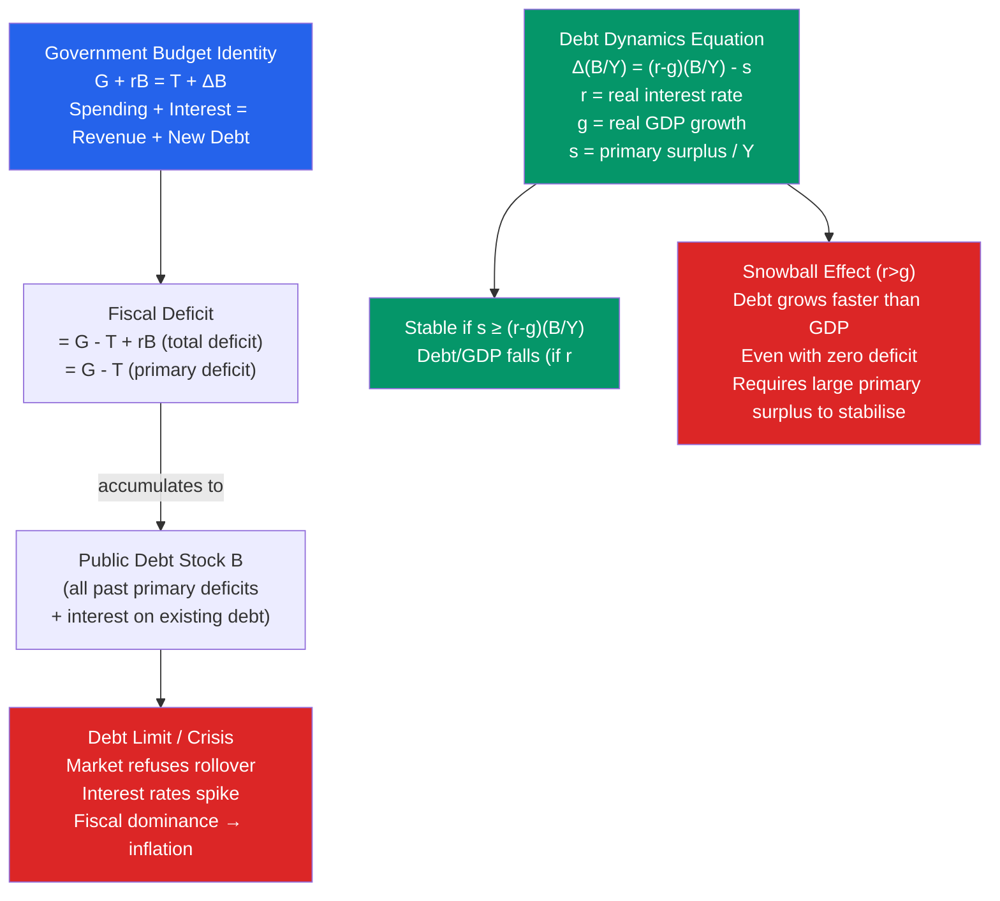

# 📊 Budget Deficits and Debt

> [!abstract] TL;DR
> The government budget deficit equals spending minus revenue ($G - T$) in a given year; public debt is the accumulated stock of past deficits. The debt dynamics equation $\dot{b} = (r - g)b - s$ shows debt-to-GDP is stable when the primary surplus $s$ exceeds $(r - g)b$. When $r > g$ (Domar condition violated), debt can snowball without primary surpluses. Historical crises show that ~90% debt-to-GDP is associated with lower growth — though causality is debated (Reinhart-Rogoff controversy).

## Intuition — analogy FIRST

Government debt is like a mortgage on a house. Taking on the debt to buy the house is sensible if the house produces value (education spending, infrastructure) and if you can service the payments from your income. The danger is when the interest payment grows faster than your income — then the mortgage crowd out everything else and eventually becomes unpayable.

The key ratio is $r - g$: the interest rate on debt ($r$) versus the economy's growth rate ($g$). If you earn raises of 5%/year and your mortgage interest is 3%/year, your debt-to-income ratio automatically falls over time — even without making extra payments. But if your income stagnates (2%/year) and interest is 5%/year, the debt-to-income ratio keeps rising, requiring painful budget cuts.

---

## How It Works

---

## Key Concepts / Details

### The Government Budget Identity

The **flow** constraint: each period, spending must equal revenue plus new borrowing:

$$G_t + r_{t-1}B_{t-1} = T_t + (B_t - B_{t-1})$$

Rearranging: New debt issued $= G - T + rB$ (total deficit = primary deficit + interest payments).

**Primary deficit:** $G - T$ (spending less taxes, *excluding* interest)  
**Total deficit:** $G - T + rB$ (includes interest on existing debt)

The distinction matters: a country with 100% debt-to-GDP and 5% interest rate must run a 5% primary *surplus* just to keep debt-to-GDP constant (if $r = g$).

### Debt Dynamics Equation

Define debt ratio $b \equiv B/Y$. The evolution of the debt ratio:

$$\dot{b} = (r - g)b - s$$

where:
- $\dot{b}$ = change in debt-to-GDP ratio
- $r$ = real interest rate on government debt
- $g$ = real GDP growth rate
- $s$ = primary surplus-to-GDP ratio ($= (T - G)/Y$)

**Steady-state debt ratio** (when $\dot{b} = 0$):

$$b^* = \frac{s}{r - g} \quad (\text{if } r > g)$$

**Key implications:**

| $r$ vs $g$ | Primary Surplus Required | Debt Trajectory |
|-----------|------------------------|-----------------|
| $r < g$ | None — debt ratio falls automatically | Sustainable even with small deficits |
| $r = g$ | Zero primary balance needed | Debt/GDP stable with balanced budget |
| $r > g$ | Positive primary surplus needed | Debt snowballs without surpluses |

### The r-g Debate

**Blanchard (2019) AEA Presidential Address:** For most of the post-WWII period, $r < g$ in the US — making the "snowball effect" a non-issue. The US could run deficits without destabilising debt dynamics. Even today, US 10-year real rate (~2%) is below potential growth (~2.5%), suggesting debt is not on an explosive path.

**Domar condition:** Debt is sustainable if $g > r$ (Domar 1944). When growth exceeds the interest rate, even constant primary deficits lead to stable or falling debt/GDP.

**Counter-argument:** $r < g$ may reflect the current low-rate environment and is not guaranteed to persist. If interest rates normalise above growth rates, fiscal consolidation becomes necessary.

### Historical Debt Episodes

| Country/Period | Peak Debt/GDP | Resolution |
|---------------|--------------|------------|
| US after WWII | 120% (1946) | Grew out over 35 years (inflation + growth) |
| UK after WWII | 250% (1946) | Inflation + growth + financial repression |
| Japan 2024 | ~260% | Negative real rates, JGB bought by BoJ |
| Greece 2012 | 180% | IMF/EU bailout + partial default (haircut) |
| Argentina (serial) | Various | Repeated defaults (8 times since 1816) |

### The Reinhart-Rogoff Controversy

Carmen Reinhart and Kenneth Rogoff's (2010) paper "*Growth in a Time of Debt*" found:
- When public debt exceeds 90% of GDP, median GDP growth falls sharply (~1% lower per year)
- This was widely cited to justify austerity policies

**Spreadsheet error controversy (Herndon et al. 2013):** A graduate student found an Excel error in R&R's calculation. After correction, the average growth rate drop at 90% debt was ~0.1%, not the dramatic break claimed. The paper also had questionable weighting choices.

**Causality debate:** Even if high debt correlates with low growth, causation likely runs **both directions**: low growth → high debt (automatic stabilizers, recession spending) AND high debt → lower growth (crowding out, distortionary taxes). Most economists now believe the 90% "threshold" is not a reliable bright line.

---

## Real-World Notes

- **US debt trajectory:** US federal debt held by public rose from ~35% of GDP (2000) → ~70% (2012) → ~100% (2020) → ~97% (2024). The COVID surge (CARES Act, PPP, ARP) added ~25% of GDP in a single year. The CBO projects debt rising to ~180% of GDP by 2054 under current policy.
- **Japan's debt miracle:** Japan's debt-to-GDP of 260% (2024) has not caused a crisis — because Japan borrows almost entirely from domestic savers in yen, the BoJ can suppress JGB yields, and deflation/low inflation has meant near-zero nominal rates. A unique combination unlikely to apply to developing countries.
- **Eurozone sovereign debt crisis (2010-12):** Greece, Ireland, Portugal, Spain, and Italy faced funding crises despite running primary surpluses in some cases — the issue was market confidence, not just arithmetic. ECB President Draghi's "whatever it takes" speech (July 2012) ended the crisis by signalling unlimited sovereign bond purchases.
- **Argentina's defaults:** Argentina defaulted in 2001 ($82 billion, the largest then on record), again in 2014 (technical default on holdout bonds), and restructured in 2020. The pattern reflects chronic primary deficits, currency crises, and external debt in foreign currency.

---

## Common Pitfalls

- **Confusing the deficit and the debt.** The deficit is a *flow* (this year's gap). The debt is a *stock* (accumulated past gaps). A country can reduce its deficit while still increasing its debt (as long as the deficit is positive).
- **Ignoring the primary vs total deficit.** A country with a primary surplus but large legacy debt will still show a total deficit (interest payments). Fiscal sustainability is assessed by the primary balance relative to $(r-g)b$.
- **Assuming high debt always causes a crisis.** Japan, the US, and the UK have run very high debt levels for extended periods without a crisis. The key factors: currency sovereignty, domestic debt ownership, reserve currency status, and the $r-g$ environment.
- **Using nominal vs real interest rates.** Inflation reduces the real burden of nominal debt. High-inflation periods (1940s-50s, 1970s) effectively inflated away large debt burdens — "financial repression."

---

## Related Concepts

- [[_MOC_Fiscal_Policy|↑ Section MOC]]
- [[Tax_Policy]] — Revenue is the $T$ in the budget identity
- [[Government_Spending_Multiplier]] — Deficit spending works through the multiplier
- [[Ricardian_Equivalence]] — Does the method of financing (debt vs taxes) matter?
- [[National_Income_Identity]] — Government deficit = private surplus (by accounting)
- [[Global_Financial_Crises]] — Sovereign debt crises are a key form of financial crisis

---

## Review Questions

1. A country has debt-to-GDP of 80%, real interest rate of 3%, real GDP growth of 2%, and a primary surplus of 0.5% of GDP. Using the debt dynamics equation, is debt rising or falling? What primary surplus would be needed to stabilise debt at 80%?
2. Blanchard (2019) argued that since $r < g$ in the US, the standard view that government debt is costless at the margin may be too pessimistic. Explain his argument. What are the main counter-arguments for why this view should not encourage unlimited borrowing?
3. The Reinhart-Rogoff paper was initially cited as justification for Eurozone austerity. After the spreadsheet error was found and corrected, what remained of their empirical finding? Does the corrected finding still support austerity? Discuss the causality question.

---

## Sources

- N. Gregory Mankiw, *Macroeconomics*, 10th ed., Ch. 17 — Government Debt
- Olivier Blanchard, "Public Debt and Low Interest Rates," *AER*, 2019
- Carmen Reinhart & Kenneth Rogoff, "Growth in a Time of Debt," *AER*, 2010
- Thomas Herndon, Michael Ash & Robert Pollin, "Does High Public Debt Consistently Stifle Economic Growth?" *Cambridge Journal of Economics*, 2014

#macroeconomics #economics #fiscal-policy #public-debt #deficit #debt-dynamics
