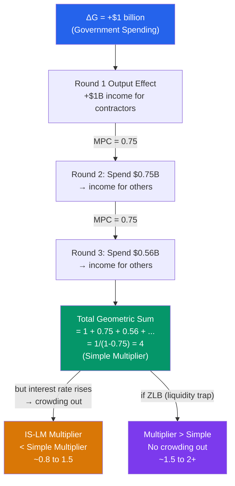

# ✖️ Government Spending Multiplier

> [!abstract] TL;DR
> The government spending multiplier measures how much total GDP increases for each dollar of additional government spending. The simple Keynesian multiplier is $1/(1-c)$ — if the MPC is 0.75, one extra dollar of G ultimately raises GDP by $4. But the IS-LM multiplier is smaller due to crowding out (rising interest rates reduce private investment). Empirical estimates cluster around 0.8–1.5 in normal times, rising above 2 during recessions when monetary policy is constrained.

## Intuition — analogy FIRST

Imagine the government spends $1 billion building a bridge. The construction workers earn that money and spend 75 cents of every dollar at local restaurants. Those restaurant workers earn and spend 75 cents of that, and so on. The initial $1 billion keeps circulating through the economy, creating a chain of spending.

The **multiplier** is the total output generated by this chain. With a 75 cent marginal propensity to consume (MPC = 0.75), the chain sums to $1/(1 - 0.75) = $4$. So a $1 billion government spend eventually generates $4 billion in total GDP.

But the real world complicates this: (1) if the government borrows to finance the spending, interest rates rise and crowd out private investment; (2) if households anticipate future tax hikes (Ricardian equivalence), they save the stimulus; (3) if the economy is at full capacity, output can't rise — only prices do.

---

## How It Works

---

## Key Concepts / Details

### The Simple Keynesian Multiplier

The **goods-market multiplier** (holding interest rates constant):

$$\text{Multiplier} = \frac{1}{1 - c} = \frac{1}{\text{MPS}}$$

where $c$ = marginal propensity to consume (MPC), and MPS = $1 - c$ = marginal propensity to save.

| MPC | Multiplier |
|-----|-----------|
| 0.5 | 2 |
| 0.75 | 4 |
| 0.8 | 5 |
| 0.9 | 10 |

For a **tax cut**, the multiplier is smaller:

$$\text{Tax Multiplier} = \frac{-c}{1-c}$$

A $1 tax cut raises GDP by $c/(1-c)$, less than the spending multiplier $1/(1-c)$ because households save a fraction $(1-c)$ of the tax rebate.

**Balanced budget multiplier (Haavelmo theorem):** Equal increases in $G$ and $T$ raise output by exactly 1. Proof:

$$\Delta Y = \frac{1}{1-c}\Delta G + \frac{-c}{1-c}\Delta T = \frac{1}{1-c}\Delta G - \frac{c}{1-c}\Delta G = \Delta G$$

### The IS-LM Multiplier (with Crowding Out)

In IS-LM, fiscal expansion raises interest rates, which crowds out investment:

$$\frac{\partial Y}{\partial G}\bigg|_{IS-LM} = \frac{1}{(1-c) + bk/h} < \frac{1}{1-c}$$

The IS-LM multiplier is always less than the simple Keynesian multiplier. The "crowding out" factor is $bk/h$ in the denominator — larger when:
- Investment is sensitive to interest rates ($b$ large)
- Money demand rises with income ($k$ large)
- Money demand is insensitive to interest rates ($h$ small)

**Full crowding out** (classical case): LM vertical → 100% crowding out → multiplier = 0.

**Zero crowding out** (liquidity trap, horizontal LM): interest rate can't rise → multiplier = simple Keynesian multiplier.

### Empirical Estimates of the Multiplier

The empirical literature has produced wide-ranging estimates:

| Study | Multiplier | Method | Context |
|-------|-----------|--------|---------|
| Romer & Bernstein (2009) | 1.5 | Structural model | ARRA design |
| Barro & Redlick (2011) | 0.4-0.7 | Defense spending | Post-WWII US |
| Ilzetzki, Mendoza & Vegh (2013) | 1.5 (recession), 0.7 (expansion) | Panel of countries | Varies with cycle |
| Blanchard & Leigh (2013) | 1.5-2.0 | IMF forecasting errors | Eurozone austerity |
| Nakamura & Steinsson (2014) | 1.5-2.0 | Military spending | "Local" multiplier |

**Key findings:**
1. Multipliers are **higher during recessions** (when monetary policy is constrained)
2. Multipliers are **higher in closed economies** (no import leakage)
3. Multipliers are **higher under fixed exchange rates** (monetary policy constrained)
4. Multipliers are **near zero in open economies with flexible exchange rates** (Mundell-Fleming)

### State-Dependent Multipliers

Modern research finds the multiplier is not constant — it depends on:

**Recession vs expansion:**
- In a recession (high slack, ZLB likely): multiplier ~1.5–2.5
- In an expansion (full employment): multiplier ~0.5–1.0 (crowding out + inflation)

**Monetary policy regime:**
- Accommodative monetary (ZLB): crowding out eliminated, higher multiplier
- Aggressive monetary offset: central bank tightens in response to fiscal expansion → multiplier near zero

**Austerity multiplier:** The IMF (Blanchard & Leigh 2013) found fiscal consolidation multipliers during 2010-12 Eurozone austerity were ~1.5–2.0 — much larger than the 0.5 assumed in their forecast models. The error was recognising that all countries were consolidating simultaneously (no neighbour to absorb exports) and the ECB wasn't offsetting the austerity.

---

## Real-World Notes

- **US ARRA (2009, $787 billion):** The Congressional Budget Office estimated the multiplier at 1.0–2.5 for different spending categories (infrastructure highest, tax cuts lowest). The actual macroeconomic response was smaller than projected — partly because the multiplier was on the lower end, partly because the stimulus was offset by state/local government cuts.
- **COVID stimulus (2020-21, ~$3.9 trillion, ~17% of GDP):** An unprecedented fiscal expansion. Multiplier effects were complicated by supply constraints — fiscal stimulus collided with constrained supply, generating inflation rather than purely more real output. The "fiscal multiplier" in terms of real GDP was probably lower than 1 due to price-level response.
- **Eurozone austerity (2010-2013):** Greece, Portugal, Spain, and Ireland implemented severe spending cuts and tax increases under IMF/EU conditionality. Output fell much more than models predicted — consistent with a "fiscal multiplier" of 1.5-2 during a deep recession with a fixed exchange rate (euro).
- **WWII spending:** US defense spending rose from 1.6% to 37% of GDP between 1940 and 1944. Real GDP grew ~75%. Whether this implies a large multiplier is debated — the economy was coming from very low utilisation (Great Depression) and there were price controls suppressing inflation.

---

## Common Pitfalls

- **Using the simple multiplier without accounting for crowding out.** At normal interest rates, the IS-LM multiplier is always smaller than the simple Keynesian multiplier. The simple multiplier is a ceiling, not a realistic estimate.
- **Applying a constant multiplier across regimes.** The multiplier varies dramatically with the business cycle position, monetary policy stance, exchange rate regime, and trade openness. A recession multiplier of 1.5 doesn't apply during a boom.
- **Confusing spending multiplier with tax multiplier.** Tax cuts have a smaller multiplier ($c/(1-c)$ vs $1/(1-c)$) because part of the cut is saved. Infrastructure spending has a higher multiplier than transfer payments.
- **Ignoring the spending composition.** Not all spending is equal. Transfer payments (unemployment benefits) stimulate quickly (recipients spend immediately, high MPC). Capital spending on infrastructure has higher long-run multipliers through productivity enhancement.

---

## Related Concepts

- [[_MOC_Fiscal_Policy|↑ Section MOC]]
- [[IS_Curve]] — The IS shift from fiscal expansion
- [[IS_LM_Model]] — IS-LM multiplier and crowding out
- [[Ricardian_Equivalence]] — If true, multiplier = 0 (households offset fiscal stimulus)
- [[Automatic_Stabilizers]] — Built-in multiplier effects without discretionary action
- [[Tax_Policy]] — Tax multiplier is $-c/(1-c)$, smaller than spending multiplier

---

## Review Questions

1. Calculate the simple Keynesian multiplier for $c = 0.8$. If $G$ rises by $200 billion, what is the total increase in GDP (ignoring interest rate effects)? Now calculate the IS-LM multiplier with $b = 20$, $k = 0.5$, $h = 50$, and compare.
2. Blanchard and Leigh (2013) found that IMF forecasters assumed a multiplier of 0.5 for European austerity, but the actual multiplier was 1.5–2. Give three structural reasons why the multiplier would have been higher in 2010-2012 Greece/Portugal than in normal times.
3. Why does the "balanced budget multiplier theorem" (Haavelmo) say that equal increases in $G$ and $T$ raise output by exactly 1? Is this result robust to the IS-LM framework (with crowding out)? Explain.

---

## Sources

- N. Gregory Mankiw, *Macroeconomics*, 10th ed., Ch. 10 — Aggregate Demand I
- Olivier Blanchard & Daniel Leigh, "Growth Forecast Errors and Fiscal Multipliers," *AER Papers & Proceedings*, 2013
- Lawrence Christiano, Martin Eichenbaum & Sergio Rebelo, "When Is the Government Spending Multiplier Large?" *JPE*, 2011
- Robert Barro & Charles Redlick, "Macroeconomic Effects from Government Purchases and Taxes," *QJE*, 2011

#macroeconomics #economics #fiscal-policy #multiplier #government-spending #Keynesian
