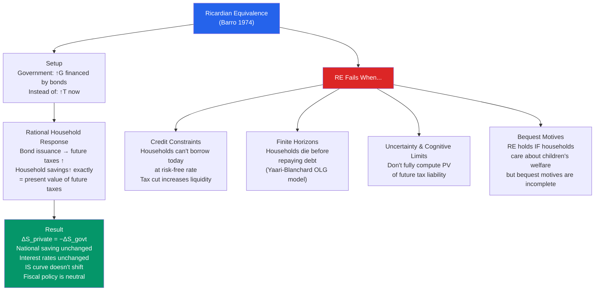

# 🔄 Ricardian Equivalence

> [!abstract] TL;DR
> Ricardian Equivalence (Robert Barro, 1974) states that the method of financing government spending — taxes now or debt (taxes later) — is irrelevant for aggregate demand. Forward-looking households, anticipating future taxes to repay today's debt, will save the tax rebate exactly, leaving national saving, interest rates, and output unchanged. In practice, RE fails because households are credit-constrained, have finite horizons, don't fully anticipate future taxes, and may not leave bequests — making debt-financed tax cuts partially or fully stimulative.

## Intuition — analogy FIRST

The government tells you it's cutting your taxes by $1,000 this year, financed by borrowing. But Ricardian consumers think: "The government must repay this debt someday — with interest. That means future taxes must rise by the present value of $1,000. My household's lifetime wealth hasn't changed — I might as well save this $1,000 to pay the future tax."

If every household reasons this way, the tax cut doesn't stimulate consumption — households save it. Private saving rises by exactly the amount the government is dissaving (deficit). National saving (private + public) is unchanged. Interest rates don't change. The IS curve doesn't move.

The key question in fiscal policy is whether households actually behave this way — or whether they are short-sighted, credit-constrained, or planning to leave future generations with the bill.

---

## How It Works

---

## Key Concepts / Details

### The Formal Argument

**Government's intertemporal budget constraint:**

$$G_1 + \frac{G_2}{1+r} = T_1 + \frac{T_2}{1+r}$$

The government must eventually tax enough to pay for all spending. Issuing debt today just defers taxes to the future.

**Household's budget constraint with rational expectations:**

$$C_1 + \frac{C_2}{1+r} = (Y_1 - T_1) + \frac{Y_2 - T_2}{1+r}$$

Lifetime wealth = present value of lifetime after-tax income.

**The key step:** A government tax cut ($\Delta T_1 < 0$, i.e., $T_1$ falls) financed by debt must be offset by a future tax rise: $\Delta T_2 = -(1+r)\Delta T_1$. Substituting into the household budget constraint:

$$\Delta(\text{Lifetime Wealth}) = -\Delta T_1 - \frac{(1+r)\Delta T_1}{1+r} = -\Delta T_1 + \Delta T_1 = 0$$

Lifetime wealth is unchanged → optimal consumption is unchanged → households save the full tax rebate.

### Conditions for Ricardian Equivalence to Hold

1. **Perfect capital markets:** Households can borrow and save at the same rate as the government
2. **Infinite horizon or full bequest motive:** Households care about their descendants as much as themselves (Barro 1974) — they internalise future generations' tax burden
3. **Lump-sum taxes:** Non-distortionary taxes (in practice, distortionary taxes create deadweight loss effects)
4. **Perfect foresight:** Households correctly anticipate future tax changes
5. **No uncertainty:** Households know the magnitude and timing of future taxes

### Why Ricardian Equivalence Fails

**Credit constraints (Liquidity constraints):**
If a household cannot borrow (due to credit market imperfections), a tax cut provides cash the household could not otherwise access. Consumption responds dollar-for-dollar to the tax cut, even if the household "should" save it.

Approximately 25-40% of US households are estimated to be credit-constrained (Campbell & Mankiw 1989), suggesting partial Keynesian effects even if Ricardians dominate.

**Finite horizons and OLG:**
Blanchard's (1985) overlapping generations model: households face a constant probability $p$ of dying each period. The discount rate they apply to future taxes is $r + p$ — higher than $r$ alone. Future taxes are discounted more heavily than the government's borrowing rate, so debt isn't exactly equivalent to taxes.

The intergenerational transfer: debt shifts taxes from current to future generations. If households don't fully value their children's welfare (incomplete bequest motive), this is a real wealth transfer and RE fails.

**Empirical failures of RE:**
- Reagan tax cuts (1981) → private saving did *not* rise to offset the deficit → national saving fell → current account deficit widened ("twin deficits")
- Japanese tax cuts (1990s) → *some* Ricardian offset (high household saving) but not complete
- COVID rebates ($1,200-$1,400 checks in 2020-21) → consumption responded strongly, consistent with large non-Ricardian fraction

### The Role of Bequest Motives

Barro (1974) showed RE holds if households have a **dynastic utility function** — they maximise a weighted sum of utility across all future generations:

$$U = \sum_{t=0}^{\infty} \beta^t u(c_t)$$

with $\beta = 1/(1+r)$ and perfect capital markets, debt is neutral. But empirically, many households consume their entire wealth before death (no bequests) or leave bequests for reasons unrelated to tax burden (e.g., "warm glow" altruism or precautionary saving against long life).

### Implications for Fiscal Policy

| RE Holds Completely | RE Fails Completely | RE Partially Holds |
|--------------------|--------------------|-------------------|
| Tax cuts = 0 stimulus | Tax cuts = full Keynesian stimulus | Partial stimulus |
| Multiplier = 0 | Multiplier = 1/(1-c) | Multiplier between 0 and 1/(1-c) |
| Deficit irrelevant for IS | Deficit shifts IS right | Partial IS shift |
| No crowding out | Full interest rate effect | Partial crowding out |

Most empirical evidence supports partial RE — households do partially save tax cuts but not completely.

---

## Real-World Notes

- **1992 Carrol-Summers estimate:** Carroll & Summers found that high-income households (more likely to have dynastic saving motives) showed more Ricardian behavior — saving a larger fraction of tax cuts. Low-income households (more credit-constrained) spent nearly all of a tax rebate.
- **2001 Bush tax rebate:** The Treasury sent $300-$600 checks. Johnson, Parker & Souleles (2006) found households spent ~65% of the rebate in the following quarter — a large non-Ricardian response.
- **COVID 2020-21 stimulus checks:** Americans spent roughly 25-40% of the $1,200 (April 2020) and $600 (December 2020) checks immediately — with higher spending rates among lower-income households. Aggregate consumption data shows the response was large and fast.
- **Twin deficits (1980s):** The US ran simultaneous budget deficits and current account deficits — consistent with RE failure (private saving didn't rise to offset public dissaving → national saving fell → current account worsened).

---

## Common Pitfalls

- **Using RE as a complete model.** RE is a benchmark, not a description of reality. Even economists who find it theoretically compelling (Barro) acknowledge the empirical failures.
- **Confusing RE with fiscal conservatism.** RE doesn't say deficits are bad — it says they're irrelevant *for aggregate demand*. RE does not address efficiency, intergenerational equity, or the composition of spending.
- **Ignoring heterogeneity.** Even if 50% of households are Ricardian and 50% are credit-constrained, the overall fiscal multiplier is positive — it's a weighted average.
- **Applying RE when taxes are distortionary.** RE is derived for lump-sum taxes. Distortionary taxes (income taxes, VAT) have real effects on labour supply and investment, creating efficiency costs that RE doesn't address.

---

## Related Concepts

- [[_MOC_Fiscal_Policy|↑ Section MOC]]
- [[Budget_Deficits_and_Debt]] — RE determines whether deficit financing "matters" for output
- [[Government_Spending_Multiplier]] — RE implies a zero tax multiplier; non-RE implies a positive one
- [[National_Income_Identity]] — If RE holds, $\Delta S_{\text{private}} = -\Delta S_{\text{govt}}$ → $S_{\text{national}}$ unchanged
- [[IS_Curve]] — RE failure means tax cuts shift IS right; RE success means IS is unchanged

---

## Review Questions

1. Derive the household's lifetime budget constraint and show formally why a current tax cut matched by a future tax increase (at compound interest) leaves lifetime wealth unchanged — and therefore optimal consumption unchanged (assuming RE holds).
2. Identify three assumptions required for Ricardian Equivalence. For each, describe an empirical scenario where it is violated. Which violation do you think is empirically most important?
3. The US government sent $1,400 stimulus checks in March 2021. Aggregate consumption data shows a 10-15% rise in spending in March/April. Is this evidence against Ricardian Equivalence, or could it be consistent with RE? What alternative explanations are there?

---

## Sources

- Robert J. Barro, "Are Government Bonds Net Wealth?" *Journal of Political Economy*, 1974
- Olivier Blanchard, "Debt, Deficits, and Finite Horizons," *Journal of Political Economy*, 1985
- John Campbell & N. Gregory Mankiw, "Consumption, Income, and Interest Rates," *NBER Macroeconomics Annual*, 1989
- David Shapiro & Joel Slemrod, "Consumer Response to the Timing of Income: Evidence from a Change in Tax Withholding," *AER*, 1995

#macroeconomics #economics #fiscal-policy #Ricardian-equivalence #Barro #tax-multiplier #debt-neutrality
