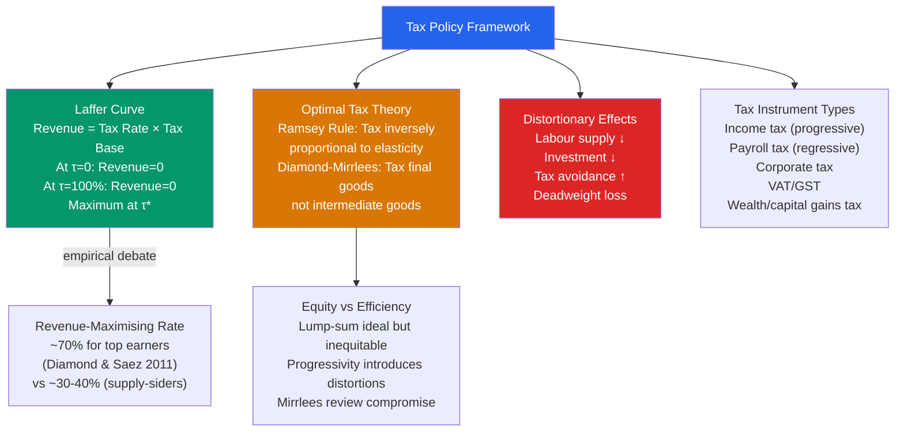

# 💰 Tax Policy

> [!abstract] TL;DR
> Tax policy involves choosing how to raise government revenue with minimum efficiency loss and acceptable distributional consequences. The Laffer curve shows that tax revenue is maximised at an intermediate tax rate — not at 100% or 0%. Optimal tax theory (Ramsey, Diamond-Mirrlees) prescribes taxing inelastic activities most heavily. In practice, tax systems involve complex trade-offs between revenue, efficiency, equity, and political feasibility.

## Intuition — analogy FIRST

Taxes are like friction in a machine — some is necessary to fund public services, but too much grinds the machine to a halt. The question is: which parts of the machine can tolerate friction (inelastic activities — like land, which doesn't change behaviour when taxed), and which parts seize up quickly (elastic activities — like work at the margin, where high taxes encourage tax avoidance or reduced labour supply)?

The Laffer curve captures this: at 0% tax, revenue is zero. At 100% tax, revenue is also zero (no one works or declares income). Somewhere in between is the revenue-maximising rate. The art of tax policy is finding where your economy sits on the curve and calibrating accordingly.

---

## How It Works

---

## Key Concepts / Details

### The Laffer Curve

The Laffer Curve (Arthur Laffer, 1974) shows tax revenue as a function of the tax rate:

$$R(\tau) = \tau \cdot Y(\tau)$$

where $Y(\tau)$ = taxable income, which decreases in $\tau$ (as rates rise, people work less, evade, or shift income).

At two extremes: $R(0) = 0$ and $R(1) = 0$ (no one earns taxable income). The revenue-maximising rate $\tau^*$ is where:

$$\frac{dR}{d\tau} = 0 \implies Y(\tau^*) + \tau^* Y'(\tau^*) = 0 \implies \tau^* = \frac{-Y(\tau^*)}{Y'(\tau^*)} = \frac{1}{1 + \varepsilon^c}$$

where $\varepsilon^c$ is the elasticity of taxable income with respect to the net-of-tax rate.

**Diamond & Saez (2011):** Using an elasticity of taxable income (ETI) of ~0.25 for top earners, the revenue-maximising top marginal rate is:

$$\tau^* = \frac{1}{1 + a \cdot e} \approx \frac{1}{1 + 3 \times 0.25} = \frac{1}{1.75} \approx 70\%$$

where $a$ = Pareto parameter (~3) for the top of the income distribution.

Current US top federal marginal rate: 37%. IMF/OECD analysis suggests most developed countries are on the "left side" of the Laffer curve (rates could rise without significant revenue loss) — the opposite of supply-side claims.

### Optimal Tax Theory

**Ramsey Rule (1927):** Tax goods inversely proportional to their price elasticity — tax inelastic goods more. Intuition: taxing inelastic goods doesn't distort behaviour much, minimising efficiency loss.

$$\frac{\tau_i}{\tau_j} = \frac{\varepsilon_j}{\varepsilon_i}$$

Implication: land (perfectly inelastic supply) should be heavily taxed — Henry George's "single tax" proposal (1879) had this right.

**Diamond-Mirrlees theorem (1971):** Optimal tax policy should not tax intermediate goods (business inputs) — only final consumption. This justifies VAT/GST systems that zero-rate business inputs and tax only final sale.

**Mirrlees Review (2011):** Comprehensive UK tax reform proposal. Key recommendations:
- Replace stamp duty (on housing transactions) with annual land value tax
- Replace multiple income taxes with single, consistent progressive schedule
- Integrate income tax and National Insurance
- Move to expenditure/consumption taxation at the top

### Tax Distortions and the Labour Supply

A progressive income tax creates an **intertemporal substitution effect** and a **labour supply distortion**:

$$\text{Effective Marginal Tax Rate} = \tau_{\text{income}} + \text{payroll} + \text{phase-outs}$$

In the US, effective marginal rates for some low-income households can reach 70-80% when accounting for means-tested benefit phase-outs (EITC cliff, Medicaid) — creating poverty traps similar to high marginal rates on the wealthy.

**Deadweight loss of taxation** (Harberger triangle):

$$DWL = \frac{1}{2} \varepsilon_D \cdot \frac{\tau^2}{P} \cdot Q$$

DWL rises with the *square* of the tax rate — implying that it is better to have one broad base at a low rate than a narrow base at a high rate.

### Types of Taxes: Trade-offs

| Tax Type | Efficiency | Equity | Revenue Stability |
|----------|-----------|--------|------------------|
| **Income tax** | Distorts labour/saving | Progressive (↓ inequality) | Procyclical |
| **Payroll tax** | Regressive at low earnings | Regressive | Stable |
| **Corporate tax** | Distorts investment | Falls partly on workers | Volatile |
| **VAT/GST** | Efficient (no cascade) | Regressive (flat rate) | Stable |
| **Land/property tax** | Very efficient (inelastic) | Ambiguous | Stable |
| **Wealth/inheritance** | Distorts accumulation | Highly progressive | Small base |
| **Carbon tax** | Double dividend (efficiency + green) | Regressive unless rebated | Growing |

### Supply-Side Economics

"Supply-side" economics (Reagan era, 1980s; Trump 2017 tax cuts) argues that cutting high marginal tax rates will:
1. Increase labour supply and capital investment (more output)
2. Increase tax compliance and reduce avoidance
3. Potentially increase total revenue (Laffer curve argument)

**Empirical record:** The 1981 and 1986 US tax reforms reduced top rates from 70% to 28%. Research finds some increase in reported taxable income (especially at the top) but limited evidence of large labour supply responses (Slemrod 1995). The revenue-neutral 1986 reform was well-designed; the 2017 TCJA at 21% corporate rate and 37% individual top rate appear on the left side of the Laffer curve for most revenue categories.

---

## Real-World Notes

- **Reagan tax cuts (1981, ERTA):** Top marginal rate cut from 70% to 50% (and to 28% by 1986). Supply-siders predicted enormous growth and revenue increases. Revenues fell sharply initially, recovering only as the economy recovered from recession. Budget deficits tripled.
- **Nordic model:** Sweden, Denmark have top marginal income tax rates of 55-65% with little evidence of Laffer curve effects — suggesting high-quality public services and social trust make high rates more sustainable than in lower-trust environments.
- **Carbon taxes:** British Columbia (Canada) introduced a revenue-neutral carbon tax in 2008 at $10/tonne (rising to $65/tonne by 2023). Carbon emissions fell 15% relative to the rest of Canada. A near-perfect example of Pigouvian taxation correcting an externality.
- **VAT adoption:** The US is the only OECD country without a VAT (value-added tax). All EU members use VAT, which is more efficient (avoids cascading taxes) and raises substantial revenue (~5-10% of GDP) with less economic distortion than income taxes.

---

## Common Pitfalls

- **Assuming the US is on the right side of the Laffer curve.** Most economists believe current US tax rates are on the *left side* — meaning rate cuts reduce revenue without significant behavioral response. The supply-side elasticities assumed in the 1980s were too large.
- **Ignoring the distinction between marginal and average tax rates.** The distortion to work incentives depends on the **marginal** rate (what you pay on the last dollar earned), while fairness comparisons often use the **average** rate (total tax / total income).
- **Treating corporate taxes as paid by corporations.** The incidence of corporate taxes falls on shareholders, workers (via lower wages), and consumers — the distribution is empirically contested.
- **Confusing static and dynamic scoring.** Static scoring calculates revenue effects assuming no behavioural response. Dynamic scoring accounts for behavioural responses but is sensitive to model assumptions and subject to political abuse.

---

## Related Concepts

- [[_MOC_Fiscal_Policy|↑ Section MOC]]
- [[Government_Spending_Multiplier]] — Tax multiplier is $-c/(1-c)$, smaller than spending multiplier
- [[Budget_Deficits_and_Debt]] — Tax revenue is the key determinant of the primary surplus
- [[Ricardian_Equivalence]] — Tax cuts vs spending: equivalent if households fully anticipate future taxes
- [[Aggregate_Supply]] — Supply-side claims: tax cuts shift LRAS by increasing work and investment incentives

---

## Review Questions

1. Using the Diamond-Saez formula $\tau^* = 1/(1 + ae)$ with $a = 3$ (Pareto parameter), calculate the revenue-maximising top marginal tax rate if the elasticity of taxable income is (a) 0.1, (b) 0.25, (c) 0.5. What do these imply for US tax policy?
2. The Ramsey Rule says optimal taxation is inversely proportional to price elasticity. Apply this principle to: (a) housing land vs. manufactured goods, (b) basic food vs. luxury goods, (c) labour vs. capital. What trade-offs does the Ramsey Rule ignore?
3. A country introduces a 20% VAT to replace a 10% corporate profit tax (revenue-neutral). Using the concepts of efficiency, equity, and economic incidence, discuss who benefits and who loses from this tax swap.

---

## Sources

- N. Gregory Mankiw, *Macroeconomics*, 10th ed., Ch. 17 — Government Debt
- Peter Diamond & Emmanuel Saez, "The Case for a Progressive Tax," *JEP*, 2011
- James Mirrlees et al., *Tax by Design: The Mirrlees Review*, 2011
- Joel Slemrod, "High-Income Families and the Tax Changes of the 1980s," *Tax Policy and the Economy*, 1995

#macroeconomics #economics #fiscal-policy #tax-policy #Laffer-curve #optimal-taxation
