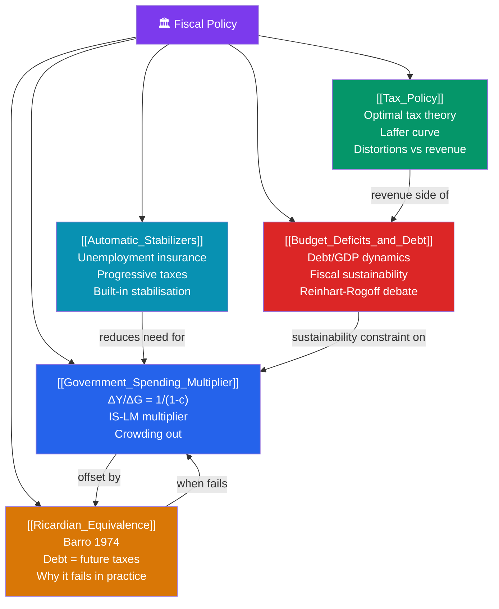

# 🗺️ Fiscal Policy — Map of Content

> [!abstract] What This Section Covers
> Fiscal policy covers how government spending and taxation affect macroeconomic output, employment, and the price level. The **government spending multiplier** ([[Government_Spending_Multiplier]]) quantifies how much a dollar of G raises GDP. **Tax policy** ([[Tax_Policy]]) covers the revenue side — VAT, income tax, optimal tax theory, and the Laffer curve. **Budget deficits and debt** ([[Budget_Deficits_and_Debt]]) examines fiscal sustainability, debt dynamics, and the historical record. **Ricardian equivalence** ([[Ricardian_Equivalence]]) is the proposition that government borrowing is equivalent to future taxes and therefore doesn't stimulate demand. **Automatic stabilizers** ([[Automatic_Stabilizers]]) describes the built-in fiscal mechanisms that smooth the business cycle without discretionary action.

## Concept Map

## Learning Path

1. [[Government_Spending_Multiplier]] — The Keynesian multiplier, the IS-LM multiplier (with crowding out), and empirical estimates.
2. [[Tax_Policy]] — Optimal taxation, the Laffer curve, distortionary effects of taxes, and fiscal reform.
3. [[Budget_Deficits_and_Debt]] — Government budget identity, debt dynamics equation, fiscal sustainability, and historical crises.
4. [[Ricardian_Equivalence]] — The Barro (1974) proposition and why it fails empirically.
5. [[Automatic_Stabilizers]] — Built-in fiscal stabilisers, their magnitude, and how they complement discretionary policy.

## All Notes at a Glance

| Note | Difficulty | What You'll Learn |
|------|------------|-------------------|
| [[Government_Spending_Multiplier]] | Intermediate | Keynesian multiplier; IS-LM with crowding out; empirical estimates |
| [[Tax_Policy]] | Intermediate | Optimal tax; Laffer curve; distortions; fiscal multiplier for taxes |
| [[Budget_Deficits_and_Debt]] | Intermediate | Debt dynamics; sustainability; historical crises; Reinhart-Rogoff |
| [[Ricardian_Equivalence]] | Advanced | Barro 1974; forward-looking consumers; why RE fails |
| [[Automatic_Stabilizers]] | Intermediate | Unemployment insurance; progressive taxes; built-in stabilisation |

## Key Questions This Section Answers

- Why is the government spending multiplier greater than 1, and under what conditions is it actually less than 1?
- What is the Laffer curve and when does it imply that tax cuts raise revenue?
- What is the debt dynamics equation and what makes debt sustainable?
- Why would Ricardian consumers not respond to a tax cut by increasing spending?
- How much do automatic stabilizers reduce the amplitude of business cycles?

## Related Sections

- [[_MOC_Macroeconomics_Master|↑ Macroeconomics Master MOC]]
- [[_MOC_Monetary_Economics|← Monetary Economics]]
- [[_MOC_IS_LM_AD_AS|← IS-LM & AD-AS]]
- [[_MOC_International_Macro|→ International Macroeconomics]]

#MOC #Macroeconomics #FiscalPolicy
