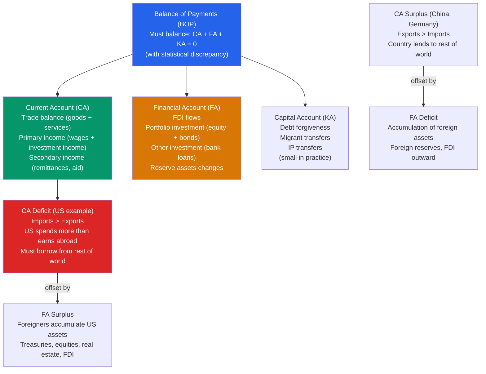

# 🌐 Balance of Payments

> [!abstract] TL;DR
> The Balance of Payments (BOP) is a comprehensive accounting record of all economic transactions between a country and the rest of the world. By construction, it must balance: the current account (trade in goods, services, income, and transfers) plus the capital/financial account (investment flows) must sum to zero. A current account deficit necessarily implies a financial account surplus — the country is borrowing from abroad.

## Intuition — analogy FIRST

The balance of payments is like a personal bank statement for a country. Every time the US sells a Boeing aircraft to Singapore (export → current account credit), Singapore must pay — either with dollars it earned from the US (imports → current account debit) or by sending capital back to the US (buying US Treasuries → financial account credit).

Every transaction has two entries — just like double-entry bookkeeping. If the US buys more from China than China buys from the US, the US runs a current account deficit. China must then do something with those extra dollars — buy US Treasuries, purchase US real estate, or hold dollar reserves. That's the financial account surplus that offsets the current account deficit. They must always balance.

---

## How It Works

---

## Key Concepts / Details

### The BOP Identity

The BOP identity:

$$CA + FA + KA = 0$$

(where $KA$ = capital account, small except for debt-relief operations)

Equivalently:

$$CA = -FA$$

A **current account deficit** ($CA < 0$) means the country is a net borrower — the rest of the world is acquiring more claims on the domestic economy than the domestic economy is acquiring on the rest of the world.

### Components of the Current Account

$$CA = \underbrace{(X - M)}_{\text{Trade balance}} + \underbrace{\text{NPI}}_{\text{Net primary income}} + \underbrace{\text{NSI}}_{\text{Net secondary income}}$$

**Trade balance (goods and services):**
- Goods: tangible exports minus imports (US deficit ~−$1 trillion/year)
- Services: education, finance, tourism, IP royalties (US *surplus* ~+$250 billion/year)

**Net primary income:**
- Interest, dividends, and wages paid to/received from rest of world
- US earns substantial primary income from past foreign investments despite being a net debtor

**Net secondary income (transfers):**
- Remittances: migrant workers sending money home (Philippines, Mexico receive large remittances)
- Foreign aid
- US makes ~$200 billion/year in transfers abroad (partly offset by inflows)

### Components of the Financial Account

**Direct investment (FDI):**
- Cross-border investment in productive enterprises with ≥10% ownership stake
- US FDI inflows ~$250-350 billion/year; outflows ~$300-400 billion/year

**Portfolio investment:**
- Purchases of foreign equities and bonds with <10% ownership stake
- Highly volatile; dominant channel for financial contagion
- Foreign official institutions hold ~$7 trillion in US Treasuries (China ~$1 trillion, Japan ~$1.1 trillion)

**Other investment:**
- Bank loans, trade credit, currency deposits
- Important for banking-sector transmission of financial crises

**Reserve assets:**
- Central bank intervention buys/sells foreign currency reserves to defend exchange rate
- China's reserves peaked at ~$4 trillion (2014), then declined as it defended the renminbi

### BOP and the Saving-Investment Identity

The CA is the external financing gap (see [[National_Income_Identity]]):

$$CA = NX = S_{\text{national}} - I_{\text{domestic}}$$

- **CA deficit ($NX < 0$):** Country invests more than it saves → borrows from abroad
- **CA surplus ($NX > 0$):** Country saves more than it invests → lends to abroad

**US CA deficit (~−2 to −4% of GDP):** The US has run persistent CA deficits since the mid-1980s, financed by the rest of the world's willingness to hold dollar-denominated assets (exorbitant privilege of the reserve currency).

### Exorbitant Privilege

Valéry Giscard d'Estaing (French Finance Minister, 1960s) coined "exorbitant privilege" for the US's ability to run CA deficits indefinitely because the dollar is the world's reserve currency:
- Foreign central banks must hold dollar reserves (demand for US assets)
- US can borrow in its own currency (no currency risk on external debt)
- US earns higher returns on its foreign investments than it pays on its foreign liabilities

Barry Eichengreen estimates the annual benefit at 0.3-0.5% of US GDP — significant but not "exorbitant."

---

## Real-World Notes

- **China's BOP evolution:** China ran large CA surpluses (~10% of GDP in 2007) while accumulating $4 trillion in reserves. The 2015-16 capital outflow episode (China residents moving money abroad) required massive reserve drawdowns and capital controls, illustrating that CA and FA can move in offsetting directions.
- **Germany's structural surplus:** Germany has run the world's largest nominal CA surplus since 2015 (~$300-350 billion/year, ~7-9% of GDP). Critics argue this represents excess saving/underinvestment that depresses global demand. The EU officially allows up to 6% CA surplus under its Macroeconomic Imbalance Procedure.
- **US "dark matter" debate:** Hausmann & Sturzenegger (2005) noted the US earns more on its foreign investments than it pays on foreign claims, even though it's a net debtor. They called the difference "dark matter" — intangible assets (management know-how, brand value) embedded in US FDI. More mundanely: US investments tend to be equity (higher return), while foreign holdings of US assets are mostly bonds (lower return).
- **Emerging market "original sin":** Many developing countries can only borrow internationally in foreign currencies (USD, EUR). This creates currency mismatch — if the local currency depreciates, the debt burden rises. The 1998 Russian default and 2001 Argentine crisis both had this feature.

---

## Common Pitfalls

- **Thinking a CA deficit is inherently bad.** A CA deficit means the country is a net borrower. Like personal debt, this can be: (1) productive (US borrows to invest in productive capacity) or (2) consumptive (borrows to fund current spending). The deficit must be financed, but the financing is only a problem if confidence in the currency collapses.
- **Confusing the capital account (KA) and financial account (FA).** In IMF terminology, what was previously called the "capital account" is now split into the financial account (dominant: FDI, portfolio, other) and the capital account (small: debt forgiveness, IP transfers). Media still sometimes say "capital account" for what is technically the financial account.
- **Misreading reserve changes.** A CA surplus country that is intervening to weaken its currency (China buying dollars) shows a financial account deficit (official outflows) offsetting the CA surplus — the country is building reserves, which is a financial outflow (acquiring foreign assets).
- **Assuming BOP balance implies equilibrium.** BOP must balance by accounting, but the underlying flows can be unsustainable — for instance, a CA deficit financed entirely by short-term portfolio flows ("hot money") is much less sustainable than one financed by FDI.

---

## Related Concepts

- [[_MOC_International_Macro|↑ Section MOC]]
- [[National_Income_Identity]] — $CA = S - I$ from the saving-investment perspective
- [[Exchange_Rates]] — The CA balance affects (and is affected by) the exchange rate
- [[Mundell_Fleming_Model]] — BP curve is the IS-LM extension for the open economy
- [[Currency_Crises]] — Unsustainable CA deficits or reserve losses can trigger currency attacks

---

## Review Questions

1. A country has GDP $Y = 500$, consumption $C = 350$, investment $I = 80$, and government spending $G = 70$. Calculate exports minus imports ($NX$), the current account balance, and whether the country is a net borrower or lender. How are foreigners financing the gap?
2. The US has run a persistent current account deficit for 40 years. Why hasn't this triggered a dollar crisis? Identify two structural reasons why the US situation is different from a typical developing country running a similar CA deficit.
3. China's current account surplus fell from 10% of GDP (2007) to 1.5% (2022). Identify three possible economic explanations: (a) domestic demand side, (b) currency appreciation effects, and (c) changing factor prices. What does the saving-investment identity imply about what must have changed?

---

## Sources

- N. Gregory Mankiw, *Macroeconomics*, 10th ed., Ch. 6 — The Open Economy
- Paul Krugman, Maurice Obstfeld & Marc Melitz, *International Economics: Theory and Policy*, 10th ed., Ch. 12
- IMF, *Balance of Payments and International Investment Position Manual* (BPM6), 2009
- Barry Eichengreen, *Exorbitant Privilege: The Rise and Fall of the Dollar*, 2011

#macroeconomics #economics #international-macro #balance-of-payments #current-account #BOP
