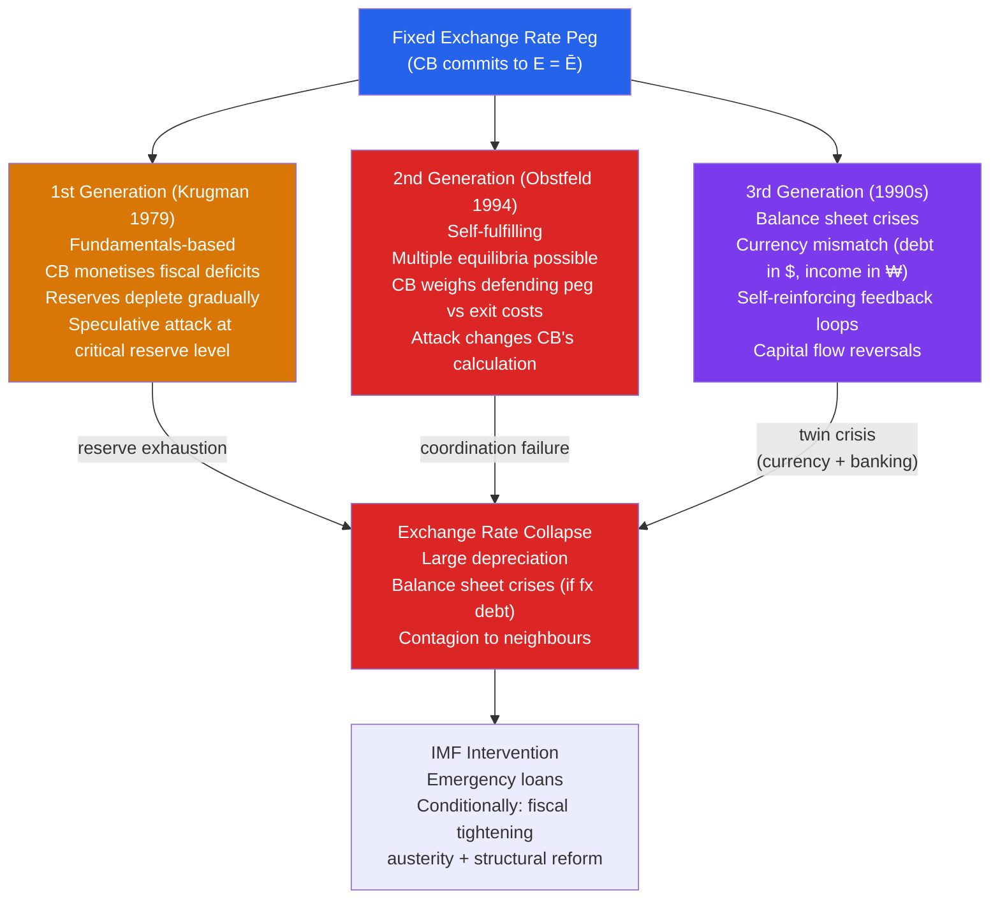

# 💥 Currency Crises

> [!abstract] TL;DR
> Currency crises occur when a fixed (or managed) exchange rate regime collapses under speculative pressure. Three generations of models explain them: (1) Krugman (1979) — fundamentals-driven: reserves run out from monetised deficits; (2) Obstfeld (1994) — self-fulfilling attacks: even fundamentally sound pegs can collapse if enough speculators attack simultaneously; (3) third-generation (1990s) — balance sheet crises: currency mismatch and short-term debt create vulnerability. The 1997 Asian financial crisis was the defining episode.

## Intuition — analogy FIRST

A currency peg is like a dam holding back a river (speculative pressure). A first-generation crisis is like a dam slowly leaking until it bursts — you can see it coming from the fundamentals. A second-generation crisis is like a structurally sound dam that collapses because a rumour spreads that it's weak — and the crowd running away from the dam causes a stampede that *makes it fail*. The dam was sound, but the self-fulfilling belief destroyed it.

Third-generation crises are like discovering the dam is connected to the city's water supply and power grid — when it bursts, it doesn't just flood one field, it collapses the entire city infrastructure. Currency collapse + banking collapse + corporate bankruptcy compound each other.

---

## How It Works

---

## Key Concepts / Details

### First-Generation Models (Krugman 1979)

The **Krugman model** builds on a fundamentally unsustainable peg:

- Government runs a persistent fiscal deficit
- Deficit is monetised (central bank prints money)
- Money growth is incompatible with the exchange rate peg (PPP: more money → higher prices → overvalued exchange rate)
- Central bank depletes reserves defending the peg
- **Speculative attack:** When reserves reach a critical level $R^*$, rational speculators attack *before* reserves run out — they know the peg will eventually fail and want to profit from the collapse

**Key prediction:** The timing of the attack is *predictable*. Fundamentals determine whether a crisis occurs; the attack happens at a specific point in time.

**Flood-Garber (1984) model:** The shadow exchange rate — what the exchange rate would be without the peg — determines when speculators attack. They attack when the shadow rate first touches (or crosses) the peg.

### Second-Generation Models (Obstfeld 1994)

**Multiple equilibria:** Even without unsustainable fundamentals, a peg can be vulnerable if:
1. There exists an equilibrium where the peg holds (if no one attacks, CB doesn't raise rates, economy is OK)
2. There exists an equilibrium where the peg fails (if enough speculators attack, CB must choose between raising rates devastatingly or abandoning the peg)

The CB's decision to defend depends on the cost. If:
- Defending means raising rates to 15% during a recession → unemployment rises, banks fail → cost is very high
- Abandoning the peg → devaluation, inflation → cost is also high
- If speculators attack → CB now faces higher cost of defense → more likely to abandon → attack succeeds

**Self-fulfilling equilibrium:** If everyone believes the attack will succeed, it does — even if the fundamentals are sound.

**1992 ERM crisis (UK):** A classic second-generation crisis:
- UK was in recession, unemployment rising → defending the peg required politically unacceptable high interest rates
- Soros recognized: the UK's optimal response to a massive attack was to abandon the peg → he attacked massively → the UK abandoned the peg
- The pound was not obviously overvalued by purchasing power — the crisis was about *political will* to defend

### Third-Generation Models and the Asian Crisis

**Third-generation models** focus on **balance sheet vulnerabilities** rather than just reserve levels or multiple equilibria:

Key vulnerabilities before 1997 Asian crisis:
1. **Currency mismatch:** Banks and firms borrowed in USD/JPY (low interest) but earned in local currency → when local currency depreciated, their debt burden exploded
2. **Maturity mismatch:** Short-term foreign borrowing to fund long-term domestic investment
3. **Moral hazard:** Implicit government guarantees encouraged excessive risk-taking ("crony capitalism")
4. **Herding:** Capital inflows to Asia were driven by global fashion → herd reversal once one country was attacked

**The 1997 Asian Crisis timeline:**
- May 1997: Thailand baht attacked by speculators (current account deficit, pegged exchange rate, short-term debt)
- July 2, 1997: Thailand abandons baht peg → baht depreciates 20%+ immediately
- Contagion: Indonesia (rupiah), Philippines (peso), Malaysia (ringgit), South Korea (won) all attacked within months
- November 1997: Korea runs out of reserves — IMF emergency loan ($57 billion)
- Indonesia worst affected: rupiah fell 80%, GDP fell 14% in 1998, President Suharto forced to resign

**IMF conditionality controversy:** IMF demanded fiscal tightening and bank closures as conditions for bailout loans. Critics (Stiglitz, Sachs) argued this was pro-cyclical — tightening when the crisis called for stimulus — and exacerbated the downturn.

### Contagion Mechanisms

Why do currency crises spread between countries?

| Channel | Mechanism |
|---------|-----------|
| **Trade channel** | Devaluation in one country → competitor countries lose competitiveness → pressure on their currencies |
| **Portfolio channel** | Investors in Crisis A sell other EM holdings to cover losses → prices fall in Crisis B countries |
| **Wake-up call** | Investors reassess fundamentals of similar countries (same "story" — high current account deficits, fixed ER) |
| **Liquidity spiral** | Forced asset sales → falling prices → more margin calls → more sales |
| **Confidence** | Generalised panic — all EM currencies/assets sold indiscriminately |

**Kaminsky & Reinhart (1999):** The combination of banking crisis + currency crisis ("twin crises") is particularly severe — each amplifies the other. Banking crises raise fears about the government's fiscal position (bank bailout cost), weakening the currency; currency depreciation weakens banks (FX losses). This was the core of the Asian crisis.

### The IMF's Role and "Washington Consensus" critique

The IMF's standard crisis package:
1. Emergency liquidity lending (as lender of last resort)
2. Fiscal tightening (reduce deficit to reduce external financing need)
3. Monetary tightening (high rates to defend currency, attract capital)
4. Structural reforms (privatisation, deregulation, trade opening)

**Stiglitz critique:** During the Asian crisis, the IMF's fiscal tightening requirement transformed a liquidity crisis into an insolvency crisis — forcing companies to fire workers and default on loans just as the crisis was hitting. The comparison to Hoover's 1930s austerity was widely made.

**Post-Asian consensus:** The IMF has since adopted more flexible approaches, allowing fiscal deficits during crises (e.g., Greece 2010 package eventually allowed primary deficits) and recognising that capital flow volatility requires macro-prudential tools.

---

## Real-World Notes

- **Brazil (1999) and Russia (1998):** Two more crises following the Asian template — both had current account deficits, short-term foreign borrowing, and fixed (or quasi-fixed) exchange rates. Brazil successfully floated the real (managed depreciation without default); Russia defaulted on domestic GKO bonds and devalued simultaneously.
- **Argentina (2001):** The Convertibility Plan (1991-2001) pegged the peso 1:1 to the dollar via a currency board. Argentina's fiscal position deteriorated (provinces borrowing independently), the peg became increasingly overvalued. In December 2001, capital controls ("corralito") froze bank deposits, IMF refused to extend support, and Argentina announced the largest sovereign default in history ($82 billion). The peso was unpegged and immediately depreciated 70%.
- **China avoiding the Asian crisis:** China was relatively insulated because it had capital controls (trilemma solution), a current account surplus, large reserves (~$140 billion), and domestic-currency-denominated debt. The lesson: capital controls are a valid tool for managing currency crises.
- **Eurozone sovereign crisis as a currency crisis analog:** Countries within the euro couldn't devalue, but they ran out of "reserves" in the sense of market access — equivalent to a fixed exchange rate crisis where the "peg" is the euro. The ECB's OMT program ("whatever it takes") played the role of IMF lender of last resort.

---

## Common Pitfalls

- **Assuming currency crises are always fundamentals-driven.** Second-generation models show crises can be self-fulfilling — attacking a sound peg can succeed if the CB's cost of defense is high enough. Not every crisis is Argentina 2001; some are UK 1992.
- **Treating all EM crises as identical.** The nature of the vulnerability varies: Mexico 1994 (current account + political uncertainty), Thailand 1997 (real estate + banking + currency mismatch), Brazil 1999 (fiscal + fixed rate). The appropriate response differs.
- **IMF conditionality as universally good or bad.** The trade-off: fiscal tightening signals fiscal credibility (needed to restore confidence) but is pro-cyclical. The optimal package depends on the source of the crisis (confidence vs fundamentals).
- **Assuming floating rates always prevent crises.** Floating rates eliminate first-generation currency crises, but banks with foreign-currency debt still face balance sheet crises if the currency depreciates sharply (the "fear of floating" phenomenon).

---

## Related Concepts

- [[_MOC_International_Macro|↑ Section MOC]]
- [[Exchange_Rates]] — Overvaluation is the typical trigger for currency attacks
- [[Mundell_Fleming_Model]] — The trilemma constrains what central banks can do in crisis
- [[Balance_of_Payments]] — Large CA deficits + reserve depletion signal first-generation vulnerability
- [[Global_Financial_Crises]] — Currency crises often coevolve with banking crises (twin crises)

---

## Review Questions

1. Contrast first-generation and second-generation models of currency crises. For each, describe: (a) the fundamental cause, (b) the trigger for the attack, and (c) the policy implications (can the crisis be prevented?). Classify the UK 1992 ERM crisis and Thailand 1997 into the appropriate generation.
2. In the third-generation model, explain how currency depreciation can cause a banking crisis (not just a currency crisis). Trace the balance sheet chain: Thai baht depreciates → what happens to a Thai bank that borrowed in USD? To the Thai firms that borrowed from that bank?
3. The IMF required Thailand and Korea to run fiscal surpluses as a condition of their 1997 bailouts. Stiglitz argued this was a major error. Using the IS-LM framework, show why fiscal tightening during a demand-deficient crisis is pro-cyclical. Under what conditions might it still be appropriate?

---

## Sources

- Paul Krugman, "A Model of Balance-of-Payments Crises," *Journal of Money, Credit and Banking*, 1979
- Maurice Obstfeld, "The Logic of Currency Crises," *Cahiers économiques et monétaires*, 1994
- Barry Eichengreen, Andrew Rose & Charles Wyplosz, "Speculative Attacks on Pegged Exchange Rates," *NBER WP*, 1994
- Joseph Stiglitz, *Globalization and Its Discontents*, 2002
- Paul Krugman, "Balance Sheets, the Transfer Problem, and Financial Crises," *International Tax and Public Finance*, 1999

#macroeconomics #economics #international-macro #currency-crises #Asian-crisis #speculative-attack #trilemma
