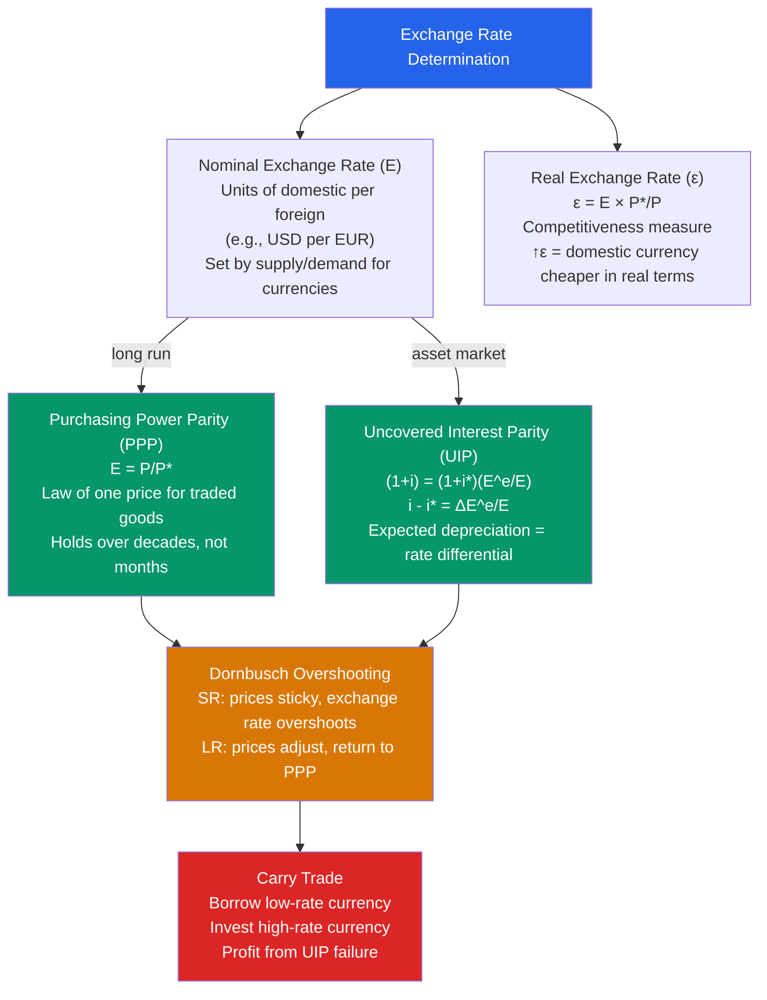

# 💱 Exchange Rates

> [!abstract] TL;DR
> The nominal exchange rate is the relative price of two currencies; the real exchange rate adjusts for price levels and measures international competitiveness. **Purchasing Power Parity (PPP)** says exchange rates equalise the price of traded goods in the long run. **Uncovered Interest Parity (UIP)** says expected exchange rate changes offset interest rate differentials. Dornbusch's **overshooting model** reconciles sticky prices (short run) with PPP (long run) — interest rate shocks cause exchange rates to overshoot their long-run level before gradually returning.

## Intuition — analogy FIRST

The exchange rate is like a price tag between two currency zones. PPP says that in the long run, exchange rates should make identical goods cost the same everywhere — The Economist's Big Mac Index tests this: a Big Mac costs $5.58 in the US and £3.99 in the UK. If the exchange rate is $1.25/£, the UK Big Mac costs $4.99 — close to PPP but not exact. The pound appears slightly undervalued.

UIP is trickier. If UK interest rates are 2% higher than US rates, investors rush to buy UK bonds — unless they expect the pound to depreciate by 2% to offset the rate advantage. UIP says: expected exchange rate changes must equal interest rate differentials for capital markets to be in equilibrium. In practice, UIP fails in the short run (the "forward premium puzzle") — the carry trade exploits this failure.

---

## How It Works

---

## Key Concepts / Details

### Nominal vs Real Exchange Rate

**Nominal exchange rate $E$:** Number of domestic currency units per foreign currency unit.
- $E = 110$ ¥/$ means $1 buys ¥110
- When $E$ falls (domestic currency appreciates in this convention), domestic goods become more expensive for foreigners

**Real exchange rate $\varepsilon$:** Nominal rate adjusted for relative price levels:

$$\varepsilon = \frac{E \cdot P^*}{P}$$

where $P^*$ = foreign price level, $P$ = domestic price level.

- $\varepsilon$ rises (real depreciation): domestic goods become relatively cheaper → competitiveness improves → exports rise, imports fall
- $\varepsilon$ falls (real appreciation): domestic goods become expensive abroad

**Real effective exchange rate (REER):** Trade-weighted average of bilateral real exchange rates — the most comprehensive measure of a currency's competitive position.

### Purchasing Power Parity (PPP)

**Absolute PPP:** The exchange rate equates the *price level* across countries:

$$E = \frac{P}{P^*}$$

Implication: if US price level is twice the UK price level, the dollar should be worth half as much as the pound. Used for cross-country comparisons (GDP in PPP terms).

**Relative PPP:** Exchange rate changes reflect *inflation differentials*:

$$\frac{\dot{E}}{E} = \pi - \pi^*$$

A country with higher inflation should see its currency depreciate proportionally.

**Big Mac Index:** The Economist's informal PPP test. A $5.58 Big Mac in the US vs ¥390 (~$3.50 at market rates) in Japan → yen appears "undervalued" by 37% vs Big Mac PPP.

**Why PPP fails short-run:**
- Non-traded goods (haircuts, housing): prices can't be arbitraged
- Transport costs, tariffs, taxes
- Sticky prices (Balassa-Samuelson effect: rich countries are expensive because productivity is high in traded goods, raising wages and thus prices of non-traded goods)

### Uncovered Interest Parity (UIP)

For capital markets to be in equilibrium, returns on comparable bonds in different currencies must be equal when measured in the same currency:

$$(1 + i_{\text{dom}}) = (1 + i_{\text{for}}) \cdot \frac{E^e_{t+1}}{E_t}$$

Approximation:

$$i_{\text{dom}} - i_{\text{for}} \approx \frac{E^e_{t+1} - E_t}{E_t}$$

**Interpretation:** If US interest rates are 3% and UK rates are 5%, then UIP predicts the pound will depreciate by 2% against the dollar — exactly offsetting the rate advantage.

**Forward Premium Puzzle (UIP failure):** Empirically, high-interest-rate currencies tend to *appreciate*, not depreciate — the opposite of UIP. This allows the **carry trade**: borrow in low-rate currency (e.g., yen at 0%), invest in high-rate currency (e.g., AUD at 5%) — and historically earn positive returns. The risk is a sudden reversal ("unwind") when carry traders exit simultaneously.

### Dornbusch Overshooting Model (1976)

**Rudi Dornbusch's key insight:** Prices are sticky in the short run (PPP fails) but flexible in the long run (PPP holds). Because asset markets (exchange rates) clear instantly while goods markets clear slowly, exchange rates *overshoot* their long-run equilibrium level.

**Example: Unexpected monetary easing (money supply ↑)**

1. **Long run (PPP):** More money → higher prices → exchange rate depreciates proportionally
2. **Short run:** Prices are sticky → real money supply rises → interest rates fall → capital outflows → exchange rate *immediately* depreciates MORE than the long-run level (overshooting)
3. **Adjustment path:** As prices gradually rise, the exchange rate slowly appreciates back to the long-run level

The degree of overshooting equals the interest rate differential and the speed of adjustment.

**Empirical significance:** Exchange rate volatility far exceeds what can be explained by PPP or trade flows alone — consistent with Dornbusch overshooting and speculative dynamics.

### Exchange Rate Regimes

| Regime | Examples | Pros | Cons |
|--------|---------|------|------|
| **Free float** | US, UK, Japan, Eurozone | Monetary policy independence | High volatility |
| **Managed float** | China (CNY), India | Reduces volatility | Requires intervention |
| **Peg/currency board** | Hong Kong (HKD/USD), Estonia (pre-euro) | Credibility, no currency risk | Lose monetary independence |
| **Currency union** | Eurozone, dollarisation | No exchange rate risk | No adjustment mechanism |

The **impossible trinity (trilemma):** A country cannot simultaneously have:
1. Fixed exchange rate
2. Free capital mobility
3. Independent monetary policy

Choose two. See [[Mundell_Fleming_Model]] for details.

---

## Real-World Notes

- **1985 Plaza Accord:** G5 nations agreed to depreciate the US dollar (overvalued due to Reagan's fiscal expansion + Volcker tightening). The DXY index fell ~40% from 1985 to 1988. The Louvre Accord (1987) then attempted to stabilise the dollar — demonstrating that exchange rates can be influenced by coordinated international intervention.
- **1992 ERM crisis:** George Soros "broke the Bank of England" by shorting the pound within the European Exchange Rate Mechanism. The UK was defending an overvalued parity (entered at too high a rate) with interest rates above 15% in a recession. Soros recognised the peg was unsustainable and amassed $10 billion in short positions, forcing the UK out of the ERM (Black Wednesday, September 16, 1992). Profit: ~$1 billion.
- **Yuan undervaluation debate (2000s-2010s):** China's exchange rate was widely argued to be undervalued by 15-40% vs PPP and UIP benchmarks, contributing to its export competitiveness and large CA surplus. The yuan was gradually revalued from ¥8.28/$ (2005) to ¥6.04/$ (2013), roughly consistent with Balassa-Samuelson expectations.
- **Japanese yen and carry trade (2024):** With Japan's interest rates near zero while G10 rates averaged 4-5%, the yen became the world's primary carry trade funding currency. When the BoJ unexpectedly hiked in July-August 2024, carry trades unwound rapidly — yen surged 10%+ in days, global equities fell.

---

## Common Pitfalls

- **Confusing nominal and real depreciation.** A nominal depreciation may not improve competitiveness if domestic inflation is high — the real exchange rate may not change. What matters for trade is the *real* exchange rate.
- **Applying PPP short-run.** PPP is a long-run equilibrium concept — can take decades to mean-revert. Using it for short-run forecasting is unreliable.
- **Assuming UIP always holds.** The carry trade empirically exploits systematic UIP violations. High-interest-rate currencies do not always depreciate. The risk is sudden reversal in risk sentiment.
- **Treating exchange rate as purely market-determined.** Most central banks intervene in FX markets — either informally (jawboning) or actively (buying/selling reserves). China and Japan have conducted the largest interventions.

---

## Related Concepts

- [[_MOC_International_Macro|↑ Section MOC]]
- [[Balance_of_Payments]] — Real exchange rate affects trade balance (Marshall-Lerner condition)
- [[Mundell_Fleming_Model]] — Exchange rate as the key adjustment variable in open-economy macro
- [[Inflation_and_Interest_Rates]] — Relative PPP links inflation differentials to exchange rate changes
- [[Currency_Crises]] — Overvalued exchange rates are the typical trigger for currency crises

---

## Review Questions

1. The US interest rate is 4% and the Japanese rate is 0.5%. According to UIP, how much should the yen appreciate against the dollar over the next year? If a carry trader ignores UIP and borrows yen to invest in USD, what is the profit if the yen doesn't move? What is the loss if the yen suddenly appreciates 10%?
2. Explain Dornbusch overshooting. If the Fed unexpectedly cuts rates by 1% (permanent), draw the time path of: (a) the nominal exchange rate ($/€), (b) the domestic price level, and (c) the real exchange rate. Label the short-run and long-run equilibria.
3. The Big Mac costs $5.58 in the US and 340 Mexican pesos. The market exchange rate is 18 pesos/$. What does the absolute PPP rate imply about the peso? What are three reasons the peso might persistently trade away from its Big Mac PPP rate?

---

## Sources

- N. Gregory Mankiw, *Macroeconomics*, 10th ed., Ch. 13 — Exchange Rates
- Rudi Dornbusch, "Expectations and Exchange Rate Dynamics," *JPE*, 1976
- Paul Krugman, Maurice Obstfeld & Marc Melitz, *International Economics*, 10th ed., Ch. 14-15
- The Economist, Big Mac Index — https://www.economist.com/big-mac-index

#macroeconomics #economics #international-macro #exchange-rates #PPP #UIP #Dornbusch-overshooting
