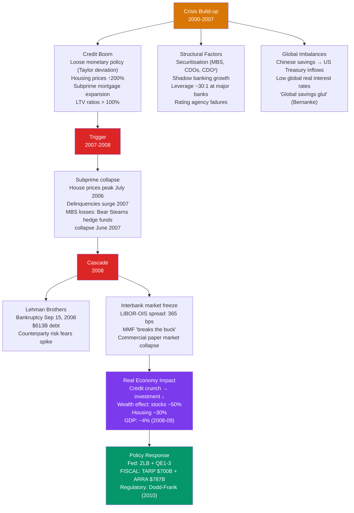

# 🏦 Global Financial Crises

> [!abstract] TL;DR
> Financial crises are episodes of widespread financial distress that disrupt the intermediation of savings into investment, causing severe economic contractions. The 2008 Global Financial Crisis was triggered by the collapse of the US subprime mortgage market, amplified by securitisation complexity, systemic leverage, and interconnectedness. Policy responses — Fed as lender of last resort, fiscal stimulus, financial regulatory reform (Dodd-Frank, Basel III) — partially mitigated the damage but the recovery was the slowest in post-war history.

## Intuition — analogy FIRST

Imagine the financial system as a city's electrical grid. Normally, electricity (capital) flows efficiently from generators (savers) to homes and factories (borrowers/investors). A crisis is like a grid failure: one large substation blows (Lehman Brothers), and instead of isolating it, the failure cascades — other substations go dark, the whole city loses power, and the real economy (factories that need electricity to produce) shuts down.

The key to understanding 2008: it wasn't just that some subprime mortgages defaulted (a manageable credit loss). It was that these mortgages were **securitised** (bundled into complex instruments), distributed across the global financial system in ways no one fully understood, and financed with extreme short-term leverage. When the subprime losses emerged, no one knew who was exposed — and the fear of counterparty default froze interbank lending entirely. That's a grid failure, not just a blown fuse.

---

## How It Works



---

## Key Concepts / Details

### Financial Fragility: Minsky's Framework

Hyman Minsky (1986) described a credit cycle that explains how crises emerge from stability:

1. **Hedge finance** (solvent): Borrowers' cash flows cover both principal and interest payments
2. **Speculative finance** (fragile): Cash flows cover only interest; must roll over principal
3. **Ponzi finance** (insolvent): Cash flows don't cover even interest; must sell assets or borrow more to service debt

Minsky's hypothesis: sustained economic stability encourages increasing risk-taking → economy moves from hedge → speculative → Ponzi finance → "Minsky moment" = sudden collapse when refinancing becomes impossible.

The 2007-08 US housing market displayed classic Minsky dynamics:
- 2003-2006: Easy credit → speculative and Ponzi mortgages (interest-only, negative amortisation)
- 2007: Interest rates rose, house prices fell → Ponzi borrowers couldn't refinance → defaults cascade

### The Securitisation Chain and Systemic Risk

Securitisation transformed illiquid bank loans into tradeable securities:

```
Mortgage → Originator → SPV → MBS → CDO → CDO² → Global investors
```

**Advantages:** Risk distribution, liquidity, lower cost of credit
**Disadvantages:** Originate-to-distribute destroyed screening incentives; complexity obscured true risk; rating agency failures (AAA on CDOs with subprime collateral)

**Systemic risk** emerges when:
1. Common exposures (everyone holds the same AAA-rated CDOs)
2. Interconnectedness (counterparty chains: AIG wrote $440B in credit default swaps)
3. Pro-cyclical leverage (leveraged firms must sell assets when prices fall → spiral)
4. Short-term funding of long-term assets (repo market, commercial paper)

### Fire Sales and Liquidity Spirals

A key amplification mechanism (Brunnermeier & Pedersen 2009):

1. Asset price falls → bank losses → bank equity falls
2. Leverage ratio rises above target → bank must sell assets (delever)
3. Many banks selling simultaneously → prices fall further → back to step 1

This "leverage cycle" (Geanakoplos 2010) amplifies small shocks into large crises. The fire sale discount on US MBS in 2008-09 was estimated at 30-40 cents per dollar of face value — far exceeding fundamental credit losses.

### The 2008 Crisis: Key Facts

| Metric | Peak | Trough | Date |
|--------|------|--------|------|
| S&P 500 | 1,565 | 666 | Mar 9, 2009 |
| US home prices (Case-Shiller) | 184.6 | 134.1 (−27%) | Mar 2012 |
| US unemployment | — | 10.0% | Oct 2009 |
| US real GDP | — | −4.2% peak-to-trough | Q2 2009 |
| Federal funds rate | 5.25% | 0-0.25% | Dec 2008 |
| Fed balance sheet | $900B | $2.3T | Mar 2010 |
| TARP total disbursed | $431.3B | — | — |
| ARRA | $787B | — | — |

### Contagion Channels in 2008

1. **Interbank lending freeze:** Libor-OIS spread (measure of interbank stress) spiked from 7 bps (normal) to 365 bps post-Lehman → banks wouldn't lend to each other
2. **Money market fund run:** Reserve Primary Fund "broke the buck" (NAV < $1) → run on MMFs → commercial paper market collapse → real economy credit withdrawal
3. **Cross-border capital flows:** Foreign banks heavily exposed to US MBS → European banks (RBS, UBS, Deutsche) faced huge losses → European credit crunch
4. **Trade finance collapse:** Global trade fell 12% in 2009 — fastest since 1930s — partly due to trade finance drying up
5. **Confidence/uncertainty:** VIX (fear index) reached 80 — businesses froze investment decisions; households cut spending

### Policy Response and Controversies

**Federal Reserve:**
- Rate cuts to zero (December 2008) — see [[Monetary_Policy_Tools]]
- TARP ($700B): bought bank equity stakes, backstopped money markets
- QE1 ($1.75T MBS + Treasuries): prevented mortgage market collapse
- Bagehot's rule: lend freely, at penalty rate, against good collateral — Fed adapted this for non-banks

**Fiscal response:**
- TARP (Troubled Asset Relief Program): $700B authority; $431B used; most repaid with profit
- ARRA (American Recovery and Reinvestment Act): $787B spending + tax cuts
- Auto bailout ($80B for GM and Chrysler): preserved ~1.5 million jobs per the Treasury

**Regulatory reform (Dodd-Frank 2010):**
- Systemic Risk Oversight: Financial Stability Oversight Council (FSOC)
- Volcker Rule: prohibit proprietary trading by deposit-taking banks
- Derivatives regulation: cleared through central counterparties
- Living wills: SIFIs (Systemically Important Financial Institutions) must have resolution plans
- CFPB (Consumer Financial Protection Bureau)

**Basel III (2010-2019):**
- Higher minimum capital ratios: Tier 1 from 4% to 6%
- Countercyclical capital buffers
- Leverage ratio
- Liquidity Coverage Ratio (LCR) and NSFR

---

## Real-World Notes

- **"Whatever it takes" (Draghi, July 2012):** ECB President Draghi's pledge to purchase unlimited Eurozone sovereign bonds ended the European sovereign crisis almost overnight — demonstrating the power of credible central bank commitment without a single bond purchase.
- **Too Big To Fail problem:** The 2008 bailouts of Bear Stearns (JP Morgan acquisition with Fed guarantee), AIG ($182B), and Citigroup ($20B equity injection) created massive moral hazard. "Too Big To Fail" is codified when bail-out is expected — creating an implicit subsidy for large banks estimated at $15-70B annually (IMF).
- **Lehman counterfactual debate:** Ben Bernanke argued the Fed lacked legal authority to rescue Lehman (no good collateral). Critics argue this is revisionist — the real reason was political unwillingness after the Bear Stearns criticism. The "Lehman moment" became the inflection point: before (crisis manageable) vs after (full systemic collapse).
- **COVID-19 financial stress (March 2020):** The Fed's rapid and massive response (March 2020: unlimited QE, lending facilities for corporate bonds, munis, Main Street loans) prevented a 2008-style financial crisis from compounding the pandemic economic shock. The lesson of 2008 was applied almost perfectly.

---

## Common Pitfalls

- **Blaming the crisis on greed alone.** Greed is always present in finance. The structural conditions — regulatory gaps, implicit guarantees, opacity of structured products, agency problems in securitisation — are the causal factors. Greed without structure doesn't create systemic crises.
- **Treating Lehman's bankruptcy as the cause of the crisis.** The crisis was already severe before Lehman (Bear Stearns in March 2008; credit markets frozen since August 2007). Lehman was the most dramatic moment, not the origin.
- **Assuming bank capital ratios tell you the whole story.** Shadow banking (money market funds, repo markets, securities dealers) was the epicentre of the 2008 crisis — entities that weren't subject to bank capital requirements but were equally systemically important.
- **"Never again" regulatory overconfidence.** Every post-crisis regulatory reform addresses the last crisis's specific vulnerabilities. 2008 → Basel III improved bank capital. But shadow banking, crypto, AI-driven trading, and non-bank intermediation create new vulnerabilities that Basel III doesn't address.

---

## Related Concepts

- [[_MOC_International_Macro|↑ Section MOC]]
- [[Money_and_Banking]] — Bank runs and deposit insurance; Diamond-Dybvig; too big to fail
- [[Monetary_Policy_Tools]] — The Fed's unconventional response: QE, lending facilities
- [[Currency_Crises]] — Currency crises often coevolve with banking crises
- [[Budget_Deficits_and_Debt]] — Bank bailouts added significantly to government debt; sovereign risk channels
- [[IS_LM_Model]] — The 2008 crisis was the ultimate liquidity trap / IS-left-shift scenario

---

## Review Questions

1. Explain the securitisation chain from mortgage origination to CDO squared. At which point in the chain did incentive problems emerge, and how did rating agencies fail to catch them? Use the concept of "originate-to-distribute" to explain why standards deteriorated.
2. The Fed was widely criticised for letting Lehman Brothers fail on September 15, 2008. Using the concept of "lender of last resort" (Bagehot's rule), evaluate: (a) Was the Fed justified in not rescuing Lehman? (b) What would have happened if Lehman had been rescued (moral hazard implications)?
3. Compare the 2008 US financial crisis policy response (TARP, QE, ARRA) to the Eurozone's response to the 2010-2012 sovereign debt crisis (IMF conditionality, ECB OMT). Why did the Eurozone response produce a more prolonged recession? What institutional difference between the US and Eurozone explains the divergence?

---

## Sources

- Ben Bernanke, *The Courage to Act*, 2015
- Timothy Geithner, *Stress Test*, 2014
- Hyman Minsky, *Stabilizing an Unstable Economy*, 1986
- Gary Gorton, *Slapped by the Invisible Hand: The Panic of 2007*, 2010
- Markus Brunnermeier, "Deciphering the 2007-08 Liquidity and Credit Crunch," *JEP*, 2009
- Carmen Reinhart & Kenneth Rogoff, *This Time Is Different: Eight Centuries of Financial Folly*, 2009

#macroeconomics #economics #international-macro #2008-crisis #financial-crisis #systemic-risk #Minsky
