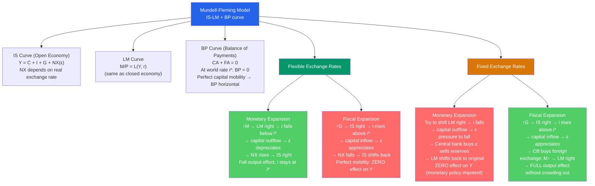

# 🌐 Mundell-Fleming Model

> [!abstract] TL;DR
> The Mundell-Fleming model extends IS-LM to an open economy by adding a balance of payments (BP) curve and making exchange rates endogenous. The key result: under **flexible exchange rates**, monetary policy is fully effective but fiscal policy is crowded out (by exchange rate appreciation). Under **fixed exchange rates**, fiscal policy works fully but monetary policy is powerless (the central bank must use its tools to defend the peg). The model also yields the **impossible trinity**: a country cannot simultaneously maintain fixed exchange rates, free capital mobility, and independent monetary policy.

## Intuition — analogy FIRST

In a closed economy (IS-LM), monetary easing lowers interest rates and stimulates investment. In an open economy with free capital flows, lower interest rates also cause capital to flee abroad (investors prefer higher returns elsewhere), which weakens the exchange rate, which boosts exports. The exchange rate channel *amplifies* monetary policy under flexible exchange rates.

For fiscal policy, the opposite: spending expansion raises interest rates → capital inflows → exchange rate appreciates → exports fall → partially or fully offsets the fiscal stimulus. If capital is perfectly mobile (infinitely elastic BP curve), fiscal policy is 100% crowded out by exchange rate appreciation.

The impossible trinity is like a hotel policy: "You can have any two of: free check-in time, free cancellation, and lowest price — but not all three." Choose your two.

---

## How It Works

---

## Key Concepts / Details

### The IS Curve in the Open Economy

Net exports depend on the real exchange rate $\varepsilon$:

$$NX = NX(\varepsilon, Y, Y^*) \quad NX_\varepsilon > 0$$

Real depreciation (↑ε): domestic goods cheaper → exports rise, imports fall → NX improves.

IS curve becomes:

$$Y = C(Y-T) + I(i) + G + NX(\varepsilon, Y, Y^*)$$

More complex than closed economy because ε is endogenous in the model.

### The BP Curve

The BP curve shows all $(Y, i)$ combinations where the BOP is in balance:

$$CA(Y, \varepsilon) + FA(i - i^*) = 0$$

With **perfect capital mobility** (all investors are indifferent between domestic and foreign bonds at the world interest rate $i^*$), the BP curve is perfectly horizontal at $i = i^*$. Any deviation of $i$ from $i^*$ triggers infinite capital flows.

**Implication of horizontal BP:** The domestic interest rate must equal the world rate $i^*$ in equilibrium (under floating rates, ε adjusts to make IS cross LM at $i^*$; under fixed rates, $M$ adjusts).

### Policy Effectiveness Table

| Regime | Monetary Policy | Fiscal Policy |
|--------|----------------|---------------|
| **Flexible exchange rate** | **Fully effective** (ε adjusts, amplifies LM effect) | **Ineffective** (ε appreciates, crowds out NX) |
| **Fixed exchange rate** | **Ineffective** (ε fixed, must sterilise: LM returns to original) | **Fully effective** (ε would appreciate → CB intervenes → M↑ → LM right) |

This is the **Fleming-Mundell assignment problem** (1960s policy debate):
- Robert Mundell: Internal balance (output) → use fiscal policy; External balance → use monetary policy (under fixed exchange rates)
- Marcus Fleming: Vice versa under floating exchange rates

### The Impossible Trinity (Trilemma)

A country cannot simultaneously achieve:
1. **Fixed exchange rate** (stable nominal ER)
2. **Free capital mobility** (open capital account)
3. **Independent monetary policy** (set domestic interest rate)

**Why:** If $i \neq i^*$ (independent monetary policy) and capital flows freely, exchange rate pressure develops. To fix the exchange rate, the central bank must intervene by adjusting money supply until $i = i^*$ — surrendering monetary independence.

**Historical resolutions:**
- **Gold standard (pre-WWI):** Fixed ER + free capital → no monetary independence
- **Bretton Woods (1944-71):** Fixed ER + monetary independence → capital controls
- **Post-Bretton Woods (1971-):** Floating ER + free capital → monetary independence
- **Eurozone:** Fixed ER (single currency) + free capital → single monetary policy (ECB)
- **China:** Managed ER + monetary independence → capital controls (partially)

### The Marshall-Lerner Condition

For exchange rate depreciation to improve the trade balance (current account), the sum of the price elasticities of demand for exports and imports must exceed 1:

$$|\eta_X| + |\eta_M| > 1$$

**J-curve:** In the short run, trade contracts may be pre-committed in the old currency → depreciation initially *worsens* the CA (higher import prices on same quantities). Over 6-18 months, quantities adjust and the CA improves — the J-curve path.

**Empirical estimates:** Most studies find $|\eta_X| + |\eta_M| \approx 1.5-2.0$ in the long run (satisfying Marshall-Lerner) but much smaller short-run elasticities (J-curve prominent).

---

## Real-World Notes

- **UK exit from ERM (1992):** The UK was trying to maintain a fixed peg (ERM) while running large budget deficits (Maastricht criteria) and setting high interest rates during a recession. The trilemma made this impossible with free capital: Soros recognised the UK couldn't maintain high rates + fixed exchange rate + recession simultaneously. See [[Currency_Crises]].
- **Asian crisis (1997):** Thailand, Korea, Indonesia had pegged exchange rates + open capital accounts. When speculative attacks began, central banks tried to defend the peg by raising interest rates enormously — but this crushed their economies. The trilemma: they had to choose between saving the peg and saving the economy; most eventually abandoned the peg.
- **China's managed float:** China partially escapes the trilemma through capital controls — it has a semi-fixed exchange rate and partially independent monetary policy while limiting free capital mobility. The "China model" shows the trilemma can be partially, though not fully, avoided with controls.
- **Eurozone divergence:** Euro membership means no exchange rate adjustment for individual countries. Greece couldn't devalue to restore competitiveness during the 2010-2012 crisis — it had to achieve "internal devaluation" (wage and price cuts) instead. This is far more painful than exchange rate adjustment and took years.

---

## Common Pitfalls

- **Applying closed-economy multipliers to open economies.** Under flexible exchange rates and perfect capital mobility, the fiscal multiplier is *zero* — exchange rate appreciation completely offsets the stimulus. This is very different from the closed-economy multiplier.
- **Ignoring the exchange rate regime.** Policy effectiveness depends entirely on the regime. The same monetary expansion has opposite implications under fixed vs flexible rates.
- **Assuming perfect capital mobility always.** In many emerging markets, capital is not perfectly mobile — the BP curve is not horizontal. Partial capital mobility means some domestic interest rate autonomy even with a fixed exchange rate.
- **Forgetting the J-curve.** Depreciation may worsen the trade balance initially before improving it. Policymakers expecting immediate competitive gains from devaluation are often disappointed in the short run.

---

## Related Concepts

- [[_MOC_International_Macro|↑ Section MOC]]
- [[IS_LM_Model]] — Mundell-Fleming extends IS-LM with exchange rates and BP curve
- [[Exchange_Rates]] — The exchange rate is the key adjustment variable in the MF model
- [[Balance_of_Payments]] — The BP curve represents BOP equilibrium
- [[Currency_Crises]] — The trilemma constraint makes fixed exchange rates vulnerable to speculative attacks
- [[Monetary_Policy_Tools]] — Effectiveness depends on the exchange rate regime

---

## Review Questions

1. Draw the Mundell-Fleming diagram (IS-LM-BP) under flexible exchange rates. Show the effect of an expansionary fiscal policy ($\Delta G > 0$) step by step: what happens to IS, the interest rate, capital flows, and the exchange rate? What is the ultimate effect on output $Y$?
2. Explain the impossible trinity with an example. The Eurozone chose fixed exchange rates + free capital mobility. What did they sacrifice? Show how this constraint affected Greece during the 2010-2012 sovereign debt crisis.
3. The UK is a small open economy with flexible exchange rates and near-perfect capital mobility. The Bank of England cuts interest rates by 1%. Using Mundell-Fleming, trace the effect on: (a) capital flows, (b) the exchange rate, (c) net exports, and (d) output. Compare this to the effect of the same rate cut in a closed economy.

---

## Sources

- Robert A. Mundell, "The Appropriate Use of Monetary and Fiscal Policy for Internal and External Stability," *IMF Staff Papers*, 1962
- J. Marcus Fleming, "Domestic Financial Policies under Fixed and under Floating Exchange Rates," *IMF Staff Papers*, 1962
- N. Gregory Mankiw, *Macroeconomics*, 10th ed., Ch. 12 — The Open Economy Revisited
- Paul Obstfeld & Alan Taylor, "The Trilemma in History," *Review of Economics and Statistics*, 2004

#macroeconomics #economics #international-macro #Mundell-Fleming #trilemma #impossible-trinity #IS-LM-BP
