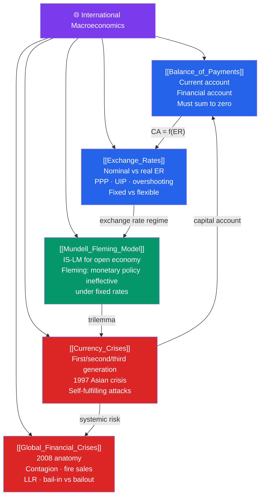

# 🗺️ International Macroeconomics — Map of Content

> [!abstract] What This Section Covers
> International macroeconomics extends closed-economy models to open economies where goods, capital, and currencies cross borders. The **balance of payments** ([[Balance_of_Payments]]) accounts for all international transactions. **Exchange rates** ([[Exchange_Rates]]) determine the relative price of currencies and their relationship to trade and capital flows. The **Mundell-Fleming model** ([[Mundell_Fleming_Model]]) extends IS-LM to the open economy under fixed and flexible exchange rates. **Currency crises** ([[Currency_Crises]]) examines how fixed exchange rate regimes collapse. **Global financial crises** ([[Global_Financial_Crises]]) covers the anatomy of financial contagion, the 2008 crisis, and policy lessons.

## Concept Map

## Learning Path

1. [[Balance_of_Payments]] — The BOP accounting identity; current account vs financial account; the relationship to national saving and investment.
2. [[Exchange_Rates]] — Nominal and real exchange rates; PPP; UIP; exchange rate determination; Dornbusch overshooting.
3. [[Mundell_Fleming_Model]] — The open-economy IS-LM; the trilemma (impossible trinity); monetary and fiscal policy under different regimes.
4. [[Currency_Crises]] — First, second, and third generation models; the 1997 Asian crisis; IMF conditionality; self-fulfilling attacks.
5. [[Global_Financial_Crises]] — Financial fragility; the 2008 crisis anatomy; contagion; policy responses; regulatory reform.

## All Notes at a Glance

| Note | Difficulty | What You'll Learn |
|------|------------|-------------------|
| [[Balance_of_Payments]] | Intermediate | BOP identity; CA deficit mechanics; FDI vs portfolio flows |
| [[Exchange_Rates]] | Intermediate | Nominal/real ER; PPP; UIP; overshooting; carry trade |
| [[Mundell_Fleming_Model]] | Advanced | IS-LM-BP; trilemma; policy effectiveness by regime |
| [[Currency_Crises]] | Advanced | Crisis models; Asian 1997; contagion; IMF role |
| [[Global_Financial_Crises]] | Intermediate | 2008 anatomy; systemic risk; policy lessons |

## Key Questions This Section Answers

- Why must the current account and financial account of the BOP sum to zero?
- What is the difference between PPP and UIP as exchange rate theories, and when does each hold?
- Why can't a country simultaneously have a fixed exchange rate, free capital flows, and independent monetary policy?
- What causes currency crises, and why are second-generation crises "self-fulfilling"?
- What are the key transmission channels through which financial crises spread globally?

## Related Sections

- [[_MOC_Macroeconomics_Master|↑ Macroeconomics Master MOC]]
- [[_MOC_Fiscal_Policy|← Fiscal Policy]]
- [[_MOC_Monetary_Economics|← Monetary Economics]]

#MOC #Macroeconomics #InternationalMacro #OpenEconomy
