# 🌍 Macroeconomics — Master Map of Content

> [!abstract] About This Vault
> A complete macroeconomics reference: **37 notes across 6 sections**, covering National Accounts, Economic Growth, IS-LM/AD-AS frameworks, Monetary Economics, Fiscal Policy, and International Macroeconomics. Every note pairs intuition-first analogies with key equations ($MV=PY$, Solow steady-state, Taylor rule, multiplier formula), Mermaid diagrams, and historical case studies — the 2008 financial crisis, COVID fiscal response, Volcker disinflation, Zimbabwe hyperinflation — alongside review questions for active recall. Start at the section that matches your goal, or follow one of the four learning paths.

## Vault Architecture

```mermaid
graph TD
    Master["🌍 Macroeconomics Master"]

    %% Section 01 — Blue
    Master --> S01["01 National Accounts"]
    %% Section 02 — Green
    Master --> S02["02 Economic Growth"]
    %% Section 03 — Teal
    Master --> S03["03 IS-LM & AD-AS"]
    %% Section 04 — Orange
    Master --> S04["04 Monetary Economics"]
    %% Section 05 — Red
    Master --> S05["05 Fiscal Policy"]
    %% Section 06 — Purple
    Master --> S06["06 International Macro"]

    S01 --> GDP["GDP & Measurement"]
    S01 --> NII["National Income Identity"]
    S01 --> PI["Price Indices & Inflation"]
    S01 --> UE["Unemployment"]
    S01 --> BCI["Business Cycle Indicators"]

    S02 --> SGM["Solow Growth Model"]
    S02 --> HCE["Human Capital & Education"]
    S02 --> TP["Technological Progress"]
    S02 --> EGT["Endogenous Growth Theory"]
    S02 --> DE["Development Economics"]

    S03 --> ISC["IS Curve"]
    S03 --> LMC["LM Curve"]
    S03 --> ISLM["IS-LM Model"]
    S03 --> AD["Aggregate Demand"]
    S03 --> AS["Aggregate Supply"]

    S04 --> MB["Money & Banking"]
    S04 --> MPT["Monetary Policy Tools"]
    S04 --> QTM["Quantity Theory of Money"]
    S04 --> IIR["Inflation & Interest Rates"]
    S04 --> TR["Taylor Rule"]

    S05 --> GSM["Gov't Spending Multiplier"]
    S05 --> TP2["Tax Policy"]
    S05 --> BDD["Budget Deficits & Debt"]
    S05 --> RE["Ricardian Equivalence"]
    S05 --> AUS["Automatic Stabilizers"]

    S06 --> BOP["Balance of Payments"]
    S06 --> ER["Exchange Rates"]
    S06 --> MFM["Mundell-Fleming Model"]
    S06 --> CC["Currency Crises"]
    S06 --> GFC["Global Financial Crises"]

    style Master fill:#7c3aed,color:#fff
    style S01 fill:#2563eb,color:#fff
    style S02 fill:#059669,color:#fff
    style S03 fill:#0891b2,color:#fff
    style S04 fill:#d97706,color:#fff
    style S05 fill:#dc2626,color:#fff
    style S06 fill:#7c3aed,color:#fff
```

## Sections at a Glance

| # | Section | Notes | Entry Point | Difficulty |
|---|---------|-------|-------------|------------|
| 01 | National Accounts | 5 | [[_MOC_National_Accounts]] | Beginner |
| 02 | Economic Growth | 5 | [[_MOC_Economic_Growth]] | Intermediate |
| 03 | IS-LM & AD-AS | 5 | [[_MOC_IS_LM_AD_AS]] | Intermediate |
| 04 | Monetary Economics | 5 | [[_MOC_Monetary_Economics]] | Intermediate → Advanced |
| 05 | Fiscal Policy | 5 | [[_MOC_Fiscal_Policy]] | Intermediate |
| 06 | International Macroeconomics | 5 | [[_MOC_International_Macro]] | Intermediate → Advanced |

---

## Learning Paths

### Path 1 — Economics Student

> Best for: undergrads or self-studyers working through a macro course (Mankiw, Blanchard).

**National Accounts → Growth → IS-LM → Monetary → Fiscal → International**

[[_MOC_National_Accounts]] → [[GDP_and_Measurement]] → [[National_Income_Identity]] → [[Unemployment]] → [[Price_Indices_Inflation]] → [[_MOC_Economic_Growth]] → [[Solow_Growth_Model]] → [[_MOC_IS_LM_AD_AS]] → [[IS_Curve]] → [[LM_Curve]] → [[IS_LM_Model]] → [[Aggregate_Demand]] → [[Aggregate_Supply]] → [[_MOC_Monetary_Economics]] → [[_MOC_Fiscal_Policy]]

---

### Path 2 — Policy Maker

> Best for: analysts and officials focused on policy levers — fiscal multipliers, monetary transmission, exchange rate regimes.

**National Accounts → Monetary → Fiscal → International**

[[GDP_and_Measurement]] → [[Business_Cycle_Indicators]] → [[_MOC_Monetary_Economics]] → [[Monetary_Policy_Tools]] → [[Taylor_Rule]] → [[Inflation_and_Interest_Rates]] → [[_MOC_Fiscal_Policy]] → [[Government_Spending_Multiplier]] → [[Automatic_Stabilizers]] → [[Budget_Deficits_and_Debt]] → [[_MOC_International_Macro]] → [[Mundell_Fleming_Model]] → [[Currency_Crises]]

---

### Path 3 — Financial Analyst

> Best for: analysts connecting macro data to asset prices, yield curves, FX, and equity valuations.

**National Accounts → Monetary → International → IS-LM**

[[GDP_and_Measurement]] → [[Price_Indices_Inflation]] → [[Unemployment]] → [[Business_Cycle_Indicators]] → [[Quantity_Theory_of_Money]] → [[Inflation_and_Interest_Rates]] → [[Taylor_Rule]] → [[Exchange_Rates]] → [[Balance_of_Payments]] → [[Mundell_Fleming_Model]] → [[Global_Financial_Crises]] → [[IS_LM_Model]]

---

### Path 4 — Academic Researcher

> Best for: grad students who need the full theoretical toolkit — growth theory, microfoundations, open-economy models.

**Growth → IS-LM/AD-AS → Advanced Monetary → International → Fiscal**

[[Solow_Growth_Model]] → [[Technological_Progress]] → [[Endogenous_Growth_Theory]] → [[Human_Capital_and_Education]] → [[Development_Economics]] → [[IS_LM_Model]] → [[Aggregate_Supply]] → [[Quantity_Theory_of_Money]] → [[Taylor_Rule]] → [[Ricardian_Equivalence]] → [[Mundell_Fleming_Model]] → [[Currency_Crises]] → [[Global_Financial_Crises]]

---

## Cross-Vault Links

This vault is the macro theory foundation that connects to related quantitative and micro vaults:

- **[[Quantitative_Finance]]** — Asset pricing, yield curves, and the term structure of interest rates build on the inflation and monetary policy frameworks here ([[Inflation_and_Interest_Rates]], [[Taylor_Rule]]).
- **[[Microeconomics]]** — Consumer theory, production functions, and general equilibrium provide the microfoundations for aggregate supply and growth models ([[Solow_Growth_Model]], [[Aggregate_Supply]]).
- **[[Econometrics]]** — Empirical measurement of multipliers, estimation of the Phillips curve, and testing of purchasing power parity all require the statistical toolkit from the Econometrics vault.

---

## Section MOC Index

- [[_MOC_National_Accounts]] — How we measure an economy: GDP, national income, price indices, unemployment, and business cycle indicators.
- [[_MOC_Economic_Growth]] — Why nations grow: the Solow model, human capital, technological progress, endogenous growth theory, and development economics.
- [[_MOC_IS_LM_AD_AS]] — The short-run model of output and interest rates: IS curve, LM curve, the full IS-LM framework, and the AD-AS model.
- [[_MOC_Monetary_Economics]] — Money, banks, and the price level: money creation, the central bank toolkit, quantity theory, inflation dynamics, and the Taylor rule.
- [[_MOC_Fiscal_Policy]] — Government spending, taxes, and debt: the multiplier, tax policy, budget deficits, Ricardian equivalence, and automatic stabilizers.
- [[_MOC_International_Macro]] — Open economies: the balance of payments, exchange rates, the Mundell-Fleming model, currency crises, and global financial crises.

#MOC #Macroeconomics #MasterMOC
