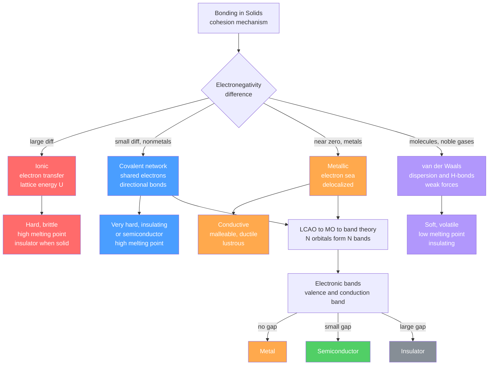

# 🔗 Chemical Bonding in Solids

> [!abstract] TL;DR
> Every solid is held together by one of four bonding mechanisms — **ionic**, **covalent**, **metallic**, or **van der Waals** — and the type chosen dictates everything: melting point, hardness, conductivity, and ductility. Ionic solids are quantified by the **Born–Landé lattice energy** $U = -(N_A M z_+ z_- e^2/4\pi\varepsilon_0 r_0)(1-1/n)$; covalent solids arise from **sp/sp²/sp³ hybridization** forming directional bonds (diamond is the archetype); metallic solids use a **delocalized electron sea** described by Drude and free-electron theory. Most real solids mix bonding types, with the degree of ionicity predicted by Pauling **electronegativity differences**. At the quantum level, all bonding connects through **LCAO → molecular orbital → band theory**: $N$ atomic orbitals broaden into bands, and whether those bands are filled, empty, or partially occupied determines whether the solid is an insulator, semiconductor, or metal.

---

## Intuition

**Analogy:** Imagine four different ways to keep a crowd of people packed tightly together. You could chain oppositely-charged bracelets between them (ionic — they grip because opposite charges attract, but the chain snaps if you push sideways). You could have them physically clasp hands only in specific directions (covalent — strong grips, but every person must face a precise direction). You could have everyone toss their loose change into a shared pile and let the shared wealth hold the group together (metallic — flexible, no fixed directions, the pool binds everyone). Or you could just pack people so close that they lean on each other through weak physical contact (van der Waals — easy to break up, low melting point).

In a real solid, all four mechanisms operate on electrons and nuclei. The key question is always: **which atoms are involved, how different are their electronegativities, and do the electrons stay localized or roam?** Those answers fix every bulk property the material will ever have.

---

## How It Works

The stability of a solid traces to a single condition: the total energy of the assembled crystal must be lower than the sum of energies of the isolated atoms. The mechanism by which this energy is minimized defines the bonding type.

### Core Mechanics

**1. Ionic bonding** occurs when a large electronegativity difference ($\Delta\chi > 1.7$ on the Pauling scale) drives electron transfer from metal to nonmetal. The resulting oppositely charged ions arrange into a lattice held by **Coulomb attraction**, partially offset by short-range Born repulsion. The molar lattice energy is given by the **Born–Landé equation**:

$$U = -\frac{N_A\, M\, z_+\, z_-\, e^2}{4\pi\varepsilon_0\, r_0}\!\left(1 - \frac{1}{n}\right)$$

where $N_A$ is Avogadro's number, $M$ is the **Madelung constant** (a pure geometric lattice sum, $M_\text{NaCl}=1.748$, $M_\text{CsCl}=1.763$, $M_\text{ZnS}=1.638$), $z_\pm$ are the ion charge magnitudes, $r_0$ is the equilibrium nearest-neighbor distance, and $n$ is the **Born exponent** (5–12, from the electron-shell repulsion). The factor $(1-1/n)$ is typically a ~10% reduction from the pure Coulomb limit.

**2. Covalent bonding** arises when two nonmetals share electrons. In extended solids the bonds are **directional**, set by the hybridization of the central atom:

| Hybridization | Geometry | Angle | Example solid |
|---------------|----------|-------|---------------|
| $sp$ | Linear | 180° | Carbyne chains |
| $sp^2$ | Trigonal planar | 120° | Graphene, graphite, h-BN |
| $sp^3$ | Tetrahedral | 109.5° | Diamond, Si, Ge, SiC |

Diamond is the prototypical covalent solid: each carbon atom forms four equivalent $\sigma$ bonds in a tetrahedral arrangement, creating an infinite 3-D covalent network with 8 atoms per cubic unit cell. This bond directedness makes covalent solids extremely hard but brittle — there is no easy slip plane.

**3. Metallic bonding** results when all atoms contribute their valence electrons to a delocalized "sea." The **Drude model** treats these electrons as a classical gas; the steady-state conductivity is

$$\sigma = \frac{n_e e^2 \tau}{m_e}$$

where $n_e$ is the electron density, $\tau$ the mean collision time, and $m_e$ the electron mass. The **Sommerfeld free-electron model** refines this with Fermi–Dirac statistics, giving a Fermi energy

$$E_F = \frac{\hbar^2}{2m_e}\!\left(3\pi^2 n_e\right)^{2/3}$$

The **cohesive energy** (energy to atomize the solid into free atoms) scales with both the bandwidth (set by orbital overlap) and the number of valence electrons contributed.

**4. Van der Waals / hydrogen-bonding solids** are held together by much weaker forces: London dispersion (induced dipole–induced dipole, $\sim r^{-6}$ dependence), permanent dipole–dipole, and hydrogen bonds ($\text{X-H}\cdots\text{Y}$, where X, Y $\in$ N, O, F). These forces are 1–3 orders of magnitude weaker than primary bonds, giving low melting points and high volatility.

**Mixed bonding and the Pauling scale.** Real solids rarely fall cleanly into one category. The Pauling electronegativity difference $\Delta\chi = |\chi_A - \chi_B|$ predicts the **percent ionic character**:

$$f_\text{ionic} \approx \left[1 - \exp\!\left(-\tfrac{1}{4}(\Delta\chi)^2\right)\right]\times 100\%$$

GaAs has $\Delta\chi = 0.37$ (96% covalent), SiO$_2$ has $\Delta\chi = 1.54$ (~56% ionic), NaCl has $\Delta\chi = 2.23$ (~78% ionic). Most semiconductors and ceramics occupy the covalent-to-mixed continuum.

### Flow / Architecture



---

## Key Concepts / Details

### Secondary Level

**Four bonding types and their fingerprints.**

| Property | Ionic | Covalent network | Metallic | van der Waals |
|----------|-------|------------------|---------|----------------|
| Melting point | High (700–3000 °C) | Very high (1000–3700 °C) | Variable (−39 to 3420 °C) | Low (−270 to 200 °C) |
| Hardness | Hard, brittle | Very hard, brittle | Soft to hard, not brittle | Very soft |
| Electrical cond. (solid) | Insulator | Insulator or semiconductor | Excellent conductor | Insulator |
| Electrical cond. (molten) | Good conductor | — | — | — |
| Ductility | None | None | High | N/A |
| Examples | NaCl, MgO, CaF₂ | Diamond, SiC, quartz | Cu, Fe, Al, W | Ar, I₂, ice, naphthalene |

**Electronegativity rules of thumb (Pauling scale):**
- $\Delta\chi < 0.4$: nonpolar covalent bond
- $0.4 \le \Delta\chi \le 1.7$: polar covalent
- $\Delta\chi > 1.7$: ionic character dominant

**Why metals conduct but ionic solids don't (in the solid state).** In a metal the valence electrons are always free to move; in an ionic solid they are trapped on ion cores. Melt the ionic solid and the ions themselves become mobile — giving ionic conduction. No electrons are ever freed.

**Diamond vs graphite — same element, opposite properties.** Diamond is $sp^3$ (3-D covalent network) → hardest natural material, electrical insulator. Graphite is $sp^2$ (2-D sheets of fused hexagons, with delocalized $\pi$ electrons) → soft, conductive, lubricant. The bonding geometry controls everything.

### Undergraduate Level

**Born–Landé equation in detail.** The Madelung constant $M$ is computed by summing the Coulomb series over all ions in the lattice:

$$M = \sum_j \frac{(\pm 1)}{r_j/r_0}$$

For NaCl (rock salt) this alternating series converges to 1.74756. Larger $M$ and larger ion charges ($z_+z_-$) give deeper $|U|$, explaining why MgO ($z_+=z_-=2$, $r_0=210$ pm) has $U\approx 3850$ kJ/mol and a melting point of 2852 °C, versus NaCl ($z_+=z_-=1$, $r_0=282$ pm) with $U\approx 787$ kJ/mol and melting point 801 °C.

The **Born exponent** $n$ is estimated from the electron configurations:
- He, Li⁺: $n=5$
- Ne, Na⁺, F⁻: $n=7$
- Ar, K⁺, Cl⁻: $n=9$
- Kr, Rb⁺, Br⁻: $n=10$
- Xe, Cs⁺, I⁻: $n=12$
For mixed shells, use the average.

**Diamond cubic structure.** Each carbon in diamond sits at the center of a tetrahedron formed by its four nearest neighbors. The structure is an FCC lattice with a two-atom basis at $(0,0,0)$ and $(\frac{1}{4},\frac{1}{4},\frac{1}{4})$ (fractional coordinates). Eight atoms per conventional cubic unit cell, coordination number 4, bond angle exactly 109.47°. Silicon and germanium adopt the same structure.

**Metallic cohesive energy and the Drude model.** The cohesive energy of a metal is roughly equal to the bandwidth of the occupied part of the conduction band. In the simplest Drude model the collision time $\tau$ can be extracted from the measured resistivity $\rho = 1/\sigma = m_e/(n_e e^2 \tau)$. For copper at room temperature, $\tau\approx 25$ fs. The resistivity rises with temperature because thermal vibrations (phonons) shorten $\tau$ — a hallmark of metallic bonding absent in ionic or covalent solids.

**Hybridization and bond angles in covalent solids.** Mixing atomic orbitals produces equivalent hybrid orbitals pointing toward bonded neighbors:
- $sp$ (one $s$ + one $p$): two lobes at 180°, as in carbyne and the acetylide ion
- $sp^2$ (one $s$ + two $p$): three lobes at 120°, as in graphene and boron nitride
- $sp^3$ (one $s$ + three $p$): four lobes at 109.5°, as in diamond and silicon

The remaining unhybridized $p$ orbital(s) form $\pi$ bonds (in molecules) or delocalized bands (in graphene / graphite).

**Properties comparison summary.**

| Material | Bonding | Melting pt. (°C) | Hardness (Mohs) | Conductivity (S/m) |
|----------|---------|-------------------|------------------|--------------------|
| NaCl | Ionic | 801 | 2.5 | ~10⁻¹⁰ (solid) |
| MgO | Ionic | 2852 | 6.5 | ~10⁻¹¹ |
| Diamond | Covalent | 3550 | 10 | ~10⁻¹⁵ |
| Silicon | Covalent | 1414 | 7 | ~4×10⁻⁴ (intrinsic) |
| SiC | Mixed cov. | 2730 | 9.5 | ~10⁻³ |
| Copper | Metallic | 1085 | 3 | 6×10⁷ |
| Iron | Metallic | 1538 | 4 | 1×10⁷ |
| Argon (solid) | vdW | −189 | 1.5 | ~10⁻²² |
| Ice | H-bond + vdW | 0 | 1.5 | ~10⁻⁹ |

### Graduate Level

**LCAO → Molecular orbital → Band theory.**  Start with $N$ identical atoms, each contributing one atomic orbital $\phi_i(\mathbf{r})$. The LCAO ansatz for a crystal orbital (Bloch state) is:

$$\psi_{\mathbf{k}}(\mathbf{r}) = \frac{1}{\sqrt{N}}\sum_j e^{i\mathbf{k}\cdot\mathbf{R}_j}\,\phi(\mathbf{r}-\mathbf{R}_j)$$

where $\mathbf{R}_j$ are lattice vectors. In the **tight-binding model** the energy dispersion for a simple cubic lattice with nearest-neighbor hopping integral $t$ is:

$$E(\mathbf{k}) = \varepsilon_0 - 2t\bigl[\cos(k_x a) + \cos(k_y a) + \cos(k_z a)\bigr]$$

The bandwidth is $W = 12|t|$ (six nearest neighbors). Large orbital overlap → large $|t|$ → wide band → more metallic character. A band gap opens whenever the Bloch condition forces a standing wave at the Brillouin-zone boundary (Bragg reflection condition), splitting otherwise-degenerate levels.

**From MOs to band classification:**
1. $N = 2$ atoms: two MOs (bonding + antibonding)  
2. $N = 4$: four MOs, beginning to look like a band
3. $N \to 10^{23}$: continuous band of width $W$
4. Band filled (valence band) + gap + empty band (conduction band) = **insulator**
5. Partially filled band = **metal**
6. Small gap ($E_g < 3$ eV) = **semiconductor**

**Fermi–Dirac occupancy.** The probability of state $E$ being occupied at temperature $T$ is $f(E)=[\exp((E-\mu)/k_BT)+1]^{-1}$. At $T=0$ all states below the Fermi energy $E_F$ are filled. For metals $E_F$ lies inside a band; for semiconductors $E_F$ lies in the gap and $n_i\propto\exp(-E_g/2k_BT)$.

**Mixed bonding and polarity.** Using Pauling's empirical formula, the fractional ionic character $f$ of a bond is related to $\Delta\chi$ as:

$$f = 1 - \exp\!\left(-\frac{(\Delta\chi)^2}{4}\right)$$

In solids like GaAs (zinc-blende, $\Delta\chi=0.37$, $f\approx3\%$), AlN (wurtzite, $\Delta\chi=1.43$, $f\approx40\%$), and MgO (rock salt, $\Delta\chi=2.13$, $f\approx69\%$), this polarity changes the dielectric constant, piezoelectric coefficient, and spontaneous polarization — all engineered properties in device applications.

**Cohesive energy and the Lennard-Jones model (vdW solids).** For a noble-gas solid the pair interaction is well described by the 12-6 Lennard-Jones potential $V(r)=4\varepsilon[(\sigma/r)^{12}-(\sigma/r)^6]$. Summing over the lattice gives the cohesive energy per atom:

$$E_{\text{coh}} = \frac{1}{2}\sum_{j\ne i} V(r_{ij}) = 4\varepsilon\!\left(A_{12}\left(\frac{\sigma}{a}\right)^{12} - A_6\left(\frac{\sigma}{a}\right)^6\right)$$

where $A_6$ and $A_{12}$ are lattice sums analogous to the Madelung constant. For FCC noble-gas solids $A_{12}=12.13$ and $A_6=14.45$.

---

## Python Demo

```python
import numpy as np
import matplotlib.pyplot as plt
import matplotlib.patches as mpatches

# Representative materials: bonding type, melting point (deg C), log10 electrical conductivity (S/m)
materials = ["NaCl", "MgO", "Diamond", "SiC", "Si", "Cu", "Fe", "Al", "Argon", "Ice"]
bond_types = ["Ionic", "Ionic", "Covalent", "Covalent", "Covalent",
              "Metallic", "Metallic", "Metallic", "vdW", "vdW"]
melt_pts   = [801,  2852,  3550,  2730, 1414,  1085, 1538,  660, -189,   0]
log_cond   = [-10,   -11,   -15,   -3,   -4,    7.8,  7.0,  7.6, -22,  -9]
# log_cond values are estimated log10(S/m) at room temperature

color_map = {
    "Ionic":    "#ff6b6b",
    "Covalent": "#4a9eff",
    "Metallic": "#ffa94d",
    "vdW":      "#b197fc",
}
colors = [color_map[b] for b in bond_types]

fig, axes = plt.subplots(1, 2, figsize=(13, 5))

# Left panel: melting points
axes[0].bar(materials, melt_pts, color=colors, edgecolor="white", linewidth=0.8)
axes[0].axhline(0, color="black", linewidth=0.8, linestyle="--", alpha=0.5)
axes[0].set_ylabel("Melting Point (deg C)")
axes[0].set_title("Melting Points by Bonding Type")
axes[0].tick_params(axis="x", rotation=35)

# Right panel: electrical conductivity (log scale)
axes[1].bar(materials, log_cond, color=colors, edgecolor="white", linewidth=0.8)
axes[1].axhline(0, color="black", linewidth=0.8, linestyle="--", alpha=0.5)
axes[1].set_ylabel("Electrical Conductivity  log10(sigma / S/m)")
axes[1].set_title("Electrical Conductivity by Bonding Type")
axes[1].tick_params(axis="x", rotation=35)

# Add conductivity region labels
axes[1].axhspan(4, 9, alpha=0.08, color="#ffa94d", label="Metallic range")
axes[1].axhspan(-5, 3, alpha=0.08, color="#51cf66", label="Semiconductor range")
axes[1].axhspan(-25, -5, alpha=0.08, color="#868e96", label="Insulator range")

# Shared legend for bonding type
legend_handles = [mpatches.Patch(color=c, label=b) for b, c in color_map.items()]
fig.legend(handles=legend_handles, loc="lower center", ncol=4,
           bbox_to_anchor=(0.5, -0.04), fontsize=10)

plt.tight_layout(rect=[0, 0.06, 1, 1])
plt.savefig("bonding_properties_comparison.png", dpi=150, bbox_inches="tight")
plt.show()

# Lennard-Jones cohesive energy curve for a noble-gas pair (e.g., Ar)
eps_eV = 0.0104   # Ar-Ar well depth in eV
sigma_A = 3.40    # Ar-Ar sigma in Angstroms
r = np.linspace(2.8, 8.0, 400)   # Angstroms
V = 4 * eps_eV * ((sigma_A / r)**12 - (sigma_A / r)**6)

fig2, ax2 = plt.subplots(figsize=(6, 4))
ax2.plot(r, V, color="#b197fc", linewidth=2)
ax2.axhline(0, color="black", linewidth=0.8, linestyle="--", alpha=0.5)
ax2.fill_between(r, V, 0, where=(V < 0), alpha=0.2, color="#b197fc")
ax2.set_xlabel("Interatomic distance r  (Angstroms)")
ax2.set_ylabel("Pair potential V(r)  (eV)")
ax2.set_title("Lennard-Jones Potential (Ar, vdW solid)")
ax2.set_ylim(-0.02, 0.04)
ax2.annotate("minimum at r = 2^(1/6) * sigma",
             xy=(sigma_A * 2**(1/6), -eps_eV),
             xytext=(5.0, -0.016),
             arrowprops=dict(arrowstyle="->", color="black"),
             fontsize=9)
plt.tight_layout()
plt.savefig("lennard_jones_Ar.png", dpi=150, bbox_inches="tight")
plt.show()
```

---

## Real-World Applications

**Steel and iron alloys (metallic + interstitial).** Iron is BCC (ferrite) at room temperature with metallic bonding throughout. Carbon atoms too small to substitute sit in interstitial sites, distorting the lattice and dramatically raising hardness. Austenite (FCC iron, stable above 912 °C) dissolves more carbon; rapid quenching traps carbon in a strained BCT martensite — the basis of tool steels and spring steels.

**Silicon semiconductors (covalent, band gap 1.12 eV).** Silicon's diamond-cubic $sp^3$ bonding leaves a 1.12 eV band gap — ideal for room-temperature photovoltaics and transistors. Doping (P for n-type, B for p-type) adds electrons or holes without destroying the covalent network. Every CPU, solar cell, and LED exploits the quantized gap produced by these directional $sp^3$ bonds.

**Piezoelectric ceramics — PZT, quartz (mixed ionic-covalent, non-centrosymmetric).** Lead zirconate titanate (PZT) is ~40% ionic. Its perovskite structure lacks an inversion center, so the net electric dipole changes under mechanical stress (piezoelectric effect). Ultrasound medical imaging probes, fuel injectors, and accelerometers rely on this property, which only exists because the bonding is polar.

**Ionic conductors in batteries and fuel cells.** Yttria-stabilized zirconia (YSZ) — primarily ionic — has oxygen vacancies (Frenkel defects) that allow O²⁻ transport at high temperature. This is the electrolyte in solid-oxide fuel cells. Similarly, lithium-ion batteries move Li⁺ through ionic/mixed-bonding cathode materials (LiCoO₂, LiFePO₄) via site hopping through a covalent-ionic framework.

**Van der Waals crystals — graphite and molecular electronics.** The stacked graphene planes in graphite are held together by van der Waals forces (~2 kJ/mol per plane), making it easy to cleave (the lubricant pencil lead). Scotch-tape exfoliation exploits exactly this weak interlayer vdW force to produce single-layer graphene. 2-D vdW heterostructures (graphene/hBN/MoS₂) are the basis of emerging beyond-silicon electronics.

---

## Common Pitfalls

- **Treating bonding types as mutually exclusive.** Almost no real solid is purely one type. GaAs is ~97% covalent yet its 3% polarity is what makes it piezoelectric. Always ask where on the Pauling scale the compound sits.
- **Assuming ionic = brittle ONLY because it is hard.** Ionic solids are brittle because slipping a lattice plane by one unit cell brings like charges adjacent, creating enormous repulsion. Metals slip without this penalty because the electron sea adjusts. Confusing hardness with brittleness leads to poor materials selection.
- **Forgetting the Born exponent factor.** The pure Coulomb form of lattice energy overestimates $|U|$ by ~10%. Omitting the $(1-1/n)$ repulsion factor gives incorrect energies and fails the Born–Haber cycle check.
- **Conflating the Drude and free-electron models.** Drude assumes classical electrons and gives correct $\sigma$ but wrong heat capacity (off by factor of ~100). Sommerfeld's quantum free-electron model (Fermi–Dirac statistics) fixes the heat capacity while keeping the conductivity formula structurally similar.
- **Treating hybridization as a physical process.** $sp^3$ hybridization is a mathematical mixing of basis functions for convenience; it is not something that "happens" in time. The physical prediction is the geometry and energy; the hybridization label is just a shorthand for that geometry.
- **Misidentifying graphite as a van der Waals solid.** Within each graphene plane the C–C bonds are strong $sp^2$ covalent bonds (~524 kJ/mol). The *inter*layer interaction is vdW. Graphite is a mixed solid, which is exactly why it is simultaneously a good electrical conductor (within planes) and a lubricant (planes slide past each other).
- **Ignoring lattice dynamics in metallic cohesion.** Cohesive energy is the static binding energy. Real metals also have zero-point phonon energy and finite temperature entropy contributions. For hydrogen under pressure these become large enough to destabilize expected metallic phases, complicating superconducting hydrogen predictions.

---

## Related Concepts

**Cross-vault — Chemistry:**
- [[Chemical_Bonding_and_Molecular_Geometry]] — the molecular-scale picture of ionic, covalent, and metallic bonds; this note extends those ideas to the infinite periodic solid
- [[Solid_State_and_Crystal_Structures]] — unit cells, Bravais lattices, Madelung constants, and Born–Haber cycles; the geometric and thermodynamic framework that wraps around the bonding described here
- [[Periodic_Trends_and_Main_Group_Chemistry]] — electronegativity, ionic radii, and ionization energies that determine which bonding type a given pair of elements adopts

**Cross-vault — Physics:**
- [[Crystal_Structure_and_Band_Theory]] — the Bloch theorem, Brillouin zones, and tight-binding model that formally connect bonding to band structure; the physics-level treatment of the LCAO → bands connection
- [[Molecular_Structure_and_Bonding]] — Born-Oppenheimer approximation and LCAO-MO theory for molecules; the starting point before extending to crystalline solids
- [[Quantum_Statistical_Mechanics]] — Fermi–Dirac and Bose–Einstein statistics that govern carrier populations in semiconductors and metals at finite temperature

**Same vault — Materials Science (forward links):**
- [[Crystal_Systems_and_Space_Groups]] — the 7 crystal systems and 230 space groups that describe the symmetry of ionic, covalent, and metallic lattices
- [[Electronic_Band_Structure]] — full $E(\mathbf{k})$ dispersion, effective mass, density of states, and consequences for conductivity, optical absorption, and thermoelectrics
- [[Defects_and_Dislocations_in_Crystals]] — Schottky and Frenkel defects in ionic solids, edge and screw dislocations in metals, and how these break or exploit the ideal bonding picture
- [[_MOC_Crystal_Structure_and_Bonding]] — section map of context

**Master MOCs:**
- [[_MOC_Chemistry_Master]] — chemistry vault entry point
- [[_MOC_Physics_Master]] — physics vault entry point

---

## Review Questions

1. **Secondary:** Classify each of the following solids by primary bonding type and justify your answer: (a) tungsten (W), (b) silicon dioxide (quartz), (c) dry ice (solid CO₂), (d) potassium bromide. For each, predict the approximate melting point range and whether it conducts electricity in the solid state.

2. **Undergraduate:** Lattice energy: (a) Write the Born–Landé equation and identify every symbol. (b) MgO and NaF are both 1:1 ionic solids with similar inter-ionic distances (~2.1 Å vs ~2.3 Å). Use the equation to explain why MgO has roughly four times the lattice energy of NaF. (c) The Born exponent for Mg²⁺ (Ne configuration) and O²⁻ (Ne configuration) is $n=7$; compute the approximate correction factor $(1-1/n)$ and compare $U$ against the uncorrected pure-Coulomb result.

3. **Graduate:** Tight-binding band structure: (a) For a 1-D chain of atoms with lattice constant $a$ and hopping integral $t$, derive the dispersion $E(k) = \varepsilon_0 - 2t\cos(ka)$. Sketch $E$ vs $k$ for $-\pi/a \le k \le \pi/a$ (first Brillouin zone). (b) Show that the bandwidth is $W = 4|t|$. (c) If a chain of 2 different atoms (A and B, on-site energies $\varepsilon_A \ne \varepsilon_B$) replaces the uniform chain, show that a band gap opens at $k=\pi/2a$, and state what determines its magnitude. Connect this to the ionic/covalent spectrum of bonding.

---

## Sources

- Kittel, C. — *Introduction to Solid State Physics*, 8th ed. (ionic, metallic, and covalent bonding chapters; free-electron theory; tight-binding)
- Ashcroft, N. W. & Mermin, N. D. — *Solid State Physics* (free-electron model, Bloch theorem, band theory, Drude model)
- Callister, W. D. & Rethwisch, D. G. — *Materials Science and Engineering: An Introduction*, 9th ed. (bonding types and their engineering consequences)
- Housecroft, A. E. & Sharpe, A. G. — *Inorganic Chemistry*, 5th ed. (Born–Landé equation, Madelung constants, Born–Haber cycles)
- Pauling, L. — *The Nature of the Chemical Bond*, 3rd ed. (electronegativity scale, mixed bonding, % ionic character)
- Shriver, D. & Atkins, P. — *Inorganic Chemistry*, 5th ed. (covalent network solids, band theory)
- West, A. R. — *Solid State Chemistry and its Applications* (lattice energy, crystal bonding, defect chemistry)

---

#materialsscience #chemicalbonding #solidstate #ionicsolids #covalentbonding #metallicbonding #vanderwaals #bornelade #madelungconstant #bandtheory #LCAO #hybridization #secondary #undergraduate #graduate
