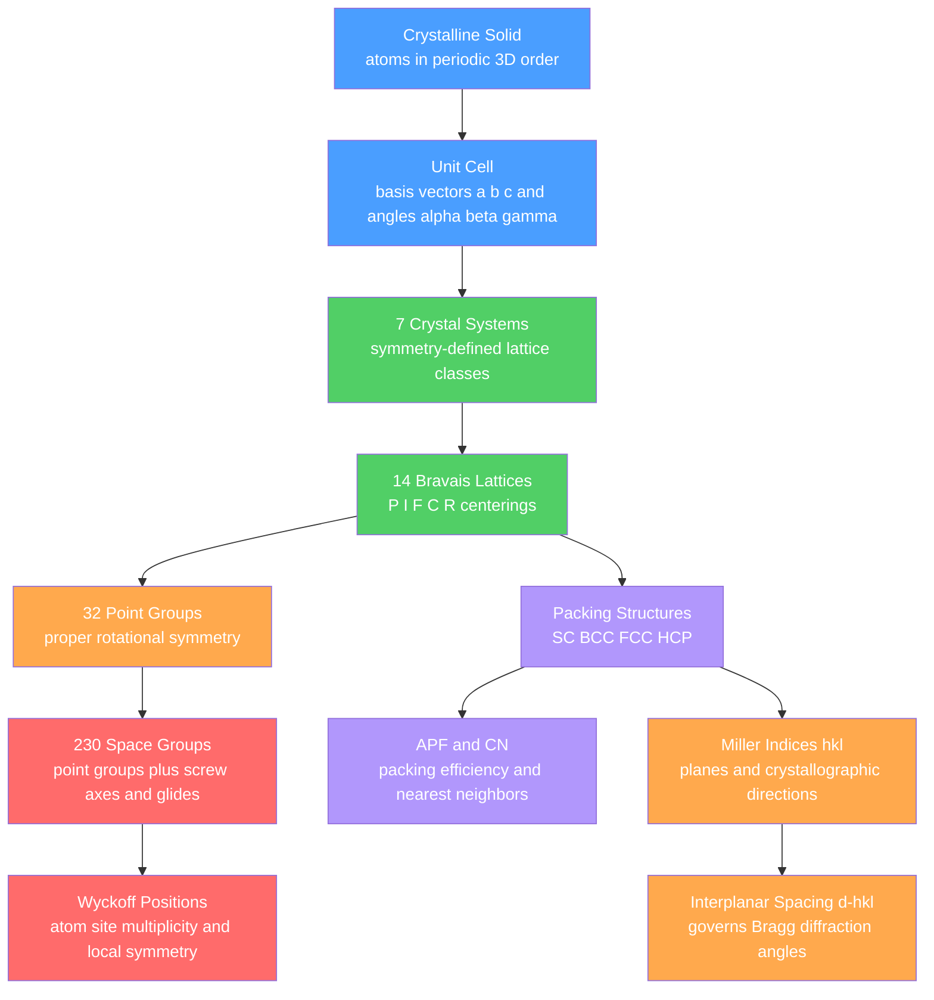

# 🔷 Crystal Systems and Space Groups

> [!abstract] TL;DR
> Crystals are 3D periodic arrangements of atoms described by a **unit cell** with basis vectors $a, b, c$ and angles $\alpha, \beta, \gamma$; the symmetry of that repeat constrains all crystals into **7 systems**, **14 Bravais lattices**, **32 point groups**, and **230 space groups**. The atomic packing factor (APF) — the fraction of unit-cell volume occupied by hard-sphere atoms — is 52% (SC), 68% (BCC), and 74% (FCC and HCP). **Miller indices** $(hkl)$ label planes and directions, feeding the interplanar-spacing formula $d_{hkl} = a/\sqrt{h^2+k^2+l^2}$ that underpins X-ray diffraction and every structure–property relationship in engineering materials.

---

## Intuition — analogy FIRST

Picture a warehouse manager stacking identical cannonballs into a crate. The naive approach — one ball directly above the previous — leaves enormous gaps between them (simple cubic, only 52% full). A smarter manager nests each ball into the triangular dimple made by three below it, producing either an **ABAB** (hexagonal close-packed) or an **ABCABC** (face-centred cubic) stack — both fill 74% of space, the theoretical maximum for equal spheres.

The symmetry of the crate plus the stacking sequence is all you need to predict the crystal. Every metal, ceramic, and semiconductor falls into one of seven geometrically distinct "crate" types (crystal systems), and the stacking rules determine the space group. Change the stacking and you change the engineering material: iron switches from BCC (tough, magnetic) to FCC (ductile, non-magnetic) just by heating above 912°C — same atoms, different packing geometry, radically different properties.

---

## How It Works

The fundamental hierarchy runs from raw atomic arrangement through geometry and symmetry to the full 230-entry space-group catalogue. Interplanar spacings and diffraction angles are read off at the bottom of this chain.



**Unit-cell geometry.** A unit cell is defined by six parameters: edge lengths $a, b, c$ and interaxial angles $\alpha$ (between $b$ and $c$), $\beta$ (between $a$ and $c$), $\gamma$ (between $a$ and $b$). The general triclinic cell volume is:

$$V = abc\,\sqrt{1 - \cos^2\!\alpha - \cos^2\!\beta - \cos^2\!\gamma + 2\cos\alpha\cos\beta\cos\gamma}$$

For the cubic special case $a = b = c$, $\alpha = \beta = \gamma = 90°$, this collapses to $V = a^3$.

---

## Key Concepts / Details

### Secondary Level

**Crystalline vs amorphous.** A crystalline solid has *long-range order*: every atom occupies a repeating lattice site, giving sharp X-ray peaks, flat crystal faces, and a well-defined melting point. An amorphous solid (glass, most polymers) has only short-range order — no lattice, no sharp diffraction, no cleavage planes.

**The 7 crystal systems.** Every crystal belongs to one of seven systems, each distinguished by constraints on its cell parameters and by its **minimum required symmetry element**:

| System | Lattice parameters | Min. symmetry | Bravais types | Engineering examples |
|--------|--------------------|:-------------:|:-------------:|----------------------|
| Cubic | $a=b=c;\ \alpha=\beta=\gamma=90°$ | Four 3-fold axes | 3 (P, I, F) | Fe, W (BCC); Cu, Al, Ni (FCC); NaCl |
| Tetragonal | $a=b\neq c;\ \alpha=\beta=\gamma=90°$ | One 4-fold axis | 2 (P, I) | Martensite, SnO₂, In |
| Orthorhombic | $a\neq b\neq c;\ \alpha=\beta=\gamma=90°$ | Three ⊥ 2-fold axes | 4 (P, C, I, F) | U, Ga, sulfur, MoSi₂ |
| Hexagonal | $a=b\neq c;\ \alpha=\beta=90°, \gamma=120°$ | One 6-fold axis | 1 (P) | Ti, Mg, Zn (HCP); graphite; ZnO |
| Trigonal | $a=b=c;\ \alpha=\beta=\gamma\neq90°$ | One 3-fold axis | 1 (R) | Bi, As, Sb, corundum |
| Monoclinic | $a\neq b\neq c;\ \alpha=\gamma=90°\neq\beta$ | One 2-fold axis | 2 (P, C) | $\beta$-Sn, gypsum, jadeite |
| Triclinic | all unequal | Inversion only | 1 (P) | Kyanite, microcline |

Total: $3+2+4+1+1+2+1 = \mathbf{14}$ Bravais lattices.

**Metallic packing structures.** The four principal engineering metallic structures:

| Structure | Example metals | Atoms/cell | CN | APF |
|-----------|----------------|:----------:|:--:|:---:|
| Simple cubic (SC) | Po (only element!) | 1 | 6 | 52% |
| Body-centred cubic (BCC) | Fe, W, Cr, Mo, V, Nb | 2 | 8 | 68% |
| Face-centred cubic (FCC) | Cu, Al, Ni, Au, Ag, Pb | 4 | 12 | 74% |
| Hexagonal close-packed (HCP) | Ti, Mg, Zn, Co, Be, Zr | 2 | 12 | 74% |

### Undergraduate Level

**Atomic packing factor (APF)** treats atoms as hard spheres of radius $r$ and asks what fraction of the unit-cell volume they occupy:

$$\text{APF} = \frac{N_{\text{atoms}} \times \tfrac{4}{3}\pi r^3}{V_{\text{cell}}}$$

Geometric derivation using the touching-sphere contact condition:

**SC** — atoms touch along the cell edge, so $a = 2r$:
$$\text{APF}_{\text{SC}} = \frac{1 \times \tfrac{4}{3}\pi r^3}{(2r)^3} = \frac{\pi}{6} \approx 52.4\%$$

**BCC** — atoms touch along the body diagonal $\sqrt{3}\,a = 4r$, so $a = 4r/\sqrt{3}$:
$$\text{APF}_{\text{BCC}} = \frac{2 \times \tfrac{4}{3}\pi r^3}{\left(4r/\sqrt{3}\right)^3} = \frac{\pi\sqrt{3}}{8} \approx 68.0\%$$

**FCC** — atoms touch along the face diagonal $\sqrt{2}\,a = 4r$, so $a = 2\sqrt{2}\,r$:
$$\text{APF}_{\text{FCC}} = \frac{4 \times \tfrac{4}{3}\pi r^3}{\left(2\sqrt{2}\,r\right)^3} = \frac{\pi}{3\sqrt{2}} \approx 74.0\%$$

**HCP** — the ideal hexagonal close-packed arrangement has $c/a = \sqrt{8/3} \approx 1.633$ and the same sphere-to-sphere contact as FCC (both are closest packings, differing only in ABAB vs ABCABC stacking), so APF$_{\text{HCP}} = 74.05\%$.

> [!warning] Real HCP metals deviate from ideal $c/a$. Zn has $c/a = 1.856$ (prolate), Be has $c/a = 1.568$ (oblate). Deviation changes available slip systems and ductility.

**Atoms per unit cell — counting rules.** An atom shared between $n$ cells contributes $1/n$ to each:
- Corner atom: shared by 8 cells → contributes $\tfrac{1}{8}$
- Edge atom: shared by 4 cells → contributes $\tfrac{1}{4}$
- Face atom: shared by 2 cells → contributes $\tfrac{1}{2}$
- Body-center atom: wholly inside one cell → contributes $1$

FCC check: $8 \times \tfrac{1}{8} + 6 \times \tfrac{1}{2} = 1 + 3 = 4$ atoms/cell.

**Miller indices** $(hkl)$ label a crystallographic plane by a three-step procedure:
1. Find where the plane intercepts the three crystallographic axes, expressed in units of $a, b, c$. A plane parallel to an axis has intercept $\infty$.
2. Take the reciprocals of those intercepts.
3. Reduce to the smallest set of integers with the same ratios.
4. Negative index is written with an overbar: $\bar{1}$ (read "bar-one").

Example: a plane intercepting $x=1$, $y=\tfrac{1}{2}$, $z=\infty$ gives reciprocals $1, 2, 0 \to (120)$.

The direction notation $[uvw]$ gives the vector with integer components $u, v, w$ along the axes. For **cubic systems only**, the direction $[hkl]$ is always perpendicular to the plane $(hkl)$. This orthogonality does **not** hold in lower-symmetry systems.

| Notation | Meaning |
|----------|---------|
| $(hkl)$ | A specific plane |
| $\{hkl\}$ | Family of all symmetry-equivalent planes |
| $[uvw]$ | A specific direction |
| $\langle uvw \rangle$ | Family of all symmetry-equivalent directions |

**Interplanar spacing.** For the **cubic** system, the spacing between adjacent $(hkl)$ planes is:

$$d_{hkl} = \frac{a}{\sqrt{h^2 + k^2 + l^2}}$$

Key values: $d_{100} = a$; $d_{110} = a/\sqrt{2}$; $d_{111} = a/\sqrt{3}$; $d_{200} = a/2$. Substituted into Bragg's law $n\lambda = 2d_{hkl}\sin\theta$, this predicts every diffraction peak in an XRD pattern. For **tetragonal** ($a=b\neq c$) the formula becomes:

$$\frac{1}{d_{hkl}^2} = \frac{h^2 + k^2}{a^2} + \frac{l^2}{c^2}$$

**Bravais lattice centering.** Adding extra lattice points to the primitive (P) cell creates:
- **I** (body-centered): extra point at $\left(\tfrac{1}{2},\tfrac{1}{2},\tfrac{1}{2}\right)$ → 2 lattice pts/cell
- **F** (face-centered): extra point at each face center → 4 lattice pts/cell
- **C** (base-centered): extra point at one pair of opposite faces → 2 lattice pts/cell
- **R** (rhombohedral): used for the trigonal system with two interior points

Not every centering type can be applied to every crystal system while producing a genuinely distinct lattice. Face-centered tetragonal, for example, is equivalent to a smaller body-centered tetragonal cell, which is why tetragonal has only P and I. The constraint of geometric distinctness yields exactly 14 Bravais lattices.

### Graduate Level

**The 230 space groups** are the complete catalogue of how point-group symmetry and lattice translations can combine in three dimensions. The two additional roto-translational symmetry elements that promote 32 point groups to 230 space groups are:

- **Screw axis** $n_m$: rotate $360°/n$ about an axis and simultaneously translate by the fraction $m/n$ of the lattice repeat along that axis (e.g., $6_1$, $4_2$, $3_2$). A helix is the physical picture.
- **Glide plane**: reflect across a plane and simultaneously translate by a fraction of a lattice vector. Types: axial glides ($a$, $b$, $c$), diagonal glide ($n$), diamond glide ($d$).

This classification was solved independently by Fedorov and Schoenflies in 1891. For any engineering alloy, ceramic, or semiconductor, the space group is the fundamental symmetry descriptor — it determines piezoelectricity, optical activity, allowed phonon modes, and systematic absences in diffraction.

**Wyckoff positions** enumerate all symmetry-distinct atomic site types within a given space group. Each position is labeled by a **multiplicity** (how many symmetrically equivalent atoms per cell) and a **letter** (arbitrary, assigned by convention). In cubic FCC, space group $Fm\bar{3}m$ (No. 225):

| Wyckoff label | Multiplicity | Site symmetry | Representative coordinates |
|:-------------:|:------------:|:-------------:|---------------------------|
| $4a$ | 4 | $m\bar{3}m$ | $(0,0,0)$ + FCC translations |
| $4b$ | 4 | $m\bar{3}m$ | $\left(\tfrac{1}{2},\tfrac{1}{2},\tfrac{1}{2}\right)$ + FCC translations |
| $8c$ | 8 | $\bar{4}3m$ | $\left(\tfrac{1}{4},\tfrac{1}{4},\tfrac{1}{4}\right)$ + FCC translations |
| $24d$ | 24 | $4m.m$ | $\left(\tfrac{1}{4},0,0\right)$ + FCC translations |

In NaCl (same space group), Cl⁻ occupies Wyckoff $4a$ and Na⁺ occupies $4b$. In a doped semiconductor, the available Wyckoff positions determine substitutional vs. interstitial sites. High-entropy alloys occupy a single Wyckoff position with statistical occupancy by multiple species.

**Structure factor and systematic absences.** The scattered X-ray amplitude from plane $(hkl)$ sums contributions from every atom in the unit cell:

$$F_{hkl} = \sum_{j=1}^{N} f_j\, \exp\!\bigl[\,2\pi i\,(h x_j + k y_j + l z_j)\,\bigr], \qquad I_{hkl} \propto |F_{hkl}|^2$$

where $f_j$ is the atomic scattering factor and $(x_j, y_j, z_j)$ are fractional coordinates. When $F_{hkl} = 0$, the reflection is **absent** — a direct crystallographic fingerprint:

| Centering | Reflection condition (peaks present) | Example absent reflection |
|-----------|--------------------------------------|--------------------------|
| P | all $(hkl)$ | — |
| I (BCC) | $h+k+l$ even | $(100), (111), (210)$ absent |
| F (FCC) | $h, k, l$ all even **or** all odd | $(100), (110), (210)$ absent |
| C | $h+k$ even | $(100), (010)$ absent |

Screw axes and glide planes produce additional systematic absences on specific subsets of reflections (e.g., $0kl$ zone for $b$-glide perpendicular to $a$). Reading the full absence pattern from a powder pattern determines the space group, which is the starting point of any crystal structure solution.

---

## Code Demo

```python
import numpy as np
import matplotlib.pyplot as plt

# Atomic packing factor from geometry (touching-sphere contact conditions)
# APF = N_atoms * (4/3 * pi * r^3) / V_cell
# Normalise to atomic radius r = 1

r = 1.0

def apf_cubic(n_atoms, a_over_r):
    """APF for a cubic unit cell.  a_over_r encodes the contact condition."""
    a       = a_over_r * r
    v_atoms = n_atoms * (4.0 / 3.0) * np.pi * r**3
    v_cell  = a**3
    return v_atoms / v_cell

# SC:  atoms touch along edge              -> a = 2r
# BCC: atoms touch along body diagonal     -> sqrt(3)*a = 4r  ->  a = 4r/sqrt(3)
# FCC: atoms touch along face diagonal     -> sqrt(2)*a = 4r  ->  a = 2*sqrt(2)*r
data = {
    "SC":  {"n": 1, "a_r": 2.0,              "cn": 6},
    "BCC": {"n": 2, "a_r": 4.0/np.sqrt(3),   "cn": 8},
    "FCC": {"n": 4, "a_r": 2.0*np.sqrt(2),   "cn": 12},
}

print(f"{'Struct':6s}  {'a/r':>8s}  {'APF':>8s}  {'CN':>4s}")
print("-" * 36)
results = {}
for name, d in data.items():
    val = apf_cubic(d["n"], d["a_r"])
    results[name] = val
    print(f"{name:6s}  {d['a_r']:8.4f}  {val*100:7.2f}%  {d['cn']:4d}")

# HCP has the same APF as FCC: both are closest packings (ABAB vs ABCABC stacking)
results["HCP"] = results["FCC"]
print(f"{'HCP':6s}  {'(same as FCC)':>8}  {results['HCP']*100:7.2f}%  {12:4d}")

labels     = ["SC", "BCC", "FCC", "HCP"]
apf_pct    = [results[s] * 100 for s in labels]
cn_vals    = [6, 8, 12, 12]
colors     = ["#4a9eff", "#51cf66", "#ff6b6b", "#ffa94d"]

fig, (ax1, ax2) = plt.subplots(1, 2, figsize=(10, 5))

bars1 = ax1.bar(labels, apf_pct, color=colors, edgecolor="black", alpha=0.85)
ax1.axhline(74.05, color="red", linestyle="--", linewidth=1.2,
            label="Close-pack limit 74.05%")
ax1.set_ylabel("Atomic Packing Factor (%)")
ax1.set_title("APF by Crystal Structure")
ax1.set_ylim(0, 90)
ax1.legend(fontsize=9)
for bar, val in zip(bars1, apf_pct):
    ax1.text(bar.get_x() + bar.get_width() / 2, bar.get_height() + 0.5,
             f"{val:.1f}%", ha="center", va="bottom", fontsize=9, fontweight="bold")

bars2 = ax2.bar(labels, cn_vals, color=colors, edgecolor="black", alpha=0.85)
ax2.set_ylabel("Coordination Number")
ax2.set_title("Coordination Number by Crystal Structure")
ax2.set_ylim(0, 15)
for bar, val in zip(bars2, cn_vals):
    ax2.text(bar.get_x() + bar.get_width() / 2, bar.get_height() + 0.1,
             str(val), ha="center", va="bottom", fontsize=11, fontweight="bold")

plt.tight_layout()
plt.savefig("crystal_packing.png", dpi=150, bbox_inches="tight")
plt.show()

# Expected output:
# SC      2.0000    52.36%     6
# BCC     2.3094    68.02%     8
# FCC     2.8284    74.05%    12
# HCP  (same as FCC)  74.05%  12
```

---

## Real-World Applications

> **Steel allotropes and martensite.** Iron is BCC ($\alpha$-ferrite, CN 8) at room temperature and transforms to FCC ($\gamma$-austenite, CN 12) above 912°C. The FCC structure has larger octahedral interstitial holes ($r/R = 0.414$ vs $0.291$ for BCC), allowing it to dissolve more carbon. Quenching FCC austenite traps carbon and distorts the cell into a body-centred **tetragonal** martensite ($c/a > 1$). The resulting lattice strain is the hardening mechanism of all martensitic steels — a direct consequence of crystal geometry.

> **Silicon wafers and semiconductor fabrication.** Silicon crystallizes in the **diamond cubic** structure: FCC with a two-atom basis, space group $Fd\bar{3}m$ (No. 227), with Si at Wyckoff $8a$ positions. Every transistor and solar cell depends on doping Si with atoms that substitute at those Wyckoff sites. Wafer orientation — (100), (110), or (111) — is specified using Miller indices because it controls surface chemistry, anisotropic etch rates, carrier mobility, and cleavage direction for die singulation.

> **X-ray diffraction for phase identification in failure analysis.** An engineer extracts a failed bearing component, grinds a powder sample, and collects an XRD pattern. Peak positions obey $\sin\theta = \lambda/(2d_{hkl}) = \lambda\sqrt{h^2+k^2+l^2}/(2a)$; comparing the pattern to the ICDD powder diffraction database identifies the crystal phase, its space group, and its lattice parameter. A shifted $a$ value signals residual stress; extra peaks reveal unwanted second phases (carbides, intermetallics, oxides) that initiated cracking.

> **Titanium alloys in aerospace.** Pure Ti is HCP ($\alpha$ phase, space group $P6_3/mmc$) but alloying with Al stabilizes $\alpha$ and adding V stabilizes a high-temperature BCC $\beta$ phase. Ti–6Al–4V, the most-used aerospace alloy, is a dual-phase $\alpha/\beta$ material engineered at the crystal-structure level. The $\alpha/\beta$ phase ratio, controlled by heat treatment, sets the balance between fatigue strength (BCC) and creep resistance (HCP). Understanding which Wyckoff positions V and Al prefer in each structure is fundamental to alloy design.

---

## Common Pitfalls

- **Using the cubic $d$-spacing formula for non-cubic systems** — $d_{hkl} = a/\sqrt{h^2+k^2+l^2}$ holds **only** for cubic. Tetragonal needs $a$ and $c$; hexagonal needs $a$, $c$, and a cross-term. Applying the cubic formula to hexagonal Ti produces systematically wrong peak positions.
- **Confusing the 7 systems with the 14 Bravais lattices** — the systems describe *cell shape*, the Bravais lattices add *centering*. Saying "the cubic lattice" is ambiguous; there are three distinct cubic Bravais lattices (P, I, F).
- **Atom-per-cell counting errors** — a corner atom contributes $\tfrac{1}{8}$, a face atom $\tfrac{1}{2}$, an edge atom $\tfrac{1}{4}$, a body-center atom $1$. Forgetting the face contributions gives FCC as 2 atoms/cell instead of 4, cutting the computed density in half.
- **Treating HCP as a Bravais lattice** — HCP is the *hexagonal* Bravais lattice (P) with a two-atom basis at $(0,0,0)$ and $\left(\tfrac{1}{3},\tfrac{2}{3},\tfrac{1}{2}\right)$. It is a crystal **structure**, not a pure lattice type. This distinction matters when counting: the 14 Bravais lattices include one hexagonal P lattice, not a separate "HCP lattice."
- **Forgetting the reciprocal step in Miller index construction** — you must take reciprocals of the axis intercepts (in units of $a,b,c$) before reducing to integers. A plane parallel to the $z$-axis has intercept $z=\infty$ and therefore Miller index $l=0$.
- **Assuming ideal $c/a$ for HCP metals** — only Be and Mg are close to ideal ($c/a \approx 1.633$). Zn ($c/a = 1.856$) and Cd ($c/a = 1.886$) are severely distorted, activating different slip systems and giving brittle behaviour. Always check the real $c/a$ when computing slip geometry.
- **Confusing systematic absences with weak reflections** — a systematic absence ($F_{hkl} = 0$) is an exact mathematical consequence of the space group and should not appear at all. A weak reflection arises from small scattering contrast and will appear but with low intensity. Misidentifying weak peaks as absences leads to the wrong space group assignment.

---

## Related Concepts

- [[_MOC_Crystal_Structure_and_Bonding|↑ Section MOC]] — entry point for the Materials Science crystal structure section
- [[Chemical_Bonding_in_Solids]] — the type of chemical bond (metallic, ionic, covalent, van der Waals) determines which crystal structure minimises free energy
- [[X_Ray_Diffraction_and_Braggs_Law]] — the experimental technique that reads $d_{hkl}$ from diffraction angles; Miller indices and interplanar spacing derived here are its direct inputs
- [[Defects_and_Dislocations_in_Crystals]] — point defects (vacancies, interstitials) occupy specific Wyckoff positions; dislocations glide on crystallographic slip planes $(hkl)$ in directions $[uvw]$
- [[Electronic_Band_Structure]] — crystal symmetry (space group and Brillouin zone) constrains all allowed electronic states; band gaps arise directly from the periodic lattice potential
- [[Crystal_Systems_and_Symmetry]] (Earth Science) — the same 7 systems and 14 Bravais lattices from a mineralogy perspective, including quasicrystals and the crystallographic restriction theorem
- [[Solid_State_and_Crystal_Structures]] (Chemistry) — ionic structures, packing holes, lattice energy, radius-ratio rule, and Born–Haber cycle; close-packing from the bonding angle
- [[Crystal_Structure_and_Band_Theory]] (Physics) — Bloch's theorem, the reciprocal lattice, and the connection from crystal periodicity to electronic band structure
- [[Interference_and_Diffraction]] (Physics) — wave superposition physics underlying Bragg's law and the structure factor
- [[What_Is_a_Mineral]] (Earth Science) — crystalline order and a definable crystal structure are part of the formal definition of a mineral
- [[_MOC_Chemistry_Master]] — cross-domain chemistry connections to crystal structures and bonding
- [[_MOC_Earth_Science_Master]] — cross-domain Earth science and mineralogy connections
- [[_MOC_Physics_Master]] — cross-domain condensed matter and solid-state physics connections

---

## Review Questions

1. **Secondary:** A copper wire (FCC) and a tungsten wire (BCC) are made from atoms of similar radius. Without calculating, explain geometrically why FCC achieves a higher packing factor than BCC. Which metal would you expect to have a higher density per unit volume, holding atomic radius constant?
2. **Undergraduate:** Aluminium has FCC structure with $a = 404.95$ pm. (a) Calculate the atomic radius of Al using the FCC contact condition. (b) Compute $d_{111}$, $d_{200}$, and $d_{220}$ using the cubic interplanar spacing formula. (c) With Cu K$\alpha$ radiation ($\lambda = 154.06$ pm), find the Bragg angle $2\theta$ for each. (d) Identify which low-index reflections are systematically absent for an FCC lattice and explain which term in $F_{hkl}$ forces them to zero.
3. **Graduate:** Silicon crystallises in the diamond cubic structure (space group $Fd\bar{3}m$, No. 227) with 8 atoms per cell at Wyckoff $8a$ positions. Write the structure factor $F_{hkl}$ for this structure and show that reflections satisfying $h+k+l \equiv 2\ (\mathrm{mod}\ 4)$ vanish — the so-called diamond extinction. Explain physically why the $(200)$ reflection is absent in Si powder diffraction even though $h+k+l = 2$ is even, and contrast this with the absence rule for a plain FCC lattice.

---

## Sources

- [Callister & Rethwisch — *Materials Science and Engineering: An Introduction*, 10th ed. (Wiley)](https://www.wiley.com/en-us/Materials+Science+and+Engineering%3A+An+Introduction%2C+10th+Edition-p-9781119405498)
- [Kittel — *Introduction to Solid State Physics*, 8th ed. (Wiley)](https://www.wiley.com/en-us/Introduction+to+Solid+State+Physics%2C+8th+Edition-p-9780471415268)

---

#materials-science #crystal-structure #crystallography #bravais-lattices #space-groups #miller-indices #atomic-packing-factor #XRD #undergraduate #graduate
