# ⚙️ Defects and Dislocations in Crystals

> [!abstract] TL;DR
> Real crystals are never perfect — they contain point, line, area, and volume defects whose concentrations and interactions govern virtually every engineering property that matters: how fast atoms diffuse, how much current flows, and — most dramatically — why metals bend rather than shatter. Dislocations (line defects) let crystal planes slide past each other at stresses **1,000× below** the theoretical shear strength by moving a local lattice distortion rather than shifting an entire plane at once.

---

## Intuition

**Analogy:** Imagine a packed concert crowd that needs to shift one step to the right. Asking every person to move simultaneously requires enormous coordinated force. But if just one person at the edge steps right and creates a gap, the next person fills it, then the next, and so on — a ripple of local two-person swaps propagates across the crowd with almost no effort, yet the whole crowd has moved one step.

A dislocation in a crystal works exactly this way. Instead of rigidly shearing an entire crystal plane (which would require stresses near the theoretical limit $G/2\pi \approx 10$ GPa), the crystal moves a line of local distortion — the dislocation — from one side to the other. Each atom makes only a tiny, low-energy adjustment; the cumulative result is a macroscopic step on the surface and permanent plastic deformation.

---

## How It Works

### Core Mechanics

**Defects by dimensionality.** Every deviation from a perfect periodic lattice can be classified by its geometric extent:
- **0-D (point defects):** single atom or vacancy — vacancies, interstitials, substitutionals
- **1-D (line defects):** one-dimensional distortion through the lattice — dislocations
- **2-D (area defects):** planar boundaries — grain boundaries, stacking faults, twin boundaries
- **3-D (volume defects):** macroscopic heterogeneities — voids, inclusions, precipitates

**The equilibrium vacancy concentration** is set by a competition between the enthalpic cost of creating a vacancy ($Q_v$) and the entropic gain of disorder. From Boltzmann statistics:

$$\frac{n_v}{N} = \exp\!\left(-\frac{Q_v}{k_B T}\right)$$

where $n_v$ is the number of vacancies, $N$ the total atom sites, $Q_v$ the vacancy formation energy, $k_B = 8.617 \times 10^{-5}$ eV/K, and $T$ temperature in kelvin. For copper ($Q_v \approx 0.90$ eV), this gives $n_v/N \approx 1.3 \times 10^{-15}$ at 300 K but $\approx 2.3 \times 10^{-4}$ just below the melting point — a 10-billion-fold increase over 1000 K.

**The Burgers vector $\mathbf{b}$** is the fundamental descriptor of a dislocation. Draw a right-hand closed loop (Burgers circuit) of equal atom steps in a perfect reference crystal. Trace the same path around a dislocation in the real crystal — it fails to close. The vector connecting start to finish is $\mathbf{b}$. Its magnitude and direction classify the dislocation type:
- **Edge dislocation:** $\mathbf{b} \perp$ dislocation line $\ell$. An extra half-plane of atoms terminates inside the crystal; the dislocation line runs along the edge of that half-plane. The surrounding lattice is in compression above the half-plane and tension below.
- **Screw dislocation:** $\mathbf{b} \parallel$ dislocation line $\ell$. The lattice planes spiral helically around the dislocation line. Screw dislocations can cross-slip onto any plane containing $\ell$; edge dislocations cannot.
- **Mixed dislocation:** $\mathbf{b}$ is at an oblique angle to $\ell$; has both edge and screw character.

**Strain energy of a dislocation.** The elastic distortion stored around a unit length of dislocation is:

$$E_{\text{line}} \approx \frac{G b^2}{2}$$

where $G$ is the shear modulus. This has two key consequences. First, dislocations prefer the smallest possible $|\mathbf{b}|$, which is always the shortest lattice translation — i.e., the close-packed direction. Second, two dislocations with Burgers vectors $\mathbf{b}_1$ and $\mathbf{b}_2$ will react to form $\mathbf{b}_3 = \mathbf{b}_1 + \mathbf{b}_2$ only if $|\mathbf{b}_3|^2 < |\mathbf{b}_1|^2 + |\mathbf{b}_2|^2$ (Frank's rule: energy must decrease).

### Flow / Architecture

```mermaid
graph TD
    ROOT["Crystal Defects"] --> D0["0-D Point Defects"]
    ROOT --> D1["1-D Line Defects<br/>(Dislocations)"]
    ROOT --> D2["2-D Area Defects"]
    ROOT --> D3["3-D Volume Defects"]

    D0 --> VAC["Vacancy<br/>missing atom<br/>thermodynamically unavoidable"]
    D0 --> IMP["Self-Interstitial<br/>Substitutional Impurity<br/>Interstitial Impurity"]
    D0 --> FRK["Frenkel Defect<br/>vacancy + interstitial pair<br/>same species — ionic crystals"]
    D0 --> SCH["Schottky Defect<br/>cation + anion vacancy pair<br/>charge-balanced — lowers density"]

    D1 --> EDGE["Edge Dislocation<br/>extra half-plane<br/>b perpendicular to line"]
    D1 --> SCREW["Screw Dislocation<br/>helical ramp<br/>b parallel to line"]
    D1 --> MXD["Mixed Dislocation<br/>b at angle to line<br/>both edge and screw character"]

    D2 --> GBH["High-Angle Grain Boundary<br/>disordered region — theta above 15 deg"]
    D2 --> GBL["Low-Angle Grain Boundary<br/>tilt: edge dislocation array<br/>twist: screw dislocation grid"]
    D2 --> STK["Stacking Fault<br/>wrong ABCABC sequence"]
    D2 --> TWN["Twin Boundary<br/>mirror-related crystal orientations"]

    D3 --> VOL["Voids — vacancy clusters<br/>Inclusions — second-phase particles<br/>Precipitates — coherent or incoherent"]

    style ROOT fill:#4a9eff,color:#fff
    style D0 fill:#ff6b6b,color:#fff
    style D1 fill:#ffa94d,color:#fff
    style D2 fill:#51cf66,color:#fff
    style D3 fill:#b197fc,color:#fff
    style VAC fill:#ffb3b3,color:#333
    style IMP fill:#ffb3b3,color:#333
    style FRK fill:#ffb3b3,color:#333
    style SCH fill:#ffb3b3,color:#333
    style EDGE fill:#ffd6a5,color:#333
    style SCREW fill:#ffd6a5,color:#333
    style MXD fill:#ffd6a5,color:#333
    style GBH fill:#b8f0c0,color:#333
    style GBL fill:#b8f0c0,color:#333
    style STK fill:#b8f0c0,color:#333
    style TWN fill:#b8f0c0,color:#333
    style VOL fill:#d4c5f9,color:#333
```



---

## Key Concepts / Details

### Secondary Level

**Why any defects at all?** At temperatures above absolute zero, thermal energy constantly kicks atoms out of their equilibrium positions. The entropy gained by disorder always outweighs the enthalpy cost at some concentration — so a finite equilibrium vacancy concentration is thermodynamically mandated, not an accident of impure materials.

**Vacancies and impurities side by side.**

| Defect | Description | Effect |
|--------|-------------|--------|
| Vacancy | Atom missing from lattice site | Enables diffusion; lowers density |
| Self-interstitial | Atom of host squeezed into interstitial site | High strain energy; rare in metals |
| Substitutional impurity | Foreign atom on a regular lattice site | Solid-solution strengthening (Cu–Zn = brass) |
| Interstitial impurity | Small foreign atom in a gap (C, N, H) | Carbon in iron = steel; strong hardening |

**Dislocations and plastic deformation.** Pure iron has a theoretical shear strength of ~$G/2\pi \approx 12$ GPa, but real iron yields at ~100 MPa — 100× lower. Dislocations are the reason. When a dislocation moves across a slip plane from one free surface to the other, the crystal above the slip plane is displaced by exactly $|\mathbf{b}|$ relative to the crystal below — this is how plastic strain accumulates at low stress.

**Grain boundaries in everyday metals.** When a liquid metal solidifies, many crystals nucleate simultaneously and grow until they impinge. The mismatch at each meeting point is a grain boundary. Finer grains = more boundary area = harder metal (Hall-Petch effect: yield strength scales as $d^{-1/2}$, where $d$ is grain diameter).

### Undergraduate Level

**Frenkel defects vs Schottky defects in ionic crystals.**

*Frenkel defect:* An ion (usually the smaller cation) is displaced from its lattice site to a nearby interstitial site, creating a vacancy-interstitial pair. Crystal density is unchanged. Common in silver halides (AgCl, AgBr) and ZnS where the cation is small enough to squeeze into the interstitial.

*Schottky defect:* In ionic crystals, charge neutrality demands that vacancies occur in pairs: one cation vacancy + one anion vacancy. This lowers the crystal density. Common in NaCl and KBr where the two ion sizes are similar, so there are no accessible interstitial sites.

The Schottky pair concentration (per cation site) is:

$$n_s \approx N \exp\!\left(-\frac{Q_s}{2k_B T}\right)$$

where $Q_s$ is the energy to form the cation-anion vacancy pair.

**Burgers circuit protocol.** Starting from an atom, take $p$ steps in direction $+\hat{u}$, $q$ steps in $+\hat{v}$, $p$ steps in $-\hat{u}$, $q$ steps in $-\hat{v}$ (a right-hand sense square). In a perfect lattice this closes. Around a dislocation it does not. The vector from finish to start is $\mathbf{b}$ (Bilby-Bullough-Smithells convention). For an edge dislocation in an FCC metal, $|\mathbf{b}| = a/\sqrt{2}$ (the nearest-neighbour distance in a close-packed direction).

**Stress state around an edge dislocation.** In linear elasticity (the Volterra model), the stress components in polar coordinates $(r, \theta)$ around an edge dislocation are:

$$\sigma_{xx} = -\frac{G b}{2\pi(1-\nu)} \frac{y(3x^2+y^2)}{(x^2+y^2)^2}, \qquad \tau_{xy} = \frac{G b}{2\pi(1-\nu)} \frac{x(x^2-y^2)}{(x^2+y^2)^2}$$

These stresses fall off as $1/r$ — the dislocation has a long-range stress field. Two parallel edge dislocations on the same slip plane repel each other; on different planes they can attract, forming dipoles or low-angle grain boundaries.

**Low-angle tilt boundaries as dislocation arrays.** A small-angle tilt boundary of misorientation $\theta$ can be constructed from a regular array of parallel edge dislocations with spacing $D = b/\theta$. This is the Read-Shockley model:

$$E_{GB}(\theta) = E_0\,\theta\,(A - \ln\theta)$$

For $\theta \lesssim 15°$ this gives excellent agreement with experiment. Above ~$15°$ the dislocation cores overlap and the model breaks down — the boundary becomes "high-angle" with a disordered glassy core.

**Stacking faults and partial dislocations.** In FCC metals, glide on $\{111\}$ planes can occur in two steps: instead of one full dislocation $\mathbf{b} = \frac{a}{2}\langle 110\rangle$, two **Shockley partial dislocations** with $\mathbf{b}_p = \frac{a}{6}\langle 112\rangle$ are more energetically favorable (each has smaller $|\mathbf{b}|^2$). The region between them is a **stacking fault** — one layer of HCP stacking interrupting the FCC ABCABC sequence. The width of the stacking fault is set by the balance between the repulsive force between the partials and the stacking fault energy $\gamma_{SF}$ (J/m²):

$$d \approx \frac{G b_p^2}{8\pi \gamma_{SF}}$$

Metals with low $\gamma_{SF}$ (e.g., austenitic stainless steel, brass) have wide faults and cannot cross-slip easily.

**Twin boundaries.** A twin boundary is a coherent interface across which the crystal orientation is a mirror image. It has very low energy (few tens of mJ/m²) because the atomic coordination is nearly perfect across the boundary. Deformation twins form under high strain rates or low temperatures (see TWIP steels — Twinning-Induced Plasticity).

### Graduate Level

**The Frank-Read source: dislocation multiplication.** A single dislocation segment pinned at two points (by inclusions, jogs, or nodes) can bow out under applied shear stress, loop around, and generate new dislocation loops repeatedly. The critical stress to operate the source is:

$$\tau_{FR} = \frac{G b}{L}$$

where $L$ is the pinning segment length. This explains why dislocation density in annealed copper ($\sim 10^{10}$ m$^{-2}$) rises to $\sim 10^{15}$ m$^{-2}$ after severe cold work — each source generates thousands of loops.

**Peierls-Nabarro stress.** Even without obstacles, a dislocation requires a minimum stress to glide through the ideal lattice because the core energy oscillates with the periodicity of the slip plane. The Peierls stress is:

$$\tau_{PN} = \frac{2G}{1-\nu}\exp\!\left(-\frac{4\pi w}{b}\right), \qquad w = \frac{a}{1-\nu}$$

where $w$ is the dislocation width and $a$ the interplanar spacing. Wide dislocations on close-packed planes (large $w/b$) have very low Peierls stress — metals are ductile. Narrow dislocations on non-close-packed planes (covalent, ionic crystals) have high $\tau_{PN}$ — ceramics are brittle.

**Hall-Petch relationship from dislocation pile-up theory.** Grain boundaries block dislocation motion. Dislocations pile up at boundaries, creating a back-stress that blocks further slip until the local stress is high enough to nucleate slip in the adjacent grain. The pile-up analysis gives:

$$\sigma_y = \sigma_0 + k_y\, d^{-1/2}$$

where $\sigma_0$ is the lattice friction stress, $d$ the grain diameter, and $k_y$ the Hall-Petch coefficient (material-dependent). This is the basis for grain-refinement strengthening.

**Jogs and kinks on dislocations.** A jog is a step on a dislocation line that moves it to a different slip plane (created by dislocation-dislocation intersections). A kink lies in the slip plane. Jogs on screw dislocations must move by non-conservative climb (requiring vacancy emission or absorption), creating point defects under stress — the origin of vacancy supersaturation during plastic deformation.

**Interaction energies and dislocation reactions.** Two dislocations interact via their long-range stress fields. The interaction energy per unit length between parallel dislocations is:

$$U_{12} \approx \frac{G b_1 b_2}{2\pi}\ln\frac{R}{r_0}$$

(with appropriate geometric prefactors). A Lomer-Cottrell lock forms when two partial dislocations from different $\{111\}$ planes react to form a stair-rod dislocation $\frac{a}{6}\langle 110\rangle$ that cannot glide — a sessile dislocation that acts as a strong obstacle and is the origin of work hardening.

---

## Python Demo

```python
import numpy as np
import matplotlib.pyplot as plt

# Arrhenius plot of equilibrium vacancy concentration for copper
# Equation: n_v / N = exp(-Q_v / k_B T)

k_B = 8.617e-5   # eV/K, Boltzmann constant
Q_v = 0.90       # eV, vacancy formation energy in copper (Callister, Table 4.2)
T_melt = 1358.0  # K, melting point of copper

T = np.linspace(350, T_melt, 600)         # temperature range K
nv_N = np.exp(-Q_v / (k_B * T))           # vacancy fraction (dimensionless)
inv_T_1000 = 1000.0 / T                   # 1000/T for readability on x-axis

# Values at landmark temperatures
T_marks = np.array([300.0, 500.0, 800.0, 1000.0, T_melt])
nv_N_marks = np.exp(-Q_v / (k_B * T_marks))
labels = ["300 K\n(room T)", "500 K", "800 K", "1000 K", f"T_melt\n({T_melt:.0f} K)"]

fig, axes = plt.subplots(1, 2, figsize=(11, 4.5))

# --- Left panel: log(n_v/N) vs T (shows explosive growth near melting) ---
axes[0].semilogy(T, nv_N, color="steelblue", lw=2)
axes[0].axvline(T_melt, ls="--", color="firebrick", lw=1.4,
                label=f"Melting point ({T_melt:.0f} K)")
for Tm, nvm, lbl in zip(T_marks, nv_N_marks, labels):
    axes[0].scatter(Tm, nvm, color="firebrick", zorder=5, s=40)
axes[0].set_xlabel("Temperature  T  (K)")
axes[0].set_ylabel("$n_v / N$  (log scale)")
axes[0].set_title("Equilibrium Vacancy Fraction vs T\n(Copper, $Q_v = 0.90$ eV)")
axes[0].legend(loc="upper left")
axes[0].grid(True, alpha=0.3)

# --- Right panel: Arrhenius plot — log(n_v/N) vs 1000/T is a straight line ---
axes[1].plot(inv_T_1000, np.log(nv_N), color="steelblue", lw=2,
             label=r"$\ln(n_v/N) = -Q_v/(k_B T)$")
axes[1].scatter(1000.0 / T_marks, np.log(nv_N_marks),
                color="firebrick", zorder=5, s=40)
# Annotate melting-point value
axes[1].annotate(
    f"At $T_m$: $n_v/N \\approx$ {nv_N_marks[-1]:.1e}",
    xy=(1000.0 / T_melt, np.log(nv_N_marks[-1])),
    xytext=(1.2, -6),
    arrowprops=dict(arrowstyle="->", color="firebrick"),
    color="firebrick", fontsize=9,
)
slope = -Q_v / k_B
axes[1].set_xlabel("$1000 / T$  (K$^{-1}$)")
axes[1].set_ylabel(r"$\ln(n_v / N)$")
axes[1].set_title(
    f"Arrhenius Plot — slope $= -Q_v/k_B = {slope:.0f}$ K\n"
    r"(straight line confirms Boltzmann statistics)"
)
axes[1].legend()
axes[1].grid(True, alpha=0.3)

plt.tight_layout()
plt.savefig("vacancy_concentration_copper.png", dpi=120)
plt.show()

# Print landmark values
print("Copper vacancy fraction at key temperatures:")
for Tm, nvm, lbl in zip(T_marks, nv_N_marks, labels):
    print(f"  T = {Tm:6.0f} K  ->  n_v/N = {nvm:.3e}")

# Expected output (approx):
# T =    300 K  ->  n_v/N = 1.3e-15
# T =    500 K  ->  n_v/N = 5.6e-10
# T =    800 K  ->  n_v/N = 6.4e-6
# T =   1000 K  ->  n_v/N = 1.0e-4
# T =   1358 K  ->  n_v/N = 2.3e-4
```

---

## Real-World Applications

**Steel — carbon as an interstitial impurity.** Carbon atoms are small enough to fit into the octahedral interstitial sites of BCC iron (side length 0.154 nm vs carbon radius ~0.077 nm). This interstitial solid solution distorts the lattice, blocks dislocation motion, and raises yield strength dramatically. Quenching austenite (FCC, higher carbon solubility) traps carbon in the BCC martensite lattice — the origin of hardened steel.

**Semiconductor doping — substitutional point defects engineered to order.** Phosphorus substituted for silicon (one extra valence electron → n-type donor) or boron for silicon (one fewer electron → p-type acceptor) are deliberate substitutional defects at concentrations of $10^{15}$–$10^{20}$ atoms/cm³. Carrier concentrations set the resistivity by orders of magnitude. Modern VLSI devices are impossible without precise control of point defect chemistry.

**Superalloys and creep — dislocations slowed to a crawl.** Turbine blades operate at $\sim 1000°C$ in nickel-based superalloys. The $\gamma'$ precipitate phase (Ni₃Al, ordered FCC) is coherently embedded in the $\gamma$ matrix. Dislocations must either cut through or bypass precipitates; the misfit strain and antiphase boundary energy (for cutting) dramatically slow dislocation velocity, giving creep resistance up to $\sim 0.85\, T_m$.

**Ionic conductors and solid-state batteries.** Frenkel and Schottky vacancies in ionic solids are the charge carriers. In yttria-stabilized zirconia (YSZ), substituting $Y^{3+}$ for $Zr^{4+}$ generates oxygen vacancies for charge balance — these vacancies carry $O^{2-}$ ions at 800–1000°C, enabling the solid-oxide fuel cell. In lithium-ion cathodes ($\text{LiCoO}_2$, $\text{LiFePO}_4$), lithium hops between interstitial and vacancy sites — the battery is literally a device that cycles point defect concentrations.

**Hall-Petch grain refinement in structural alloys.** Ultra-fine grained steels (grain size $\sim 1\,\mu$m) achieve yield strengths of $\sim 1$ GPa without alloying additions, purely from grain boundary blocking of dislocations. HSLA (high-strength low-alloy) steels in car body panels and pipelines derive most of their strength from thermomechanically controlled grain refinement.

---

## Common Pitfalls

- **Confusing Frenkel and Schottky defects** — Frenkel moves an atom to an interstitial (density unchanged, common where the cation is small enough to fit — AgCl); Schottky removes atoms to the surface in charge-balanced pairs (density decreases, common in NaCl-type structures). Neither requires doping; both are intrinsic at finite temperature.
- **Forgetting the sign convention for the Burgers circuit** — the result depends on the handedness of the circuit. The RH/FS (right-hand finish-start) convention is standard: circuit traversed right-handed looking along the positive dislocation line direction, $\mathbf{b}$ runs from finish to start. Reversed convention changes the sign of $\mathbf{b}$.
- **Treating the vacancy concentration formula as exact** — the expression $n_v = N\exp(-Q_v/k_BT)$ assumes dilute, non-interacting vacancies. At high temperatures close to melting, vacancy-vacancy interactions and divacancy formation (with binding energy $\sim 0.3$ eV in copper) mean the actual $n_v$ can exceed the simple Arrhenius prediction by a factor of 2–3.
- **Assuming dislocations in metals are pure edge or pure screw** — in real microstructures, dislocations are overwhelmingly mixed, particularly around jogs, bends, and Frank-Read loops. "Edge" and "screw" are pure end-member states; the general case is intermediate.
- **Confusing slip and climb** — slip is conservative dislocation glide on the slip plane; it requires no mass transport. Climb is non-conservative motion perpendicular to the slip plane, requiring vacancy diffusion, and only becomes significant above $\sim 0.4\,T_m$. Creep and recovery involve climb; room-temperature plasticity is pure glide.
- **Equating high dislocation density with high strength unconditionally** — dislocation density does increase strength (Taylor hardening: $\sigma \propto G b \rho^{1/2}$), but beyond a critical density, dislocations form low-energy wall structures (polygonization/recovery) and the material softens. Strength peaks at intermediate densities during cold work.

---

## Related Concepts

- [[_MOC_Crystal_Structure_and_Bonding]] — section MOC; parent node for this note
- [[Crystal_Systems_and_Space_Groups]] — the periodic lattice geometry that dislocations distort; Burgers vector must be a lattice translation vector
- [[Plastic_Deformation_and_Slip_Systems]] — dislocation glide on specific $\{hkl\}\langle uvw\rangle$ slip systems is the mechanism of ductility
- [[Strengthening_Mechanisms_in_Metals]] — all major strengthening mechanisms act by blocking or pinning dislocations
- [[Diffusion_in_Solids_and_Ficks_Laws]] — vacancy diffusion underpins substitutional atom migration; Fick's law quantifies the flux
- [[Solid_State_and_Crystal_Structures]] — (Chemistry vault) covers perfect lattice geometry, packing, Frenkel/Schottky in the ionic crystal context, and doping in semiconductors
- [[Laws_of_Thermodynamics]] — (Physics vault) the Boltzmann entropy framework that gives the equilibrium vacancy concentration formula
- [[_MOC_Chemistry_Master]] — (Chemistry vault) gateway to solid-state chemistry, band theory, and ionic bonding
- [[_MOC_Physics_Master]] — (Physics vault) gateway to condensed matter physics and statistical mechanics treatments

---

## Review Questions

1. **Secondary:** A metal rod is heated from room temperature to just below its melting point. Without any external forces, describe two ways the crystal microstructure changes at the atomic scale, and explain in each case why it is energetically favourable.

2. **Undergraduate:** An edge dislocation in copper moves across an entire slip plane of diameter 1 mm under an applied shear stress of 10 MPa. (a) Using $|\mathbf{b}| = 0.256$ nm and the Burgers vector relationship, estimate the shear strain produced on that plane. (b) Given that the strain energy per unit length is $Gb^2/2$ with $G = 48$ GPa, compute the energy stored in 1 mm of dislocation line and compare it to the thermal energy $k_BT$ at room temperature. What does this tell you about dislocation stability?

3. **Graduate:** Explain why face-centred cubic metals (Cu, Al, Ag) tend to be more ductile and have lower work-hardening rates than hexagonal close-packed metals (Mg, Zn) with similar chemical bonding. Your answer should invoke slip system count, cross-slip capability, stacking fault energy, and the role of partial dislocations. Then predict how alloying Cu with Zn to make brass (which lowers stacking fault energy from ~78 to ~14 mJ/m²) should change the work-hardening behaviour and the dislocation substructure observed in TEM.

---

## Sources

- Callister, W. D. & Rethwisch, D. G. — *Materials Science and Engineering: An Introduction*, 10th ed., Chs. 4 and 7 (point defects, dislocations, strengthening mechanisms)
- Hull, D. & Bacon, D. J. — *Introduction to Dislocations*, 5th ed. (Butterworth-Heinemann) — the definitive undergraduate text on dislocation mechanics
- Hirth, J. P. & Lothe, J. — *Theory of Dislocations*, 2nd ed. (Krieger) — graduate-level elastic theory of dislocation fields
- Shackelford, J. F. — *Introduction to Materials Science for Engineers*, 8th ed., Ch. 4 — accessible secondary-level treatment
- Porter, D. A., Easterling, K. E. & Sherif, M. — *Phase Transformations in Metals and Alloys*, 3rd ed. — grain boundary thermodynamics and stacking faults
- Reed-Hill, R. E. & Abbaschian, R. — *Physical Metallurgy Principles*, 3rd ed. — point defect equilibrium and dislocation reactions

---

#materialscience #crystaldefects #dislocations #pointdefects #vacancies #burgervector #grainboundaries #plasticity #solidstatephysics #secondary #undergraduate #graduate
