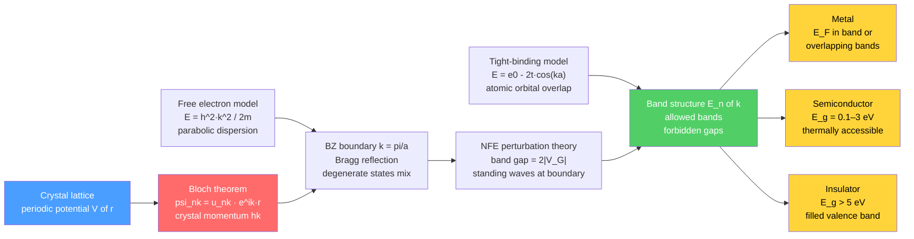

# ⚡ Electronic Band Structure

> [!abstract] TL;DR
> When electrons propagate through the periodic potential of a crystal lattice, quantum mechanics forces them into allowed energy bands separated by forbidden gaps. Bloch's theorem — $\psi_{n\mathbf{k}}(\mathbf{r}) = u_{n\mathbf{k}}(\mathbf{r})\,e^{i\mathbf{k}\cdot\mathbf{r}}$ — is the foundational result. Band gaps arise from Bragg reflection at Brillouin zone boundaries, and the position of the Fermi energy relative to these gaps determines whether a material is a metal, semiconductor, or insulator.

---

## Intuition — analogy FIRST

**Analogy:** Imagine a long corridor lined with evenly spaced pillars. A wave travelling down the corridor mostly passes through — but at one particular wavelength, reflections from every pillar arrive back in phase (Bragg condition), creating a standing wave that goes nowhere. At that wavelength the wave cannot propagate: this is the origin of a band gap.

In a crystal, the lattice of atoms creates a periodic electrostatic potential. Electron de Broglie waves feel this potential. At the Brillouin zone boundary where $k = \pi/a$, the Bragg condition is met: forward and backward waves interfere to produce two distinct standing waves — one with electron density concentrated at the ionic cores (lower electrostatic energy) and one sitting between the cores (higher energy). The energy splitting between these two standing waves is the band gap. Between the bands lies a forbidden range of energies that no electron can occupy in the bulk crystal.

---

## How It Works

### Core Mechanics

1. **Free electron model (zeroth order).** Ignore the lattice potential entirely. Electrons are plane waves $e^{i\mathbf{k}\cdot\mathbf{r}}$ with energy $E = \hbar^2 k^2 / 2m$ — a parabola in $k$-space. At absolute zero, all states up to the Fermi energy are filled:
$$E_F = \frac{\hbar^2}{2m}\left(3\pi^2 n\right)^{2/3}$$
where $n = N/V$ is the electron number density.

2. **Bloch's theorem.** In any perfectly periodic potential $V(\mathbf{r} + \mathbf{R}) = V(\mathbf{r})$ (where $\mathbf{R}$ is a Bravais lattice vector), every eigenstate of the Schrödinger equation has the form:
$$\psi_{n\mathbf{k}}(\mathbf{r}) = u_{n\mathbf{k}}(\mathbf{r})\,e^{i\mathbf{k}\cdot\mathbf{r}}$$
where $u_{n\mathbf{k}}(\mathbf{r}+\mathbf{R}) = u_{n\mathbf{k}}(\mathbf{r})$ is lattice-periodic, $n$ is the band index, and $\hbar\mathbf{k}$ is the crystal momentum. Crystal momentum is conserved modulo $\hbar\mathbf{G}$ (any reciprocal lattice vector), not exactly conserved like true momentum.

3. **Nearly-free electron model.** Treat the lattice potential as a weak perturbation. The potential expands as $V(\mathbf{r}) = \sum_\mathbf{G} V_\mathbf{G}\,e^{i\mathbf{G}\cdot\mathbf{r}}$. At the zone boundary $k = \pi/a$, the free-electron states $|k\rangle$ and $|k - G\rangle$ are exactly degenerate. Degenerate second-order perturbation theory in $V_G$ mixes them, producing a $2\times2$ Hamiltonian whose eigenvalues split by $2|V_G|$:
$$E_\pm = E_0 \pm |V_G|, \qquad E_0 = \frac{\hbar^2\pi^2}{2ma^2}$$
The band gap is $\Delta E = 2|V_G|$.

4. **Tight-binding approximation.** Start from atomic orbitals $\phi(\mathbf{r})$ localised on each lattice site. Build Bloch sums and allow nearest-neighbour quantum tunnelling with hopping integral $t$. In 1D with lattice constant $a$:
$$E(k) = \varepsilon_0 - 2t\cos(ka)$$
Bandwidth $W = 4t$. Wider bands come from larger orbital overlap; narrow $d$- and $f$-electron bands have small $t$. In 3D simple cubic: $E(\mathbf{k}) = \varepsilon_0 - 2t\bigl[\cos(k_x a) + \cos(k_y a) + \cos(k_z a)\bigr]$.

5. **First Brillouin zone and reduced zone scheme.** The first BZ is the Wigner-Seitz cell of the reciprocal lattice — all $\mathbf{k}$-vectors closer to $\mathbf{G} = 0$ than to any other reciprocal lattice point. By the periodicity $E_n(\mathbf{k}+\mathbf{G}) = E_n(\mathbf{k})$, all distinct band energies can be plotted in the first BZ (reduced zone scheme). Band folding maps the parabolas of the extended zone into the first BZ, creating multiple bands from a single free-electron parabola.

6. **Density of states.** In 3D, converting from $k$-space counting to energy:
$$g(E) = \frac{1}{2\pi^2}\left(\frac{2m}{\hbar^2}\right)^{3/2}\sqrt{E}$$
The $\sqrt{E}$ dependence is characteristic of 3D free electrons. In 2D $g(E) = \text{const}$; in 1D $g(E) \propto E^{-1/2}$. Van Hove singularities occur at band edges and saddle points where $\nabla_\mathbf{k} E_n(\mathbf{k}) = 0$. Thermal occupation follows the Fermi-Dirac distribution:
$$f(E) = \frac{1}{\exp\!\left[(E - E_F)/k_BT\right] + 1}$$

7. **Effective mass.** Near a band extremum at $\mathbf{k}_0$, the dispersion is locally quadratic:
$$m^* = \hbar^2\!\left(\frac{d^2E}{dk^2}\right)^{-1}$$
A concave band maximum (valence band top) gives $m^* < 0$; the natural quasiparticle is a hole with positive charge and positive $|m^*|$. In anisotropic cases (e.g., Si) $m^*$ becomes a tensor with distinct longitudinal ($m^*_l$) and transverse ($m^*_t$) components.

### Flow / Architecture



---

## Key Concepts

### Secondary Level

**Why do materials conduct so differently?** When $10^{23}$ atoms are brought together to form a crystal, each isolated energy level ($1s$, $2s$, $2p$, ...) broadens into a band containing $10^{23}$ closely-spaced levels. Whether electrons can respond to an applied electric field depends entirely on whether there is a partially occupied band at the Fermi energy.

**Band gap classification:**

| Material type | Band gap | Room-temperature example | Physical reason |
| --- | --- | --- | --- |
| Metal | 0 (no gap at $E_F$) | Cu, Al, Fe | Partially filled or overlapping bands |
| Semimetal | $\approx 0$ (tiny overlap) | Graphite, Bi | VB and CB overlap by a few meV |
| Semiconductor | 0.1–3 eV | Si (1.12 eV), GaAs (1.42 eV) | Thermal excitation or doping populates CB |
| Insulator | $> 5$ eV | Diamond (5.5 eV), SiO$_2$ (9 eV) | No accessible carriers at room temperature |

**Conductors, semiconductors, and insulators summarised:**

- **Metal:** conduction band partially filled $\to$ electrons can gain infinitesimal energy $\to$ conducts at all temperatures.
- **Insulator:** valence bands completely filled, large gap $\to$ no accessible states $\to$ effectively zero conductivity.
- **Semiconductor:** like an insulator but with a small enough gap that doping or thermal energy can create mobile carriers.

### Undergraduate Level

**Fermi energy and Fermi-Dirac statistics:**

The Fermi energy for 3D free electrons (spin degeneracy 2, number density $n$):
$$E_F = \frac{\hbar^2}{2m}\left(3\pi^2 n\right)^{2/3}$$

For copper ($n \approx 8.5\times10^{28}$ m$^{-3}$): $E_F \approx 7.0$ eV, Fermi temperature $T_F = E_F/k_B \approx 80{,}000$ K. At room temperature $k_BT \approx 0.026$ eV $\ll E_F$: the Fermi sea is essentially intact. Only states within $\sim k_BT$ of $E_F$ are smeared, which is why the electronic heat capacity of metals is far below the classical prediction of $\tfrac{3}{2}Nk_B$.

**Bloch theorem derivation sketch:**

The Hamiltonian $\hat{H} = -\hbar^2\nabla^2/2m + V(\mathbf{r})$ commutes with every lattice translation operator $\hat{T}_\mathbf{R}$ because $V(\mathbf{r}+\mathbf{R}) = V(\mathbf{r})$. Since $[\hat{H}, \hat{T}_\mathbf{R}] = 0$, they share eigenstates. The eigenvalue of $\hat{T}_\mathbf{R}$ must have unit modulus (unitary operator), so $\hat{T}_\mathbf{R}\psi = e^{i\mathbf{k}\cdot\mathbf{R}}\psi$, giving $\psi(\mathbf{r}+\mathbf{R}) = e^{i\mathbf{k}\cdot\mathbf{R}}\psi(\mathbf{r})$ — exactly the Bloch condition. The lattice-periodic part $u_{n\mathbf{k}}$ satisfies its own reduced Schrödinger equation at each $\mathbf{k}$.

**Nearly-free electron model:**

At zone boundary $k = \pi/a$, two free-electron states are exactly degenerate: $E(k) = E(k-G) = \hbar^2\pi^2/2ma^2 \equiv E_0$. The $2\times2$ degenerate perturbation theory Hamiltonian is:
$$H_{2\times2} = \begin{pmatrix} E_0 & V_G \\ V_G^* & E_0 \end{pmatrix}$$
Eigenvalues $E_\pm = E_0 \pm |V_G|$. The lower eigenstate has electron density concentrated at the ionic cores (bonding); the upper has density between cores (antibonding). The energy gap is $\Delta E = 2|V_G|$.

For general $k$ near the boundary, the split bands are:
$$E_\pm(k) = \frac{E_k + E_{k-G}}{2} \pm \sqrt{\left(\frac{E_k - E_{k-G}}{2}\right)^2 + |V_G|^2}$$
This reproduces the free-electron parabola far from the boundary and opens a gap at $k = \pi/a$.

**Tight-binding model:**

Bloch sums from atomic orbitals $\phi(\mathbf{r})$:
$$\psi_\mathbf{k}(\mathbf{r}) = \frac{1}{\sqrt{N}}\sum_\mathbf{R} e^{i\mathbf{k}\cdot\mathbf{R}}\,\phi(\mathbf{r}-\mathbf{R})$$

The 1D nearest-neighbour dispersion $E(k) = \varepsilon_0 - 2t\cos(ka)$ with on-site energy $\varepsilon_0$ and hopping $t > 0$ produces a cosine band of total width $W = 4t$ centred at $\varepsilon_0$. At half filling (one electron per site) the Fermi level sits at $E = \varepsilon_0$, which is the middle of the band — a metal.

**Density of states in 3D:**

Starting from the $k$-space density of states $g(k) = k^2/\pi^2$ (including spin) and using $dE/dk = \hbar^2k/m$:
$$g(E) = \frac{1}{2\pi^2}\left(\frac{2m}{\hbar^2}\right)^{3/2}\!\sqrt{E}$$

The total electron density fixes $E_F$: $n = \int_0^{E_F} g(E)\,dE = \frac{1}{3\pi^2}\left(\frac{2mE_F}{\hbar^2}\right)^{3/2}$, which inverts to the standard $E_F$ formula above.

### Graduate Level

**Effective mass tensor:**

Near a band extremum the Taylor expansion gives:
$$E(\mathbf{k}) \approx E(\mathbf{k}_0) + \sum_{ij}\frac{\hbar^2(k-k_0)_i(k-k_0)_j}{2m^*_{ij}}$$

The inverse effective mass tensor $\left(m^{*-1}\right)_{ij} = \hbar^{-2}\,\partial^2 E/\partial k_i\partial k_j$ encodes the band curvature. For Si, the six conduction band minima near the $X$-point have longitudinal mass $m^*_l \approx 0.92\,m_e$ and transverse mass $m^*_t \approx 0.19\,m_e$; the density-of-states effective mass is the geometric mean $m^*_\text{DOS} = (m^*_l \cdot m^{*2}_t)^{1/3} \approx 0.36\,m_e$.

**Direct versus indirect band gap:**

An optical transition conserves both energy and crystal momentum. For a direct gap (VBM and CBM at the same $\mathbf{k}$, e.g., GaAs at $\Gamma$), a photon alone drives absorption or emission — efficient. For an indirect gap (VBM and CBM at different $\mathbf{k}$, e.g., Si: VBM at $\Gamma$, CBM near $X$), a phonon must simultaneously supply the momentum difference — weak transition probability. This is why LEDs and semiconductor lasers require direct-gap materials.

**DFT and GW corrections:**

Kohn-Sham density functional theory (LDA or GGA) gives a self-consistent single-particle band structure that correctly predicts Fermi surfaces of metals and band shapes, but systematically underestimates band gaps by 30–50% (the DFT band-gap problem). The quasi-particle correction from the GW approximation — Green's function $G$ times screened Coulomb interaction $W$ — shifts the conduction band up and valence band down by the self-energy difference $\Sigma(\omega) - V_{xc}$, recovering gaps in quantitative agreement with photoemission and optical data. For Si: DFT gap $\approx 0.6$ eV, GW gap $\approx 1.1$ eV, experiment $1.12$ eV.

---

## Python Demo

```python
import numpy as np
import matplotlib.pyplot as plt

# 1D nearly-free electron model via plane-wave matrix diagonalisation
# Units: hbar^2/(2m) = 1, lattice constant a = 1
# Free electron: E(k) = k^2,  G = 2*pi,  zone boundary at k = +-pi

a    = 1.0
G    = 2 * np.pi          # first reciprocal lattice vector
V_G  = 2.0                # lattice Fourier component; gap at zone boundary ~ 2*V_G
N_pw = 7                  # plane waves: n = -N_pw to N_pw

k_bz   = np.linspace(-np.pi, np.pi, 600)
n_vals = np.arange(-N_pw, N_pw + 1)
n_basis = len(n_vals)
bands  = np.zeros((len(k_bz), n_basis))

for i, k in enumerate(k_bz):
    H = np.diag((k + n_vals * G)**2).astype(float)
    for j in range(n_basis - 1):   # nearest-neighbour coupling in G-space
        H[j, j + 1] = V_G
        H[j + 1, j] = V_G
    bands[i] = np.linalg.eigvalsh(H)   # sorted ascending

fig, axes = plt.subplots(1, 3, figsize=(14, 5))

# --- Panel 1: free electron parabola, extended zone ---
ax = axes[0]
k_ext = np.linspace(-3 * np.pi, 3 * np.pi, 1000)
ax.plot(k_ext, k_ext**2, 'steelblue', lw=2.2)
for n_zone in [-2, -1, 0, 1, 2]:
    ax.axvline((n_zone + 0.5) * 2 * np.pi, color='grey', lw=0.6, ls='--', alpha=0.5)
ax.axvline(-np.pi, color='red', lw=1.5, ls='--', label='1st BZ boundary')
ax.axvline( np.pi, color='red', lw=1.5, ls='--')
ax.set(xlim=(-3 * np.pi, 3 * np.pi), ylim=(0, 5 * np.pi**2),
       xlabel='k  (1/a)', ylabel='E  (hbar^2/2ma^2)',
       title='Free electron — extended zone\nE = k^2')
ax.legend(fontsize=8)

# --- Panel 2: reduced zone — band folding ---
ax = axes[1]
for idx, n in enumerate(range(-3, 4)):
    ax.plot(k_bz / np.pi, (k_bz + n * G)**2,
            lw=1.8, color=plt.cm.tab10(idx / 9), alpha=0.85,
            label=f'n = {n}')
ax.axvline(-1, color='red', lw=1.5, ls='--')
ax.axvline( 1, color='red', lw=1.5, ls='--')
ax.set(xlim=(-1, 1), ylim=(0, 5 * np.pi**2),
       xlabel='k  (pi/a)',
       title='Reduced zone — band folding\nfree-electron parabolas in 1st BZ')
ax.legend(fontsize=7, ncol=2, loc='upper center')

# --- Panel 3: NFE bands with gaps ---
ax = axes[2]
palette = ['steelblue', 'tomato', 'seagreen', 'darkorange']
for b in range(4):
    ax.plot(k_bz / np.pi, bands[:, b], lw=2.3,
            color=palette[b], label=f'Band {b + 1}')
gap_lo = bands[:, 0].max()
gap_hi = bands[:, 1].min()
ax.axhspan(gap_lo, gap_hi, alpha=0.25, color='gold',
           label=f'Gap = {gap_hi - gap_lo:.2f}')
ax.axvline(-1, color='red', lw=1.5, ls='--')
ax.axvline( 1, color='red', lw=1.5, ls='--')
ax.set(xlim=(-1, 1), ylim=(0, 5 * np.pi**2),
       xlabel='k  (pi/a)',
       title=f'Nearly-free electron  V_G = {V_G}\nGaps open at BZ boundaries')
ax.legend(fontsize=8, loc='upper center')

plt.suptitle('Electronic Band Structure — 1D Nearly-Free Electron Model', fontsize=11)
plt.tight_layout()
plt.savefig('band_structure_demo.png', dpi=110, bbox_inches='tight')
plt.show()

# Analytical check: gap should equal 2*V_G = 4.0
print("Band gaps at Brillouin zone boundary:")
for b in range(3):
    top = bands[:, b].max()
    bot = bands[:, b + 1].min()
    if bot - top > 0.01:
        print(f"  Gap {b+1}--{b+2}: {bot - top:.3f}  (expected ~2*V_G = {2*V_G:.1f})")

# Density of states: analytic free-electron 3D formula
hbar = 1.055e-34   # J*s
m_e  = 9.109e-31   # kg
E_eV = np.linspace(0.01, 10, 300)
E_J  = E_eV * 1.602e-19
g_E  = (1 / (2 * np.pi**2)) * (2 * m_e / hbar**2)**1.5 * np.sqrt(E_J) / 1.602e-19
idx5 = np.argmin(np.abs(E_eV - 5))
print(f"\nFree-electron DOS at E = 5 eV: {g_E[idx5]:.3e} states/(eV m^3)")
```

---

## Real-World Applications

- **Silicon CMOS technology:** Si has an indirect gap of 1.12 eV at 300 K. The CBM is near the $X$-point; the VBM is at $\Gamma$. Phosphorus donors add electrons just below the CBM (n-type); boron acceptors add holes just above the VBM (p-type). Effective-mass theory correctly predicts ionisation energies (~45 meV), carrier mobilities, and threshold voltages for MOSFETs. The entire $600B/year semiconductor industry rests on this application of band theory.
- **III-V direct-gap optoelectronics:** GaAs (direct, $E_g = 1.42$ eV), InGaN (direct, $E_g = 0.7$–$3.4$ eV tunable by alloy composition), and InP are used in LEDs, semiconductor lasers, and high-speed transistors. The direct gap enables radiative recombination without phonon assistance, achieving internal quantum efficiencies near 100%. GaAs HEMTs exploit the low electron effective mass $m^* \approx 0.067\,m_e$ for high-frequency operation.
- **Graphene Dirac cones:** The 2D honeycomb lattice has two inequivalent $K$ and $K'$ points in the BZ where the tight-binding valence and conduction bands touch linearly. Near these points $E(\mathbf{k}) = \pm\hbar v_F|\mathbf{k}|$ with Fermi velocity $v_F \approx 10^6$ m/s — massless Dirac fermions ($m^* \to 0$). This produces extraordinary carrier mobility ($>200{,}000$ cm$^2$/Vs) and the anomalous quantum Hall effect observable at room temperature.
- **Topological insulators (Bi$_2$Se$_3$):** Spin-orbit coupling inverts the band ordering near $\Gamma$, producing a bulk insulating gap of $\sim 0.3$ eV yet topologically protected metallic surface states. These arise from a non-trivial $\mathbb{Z}_2$ Berry-phase invariant of the occupied Bloch bands — the Berry curvature of the Bloch states $u_{n\mathbf{k}}$ integrates to an odd topological index, mandating gapless edge modes by the bulk-edge correspondence.

---

## Common Pitfalls

- **Crystal momentum is not mechanical momentum** — $\hbar\mathbf{k}$ is conserved only modulo $\hbar\mathbf{G}$. Optical selection rules and phonon scattering both require crystal momentum conservation, not true momentum conservation.
- **DFT band gaps are underestimated** — the Kohn-Sham eigenvalue differences are not quasi-particle gaps. LDA gives Si $\approx 0.6$ eV vs experiment 1.12 eV. Always use GW, hybrid functionals (HSE06), or scissor corrections for quantitative optical properties.
- **Direct vs indirect gap confusion in device design** — Si cannot efficiently emit light (indirect); GaAs can (direct). Silicon photonics requires strain engineering, SiGe alloys, or coupled photonic structures to overcome this. Mistaking an indirect-gap material for a direct one will give zero LED efficiency.
- **Negative effective mass means holes, not anti-gravity** — $m^* < 0$ at a VBM is the natural result of a concave band; describing the same physics with positively charged holes carrying positive $m^* = |m^*|$ is exactly equivalent and almost always simpler for transport.
- **Fermi-Dirac is not a step function at finite temperature** — states within $\sim 3k_BT$ of $E_F$ are partially occupied. For intrinsic semiconductors this matters enormously: $n_i = \sqrt{N_c N_v}\exp(-E_g/2k_BT)$ is exponentially sensitive to temperature and gap.
- **Van Hove singularities produce real spectral features** — band edges in 3D give $\sqrt{E}$ onsets in absorption; 2D bands give step discontinuities; 1D bands give sharp $1/\sqrt{E}$ peaks. Ignoring these singularities gives qualitatively wrong optical spectra.

---

## Related Concepts

- [[Crystal_Structure_and_Band_Theory]] — the Physics vault's comprehensive treatment of Bravais lattices, reciprocal space, Bloch theorem, and topological extensions; the primary physics companion note
- [[Quantum_Statistical_Mechanics]] — Fermi-Dirac distribution and Fermi energy are derived from quantum statistics of electrons; essential for carrier concentration calculations
- [[Wave_Particle_Duality_and_Uncertainty]] — de Broglie wave description of electrons underpins the entire plane-wave and Bloch-function framework
- [[Perturbation_Theory]] — degenerate perturbation theory applied at BZ boundaries is the exact mechanism by which the nearly-free electron band gap opens
- [[Solid_State_and_Crystal_Structures]] — crystal symmetry and space groups constrain degeneracies in the band structure and determine BZ shape and high-symmetry points
- [[Quantum_Chemistry_and_Atomic_Orbitals]] — atomic orbital wavefunctions are the starting basis for tight-binding Bloch sums and Wannier function analysis
- [[Semiconductors_Intrinsic_and_Extrinsic]] — direct application of band theory: doping shifts $E_F$, carrier statistics, p-n junctions, and transistor physics
- [[Phonons_and_Lattice_Dynamics]] — phonons mediate indirect optical transitions and set the carrier mobility ceiling through electron-phonon scattering
- [[Superconductivity_and_BCS_Theory]] — BCS theory begins with the Fermi surface (a consequence of band structure) and adds an attractive pairing instability between Bloch states
- [[Chemical_Bonding_in_Solids]] — bonding type (ionic, covalent, metallic) determines bandwidth and gap magnitude; related note in this vault section
- [[_MOC_Crystal_Structure_and_Bonding]] — section map for this Materials Science module
- [[_MOC_Physics_Master]] — Physics vault entry point; condensed matter section covers topological extensions
- [[_MOC_Chemistry_Master]] — Chemistry vault entry point; physical chemistry and inorganic solid-state sections provide complementary perspectives

---

## Review Questions

1. **(Secondary / Undergraduate)** Explain why diamond ($E_g = 5.5$ eV) is an insulator while graphite is a semimetal, even though both are pure carbon. Use hybridisation and band-filling arguments, not just the phrase "band gap."

2. **(Undergraduate / Graduate)** For a 1D monatomic chain with lattice constant $a$ and nearest-neighbour hopping $t$, derive $E(k)$ from the tight-binding model. At half-filling (one electron per site), is the system a metal or insulator? Now imagine a Peierls distortion that doubles the unit cell to $2a$ — what happens to the band structure and the conductivity? Sketch the new BZ and the folded bands.

3. **(Graduate)** The LDA band gap of Si is $\approx 0.6$ eV while the experimental optical gap is 1.12 eV. (a) Identify the physical reason for the DFT underestimate and state which term in the total energy functional is responsible. (b) Describe how the GW approximation corrects the quasi-particle energies and why it gives a result close to experiment. (c) Si has an indirect gap but can still be used in solar cells — explain why, and what is the dominant optical absorption mechanism near the band edge.

---

## Sources

- Kittel, C. *Introduction to Solid State Physics*, 8th ed., Wiley (2005) — standard undergraduate text; Chapters 7–9 cover free-electron model, energy bands, and semiconductor crystals
- Ashcroft, N.W. & Mermin, N.D. *Solid State Physics*, Harcourt (1976) — comprehensive graduate reference; Chapters 8–12 give the full derivations
- Ziman, J.M. *Electrons and Phonons*, Oxford (1960) — authoritative treatment of transport and electron-phonon coupling
- Harrison, W.A. *Electronic Structure and the Properties of Solids*, Dover (1989) — detailed tight-binding and nearly-free electron methodology
- Hybertsen, M.S. & Louie, S.G. "Electron correlation in semiconductors and insulators: band gaps and quasiparticle energies," *Phys. Rev. B* 34, 5390 (1986) — foundational GW paper

---

#MaterialsScience #BandStructure #SolidState #ElectronicProperties #BlochTheorem #BrillouinZone #TightBinding #NearlyFreeElectron #FermiEnergy #EffectiveMass #Semiconductors #undergraduate #graduate
