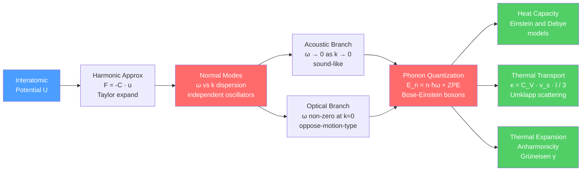

# 🎵 Phonons and Lattice Dynamics

> [!abstract] TL;DR
> Atoms in a crystal vibrate around their equilibrium positions. Under the harmonic approximation these vibrations decompose into independent normal modes — collective waves called phonons. A phonon is the quantum of lattice vibration, exactly as a photon is the quantum of light. Phonons govern thermal properties (heat capacity, thermal expansion) and thermal transport (conductivity), and their interaction with electrons drives superconductivity and electrical resistance.

---

## Intuition

**Analogy:** Imagine a mattress spring — a grid of masses connected by coil springs. If you poke one corner, a wave ripples outward through the entire mattress. Long-wavelength pokes travel like sound waves; short-wavelength wiggles oscillate neighbors against each other. Sound in a solid is literally the long-wavelength limit of these lattice waves.

Zoom into a crystal: every atom is that mass; the interatomic bonds are those springs. The "normal modes" are the independent standing-wave patterns the lattice can ring at. Quantize those waves — just as you quantize the electromagnetic field into photons — and you get **phonons**: discrete packets of vibrational energy each carrying energy $\hbar\omega$ and crystal momentum $\hbar\mathbf{k}$.

---

## How It Works

### Core Mechanics



---

## Key Concepts

### Secondary Level

**Why do solids vibrate?** Atoms in a crystal sit at energy minima of the interatomic potential. A small displacement from equilibrium feels a restoring force, just like a mass on a spring. At any finite temperature, thermal energy kicks atoms away from equilibrium, and they oscillate. In a solid these oscillations are not independent — every atom is coupled to its neighbours — so they travel as waves.

**Sound = long-wavelength phonons.** The speed of sound in a solid is $v_s = \sqrt{E/\rho}$ (Young's modulus / density). This is identical to the group velocity of acoustic phonons in the limit of very small wave vectors: $v_g = d\omega/dk \to a\sqrt{C/m}$ as $k \to 0$.

**Dulong-Petit law (classical).** Every atom in a 3D crystal has 3 degrees of freedom (KE) + 3 (PE) = $3k_B$ of energy on average (equipartition). Total $U = 3Nk_BT$, so $C_V = 3Nk_B \approx 25$ J mol$^{-1}$ K$^{-1}$. This works at high temperature but fails dramatically at low $T$, where quantum effects freeze out high-frequency modes.

### Undergraduate Level

#### Harmonic Approximation

Expand the crystal potential energy in powers of atomic displacements $u_i$ from equilibrium:

$$U \approx U_0 + \frac{1}{2}\sum_{i,j} \Phi_{ij}\, u_i u_j \qquad (\text{harmonic terms only})$$

The force constants $\Phi_{ij} = \partial^2 U/\partial u_i \partial u_j\big|_{\text{eq}}$ play the role of spring constants. This is the harmonic approximation — it gives exact phonon frequencies and ignores anharmonic corrections (which are responsible for thermal expansion and phonon-phonon scattering).

#### 1D Monatomic Chain

For a chain of identical masses $m$ separated by $a$, each connected to its neighbors by spring constant $C$, the dispersion relation is:

$$\boxed{\omega(k) = 2\sqrt{\frac{C}{m}}\,\left|\sin\!\left(\frac{ka}{2}\right)\right|}$$

Key features:
- **First Brillouin zone**: $k \in [-\pi/a,\, \pi/a]$. The dispersion is periodic with period $2\pi/a$.
- **Long-wavelength limit** ($k \to 0$): $\omega \approx a\sqrt{C/m}\,|k|$ — linear, sound-like. Group velocity $v_g = a\sqrt{C/m}$ is constant.
- **Zone boundary** ($k = \pi/a$): $\omega_\text{max} = 2\sqrt{C/m}$; $v_g = d\omega/dk = 0$ — standing wave, no energy transport.

#### 1D Diatomic Chain: Acoustic + Optical Branches

With two masses per unit cell ($M > m$, spring constant $C$, cell length $a$):

$$\omega^2 = C\!\left(\frac{1}{m}+\frac{1}{M}\right) \pm\, C\sqrt{\left(\frac{1}{m}+\frac{1}{M}\right)^{\!2} - \frac{4\sin^2(ka/2)}{mM}}$$

| Branch | $k \to 0$ | $k = \pi/a$ (zone boundary) | Physics |
|--------|-----------|----------------------------|---------|
| **Acoustic** ($-$) | $\omega \to 0$ | $\omega = \sqrt{2C/M}$ | All atoms move in phase; sound |
| **Optical** ($+$) | $\omega = \sqrt{2C(1/m+1/M)}$ | $\omega = \sqrt{2C/m}$ | Neighbours move in antiphase; IR-active |

**Phonon gap** at the zone boundary: frequencies between $\sqrt{2C/M}$ and $\sqrt{2C/m}$ are forbidden. No wave can propagate at these frequencies — they are reflected (Bragg condition).

At $k = 0$ for the optical branch, heavy atoms ($M$) are stationary and light atoms ($m$) vibrate: $\omega_\text{op}(k{=}0) = \sqrt{2C(1/m + 1/M)}$. Because light atoms carry more charge in ionic crystals (e.g., NaCl), this mode couples strongly to infrared light — hence the name "optical."

#### 3D Crystal: Branch Count

A unit cell with $p$ atoms has $3p$ branches:
- **3 acoustic branches**: 1 longitudinal (LA) + 2 transverse (TA). All have $\omega \to 0$ as $k \to 0$.
- **$3p - 3$ optical branches**: start at non-zero frequency at $\mathbf{k} = 0$.

Example: NaCl ($p = 2$) → 3 acoustic + 3 optical = 6 branches. Diamond ($p = 2$) → 6 branches; the LO–TO splitting in diamond is zero by symmetry.

In general 3D, transverse modes have two independent polarizations perpendicular to $\mathbf{k}$; the longitudinal mode polarizes parallel to $\mathbf{k}$. Longitudinal acoustic modes are stiffer (higher velocity) than transverse modes.

#### Phonon as a Quasiparticle

Each normal mode $(n\mathbf{k})$ is an independent quantum harmonic oscillator with energy:

$$E_{n\mathbf{k}} = \left(n_{n\mathbf{k}} + \frac{1}{2}\right)\hbar\omega_{n\mathbf{k}}, \qquad n_{n\mathbf{k}} = 0, 1, 2, \ldots$$

A **phonon** is one quantum of excitation in mode $(n\mathbf{k})$. Phonons:
- Are **bosons** (integer occupation): their mean occupation at temperature $T$ is the Bose-Einstein distribution with $\mu = 0$:

$$\langle n_{n\mathbf{k}}\rangle = \frac{1}{e^{\hbar\omega_{n\mathbf{k}}/k_BT} - 1}$$

- Carry **crystal momentum** $\hbar\mathbf{k}$ (not true mechanical momentum — it differs by a reciprocal lattice vector).
- Can be **created and annihilated**: at higher $T$, more phonons are thermally excited; $\mu = 0$ because phonon number is not conserved (analogous to photons).
- Have **zero-point energy** $\hbar\omega/2$ even at $T = 0$: the crystal still vibrates at absolute zero.

#### Einstein Model

Einstein (1907) assumed all $3N$ modes vibrate at the same frequency $\omega_E$. The heat capacity per oscillator:

$$C_V^\text{Einstein} = 3Nk_B \left(\frac{\hbar\omega_E}{k_BT}\right)^{\!2} \frac{e^{\hbar\omega_E/k_BT}}{\left(e^{\hbar\omega_E/k_BT}-1\right)^2}$$

Define the **Einstein temperature** $\Theta_E = \hbar\omega_E/k_B$:
- $T \gg \Theta_E$: $C_V \to 3Nk_B$ (Dulong-Petit, classical limit).
- $T \ll \Theta_E$: $C_V \propto (\Theta_E/T)^2 e^{-\Theta_E/T}$ — exponential decay, too steep compared to experiment.

#### Debye Model

Debye (1912) assumed a continuous, isotropic medium with linear dispersion $\omega = v_s k$ up to a cutoff frequency $\omega_D$ (the **Debye frequency**), chosen so the total number of modes equals $3N$:

$$\omega_D = v_s\left(6\pi^2 N/V\right)^{1/3}$$

The **Debye temperature** $\Theta_D = \hbar\omega_D/k_B$ is a material constant. The heat capacity:

$$\boxed{C_V^\text{Debye} = 9Nk_B\!\left(\frac{T}{\Theta_D}\right)^{\!3}\!\int_0^{\Theta_D/T}\!\frac{x^4 e^x}{\left(e^x-1\right)^2}\,dx}$$

Limiting behaviour:
- **High T** ($T \gg \Theta_D$): $C_V \to 3Nk_B$ (Dulong-Petit).
- **Low T** ($T \ll \Theta_D$): only acoustic modes are excited; the integral $\to 4\pi^4/15$, giving the **Debye $T^3$ law**:

$$C_V \approx \frac{12\pi^4}{5}\,Nk_B\!\left(\frac{T}{\Theta_D}\right)^{\!3}$$

The $T^3$ law is well confirmed experimentally for insulators. Metals also show a linear-$T$ electronic term at very low temperatures: $C_V = \gamma T + AT^3$.

| Material | $\Theta_D$ (K) | Notes |
|----------|---------------|-------|
| Diamond | 2230 | Stiff C-C bonds, lightest atoms → highest $\Theta_D$ |
| Beryllium | 1440 | Light, stiff metal |
| Silicon | 640 | Semiconductor, covalent |
| Iron | 470 | Transition metal |
| Aluminium | 428 | FCC metal |
| Copper | 343 | Standard benchmark |
| Sodium | 158 | Soft alkali metal |
| Lead | 105 | Heavy, soft → lowest $\Theta_D$ of common metals |

### Graduate Level

#### Thermal Conductivity and Phonon Scattering

From kinetic theory applied to a phonon gas:

$$\kappa = \frac{1}{3} C_V v_s \ell$$

where $\ell$ is the phonon mean free path. The conductivity is limited by scattering mechanisms:

**Normal (N) processes**: $\mathbf{k}_1 + \mathbf{k}_2 = \mathbf{k}_3$. Crystal momentum conserved — phonons redistribute among modes but do not relax the heat current. N-processes alone cannot produce thermal resistance.

**Umklapp (U) processes**: $\mathbf{k}_1 + \mathbf{k}_2 = \mathbf{k}_3 + \mathbf{G}$ where $\mathbf{G}$ is a reciprocal lattice vector. The "flip" from $\mathbf{G}$ reverses the net phonon momentum, creating genuine resistance. Dominant at high $T$.

Temperature regimes:
- **Low T**: $\ell$ limited by sample boundaries and defects (temperature-independent); $C_V \propto T^3$; so $\kappa \propto T^3$.
- **Intermediate T**: $\kappa$ reaches a peak near $\Theta_D/10$.
- **High T** ($T \gtrsim \Theta_D$): U-process rate $\propto n_\text{phonon} \propto T$; $\ell \propto 1/T$; $C_V \approx 3Nk_B$ constant; so $\kappa \propto 1/T$.

Diamond has the highest thermal conductivity of any natural material ($\kappa \approx 2200$ W m$^{-1}$ K$^{-1}$) because of its high $v_s$ and large $\ell$ (light C atoms, very stiff bonds).

**Phonon-defect scattering**: impurities, vacancies, isotope mass fluctuations scatter phonons. The isotope effect on $\kappa$ can be significant: isotopically pure $^{12}$C diamond has $\kappa \approx 41\%$ higher than natural diamond.

#### Anharmonicity and Thermal Expansion

The harmonic approximation predicts zero thermal expansion — the average displacement $\langle u \rangle = 0$ by symmetry because the harmonic potential is symmetric about equilibrium. Real solids expand because the interatomic potential is **asymmetric** (cubic anharmonic term): atoms can sample larger average separations at higher energy.

Define the **Grüneisen parameter** (mode-averaged):

$$\gamma = -\frac{d\ln\omega}{d\ln V} = -\frac{V}{\omega}\frac{\partial\omega}{\partial V}$$

It measures how phonon frequencies shift with volume. For most materials $\gamma \approx 1$–$3$. The linear thermal expansion coefficient:

$$\alpha = \frac{\gamma C_V}{3BV}$$

where $B$ is the bulk modulus and $V$ is volume. Materials with $\gamma > 0$ expand on heating (typical). Materials with negative $\gamma$ modes exhibit **negative thermal expansion** (e.g., ZrW$_2$O$_8$, certain metal-organic frameworks) — useful in precision optics and electronics packaging.

Anharmonicity also gives phonon-phonon scattering via Umklapp processes, the phonon lifetime $\tau \propto 1/T$ at high $T$, and the renormalization of phonon frequencies with temperature (phonon softening near structural phase transitions).

---

## Python Demo

```python
import numpy as np
import matplotlib.pyplot as plt
from scipy.integrate import quad

# ============================================================
# Demo: 1D diatomic phonon dispersion + heat capacity models
# ============================================================

# --- 1D Diatomic Chain parameters ---
C_spring = 1.0   # normalized spring constant
M_heavy  = 2.0   # heavy atom mass (normalized)
m_light  = 1.0   # light atom mass (normalized)
a        = 1.0   # unit-cell lattice constant

k_vals = np.linspace(-np.pi / a, np.pi / a, 600)
sin2   = np.sin(k_vals * a / 2) ** 2

# Dispersion: ω² = C(1/m + 1/M) ± C·√[(1/m+1/M)² - 4sin²(ka/2)/(mM)]
base = C_spring * (1 / m_light + 1 / M_heavy)
disc = C_spring * np.sqrt(
    np.maximum((1 / m_light + 1 / M_heavy) ** 2 - 4 * sin2 / (m_light * M_heavy), 0.0)
)
omega_ac = np.sqrt(np.maximum(base - disc, 0.0))
omega_op = np.sqrt(np.maximum(base + disc, 0.0))

omega_ac_max = np.sqrt(2 * C_spring / M_heavy)   # acoustic top at zone boundary
omega_op_min = np.sqrt(2 * C_spring / m_light)    # optical bottom at zone boundary

# --- Heat capacity models (C_V per Nk_B) ---
def cv_einstein(T_arr, theta_E):
    x = theta_E / T_arr
    with np.errstate(over="ignore", invalid="ignore"):
        cv = 3.0 * x**2 * np.exp(x) / (np.exp(x) - 1.0) ** 2
    return np.where(T_arr > 0, cv, 0.0)

def _debye_integrand(t):
    if t > 500.0:
        return 0.0
    return t**4 * np.exp(t) / (np.exp(t) - 1.0) ** 2

def cv_debye(T_arr, theta_D):
    result = np.zeros_like(T_arr, dtype=float)
    for i, T in enumerate(T_arr):
        upper    = min(theta_D / T, 500.0)
        integral, _ = quad(_debye_integrand, 0.0, upper)
        result[i] = 9.0 * (T / theta_D) ** 3 * integral
    return result

theta_D = 343.0           # Debye temperature for Cu (K)
theta_E = 0.75 * theta_D  # empirical Einstein temperature

T_range = np.linspace(5.0, 700.0, 300)
cv_E    = cv_einstein(T_range, theta_E)
cv_D    = cv_debye(T_range, theta_D)

# --- Plot ---
fig, axes = plt.subplots(1, 2, figsize=(12, 5))

ax = axes[0]
ax.plot(k_vals, omega_ac, "b-", lw=2, label="Acoustic branch")
ax.plot(k_vals, omega_op, "r-", lw=2, label="Optical branch")
ax.fill_between(
    [k_vals[0], k_vals[-1]], omega_ac_max, omega_op_min,
    color="green", alpha=0.13, label="Phonon gap"
)
ax.axhline(omega_ac_max, color="b", ls=":", lw=1.1, alpha=0.6)
ax.axhline(omega_op_min, color="r", ls=":", lw=1.1, alpha=0.6)
ax.axvline( np.pi / a, color="gray", ls="--", lw=1.2, alpha=0.55, label="Zone boundary")
ax.axvline(-np.pi / a, color="gray", ls="--", lw=1.2, alpha=0.55)
ax.set_xlabel("Wave vector k  (units of 1/a)")
ax.set_ylabel("Angular frequency ω  (normalized)")
ax.set_title("1D Diatomic Chain — Phonon Dispersion\nM=2, m=1; acoustic + optical branches")
ax.legend(fontsize=8)
ax.set_xlim(-np.pi / a, np.pi / a)

ax2 = axes[1]
ax2.plot(T_range, cv_E, "r-", lw=2, label=f"Einstein  (θ_E = {theta_E:.0f} K)")
ax2.plot(T_range, cv_D, "b-", lw=2, label=f"Debye   (Θ_D = {theta_D:.0f} K, Cu)")
ax2.axhline(3.0, color="gray", ls="--", lw=1.5, label="Dulong-Petit  = 3Nk_B")
ax2.set_xlabel("Temperature T  (K)")
ax2.set_ylabel("C_V / Nk_B")
ax2.set_title("Heat Capacity: Einstein vs Debye\nDebye parameters for Cu")
ax2.legend(fontsize=9)
ax2.set_xlim(0, 700)
ax2.set_ylim(0, 3.4)

plt.tight_layout()
plt.savefig("phonon_dispersion_heat_capacity.png", dpi=120, bbox_inches="tight")
plt.show()

# Summary
print("Phonon gap at zone boundary:")
print(f"  Acoustic top  ω = {omega_ac_max:.4f}")
print(f"  Optical bottom ω = {omega_op_min:.4f}")
print(f"\n  C_V / Nk_B at key temperatures (Cu parameters):")
for T in [theta_D / 10, theta_D / 3, theta_D, 3 * theta_D]:
    e_val = cv_einstein(np.array([T]), theta_E)[0]
    d_val = cv_debye(np.array([T]), theta_D)[0]
    print(f"  T = {T:6.1f} K  ({T/theta_D:.2f}·Θ_D):  Einstein = {e_val:.3f},  Debye = {d_val:.3f}")
```

The two panels show: **(left)** the acoustic and optical branches of a diatomic chain with the forbidden gap at the zone boundary; **(right)** how Einstein and Debye heat capacities converge to Dulong-Petit at high $T$ but diverge at low $T$ — Debye's $T^3$ law fits real data far better than Einstein's exponential suppression.

---

## Real-World Applications

> **Thermal management in CPUs.** Silicon's phonon mean free path at room temperature is $\ell \sim 300$ nm. As transistor features shrink below $\ell$, phonons scatter from boundaries before equilibrating — "phonon boundary scattering" regime. This is why nano-structured thermoelectrics can have dramatically reduced $\kappa$ while maintaining electrical conductivity: grain boundaries and nanowire surfaces scatter phonons (long mean free path) more effectively than electrons (short mean free path).

> **Thermoelectrics (TE).** A good TE material needs high $\sigma$ (electrical conductivity), high Seebeck coefficient $S$, but low $\kappa$. Phonon engineering — nanostructuring, alloying (mass-disorder scattering), rattler atoms (Einstein-like localized modes in cage structures, e.g., skutterudites) — reduces $\kappa$ without degrading $\sigma$. PbTe alloys and half-Heusler compounds achieve $ZT > 1$ partly through optimized phonon scattering.

> **Superconductivity.** In conventional (BCS) superconductors, the attractive electron-electron interaction that forms Cooper pairs is mediated by phonon exchange: one electron emits a virtual phonon, the second absorbs it. The coupling constant $\lambda_\text{ep}$ integrates over the phonon density of states weighted by the electron-phonon matrix element. High phonon frequencies (high $\Theta_D$) raise $T_c$; isotope substitution shifts $T_c$ as $T_c \propto M^{-1/2}$ (isotope effect) — the key experimental proof of the BCS phonon mechanism.

> **Inelastic neutron scattering (INS).** Thermal neutrons have wavelengths $\sim 1$ Å and energies $\sim 10$–100 meV — perfectly matched to phonon wavelengths and energies. INS directly measures the phonon dispersion $\omega(\mathbf{k})$ across the full Brillouin zone. Phonon softening (a mode whose $\omega \to 0$) signals an approaching structural (ferroelectric or martensitic) phase transition.

---

## Common Pitfalls

- **Crystal momentum $\hbar\mathbf{k}$ is not mechanical momentum.** Phonons carry pseudo-momentum: in a U-process, $\hbar\mathbf{G}$ is absorbed by the lattice as a whole, so total phonon momentum is not conserved. Confusion between crystal momentum and real momentum leads to errors in scattering selection rules.

- **Einstein model fails at low T.** The exponential tail $e^{-\Theta_E/T}$ vanishes far too fast. Real solids always have low-frequency acoustic phonons ($\omega \propto k$) that give $C_V \propto T^3$. The Einstein model is only accurate near the peak and above.

- **Debye model is also approximate.** Real phonon dispersions are not simply linear. The Debye model works because $C_V$ is dominated by acoustic modes at low $T$ and all modes at high $T$ (where details cancel). It gives poor predictions for the phonon density of states shape or for optical-mode contributions.

- **Harmonic approximation ignores thermal expansion.** A purely harmonic crystal has $\alpha = 0$ and infinite thermal conductivity. Any real calculation of $\kappa$ or $\alpha$ must include anharmonic corrections — at minimum the cubic term in the potential energy.

- **Phonon momentum vs photon momentum.** Phonons are not infrared-active unless they are at $\mathbf{k} \approx 0$ because the photon momentum $\hbar\omega/c$ is negligible compared to the Brillouin zone size. Only zone-centre optical modes couple to infrared radiation (selection rule: ionic displacement must have a dipole moment).

- **Negative thermal expansion is unusual but real.** Most materials expand because the cubic anharmonic term dominates. In framework structures like ZrW$_2$O$_8$, transverse (rocking) phonon modes have a negative Grüneisen parameter and can dominate, giving overall contraction on heating over a wide temperature range.

---

## Related Concepts

- [[Quantum_Statistical_Mechanics]] — Bose-Einstein distribution governs phonon occupation; Debye and Einstein models are applications of quantum statistics to a boson gas with $\mu = 0$
- [[Laws_of_Thermodynamics]] — heat capacity connects to the second law via entropy $S = \int C_V/T\,dT$; third law requires $C_V \to 0$ as $T \to 0$, satisfied by quantum phonon models but not by Dulong-Petit
- [[Wave_Motion_and_Properties]] — phonons are quantized wave packets; group velocity, dispersion, and standing waves are all classical wave concepts inherited by phonon physics
- [[Crystal_Structure_and_Band_Theory]] — phonons scatter electrons at the Fermi surface (electron-phonon coupling), giving electrical resistance; the Brillouin zone is shared between electron bands and phonon dispersion
- [[Quantum_Harmonic_Oscillator]] — each phonon mode is exactly a QHO; the ladder operators $\hat{a}^\dagger, \hat{a}$ create and destroy phonons; the energy spectrum $(n+\tfrac{1}{2})\hbar\omega$ is the direct result
- [[Oscillations_and_SHM]] — the classical foundation: normal modes of coupled oscillators are the precursor to phonons
- [[Superconductivity]] — BCS theory relies on phonon-mediated electron-electron attraction; high $\Theta_D$ and strong electron-phonon coupling favour higher $T_c$; the isotope effect $T_c \propto M^{-1/2}$ is direct phonon evidence
- [[Electronic_Band_Structure]] — (planned) band structure and phonon dispersion coexist in the Brillouin zone; avoided crossings produce phonon branches and band gaps by the same Bragg-reflection mechanism
- [[Thermal_Properties_and_Heat_Conduction]] — (planned) phonon mean free path, Umklapp processes, and the $\kappa \propto 1/T$ high-temperature regime are the microscopic basis of all thermal transport
- [[Superconductivity_and_BCS_Theory]] — (planned) detailed derivation of the phonon-mediated pairing interaction, Eliashberg spectral function, and isotope effect
- [[_MOC_Crystal_Structure_and_Bonding]] — section map for the Materials Science vault
- [[_MOC_Physics_Master]] — cross-vault: parent MOC in Physics vault

---

## Review Questions

1. **(Conceptual — Secondary/Undergraduate)** A 1D monatomic chain and a 1D diatomic chain both have the same lattice constant $a$ and spring constant $C$. The diatomic chain has masses $M = 2m$. Sketch the dispersion $\omega(k)$ for both. Where does the diatomic chain develop a gap, and why? What happens to the gap width as $M \to m$?

2. **(Scenario — Undergraduate/Graduate)** You are designing a thermoelectric material for waste heat recovery at $T = 500$ K. The Debye temperature of your candidate material is $\Theta_D = 200$ K. (a) Is the classical Dulong-Petit limit a good approximation for $C_V$ at this temperature? (b) Is the Debye $T^3$ law valid? (c) What scattering mechanism dominates the phonon mean free path $\ell$ at 500 K, and how would you reduce it to lower thermal conductivity without affecting electronic properties?

3. **(Trade-off — Graduate)** Compare the Einstein and Debye models: where does each succeed and fail? Why does the Debye model correctly predict the $T^3$ law but the Einstein model does not? Derive the low-temperature behaviour of $C_V$ in both models from first principles, and explain why the existence of low-frequency acoustic modes is the key physical difference.

---

## Sources

- [Kittel, C. — *Introduction to Solid State Physics*, 8th ed., Wiley (2005), Chapters 4–5](https://www.wiley.com/en-us/Introduction+to+Solid+State+Physics%2C+8th+Edition-p-9780471415268)
- [Ashcroft, N. W. & Mermin, N. D. — *Solid State Physics*, Holt-Saunders (1976), Chapters 22–26](https://www.cengage.com/c/solid-state-physics-1e-ashcroft/)
- [Debye, P. — "Zur Theorie der spezifischen Wärmen," *Annalen der Physik* 39, 789 (1912)](https://doi.org/10.1002/andp.19123441404)
- [Einstein, A. — "Die Plancksche Theorie der Strahlung und die Theorie der spezifischen Wärme," *Annalen der Physik* 22, 180 (1907)](https://doi.org/10.1002/andp.19063270110)
- [Dove, M. T. — *Introduction to Lattice Dynamics*, Cambridge University Press (1993)](https://www.cambridge.org/core/books/introduction-to-lattice-dynamics/AED4C7C4FBACCA8F40D8CE59A4E5D05E)

---

#MaterialsScience #Phonons #LatticeDynamics #ThermalProperties #DebyeModel #EinsteinModel #CondensedMatter #StatisticalMechanics #CrystalStructure
