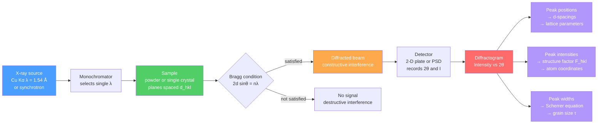

# 🔬 X-Ray Diffraction and Bragg's Law

> [!abstract] TL;DR
> X-ray diffraction (XRD) exploits the fact that crystal planes act as natural diffraction gratings for X-rays — constructive interference occurs only at angles satisfying **Bragg's law** $2d_{hkl}\sin\theta = n\lambda$ — to decode atomic structure, phase identity, crystallite size, residual strain, and atom coordinates from a single diffractogram.

---

## Intuition

**Analogy:** Imagine shouting at a cliff face and listening for an echo. You only hear a clear echo when you are the right distance away — the reflected sound arrives back perfectly in phase with your next shout. Shout at the wrong distance and the echoes arrive randomly and cancel. Crystal planes do exactly the same thing for X-rays: each plane reflects a fraction of the beam, and you only get a strong signal when the path-length difference between reflections off successive planes is an exact whole number of wavelengths.

The wavelength of X-rays (0.5–2.5 Å) is comparable to interatomic spacings (1–4 Å). That coincidence is not exploited by accident — it means the crystal lattice is a perfect natural diffraction grating, and each set of planes $(hkl)$ will "answer" at a specific angle that reveals its spacing.

---

## How It Works

### Core Mechanics — Bragg's Law

Consider two parallel crystal planes of the set $(hkl)$, separated by interplanar spacing $d_{hkl}$. A monochromatic X-ray beam strikes both planes at **glancing angle** $\theta$ (measured from the plane, not the normal). The beam reflected from the second plane travels an extra path of $2d_{hkl}\sin\theta$. For constructive interference this path difference must equal an integer multiple of the wavelength $\lambda$:

$$\boxed{2d_{hkl}\sin\theta = n\lambda}$$

In practice, $n = 1$ is absorbed into $d$: the $n$th-order reflection from planes of spacing $d$ is treated as a first-order reflection from fictitious planes of spacing $d/n$. The three parameters are independently adjustable:

| Parameter | Controls |
|-----------|---------|
| $\lambda$ | fixed by X-ray source (Cu K$\alpha$ = 1.5406 Å) |
| $d_{hkl}$ | encodes unit-cell geometry via $d_{hkl} = a/\sqrt{h^2+k^2+l^2}$ (cubic) |
| $\theta$ | the measured diffraction angle; $2\theta$ is recorded by detector |

### Structure Factor and Extinction Rules

Bragg's law tells you *where* peaks can occur; the **structure factor** $F_{hkl}$ tells you *whether* a peak actually has nonzero intensity:

$$F_{hkl} = \sum_{j=1}^{N} f_j \exp\!\bigl[2\pi i\,(hx_j + ky_j + lz_j)\bigr]$$

where $f_j$ is the **atomic scattering factor** of atom $j$ (proportional to atomic number $Z$ at small angles) and $(x_j, y_j, z_j)$ are its fractional coordinates in the unit cell. The peak intensity is proportional to $|F_{hkl}|^2$.

**BCC lattice** — motif at $(0,0,0)$ and $(\tfrac{1}{2},\tfrac{1}{2},\tfrac{1}{2})$:

$$F_{hkl} = f\bigl[1 + e^{i\pi(h+k+l)}\bigr] = \begin{cases} 2f & h+k+l \text{ even} \\ 0 & h+k+l \text{ odd} \end{cases}$$

**FCC lattice** — motif at $(0,0,0)$, $(\tfrac{1}{2},\tfrac{1}{2},0)$, $(\tfrac{1}{2},0,\tfrac{1}{2})$, $(0,\tfrac{1}{2},\tfrac{1}{2})$:

$$F_{hkl} = f\bigl[1 + e^{i\pi(h+k)} + e^{i\pi(h+l)} + e^{i\pi(k+l)}\bigr] = \begin{cases} 4f & h,k,l \text{ all odd or all even} \\ 0 & \text{mixed parities} \end{cases}$$

These **systematic absences** are powerful fingerprints: a diffractogram showing the sequence $2\theta$ positions consistent with $(111), (200), (220), (311), \ldots$ but missing $(100), (110), (210), \ldots$ uniquely identifies an FCC arrangement.

### Powder Diffraction — Debye-Scherrer Method

In a **powder** (polycrystalline) sample, crystallites are randomly oriented. For any $(hkl)$, some fraction of crystallites will be correctly oriented to satisfy Bragg's law. Because all orientations are equally probable, the diffracted beams form **cones** around the incident beam. A flat detector intercepts these cones as concentric **Debye rings** (arcs). A 1-D detector swept in $2\theta$ converts the cones to a **diffractogram**: a plot of intensity versus $2\theta$.

Peak positions give $d_{hkl}$ values; the set of $d_{hkl}$ uniquely identifies the phase (matched against the ICDD Powder Diffraction File database). Peak intensities encode atom positions; peak widths encode crystallite size and strain.

### Scherrer Equation — Grain Size from Peak Width

A finite crystallite of size $\tau$ produces a broadened diffraction peak. The **Scherrer equation** relates peak broadening to grain size:

$$\boxed{\tau = \frac{K\lambda}{\beta\cos\theta}}$$

where:
- $\tau$ is the **mean crystallite size** (not grain size — coherently diffracting domain)
- $K \approx 0.9$ is the **shape factor** (spherical crystallites; varies 0.62–2.08 by shape)
- $\beta$ is the **integral breadth** or FWHM of the peak in radians, **after** subtracting the instrumental broadening in quadrature: $\beta^2 = \beta_\text{meas}^2 - \beta_\text{inst}^2$
- $\theta$ is the Bragg angle

The Scherrer equation is valid for $\tau < 200$ nm. Above that, broadening from finite size becomes smaller than instrumental resolution. Broadening from **microstrain** $\varepsilon$ follows $\beta_\text{strain} = 4\varepsilon\tan\theta$, enabling the **Williamson-Hall plot** ($\beta\cos\theta$ vs $\sin\theta$) to separate size and strain contributions.

### Reciprocal Lattice and Ewald Sphere

The reciprocal lattice provides an elegant geometric picture of when diffraction occurs. For a real-space lattice with primitive vectors $\mathbf{a}, \mathbf{b}, \mathbf{c}$ (volume $V = \mathbf{a}\cdot(\mathbf{b}\times\mathbf{c})$), the reciprocal lattice vectors are:

$$\mathbf{a}^* = \frac{\mathbf{b}\times\mathbf{c}}{V},\quad \mathbf{b}^* = \frac{\mathbf{c}\times\mathbf{a}}{V},\quad \mathbf{c}^* = \frac{\mathbf{a}\times\mathbf{b}}{V}$$

Reciprocal lattice point $\mathbf{G}_{hkl} = h\mathbf{a}^* + k\mathbf{b}^* + l\mathbf{c}^*$ has magnitude $|\mathbf{G}_{hkl}| = 1/d_{hkl}$.

**Ewald sphere construction:** Draw a sphere of radius $1/\lambda$ centred such that the origin of reciprocal space lies on the sphere surface along the incident beam direction. Diffraction from $(hkl)$ occurs whenever the reciprocal lattice point $G_{hkl}$ lies exactly on the sphere surface — this is geometrically equivalent to Bragg's law. The construction makes immediately visible why a monochromatic beam diffracts only from a subset of planes (only those whose reciprocal lattice points touch the sphere), while a white beam (Laue method) gives simultaneous diffraction from many planes.

### XRD Methods Compared

| Method | Sample | Beam | Output | Best for |
|--------|--------|------|--------|---------|
| **Powder / Debye-Scherrer** | polycrystal, powder | monochromatic | 1-D diffractogram | phase ID, lattice parameters, grain size |
| **Laue** | single crystal, fixed | white (broad $\lambda$) | spot pattern on flat film | crystal orientation, symmetry determination |
| **Rotating crystal** | single crystal, rotated | monochromatic | layer lines on cylinder film | unit-cell dimensions, full reciprocal lattice mapping |
| **Neutron diffraction** | powder or crystal | monochromatic neutrons | diffractogram | light elements (H, Li), magnetic structures |
| **Electron diffraction (SAED/CBED)** | TEM thin foil | electron beam | spot/ring/disc pattern | nanoscale phase ID, local crystal orientation |
| **Synchrotron XRD** | any | tuneable, brilliant | ultra-high resolution | in-situ studies, anomalous scattering, thin films |

### Flow — From X-ray Beam to Structural Result



---

## Key Concepts

### Secondary

X-rays are very short-wavelength light — so short that the gaps between atoms in a crystal act like the slits in a diffraction grating. Shine X-rays at a crystal from different angles and at a few specific "magic" angles you get a bright reflected beam. Those magic angles — given by Bragg's law — are different for every material because each material's atoms are packed in their own unique arrangement. This is why XRD is used like a fingerprint: match the pattern of bright spots to a database entry and identify the material.

### Undergraduate

The interplanar spacing $d_{hkl}$ in a cubic crystal is $a/\sqrt{h^2+k^2+l^2}$, where $a$ is the lattice parameter and $(hkl)$ are Miller indices. Bragg's law $2d\sin\theta = \lambda$ then predicts all peak positions. Not all $(hkl)$ reflections appear: the structure factor $F_{hkl}$ vanishes for certain combinations due to destructive interference between atoms within the unit cell — this gives systematic absences that fingerprint the lattice type (BCC: absent when $h+k+l$ odd; FCC: absent when indices are mixed parity). In a powder diffractogram, peak intensity also depends on the multiplicity (number of equivalent planes), the Lorentz-polarization factor, and absorption.

The Scherrer equation $\tau = K\lambda/(\beta\cos\theta)$ extracts mean crystallite size from peak FWHM. It is valid only when broadening is dominated by finite crystallite size rather than strain; the Williamson-Hall method disentangles the two.

### Graduate

The **structure factor** $F_{hkl} = \sum_j f_j e^{2\pi i(\mathbf{G}_{hkl}\cdot\mathbf{r}_j)}$ is the Fourier component of the electron-density distribution at reciprocal lattice vector $\mathbf{G}_{hkl}$. The complete electron density is recovered by inverse Fourier transform: $\rho(\mathbf{r}) = (1/V)\sum_{hkl} F_{hkl}\,e^{-2\pi i\mathbf{G}_{hkl}\cdot\mathbf{r}}$. The **phase problem** arises because detectors record only $|F_{hkl}|^2$, losing the phases; it is solved by direct methods, Patterson synthesis, or heavy-atom/anomalous dispersion methods.

**Rietveld refinement** fits the entire powder diffractogram — peak positions, intensities, shapes, and background — by least-squares adjustment of structural parameters (atom positions, thermal parameters, site occupancies) plus instrumental parameters. It converts a 1-D powder pattern into a full crystal structure solution. The goodness-of-fit is assessed by the weighted profile R-factor $R_{wp}$.

**Residual strain** shifts peak positions by $\delta(2\theta)$, giving lattice strain $\varepsilon = -\cot\theta\,\delta\theta$. In thin-film XRD, the $\sin^2\psi$ method measures strain as a function of tilt angle $\psi$ to separate biaxial stress components, enabling non-destructive stress mapping in engineering components.

**Anomalous (resonant) scattering** — available at synchrotrons — tunes the X-ray energy near an absorption edge of a specific element, changing $f_j$ dramatically and enabling element-selective contrast that resolves the phase problem in protein crystallography (MAD/SAD phasing).

---

## Python Demo

```python
import numpy as np
import matplotlib.pyplot as plt

# === Simulated powder XRD pattern for FCC Aluminum ===
# Lattice parameter: a = 4.0495 Å (room temperature)
# Radiation: Cu Kα, λ = 1.5406 Å (most common lab source)

a = 4.0495       # Al lattice parameter, Angstroms
lam = 1.5406     # Cu Kα wavelength, Angstroms

def fcc_allowed(h, k, l):
    """FCC extinction rule: h,k,l must be ALL odd or ALL even (0 is even)."""
    parities = {h % 2, k % 2, l % 2}
    return len(parities) == 1

def d_cubic(h, k, l, a):
    """Interplanar spacing for a cubic lattice."""
    return a / np.sqrt(h**2 + k**2 + l**2)

def cubic_multiplicity(h, k, l):
    """Powder multiplicity — number of symmetry-equivalent planes in cubic system."""
    s = sorted([abs(h), abs(k), abs(l)])
    if s[0] == 0 and s[1] == 0:         # {h00}: 6 faces
        return 6
    elif s[0] == 0 and s[1] == s[2]:    # {hh0}: 12
        return 12
    elif s[0] == 0:                      # {hk0}, h != k: 24
        return 24
    elif s[0] == s[1] == s[2]:           # {hhh}: 8
        return 8
    elif s[0] == s[1] or s[1] == s[2]:  # {hhl}: 24
        return 24
    else:                                # {hkl} all different: 48
        return 48

# ── Generate all FCC-allowed reflections up to 2θ = 120° ──────────────────────
peaks = []
for h in range(0, 9):
    for k in range(0, h + 1):
        for l in range(0, k + 1):
            if h == k == l == 0:
                continue
            if not fcc_allowed(h, k, l):
                continue
            d = d_cubic(h, k, l, a)
            sin_th = lam / (2.0 * d)
            if sin_th > 1.0:
                continue
            theta_rad = np.arcsin(sin_th)
            two_theta = np.degrees(2 * theta_rad)
            if two_theta > 120.0:
                continue
            mult = cubic_multiplicity(h, k, l)
            # Lorentz-polarization factor: LP = (1 + cos²2θ) / (sin²θ · cosθ)
            two_theta_rad = 2 * theta_rad
            lp = (1 + np.cos(two_theta_rad)**2) / (np.sin(theta_rad)**2 * np.cos(theta_rad))
            # Relative intensity (single-element: |F|² = 16f² for all allowed FCC peaks)
            intensity = mult * lp
            peaks.append({'two_theta': two_theta, 'hkl': (h, k, l),
                          'd': d, 'mult': mult, 'intensity': intensity})

peaks.sort(key=lambda p: p['two_theta'])

# Normalize to strongest peak = 1.0
max_I = max(p['intensity'] for p in peaks)
for p in peaks:
    p['intensity'] /= max_I

# ── Build continuous pattern: sum of Gaussians ────────────────────────────────
tt_axis = np.linspace(20.0, 120.0, 10000)
pattern = np.zeros_like(tt_axis)
sigma = 0.12   # controls peak sharpness (simulate well-crystallised sample)

for p in peaks:
    pattern += p['intensity'] * np.exp(-0.5 * ((tt_axis - p['two_theta']) / sigma)**2)

pattern = pattern / pattern.max() * 100   # rescale so tallest peak = 100

# ── Plot ───────────────────────────────────────────────────────────────────────
fig, ax = plt.subplots(figsize=(14, 5))
ax.plot(tt_axis, pattern, color='steelblue', linewidth=1.0)
ax.fill_between(tt_axis, pattern, alpha=0.20, color='steelblue')

for p in peaks:
    hkl_str = ''.join(str(i) for i in p['hkl'])
    y_tip = p['intensity'] * 100
    ax.text(p['two_theta'], y_tip + 3, hkl_str,
            ha='center', va='bottom', fontsize=8, color='firebrick', rotation=0)
    ax.axvline(x=p['two_theta'], color='firebrick', alpha=0.20,
               linestyle='--', linewidth=0.6)

ax.set_xlabel('2θ (degrees)', fontsize=12)
ax.set_ylabel('Relative Intensity', fontsize=12)
ax.set_title('Simulated Powder XRD — FCC Aluminum  (Cu Kα, λ = 1.5406 Å)', fontsize=13)
ax.set_xlim(20, 120)
ax.set_ylim(0, 120)
ax.grid(True, alpha=0.25, linestyle='--')
plt.tight_layout()
plt.savefig('al_xrd_pattern.png', dpi=150, bbox_inches='tight')
plt.show()

# ── Print peak table ──────────────────────────────────────────────────────────
print(f"\n{'hkl':>5}  {'2θ (°)':>8}  {'d (Å)':>7}  {'mult':>5}  {'I_rel':>7}")
print("-" * 44)
for p in peaks:
    hkl_str = ''.join(str(i) for i in p['hkl'])
    print(f"{hkl_str:>5}  {p['two_theta']:>8.3f}  {p['d']:>7.4f}"
          f"  {p['mult']:>5}  {p['intensity']:>7.4f}")
```

Expected output (first six lines):

```
  hkl   2θ (°)   d (Å)  mult    I_rel
--------------------------------------------
  111   38.473   2.3380      8   1.0000
  200   44.738   2.0248      6   0.4523
  220   65.133   1.4317     12   0.2871
  311   78.230   1.2210     24   0.2994
  222   82.443   1.1690      8   0.0638
  400   99.080   1.0124      6   0.0801
```

The (111) peak is strongest in Al because it has the highest multiplicity combined with a favourable Lorentz-polarization factor at that angle. The (222) reflection is anomalously weak — a near-extinction caused by cancellation between even-order structure-factor terms for aluminium.

---

## Real-World Applications

> **Phase identification:** The ICDD (International Centre for Diffraction Data) Powder Diffraction File contains over 1 million reference patterns. A 5-minute lab XRD scan on a corroded steel coupon identifies rust phases (goethite, maghemite, magnetite) that take hours to separate chemically.

> **Rietveld refinement — battery materials:** In lithium-ion research, synchrotron XRD is collected *operando* (cell cycling inside the beam) with sub-second time resolution. Rietveld refinement at each frame tracks lattice parameter evolution during Li intercalation, revealing phase boundaries, solid-solution regions, and degradation mechanisms in LiFePO₄ or NMC cathodes.

> **Residual stress in engineering:** Aircraft turbine blades are shot-peened to introduce compressive residual stress that delays fatigue crack nucleation. Lab XRD with the $\sin^2\psi$ method maps that stress non-destructively, verifying manufacturing compliance to within ±10 MPa.

> **Grain size in nanoparticles:** Semiconductor quantum dots (CdSe, ZnO) are characterised by Scherrer analysis: a powder diffractogram of the nanoparticles gives grain sizes of 3–20 nm, correlated with photoluminescence emission wavelength to validate quantum confinement models.

> **Protein crystallography:** Synchrotron beamlines (APS, ESRF, SPring-8) routinely solve protein structures to 1–2 Å resolution from crystals smaller than 0.05 mm. MAD phasing using anomalous scattering near a Se K-edge (incorporated via selenomethionine labelling) solves the phase problem without a prior model.

---

## Trade-offs

| Aspect | Pro | Con |
|--------|-----|-----|
| **Phase ID** | Rapid, non-destructive, database-matched | Amorphous phases give no peaks; detection limit ~3–5 wt% for minor phases |
| **Powder vs single crystal** | Powder needs no large crystal; easy sample prep | Loss of 3-D reciprocal-space information; overlap of peaks with similar $d$ |
| **Lab vs synchrotron** | Lab diffractometer: in-house, cheap, routine | Synchrotron: 10⁶× more brilliant, but requires beamtime scheduling and travel |
| **Grain size (Scherrer)** | Quick estimate from existing diffractogram | Cannot separate size from microstrain without Williamson-Hall or Warren-Averbach analysis |
| **Neutron diffraction** | Sensitive to light elements (H, D, Li); sees magnetic order | Low flux, requires reactor or spallation source, large sample needed |

---

## When to Use vs Avoid

**Use when:**
- Identifying unknown crystalline phases in a bulk or powder sample
- Measuring lattice parameters to ±0.001 Å precision (for thermal expansion, alloying effects)
- Estimating crystallite size in nanoparticles or thin films via Scherrer equation
- Determining crystal structure (atom positions) by Rietveld refinement or single-crystal analysis
- Mapping residual stress distributions non-destructively in engineering parts
- Tracking structural changes in real time during synthesis, heating, or electrochemical cycling

**Avoid when:**
- The sample is amorphous — XRD gives only a broad hump, not sharp peaks
- You need elemental composition (use EDS, XRF, or ICP instead)
- The phase of interest is below ~3 wt% and buried under stronger peaks (use synchrotron or neutron for trace phases)
- Grain sizes exceed ~200 nm — Scherrer broadening is below instrumental resolution; use EBSD or TEM instead
- You need short-range order on the 1–10 Å scale without long-range periodicity (use pair distribution function / PDF analysis from total scattering)

---

## Common Pitfalls

- **Preferred orientation (texture)** — If crystallites are not truly random, peak intensities deviate from database values. Platelet minerals like mica or graphite always show strong preferred orientation in pressed pellets. Solution: use a spinner, back-load the sample, or measure multiple orientations.
- **Confusing glancing angle θ with incidence angle** — Bragg's law uses the glancing angle (angle from the plane surface), not the incidence angle from the normal. They are complements: $\theta_\text{Bragg} = 90° - \theta_\text{incidence}$. Misidentifying which angle is which shifts every $d_{hkl}$ calculation.
- **Forgetting instrumental broadening in Scherrer analysis** — Plugging raw FWHM into $\tau = K\lambda/(\beta\cos\theta)$ without subtracting $\beta_\text{inst}$ overestimates broadening and underestimates grain size. Always calibrate with a LaB₆ or Si standard.
- **Peak overlap at high $2\theta$** — Peaks crowd together as $2\theta$ increases. Fitting overlapping peaks as a single broad peak inflates the apparent FWHM and makes grains look smaller than they are. Use profile-fitting software (TOPAS, HighScore Plus) for deconvolution.
- **Fluorescence background** — If the sample contains Fe and you use Cu K$\alpha$ radiation, iron fluoresces strongly (Cu K$\alpha$ energy is just above the Fe K absorption edge), raising the background dramatically and degrading signal-to-noise. Switch to Co K$\alpha$ or Mo K$\alpha$ radiation, or use an energy-discriminating detector.
- **Ignoring the phase problem** — The diffractogram gives $|F_{hkl}|^2$ but not the phase of $F_{hkl}$. For new structures, direct methods or anomalous dispersion are required. Naively assuming phases are all zero gives a wrong electron density via inverse Fourier transform.

---

## Related Concepts

- [[Crystal_Systems_and_Symmetry]] — defines the 7 crystal systems and 14 Bravais lattices whose geometry determines $d_{hkl}$ values and thus peak positions
- [[Solid_State_and_Crystal_Structures]] — covers unit-cell geometry, close packing, and ionic structures whose atomic coordinates feed the structure-factor calculation
- [[Electromagnetic_Waves_and_Radiation]] — X-rays are EM radiation; synchrotron emission is the relativistic Larmor-radiation limit of circular-orbit acceleration
- [[Interference_and_Diffraction]] — the wave-optics foundation of constructive and destructive interference that underlies Bragg's law
- [[Crystal_Structure_and_Band_Theory]] — the band structure of a solid is computed in reciprocal space, the same space that XRD probes directly via the Ewald sphere
- [[Mineral_Properties_and_Identification]] — XRD is the gold-standard instrument confirmation after preliminary field identification of minerals
- [[Crystal_Systems_and_Space_Groups]] — space group symmetry generates systematic absences beyond those of the lattice type alone; required for full structure determination
- [[Electronic_Band_Structure]] — band structure is the electronic analogue of reciprocal-space geometry; XRD defines the lattice that band calculations use as input
- [[Defects_and_Dislocations_in_Crystals]] — dislocations broaden XRD peaks (Williamson-Hall analysis) and stacking faults shift peak positions; XRD is a primary tool for defect quantification
- [[_MOC_Crystal_Structure_and_Bonding]] — parent section MOC for this Materials Science vault
- [[_MOC_Physics_Master]] — physics vault entry; wave optics and condensed matter sections directly underpin XRD theory
- [[_MOC_Chemistry_Master]] — chemistry vault entry; inorganic solid-state and analytical chemistry sections connect closely
- [[_MOC_Earth_Science_Master]] — earth science vault entry; mineralogy and crystallography sections use XRD as the definitive identification technique

---

## Review Questions

**Conceptual (secondary / undergraduate)**

1. Bragg's law is often written $n\lambda = 2d\sin\theta$. Why is the diffraction order $n$ usually set to 1 in practice, and what is the physical meaning of higher-order reflections?
2. A powder diffractogram of an unknown iron-based alloy shows peaks at $2\theta = 44.7°, 65.0°, 82.3°, 98.9°$ using Cu K$\alpha$ radiation. Calculate the $d$-spacings for each peak and determine whether the lattice is BCC or FCC (assume cubic symmetry with a single element).

**Scenario (intermediate)**

3. You obtain a Scherrer grain size of 15 nm from a ZnO nanoparticle sample, but a TEM image shows particles of 40 nm. Propose two independent reasons for this discrepancy and describe an experiment to distinguish between them.
4. A Rietveld refinement of a perovskite (ABO₃) cathode material converges with a high $R_{wp}$ of 18%. List three structural and three instrumental sources of poor fit, and describe what change in the refinement strategy you would try first.

**Graduate / research**

5. In the Ewald sphere construction, explain geometrically why a monochromatic beam diffracts from only a small fraction of all $(hkl)$ reflections simultaneously, while a white (polychromatic) beam can diffract from many at once. How does the rotating-crystal method bridge these two extremes?
6. The structure factor for the (200) reflection of FCC Al is theoretically non-zero, but the (222) reflection has anomalously low intensity compared to the (111). Use the structure-factor expression to explain why, and discuss what this means for distinguishing Al from a hypothetical element with the same lattice parameter but different $f_j$ dependence on $\sin\theta/\lambda$.

---

## Sources

- [Cullity, B. D. & Stock, S. R. — *Elements of X-Ray Diffraction*, 3rd ed. (Pearson, 2001)](https://www.pearson.com/en-us/subject-catalog/p/elements-of-x-ray-diffraction/P200000006822) — the definitive undergraduate/graduate text; derivations of Bragg's law, structure factors, and powder methods
- [Kittel, C. — *Introduction to Solid State Physics*, 8th ed. (Wiley, 2004)](https://www.wiley.com/en-us/Introduction+to+Solid+State+Physics%2C+8th+Edition-p-9780471415268) — Chapter 2 covers reciprocal lattice and Bragg diffraction from a solid-state perspective
- [Warren, B. E. — *X-Ray Diffraction* (Dover, 1990)](https://store.doverpublications.com/0486663175.html) — rigorous treatment of peak broadening, Fourier methods, and disorder
- [Rietveld, H. M. — "A profile refinement method for nuclear and magnetic structures," *J. Appl. Cryst.* 2, 65 (1969)](https://doi.org/10.1107/S0021889869006558) — original Rietveld refinement paper
- [ICDD Powder Diffraction File database](https://www.icdd.com/pdf/) — reference patterns for phase identification

---

#MaterialsScience #XRayDiffraction #BraggsLaw #Crystallography #StructureFactor #PowderDiffraction
