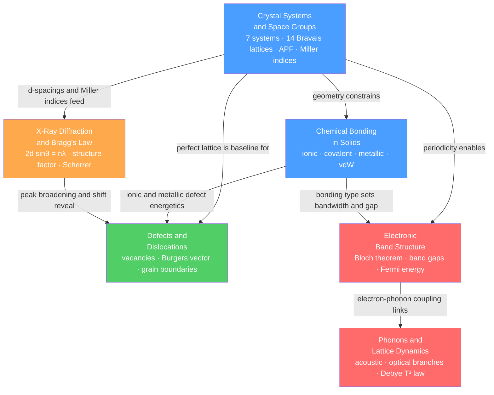

# Crystal Structure and Bonding — Map of Content

> [!info] How to use this map
> Start with **Fundamentals**, follow the arrows, and use the Learning Path below as your guide.
> Each node links to a full note. Come back to this map when you feel lost.

Crystal structure and bonding form the atomic-scale foundation of all materials science: every mechanical, electrical, thermal, and optical property of a solid traces back to how its atoms are arranged in space and how they are held together. This section covers the geometric framework of crystallography — from unit cells and space groups through to defects and dislocations — alongside the three pillars of solid-state physics that spring from it: the experimental probe of X-ray diffraction, the quantum theory of electronic band structure, and the phonon description of lattice dynamics. Together these six notes answer the question "why do materials behave as they do at the atomic level?" before later sections address specific property classes.

---

## Concept Map

*(Blue = fundamental, Green = intermediate, Orange = experimental bridge, Red = advanced quantum theory; arrows = "leads to" or "requires")*

---

## Learning Path

Recommended order for a first pass through this topic:

1. [[Crystal_Systems_and_Space_Groups]] — Start here: unit cells, 7 crystal systems, 14 Bravais lattices, APF, and Miller indices form the vocabulary every other note uses.
2. [[Chemical_Bonding_in_Solids]] — Builds directly on crystal geometry: why each bonding type (ionic, covalent, metallic, vdW) arises from electronegativity differences, and how LCAO → band theory bridges bonding to electronic structure.
3. [[Defects_and_Dislocations_in_Crystals]] — Extends the perfect-lattice picture: vacancies, Frenkel/Schottky defects, and dislocations explain why real materials are orders of magnitude weaker than theory predicts.
4. [[X_Ray_Diffraction_and_Braggs_Law]] — The experimental counterpart: Bragg's law converts the d-spacings and Miller indices from note 1 into measurable diffraction angles; structure factors and the Scherrer equation extract phase identity and crystallite size.
5. [[Electronic_Band_Structure]] — Quantum mechanics meets crystal periodicity: Bloch's theorem, nearly-free electron gaps, tight-binding bands, and the Fermi energy determine whether a material is a metal, semiconductor, or insulator.
6. [[Phonons_and_Lattice_Dynamics]] — Completes the picture: quantized lattice vibrations (phonons) govern heat capacity, thermal conductivity, and thermal expansion, and couple back to electrons to produce electrical resistance and superconductivity.

---

## All Notes in This Topic

| Note | Key Equation/Concept | Level |
|------|---------------------|-------|
| [[Crystal_Systems_and_Space_Groups]] | $d_{hkl} = a/\sqrt{h^2+k^2+l^2}$; 7 crystal systems, 14 Bravais lattices, 230 space groups, APF | Beginner |
| [[Chemical_Bonding_in_Solids]] | Born-Landé $U = -(N_A M z_+ z_- e^2 / 4\pi\varepsilon_0 r_0)(1-1/n)$; Drude conductivity; LCAO to bands | Intermediate |
| [[Defects_and_Dislocations_in_Crystals]] | $n_v/N = \exp(-Q_v/k_BT)$; strain energy $E_\text{line} \approx Gb^2/2$; Hall-Petch $\sigma_y = \sigma_0 + k_y d^{-1/2}$ | Intermediate |
| [[X_Ray_Diffraction_and_Braggs_Law]] | $2d_{hkl}\sin\theta = n\lambda$; structure factor $F_{hkl}$; Scherrer $\tau = K\lambda/\beta\cos\theta$ | Intermediate |
| [[Electronic_Band_Structure]] | $\psi_{n\mathbf{k}} = u_{n\mathbf{k}}e^{i\mathbf{k}\cdot\mathbf{r}}$; band gap $= 2|V_G|$; $E_F = (\hbar^2/2m)(3\pi^2 n)^{2/3}$ | Advanced |
| [[Phonons_and_Lattice_Dynamics]] | $\omega(k) = 2\sqrt{C/m}\lvert\sin(ka/2)\rvert$; Debye $C_V \propto T^3$; $\kappa = C_V v_s \ell / 3$ | Advanced |

---

## Key Questions This Topic Answers

- How do atoms arrange themselves in three-dimensional space, and what symmetry constraints partition all possible crystal structures into exactly 7 systems, 14 Bravais lattices, and 230 space groups?
- Why do ionic solids, covalent network solids, metals, and van der Waals crystals have such dramatically different melting points, hardness values, and electrical conductivities?
- Why do real metals yield at stresses roughly 1,000 times below the theoretical shear strength, and how do vacancies, dislocations, and grain boundaries govern diffusion, plasticity, and strengthening?
- How does X-ray diffraction decode a crystal's phase identity, lattice parameters, atom coordinates, crystallite size, and residual stress from a single diffractogram?
- Why does the quantum-mechanical periodicity of a crystal force electron energies into allowed bands separated by forbidden gaps, and how does the Fermi energy's position determine whether a material is a metal, semiconductor, or insulator?
- How do quantized lattice vibrations (phonons) determine heat capacity from 0 K to the Dulong-Petit limit, govern thermal conductivity through Umklapp scattering, and mediate the attractive electron-electron interaction responsible for superconductivity?

---

## Connections to Other Topics

- [[_MOC_MaterialsScience_Master]] — Master entry point for the full Materials Science vault
- [[_MOC_Mechanical_Properties]] — Dislocations, slip systems, Burgers vectors, and grain-boundary Hall-Petch from this section are the microscopic mechanisms behind stress-strain curves, yield strength, work hardening, and fracture toughness
- [[_MOC_Thermal_and_Phase_Behavior]] — Phonon thermal conductivity, Debye temperature, and Grüneisen parameter from this section feed directly into heat treatment theory, phase diagrams, and diffusion-controlled transformations
- [[_MOC_Electronic_Magnetic_and_Optical_Properties]] — Band structure, band gaps, Fermi energy, effective mass, and direct vs indirect transitions from this section are the foundation for semiconductor devices, optical absorption edges, dielectric constants, and magnetic ordering
- [[_MOC_Nanotechnology_and_Nanomaterials]] — Quantum confinement, surface-to-volume ratio effects, and nanoscale phonon mean-free-path engineering all trace back to the crystal structure and band-structure concepts established here
