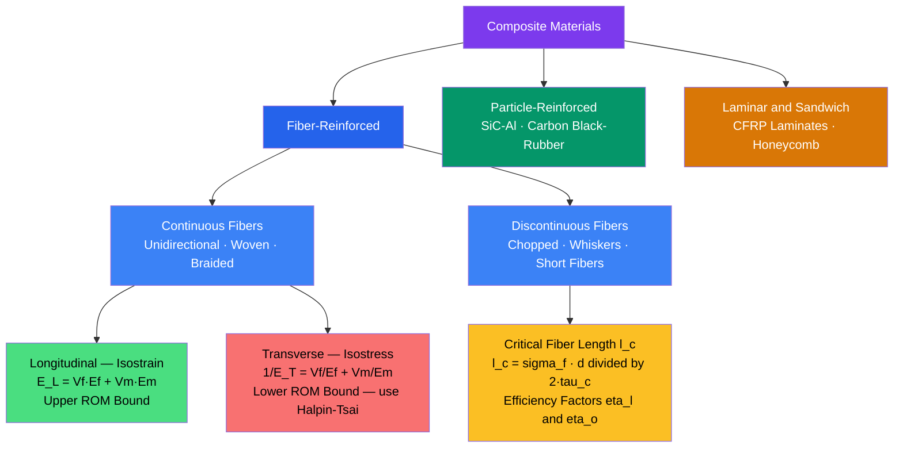

# Composite Materials and Fiber Reinforcement

> [!abstract] TL;DR
> A composite material combines two or more distinct phases to achieve properties neither phase can deliver alone; fiber-reinforced composites exploit the extreme axial stiffness of carbon or glass fibers embedded in a tough polymer matrix, yielding structural materials with specific stiffness and specific strength that surpass steel and aluminum — the reason modern aircraft, racing cars, and wind turbine blades are largely made of them.

---

## Intuition

**Analogy:** Think of reinforced concrete. Steel rebars are strong in tension but buckle under compression; plain concrete is strong in compression but cracks the instant you pull on it. Embed the rebars in the concrete and each material is doing exactly what it does best — the rebar carries tension, the concrete handles compression, and the result is a material system no civil engineer could achieve with either material alone.

Fiber composites work on the same principle at a smaller scale. A single carbon fiber (diameter ~7 µm) can withstand over 3 GPa in tension — stronger than hardened steel — but is brittle and would buckle under any compression alone. Embed thousands of such fibers in an epoxy polymer matrix and the matrix holds them in alignment, transfers load between them, and provides toughness against crack propagation. The outcome is a material that is simultaneously stiffer than steel, lighter than aluminum, and tough enough to survive impact — at the cost of complexity in fabrication and directional (anisotropic) properties.

---

## How It Works

### Classification

Composite materials divide into three broad families based on reinforcement geometry:

1. **Fiber-reinforced composites** — reinforcement is filamentary; further divided by continuity:
   - *Continuous unidirectional* — fibers run the full length of the part; maximum axial stiffness and strength, but highly anisotropic.
   - *Woven / braided* — fibers interlaced in two or more in-plane directions; reduced anisotropy, easier drape over curved surfaces.
   - *Discontinuous (chopped) fibers* — short fibers randomly or semi-randomly oriented; isotropic in-plane properties but much lower stiffness than continuous.

2. **Particle-reinforced composites** — equiaxed inclusions (e.g., SiC particles in aluminum, carbon black in rubber); nearly isotropic; improve hardness, wear resistance, or damping but give smaller stiffness gains than fibers.

3. **Laminar / sandwich composites** — stacked plies of different materials bonded together; each ply contributes its own stiffness tensor, giving a designer freedom to tailor bending vs stretching response (carbon-fiber laminates, honeycomb sandwich panels).

### Rule of Mixtures (ROM)

The simplest micromechanical model treats fiber and matrix as two springs loaded in parallel (longitudinal) or series (transverse).

**Volume fractions** must sum to unity (including void fraction $V_v$):

$$V_f + V_m + V_v = 1$$

**Longitudinal (fiber-direction) modulus — isostrain assumption:**
Fibers and matrix experience the same axial strain $\varepsilon_c = \varepsilon_f = \varepsilon_m$. Force equilibrium gives:

$$\boxed{E_L = V_f E_f + V_m E_m}$$

This is the **upper bound** (Voigt average) on composite stiffness. It also applies to density: $\rho_c = V_f \rho_f + V_m \rho_m$.

**Transverse modulus — isostress assumption:**
Load applied perpendicular to the fibers; fiber and matrix carry equal stress $\sigma_c = \sigma_f = \sigma_m$. Compatibility of total strain gives:

$$\boxed{\frac{1}{E_T} = \frac{V_f}{E_f} + \frac{V_m}{E_m}}$$

This is the **lower bound** (Reuss average). For a carbon/epoxy system with $E_f = 230$ GPa and $E_m = 4$ GPa at $V_f = 0.60$:

$$E_L = 0.60 \times 230 + 0.40 \times 4 = 139.6 \text{ GPa}$$
$$E_T = \left(\frac{0.60}{230} + \frac{0.40}{4}\right)^{-1} \approx 9.5 \text{ GPa}$$

The ratio $E_L / E_T \approx 15$ encapsulates the dramatic **anisotropy** of unidirectional composites.

### Halpin-Tsai Equations

The isostress lower bound underestimates the transverse modulus for real cylindrical fibers. The empirical Halpin-Tsai model interpolates between the two bounds:

$$E_T^{HT} = E_m \cdot \frac{1 + \xi \eta V_f}{1 - \eta V_f}$$

where

$$\eta = \frac{E_f / E_m - 1}{E_f / E_m + \xi}$$

and $\xi$ is a reinforcement geometry parameter. For circular fibers under transverse loading, $\xi = 2$ is widely adopted (Halpin & Kardos, 1976); for platelet-like reinforcement, $\xi \to 0$ recovers the Reuss lower bound. The Halpin-Tsai prediction falls between the two ROM bounds and matches finite-element micromechanics well at intermediate volume fractions ($0.3 \lesssim V_f \lesssim 0.65$).

### Critical Fiber Length

Discontinuous fibers can only be loaded effectively if they are long enough for shear at the fiber-matrix interface to build up sufficient axial stress. The **critical fiber length** $l_c$ is the minimum length needed to reach the fiber tensile strength $\sigma_f^*$ at the fiber midpoint:

$$\boxed{l_c = \frac{\sigma_f^* \, d}{2 \tau_c}}$$

where $d$ is fiber diameter and $\tau_c$ is the interfacial shear strength. For carbon fibers in epoxy: $\sigma_f^* \approx 3530$ MPa, $d \approx 7\ \mu\text{m}$, $\tau_c \approx 50$ MPa, giving $l_c \approx 0.25$ mm. Fibers shorter than $l_c$ fail to reach their tensile strength; fibers much longer than $l_c$ behave like continuous fibers.

The **fiber efficiency factor** $\eta_l$ accounts for sub-critical lengths in discontinuous composites:

$$\eta_l = 1 - \frac{l_c}{2l} \quad \text{for } l > l_c$$

The longitudinal ROM for short-fiber composites becomes $E_L = \eta_l \eta_o V_f E_f + V_m E_m$, where $\eta_o \leq 1$ is an orientation efficiency factor (1 for aligned, 3/8 for random in-plane, 1/5 for 3D random).

### Mermaid: Composite Architecture and Loading Response



---

## Key Concepts

### Secondary Level

**What is a composite?** A composite material is made from two or more constituents that remain physically and chemically distinct at the microscale but act together as a single structural material. The constituent in larger proportion is the **matrix**; the other is the **reinforcement** (fiber, particle, or sheet).

**Why fibers?** A thin fiber of a brittle material (glass, carbon, ceramic) is much stronger than a bulk piece of the same material because it has fewer critical surface flaws. This follows from Griffith's flaw theory: flaw size scales with cross-sectional dimension, so reducing fiber diameter exponentially raises tensile strength.

**Common composite systems:**

| System | Matrix | Reinforcement | Typical $V_f$ | Application |
|--------|--------|---------------|----------------|-------------|
| CFRP | Epoxy | Carbon fiber T300/T800 | 0.55–0.65 | Aerospace, motorsport, sports equipment |
| GFRP | Polyester / Epoxy | E-glass or S-glass | 0.35–0.55 | Wind turbines, boat hulls, automotive body panels |
| GLARE | Aluminum | Glass-fiber/epoxy prepreg | — (hybrid) | Airbus A380 fuselage panels |
| CMC | SiC matrix | SiC fiber | 0.30–0.45 | Jet engine hot sections |
| MMC | Aluminum alloy | SiC particles / fibers | 0.10–0.40 | Brake rotors, bicycle frames |

**Specific stiffness and specific strength** are key design metrics when weight matters:

$$\text{Specific stiffness} = \frac{E}{\rho}, \qquad \text{Specific strength} = \frac{\sigma_{ult}}{\rho}$$

CFRP at $V_f = 0.60$ achieves $E/\rho \approx 100\ \text{GPa}/\text{(g/cm}^3) = 100\ \text{MN·m/kg}$, compared to steel at ~26 and aluminum at ~26 — roughly a 4× advantage in specific stiffness.

### Undergraduate Level

**Stiffness bounds and physical meaning.** The Voigt (isostrain) upper bound treats fiber and matrix as parallel springs: the stiff fiber carries most of the load, so the composite modulus rises nearly linearly with $V_f$. The Reuss (isostress) lower bound treats them as series springs: the compliant matrix is the weak link, so $E_T$ barely exceeds $E_m$ until very high $V_f$. Real composites under transverse load fall between these extremes — the Halpin-Tsai equation with $\xi = 2$ gives a physically motivated interpolation that matches experiment.

**Strength of unidirectional composites.** Longitudinal tensile strength follows a modified ROM:

$$\sigma_L^* = V_f \sigma_f^* + V_m \sigma_m'$$

where $\sigma_m'$ is the matrix stress at the strain corresponding to fiber failure ($\varepsilon_f^* = \sigma_f^*/E_f$). A **critical fiber volume fraction** $V_f^{crit}$ exists below which the composite is weaker than the matrix alone (fibers are stress concentrators without sufficient load-sharing). For CFRP, $V_f^{crit} \approx 0.01$ — essentially all practical composites exceed this.

**Interface mechanics.** Load transfer between fiber and matrix occurs through interfacial shear. The shear stress distribution along a fiber (Kelly-Tyson shear-lag model) peaks at the fiber ends and decays toward the center. The interfacial shear strength $\tau_c$ governs both the critical fiber length and the failure mode: weak interfaces promote fiber pull-out (toughening); strong interfaces promote catastrophic brittle failure at the fiber fracture plane.

**Thermal residual stresses.** Composite laminates are typically cured at elevated temperature (120–180°C for epoxy) and then cooled to room temperature. The mismatch in coefficients of thermal expansion (CTE) between fiber ($\alpha_f \approx -0.5 \times 10^{-6}\ \text{K}^{-1}$ axial for carbon) and matrix ($\alpha_m \approx 55 \times 10^{-6}\ \text{K}^{-1}$ for epoxy) introduces residual stresses that can affect the onset of microcracking.

**Void fraction effects.** Trapped voids during lay-up or infusion degrade mechanical properties significantly. A void fraction $V_v = 1\%$ reduces interlaminar shear strength (ILSS) by approximately 7%; $V_v > 2\%$ is considered unacceptable for structural aerospace parts. Autoclave processing at 5–7 bar consolidation pressure typically achieves $V_v < 0.5\%$.

### Graduate Level

**Classical lamination theory (CLT).** A unidirectional ply has an orthotopic stiffness tensor characterized by four independent engineering constants: $E_1, E_2, G_{12}, \nu_{12}$. The reduced stiffness matrix in principal coordinates is:

$$[Q] = \begin{bmatrix} \frac{E_1}{1-\nu_{12}\nu_{21}} & \frac{\nu_{12}E_2}{1-\nu_{12}\nu_{21}} & 0 \\ \frac{\nu_{12}E_2}{1-\nu_{12}\nu_{21}} & \frac{E_2}{1-\nu_{12}\nu_{21}} & 0 \\ 0 & 0 & G_{12} \end{bmatrix}$$

For a ply rotated by angle $\theta$ from the fiber direction, the transformed stiffness $[\bar{Q}]$ is obtained by standard tensor rotation. A laminate of $N$ plies has an $ABD$ stiffness matrix:

$$\begin{bmatrix} \mathbf{N} \\ \mathbf{M} \end{bmatrix} = \begin{bmatrix} \mathbf{A} & \mathbf{B} \\ \mathbf{B} & \mathbf{D} \end{bmatrix} \begin{bmatrix} \boldsymbol{\varepsilon}^0 \\ \boldsymbol{\kappa} \end{bmatrix}$$

where $\mathbf{A}$ (extensional), $\mathbf{B}$ (bending-extension coupling), and $\mathbf{D}$ (bending) stiffness matrices are integrated through the laminate thickness. Symmetric laminates ($\mathbf{B} = 0$) are preferred to avoid warping on cure.

**Woven prepregs and autoclave curing.** A prepreg is a sheet of fibers pre-impregnated with partially cured (B-stage) resin. Woven prepregs (plain weave, twill, satin) provide in-plane isotropy and easier drape around double-curved surfaces. Autoclave curing applies heat and pressure simultaneously: temperature drives the crosslinking reaction (exothermic), while hydrostatic pressure (5–7 bar) compacts the laminate, expels voids, and ensures intimate fiber-matrix contact. The resulting degree of cure $\alpha \in [0,1]$ is tracked via Kamal-Sourour kinetics:

$$\frac{d\alpha}{dt} = (k_1 + k_2 \alpha^m)(1-\alpha)^n$$

where $k_1, k_2$ are Arrhenius rate constants and $m, n$ are cure exponents fitted to DSC data.

**Natural composites.** Evolution independently discovered fiber reinforcement for structural materials:

- **Bone**: $\sim 70\%$ hydroxyapatite crystals (Ca$_{10}$(PO$_4$)$_6$(OH)$_2$, ceramic, $E \approx 130$ GPa) reinforcing a collagen fibril matrix ($E \approx 2$ GPa). The hierarchical architecture — from nanoscale collagen fibrils to osteon-level lamellae — gives bone exceptional toughness through multiple crack-deflection mechanisms. Effective $E_{\text{bone}} \approx 20$ GPa with fracture toughness $K_{Ic} \approx 2$–$5\ \text{MPa}\sqrt{\text{m}}$, orders of magnitude tougher than either constituent alone.

- **Wood**: cellulose microfibrils (crystalline, $E \approx 130$ GPa along chains) wound in a helical angle within a lignin-hemicellulose matrix ($E \approx 2$ GPa). The microfibril angle (MFA) varies from ~0° in mature wood (stiff, high $E$) to ~40° in juvenile wood (flexible, high extensibility) — a natural form of fiber angle optimization analogous to CLT.

- **Nacre (mother-of-pearl)**: aragonite (CaCO$_3$) tablets in a protein matrix arranged in a brick-and-mortar microstructure achieve $K_{Ic} \approx 8\ \text{MPa}\sqrt{\text{m}}$, roughly 3000× tougher than monolithic aragonite, through crack bridging, tablet sliding, and viscoelastic dissipation in the protein mortar.

**Hybrid composites.** Stacking plies of different fiber types (e.g., carbon and glass, carbon and aramid) within one laminate creates hybrids that balance cost, impact resistance, and stiffness. The "hybrid effect" — a positive deviation in strain-to-failure for carbon fibers when interspersed with glass fibers — is attributed to statistical flaw size suppression (Zweben, 1977) and is exploited in GLARE (glass/aluminum) used on the Airbus A380 upper fuselage.

---

## Python Demo

```python
import numpy as np
import matplotlib.pyplot as plt

# -------------------------------------------------------------------
# Material properties: T300 carbon fiber / aerospace epoxy
# -------------------------------------------------------------------
E_f   = 230.0   # GPa  — T300 carbon fiber axial modulus
E_m   = 4.0     # GPa  — epoxy matrix modulus
rho_f = 1760    # kg/m3
rho_m = 1200    # kg/m3

V_f = np.linspace(0.0, 1.0, 500)
V_m = 1.0 - V_f

# -------------------------------------------------------------------
# Rule of Mixtures — Longitudinal (Voigt, isostrain upper bound)
# -------------------------------------------------------------------
E_L = V_f * E_f + V_m * E_m

# -------------------------------------------------------------------
# Rule of Mixtures — Transverse (Reuss, isostress lower bound)
# Avoid division by zero at V_f = 1 where V_m = 0
# -------------------------------------------------------------------
with np.errstate(divide='ignore', invalid='ignore'):
    E_T_ROM = np.where(
        V_f < 1.0,
        1.0 / (V_f / E_f + V_m / E_m),
        E_f
    )

# -------------------------------------------------------------------
# Halpin-Tsai — Transverse (xi = 2 for circular fibers)
# -------------------------------------------------------------------
xi  = 2.0
eta = (E_f / E_m - 1.0) / (E_f / E_m + xi)   # shape parameter
E_T_HT = E_m * (1.0 + xi * eta * V_f) / (1.0 - eta * V_f)

# -------------------------------------------------------------------
# Composite density (ROM always valid)
# Specific stiffness = E / (rho in g/cm3) [units: GPa·cm3/g]
# -------------------------------------------------------------------
rho_c         = V_f * rho_f + V_m * rho_m         # kg/m3
rho_c_gcc     = rho_c / 1000.0                     # g/cm3
spec_E_L      = E_L / rho_c_gcc                    # GPa / (g/cm3)

# Reference materials
spec_E_steel = 200.0 / 7.85
spec_E_al    = 70.0  / 2.7

# -------------------------------------------------------------------
# Plotting
# -------------------------------------------------------------------
fig, axes = plt.subplots(1, 2, figsize=(12, 5))
fig.suptitle("Carbon/Epoxy Composite Mechanics (T300 / Aerospace Epoxy)", fontsize=13)

# --- Left panel: Modulus vs V_f -----------------------------------
ax = axes[0]
ax.plot(V_f, E_L,     'b-',  linewidth=2.5, label=r"Longitudinal $E_L$ — ROM upper bound")
ax.plot(V_f, E_T_ROM, 'r--', linewidth=2.0, label=r"Transverse $E_T$ — ROM lower bound")
ax.plot(V_f, E_T_HT,  'g-.',  linewidth=2.0, label=r"Transverse $E_T$ — Halpin-Tsai ($\xi=2$)")
ax.axvline(x=0.60, color='gray', linestyle=':', linewidth=1.5, label=r"Aerospace $V_f = 0.60$")
ax.set_xlabel(r"Fiber Volume Fraction $V_f$", fontsize=11)
ax.set_ylabel("Elastic Modulus (GPa)", fontsize=11)
ax.set_title("Stiffness Anisotropy: Longitudinal vs Transverse", fontsize=11)
ax.legend(fontsize=8)
ax.grid(True, alpha=0.3)
ax.set_xlim(0, 1)
ax.set_ylim(0, 240)

# --- Right panel: Specific stiffness vs V_f ----------------------
ax2 = axes[1]
ax2.plot(V_f, spec_E_L, 'b-', linewidth=2.5, label=r"CFRP longitudinal $E_L/\rho$")
ax2.axhline(spec_E_steel, color='#888', linestyle='--', linewidth=1.5, label=f"Steel: {spec_E_steel:.1f} GPa·cm3/g")
ax2.axhline(spec_E_al,    color='#aaa', linestyle=':', linewidth=1.5, label=f"Aluminum: {spec_E_al:.1f} GPa·cm3/g")
ax2.axvline(x=0.60, color='gray', linestyle=':', linewidth=1.5)
ax2.set_xlabel(r"Fiber Volume Fraction $V_f$", fontsize=11)
ax2.set_ylabel(r"Specific Stiffness (GPa·cm$^3$/g)", fontsize=11)
ax2.set_title("Weight-Normalized Stiffness vs Fiber Content", fontsize=11)
ax2.legend(fontsize=9)
ax2.grid(True, alpha=0.3)
ax2.set_xlim(0, 1)

plt.tight_layout()
plt.savefig("composite_anisotropy.png", dpi=150, bbox_inches="tight")
plt.show()

# -------------------------------------------------------------------
# Print key values at V_f = 0.60
# -------------------------------------------------------------------
vf = 0.60
vm = 1.0 - vf
el   = vf * E_f + vm * E_m
et_r = 1.0 / (vf / E_f + vm / E_m)
et_h = E_m * (1.0 + xi * eta * vf) / (1.0 - eta * vf)
rho  = (vf * rho_f + vm * rho_m) / 1000.0

print(f"Carbon/Epoxy at V_f = 0.60:")
print(f"  E_L  (ROM)         = {el:.1f}  GPa")
print(f"  E_T  (ROM)         = {et_r:.2f} GPa")
print(f"  E_T  (Halpin-Tsai) = {et_h:.2f} GPa")
print(f"  Anisotropy E_L/E_T (ROM)    = {el/et_r:.1f}x")
print(f"  Anisotropy E_L/E_T (H-T)    = {el/et_h:.1f}x")
print(f"  Density rho_c      = {rho:.3f} g/cm3")
print(f"  Specific stiffness = {el/rho:.1f} GPa·cm3/g  (steel = {spec_E_steel:.1f})")
```

**Expected output at $V_f = 0.60$:**

```
Carbon/Epoxy at V_f = 0.60:
  E_L  (ROM)         = 139.6  GPa
  E_T  (ROM)         =   9.52 GPa
  E_T  (Halpin-Tsai) =  10.29 GPa
  Anisotropy E_L/E_T (ROM)    = 14.7x
  Anisotropy E_L/E_T (H-T)    = 13.6x
  Density rho_c      = 1.536 g/cm3
  Specific stiffness =  90.9 GPa·cm3/g  (steel = 25.5)
```

The plot makes two things vivid: (1) the enormous gap between $E_L$ and $E_T$ at typical aerospace fiber fractions; (2) that CFRP's specific stiffness exceeds steel's by a factor of ~3.5 across most of the usable $V_f$ range.

---

## Real-World Applications

> **CFRP in Aerospace.** The Boeing 787 Dreamliner fuselage is 50% CFRP by weight — the first commercial aircraft with a primary structure made almost entirely of carbon-fiber composites. Autoclave-cured T800/3900 prepreg at $V_f \approx 0.60$ delivers an airframe 20% lighter than an equivalent aluminum structure, translating directly to 20% lower fuel burn. The $B$ matrix suppression through symmetric layups ($[0/\pm45/90]_s$) is essential to prevent thermally induced warping during cure cool-down.

> **GFRP in Wind Energy.** Offshore wind turbine blades now exceed 100 m in length. E-glass (Young's modulus ~73 GPa, cost ~$1–2/kg) is the dominant reinforcement; spar caps use S-glass (86 GPa) or infused carbon fiber for the highest-loaded zones. Vacuum-assisted resin transfer molding (VARTM) at atmospheric pressure (no autoclave) is economical at this scale, accepting $V_v \approx 1$–$2\%$. Fatigue life over $10^8$ cycles at sea governs the design — glass composites are preferred over carbon here partly because their lower modulus gives larger elastic bending without delamination.

> **Natural Composites in Biomechanics.** Human cortical bone achieves $K_{Ic} \approx 2$–$5\ \text{MPa}\sqrt{\text{m}}$ through the hierarchical arrangement of collagen fibrils and hydroxyapatite platelets across seven length scales from the nanometer (collagen triple helix) to the millimeter (osteon). Understanding this architecture directly informs the design of bio-inspired composites and synthetic bone grafts.

> **Racing and Sporting Equipment.** Formula 1 monocoques, bicycle frames (Cervelo, Trek), and tennis rackets (graphite-epoxy) all exploit high-$V_f$ unidirectional CFRP. An F1 chassis weighs ~35 kg yet sustains multi-g lateral and braking loads; the design is validated via CLT stiffness analysis and finite-element progressive failure simulation, with each ply failure modeled using the Hashin or LaRC failure criteria.

---

## Common Pitfalls

- **Applying ROM transverse modulus directly** — The isostress ROM dramatically underestimates $E_T$ at high $V_f$ because it assumes the fiber and matrix share identical stress, ignoring load path tortuosity around stiff inclusions. Always use Halpin-Tsai or micromechanics FEM for transverse or shear moduli.

- **Ignoring void fraction** — Even $V_v = 1$–$2\%$ reduces interlaminar shear strength (ILSS) by 7–15% and fatigue life by 50% or more. Void content must be measured (via acid digestion or optical micrography) and reported alongside all mechanical data.

- **Confusing fiber volume fraction with weight fraction** — Material data sheets often quote fiber weight fraction $W_f$ (easier to measure). The conversion is $V_f = (W_f / \rho_f) / (W_f / \rho_f + W_m / \rho_m)$. For CFRP ($\rho_f = 1.76$, $\rho_m = 1.20$), $W_f = 0.65$ corresponds to $V_f \approx 0.55$, not 0.65. Mixing these leads to 15-30% errors in predicted modulus.

- **Overlooking thermal residual stresses** — Residual stresses from cure cool-down are large (fiber axial: compression ~100 MPa; matrix: tension ~50 MPa transverse). They shift the effective stress state at the ply level and can cause microcracking at service temperatures, especially in cryogenic applications (liquid hydrogen tanks).

- **Assuming fiber direction is always optimal** — A $[0]_n$ unidirectional laminate is optimal only for a uniaxial tension member. Panels under biaxial loads, torsion, or impact require balanced symmetric laminates ($[0/\pm45/90]_s$ or $[0/\pm45]_s$). Choosing all $0°$ plies for a shear web is a catastrophic design error.

- **Ignoring fiber waviness / wrinkling** — Fiber misalignment of even $\pm2°$ from the designed direction reduces compressive strength by 10–20%. Woven fabrics inherently introduce waviness at crossover points, which is why their compressive strength is ~15–20% below equivalent unidirectional layups.

---

## Related Concepts

- [[Crystal_Structure_and_Band_Theory]] — the crystalline microstructure of reinforcing fibers (graphite layers in carbon fiber, silica network in glass) determines their axial modulus through atomic bonding stiffness; the same Bloch/tight-binding framework applies to phonon stiffness in ceramic fibers.

- [[Solid_State_and_Crystal_Structures]] — crystal chemistry of hydroxyapatite in bone composites and of SiC whiskers in ceramic-matrix composites; packing geometry informs accessible volume fractions.

- [[Pericyclic_Radical_and_Polymer_Chemistry]] — epoxy and polyester matrix resins are thermoset polymers whose crosslink density (controlled by curing agent stoichiometry and temperature) sets $E_m$, $\tau_c$, and the glass-transition temperature $T_g$ that limits service temperature.

- [[Chemical_Bonding_and_Molecular_Geometry]] — surface treatments (sizing agents, silane coupling agents on glass fiber; plasma or oxidative treatment on carbon fiber) modify the fiber-matrix interface chemistry, directly controlling $\tau_c$ and therefore critical fiber length and mode-II fracture energy.

- [[_MOC_Physics_Master]] — continuum mechanics (stress, strain, elastic moduli), fracture mechanics, and thermodynamics of curing are all grounded in the physics covered in this vault.

- [[_MOC_Mechanical_Properties|↑ Mechanical Properties MOC]] — section map for all mechanical properties notes in this vault

---

## Review Questions

1. **(Secondary / Undergraduate)** A glass/polyester composite has $V_f = 0.40$, $E_f = 73\ \text{GPa}$, $E_m = 3.5\ \text{GPa}$. Calculate both the longitudinal and transverse moduli using the rule of mixtures. By what factor is the longitudinal modulus larger than the transverse? Explain physically why this anisotropy arises.

2. **(Undergraduate)** A carbon fiber has $\sigma_f^* = 3530\ \text{MPa}$, diameter $d = 7\ \mu\text{m}$, and is embedded in an epoxy with interfacial shear strength $\tau_c = 50\ \text{MPa}$. Calculate $l_c$. If chopped fibers of length $l = 0.5\ \text{mm}$ are used, what is the fiber efficiency factor $\eta_l$? Would you recommend this system for a structural application requiring near-continuous-fiber performance, and why?

3. **(Graduate)** A symmetric cross-ply laminate $[0/90]_s$ is manufactured from carbon/epoxy prepreg and cooled from the cure temperature $T_{cure} = 175°C$ to room temperature $T_{RT} = 25°C$. The axial CTE of carbon/epoxy is $\alpha_1 = -0.5 \times 10^{-6}\ \text{K}^{-1}$ and transverse CTE is $\alpha_2 = 30 \times 10^{-6}\ \text{K}^{-1}$. Using CLT, qualitatively describe the residual stress state in the $0°$ and $90°$ plies after cool-down. Which ply is at risk of transverse microcracking, and why does laminate symmetry prevent gross warping despite these stresses?

---

## Sources

- Callister, W. D. & Rethwisch, D. G., *Materials Science and Engineering: An Introduction*, 10th ed., Wiley (2018) — comprehensive undergraduate treatment; Chapters 16–17 cover composite mechanics and processing.
- Chawla, K. K., *Composite Materials: Science and Engineering*, 3rd ed., Springer (2012) — graduate-level micromechanics, interface mechanics, and processing science.
- Halpin, J. C. & Kardos, J. L., "The Halpin-Tsai equations: a review," *Polymer Engineering & Science*, 16(5), 344–352 (1976) — original source for the reinforcement geometry parameter $\xi$.
- Jones, R. M., *Mechanics of Composite Materials*, 2nd ed., Taylor & Francis (1999) — definitive CLT reference with full ABD matrix derivation.
- [Mastering Halpin-Tsai Equations](https://www.numberanalytics.com/blog/mastering-halpin-tsai-equations) — accessible overview of the $\xi$ parameter and its dependence on fiber geometry.
- [Halpin-Tsai Model — ScienceDirect Topics](https://www.sciencedirect.com/topics/engineering/halpin-tsai-model) — curated literature summary on transverse modulus predictions.

---

#MaterialsScience #Composites #FiberReinforcement #CFRP #GFRP #RuleOfMixtures #HalpinTsai #Anisotropy #MechanicalProperties
