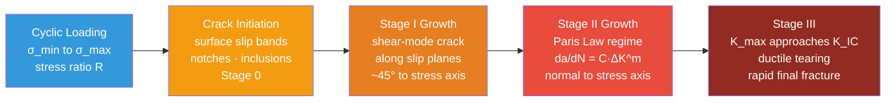

# Fatigue, Creep, and High-Temperature Failure

> [!abstract] TL;DR
> Fatigue is failure under cyclic loading at stresses far below the static yield strength — quantified by the S-N (Wöhler) curve, the Paris law for crack growth ($da/dN = C\Delta K^m$), and the Goodman criterion for mean stress. Creep is time-dependent plastic deformation at $T > 0.4\,T_m$ — described by the Norton power law ($\dot{\varepsilon}_{ss} = A\sigma^n e^{-Q/RT}$) and life-predicted with the Larson-Miller parameter. Both failure modes have claimed aircraft, bridges, and power-plant components; together they define the upper limits of materials performance in high-cycle and high-temperature engineering.

---

## Intuition

**Analogies first.**

Take a metal paper clip and bend it back and forth. Each individual bend is nowhere near enough to snap it — you could apply that bend once and release it a thousand times in one direction. But alternate the direction, and after 10–20 cycles the wire snaps cleanly. That is **fatigue**: structural failure driven by cyclic damage accumulation, not by any single overload.

Now place a candle on a warm window sill. Leave it for a few hours. It slumps — not because you applied any force, but because gravity acting continuously at an elevated temperature is enough for the wax to flow. This is **creep**: time-dependent, thermally activated deformation under a stress that would cause no detectable strain in a quick test. Steel does the same thing at 600 °C; lead does it at room temperature; ice does it inside a glacier.

The unifying theme: **time and load history matter**. Static strength testing — one fast pull to failure — misses both phenomena entirely.

---

## How It Works

### Fatigue: Cyclic Loading Mechanics

When a component is subjected to a fluctuating stress, the relevant parameters are:

| Symbol | Definition | Formula |
|--------|-----------|---------|
| $\sigma_{max}$ | Maximum stress in cycle | — |
| $\sigma_{min}$ | Minimum stress in cycle | — |
| $\sigma_a$ | Stress amplitude | $(\sigma_{max} - \sigma_{min})/2$ |
| $\sigma_m$ | Mean stress | $(\sigma_{max} + \sigma_{min})/2$ |
| $R$ | Stress ratio | $\sigma_{min}/\sigma_{max}$ |
| $\Delta\sigma$ | Stress range | $\sigma_{max} - \sigma_{min}$ |

**Fully reversed loading** ($R = -1$, $\sigma_m = 0$) is the classic lab condition. Real components almost always have $R > -1$ because mean stresses from assembly, residual stresses, or geometry are present.

**The S-N (Wöhler) Curve** plots stress amplitude $S$ against the number of cycles to failure $N$ on a semi-logarithmic scale. Two critical behaviors exist:

- **Steels** show a distinct **endurance limit** $S_e$ — a stress amplitude below which the material can survive infinite cycles ($N > 10^7$). Typically $S_e \approx 0.4$–$0.5\,S_u$ for wrought steels.
- **Aluminium alloys** (and most non-ferrous metals) show **no endurance limit** — the S-N curve continues to slope downward indefinitely. For design, a **fatigue strength** at $10^8$ cycles is used instead.

**Basquin's Law** (the high-cycle regime, $N > 10^4$):

$$\sigma_a = \sigma_f'(2N_f)^b$$

where $\sigma_f'$ is the fatigue strength coefficient ($\approx S_u$), $2N_f$ is the number of reversals, and $b \approx -0.05$ to $-0.12$ is the Basquin exponent.

**Mean Stress Effects — Modified Goodman Diagram**

A tensile mean stress $\sigma_m > 0$ reduces the allowable stress amplitude. The **modified Goodman criterion** draws a straight line from $(S_e,\, 0)$ to $(0,\, S_u)$ in ($\sigma_a$, $\sigma_m$) space:

$$\frac{\sigma_a}{S_e} + \frac{\sigma_m}{S_u} = 1$$

Points inside the line: infinite life. Points outside: finite life or immediate failure. The **Gerber parabola** and **Morrow criterion** (using true fracture strength) are more conservative alternatives used in aerospace.

---

### Fatigue Crack Propagation: The Paris Law

Once a crack nucleates, its growth rate per cycle is controlled by the **stress intensity factor range**:

$$\Delta K = K_{max} - K_{min} = \Delta\sigma\sqrt{\pi a}\cdot F$$

where $a$ is the current crack half-length and $F$ is a geometry correction factor.

**Paris Law** (Region II crack growth):

$$\frac{da}{dN} = C\,(\Delta K)^m$$

| Parameter | Typical range (steels) |
|-----------|----------------------|
| $C$ | $10^{-12}$ to $10^{-11}$ m/cycle per (MPa√m)$^m$ |
| $m$ | 2.5 – 4.0 |
| $\Delta K_{th}$ (threshold) | 3 – 8 MPa√m |
| $K_{IC}$ (fracture toughness) | 50 – 200 MPa√m |

**Integrating Paris Law** gives the number of cycles from initial crack size $a_0$ to final critical size $a_c$:

$$N_f = \int_{a_0}^{a_c} \frac{da}{C\,(\Delta K)^m}$$

For $F = 1$ (central crack in infinite plate) and $m \neq 2$:

$$N_f = \frac{a_c^{1-m/2} - a_0^{1-m/2}}{C\,(1 - m/2)\,(\Delta\sigma\sqrt{\pi})^m}$$

This is the heart of **damage-tolerant design**: inspect at intervals short enough that a crack starting at the minimum detectable size $a_0$ cannot reach $a_c$ between inspections.

---

### Fatigue Crack Growth Stages — Flow Diagram



---

### Creep: Time-Dependent Deformation

Creep is significant when $T > 0.4\,T_m$ (homologous temperature threshold), because thermal energy is sufficient to activate dislocation climb, vacancy diffusion, and grain boundary sliding. The **three creep stages** in a constant-stress creep test are:

| Stage | Character | Mechanism |
|-------|-----------|-----------|
| **Primary** | Decelerating strain rate | Strain hardening outpaces recovery |
| **Secondary (steady-state)** | Constant minimum strain rate $\dot{\varepsilon}_{ss}$ | Hardening balanced by dynamic recovery |
| **Tertiary** | Accelerating strain rate | Void nucleation, necking, grain boundary cracking |

**Norton Power Law** (secondary creep rate):

$$\dot{\varepsilon}_{ss} = A\,\sigma^n\,\exp\!\left(-\frac{Q}{RT}\right)$$

where:
- $A$ = material constant (pre-exponential)
- $n$ = creep stress exponent: $n = 1$ for diffusion creep; $n = 3$–$5$ for dislocation creep
- $Q$ = activation energy (J/mol): $Q \approx Q_{lattice}$ for high-$T$ creep, $Q \approx Q_{gb}$ for low-$T$ creep
- $R = 8.314$ J/(mol·K) = universal gas constant
- $T$ = absolute temperature (K)

Taking logarithms: $\ln\dot{\varepsilon}_{ss} = \ln A + n\ln\sigma - Q/(RT)$. A log–log plot of $\dot{\varepsilon}_{ss}$ vs $\sigma$ at constant $T$ gives a straight line of slope $n$. An Arrhenius plot ($\ln\dot{\varepsilon}_{ss}$ vs $1/T$ at constant $\sigma$) gives slope $-Q/R$.

---

### Creep Mechanisms

**Diffusion Creep** (low stress, near $T_m$)

Atoms and vacancies diffuse under a stress gradient, allowing grain shapes to change without dislocation motion. Two sub-mechanisms:

- **Nabarro-Herring creep**: diffusion through grain interiors (lattice diffusion, dominant at $T > 0.8\,T_m$).
  $$\dot{\varepsilon}_{NH} \propto \frac{\sigma D_L \Omega}{d^2 k_B T}$$
  Grain size dependence: $\dot{\varepsilon} \propto d^{-2}$ — finer grains creep faster.

- **Coble creep**: diffusion along grain boundaries (dominant at lower $T$ or small grain sizes).
  $$\dot{\varepsilon}_{Coble} \propto \frac{\sigma D_{gb}\,\delta_{gb}\,\Omega}{d^3 k_B T}$$
  Grain size dependence: $\dot{\varepsilon} \propto d^{-3}$ — extremely sensitive to grain size.

In both cases $n = 1$ (linear viscous), and the remedy is **large grains** or **eliminating grain boundaries entirely** (single-crystal components).

**Dislocation Creep** (intermediate to high stress)

Dislocations glide on slip planes but become pinned at obstacles. At high temperature, they can **climb** (diffuse vacancies to/from the dislocation core), bypass obstacles, and continue gliding. The glide-climb cycle sustains ongoing deformation. $n \approx 3$–$5$, strongly dependent on $\sigma$.

**Deformation Mechanism Map (Ashby Map)**

A $\sigma/G$ (normalized stress) vs $T/T_m$ (homologous temperature) map shows boundaries between: elastic deformation, dislocation glide, dislocation creep, Nabarro-Herring creep, and Coble creep — enormously useful for selecting operating conditions that avoid creep in service.

---

### Larson-Miller Parameter: Life Prediction

For engineering life prediction, the **Larson-Miller parameter** combines temperature and time to rupture $t_r$ into a single number:

$$P = T\bigl(C + \log_{10} t_r\bigr)$$

where:
- $T$ = temperature in Kelvin (some texts use Rankine)
- $t_r$ = time to rupture (hours)
- $C$ = material constant, typically 15–25 for steels ($C \approx 20$ is a common starting value)

$P$ is a **master curve** parameter: a single plot of applied stress $\sigma$ vs $P$ collapses data from many temperatures onto one curve. To find $t_r$ at a new $(T, \sigma)$ condition, read $P$ from the curve and solve for $t_r$:

$$t_r = 10^{\,(P/T)\, -\, C}$$

The physical basis is the Arrhenius equation: $t_r \propto \exp(Q/RT)$, so $\ln t_r \propto 1/T$, and $T\ln t_r = \text{const}$ at constant $\sigma$ — which is exactly the Larson-Miller form with $\log_{10}$.

---

## Key Concepts

### Secondary Level

**Fatigue in everyday terms**

Every time you load a bridge, flex a wing, or pressurize a fuselage, you add one cycle of damage. It takes many thousands or millions of cycles before failure — but failure is sudden and (without proper inspection) unpredictable. Unlike yielding (which gives visible warning), fatigue fracture looks identical to brittle fracture right up to the moment of complete separation. This is why fatigue accounts for ~90% of all metal service failures.

**The endurance limit as a design line**

For steel components in rotating machinery (shafts, gears, springs): keep the alternating stress below $S_e \approx 0.45\,S_u$, and the part will theoretically never fail from fatigue. For aluminium parts (aircraft structure, bicycle frames), there is no such safe line — every cycle consumes some fatigue life.

**Creep in structural terms**

Creep explains why jet engine turbine blades elongate slowly in service, why high-voltage power lines sag more on hot days, and why concrete prestress is gradually lost over decades. The fundamental driver is thermal activation: atoms can jump into neighboring vacancy sites when they have enough thermal energy.

### Undergraduate Level

**Stress concentration and notch sensitivity**

The S-N curve is measured on smooth, polished specimens. Real parts have notches, holes, keyways, and surface roughness. The **fatigue stress concentration factor** $K_f$ modifies the endurance limit:

$$S_e^{notched} = \frac{S_e}{K_f}$$

$K_f$ depends on both $K_t$ (theoretical concentration factor from elasticity) and the material's **notch sensitivity index** $q$:

$$K_f = 1 + q(K_t - 1), \qquad 0 \le q \le 1$$

Highly brittle materials ($q \to 1$): fully sensitive. Ductile materials or large notch radii ($q \to 0$): relatively insensitive. Surface finish, residual stress (shot-peening imparts beneficial compressive residual stress), and environment all modify $K_f$.

**Integrating the Paris law — inspection intervals**

For a center-cracked panel under constant amplitude loading, $a_c = (K_{IC}/F\sigma_{max})^2/\pi$. If $a_0$ is the NDT detection limit (say 1 mm), the fatigue life in cycles is:

$$N_f = \frac{2}{C\,m\,(\Delta\sigma\sqrt{\pi})^m}\left(a_0^{1-m/2} - a_c^{1-m/2}\right) \qquad (m \ne 2)$$

The inspection interval is $N_f / 2$ (inspect at half the calculated life — conservative). This is the basis of FAA airworthiness directives.

**Norton law in Larson-Miller context**

From the Norton law, at constant $\sigma$: $\ln\dot{\varepsilon}_{ss} = \text{const} - Q/(RT)$. The time to rupture is approximately $\varepsilon_r / \dot{\varepsilon}_{ss}$ (where $\varepsilon_r$ is the strain at rupture), so $\ln t_r \approx \text{const} + Q/(RT)$, which directly yields $T\ln t_r = \text{const}$ — the Larson-Miller form. The constant $C$ absorbs $\ln(\varepsilon_r/A)$ and converts natural log to log base 10.

### Graduate Level

**Short crack anomaly**

Below a crack length of ~0.1–1 mm, cracks grow faster than Paris law predicts (short cracks can grow below $\Delta K_{th}$). This is because the plastic zone at the tip is not small compared to the crack, the crack faces cannot be fully closed by compressive loading (no crack closure), and microstructural barriers (grain boundaries, phase boundaries) have not been overcome. The **Kitagawa-Takahashi diagram** maps the transition from short to long crack behavior and is critical for high-cycle fatigue of small components.

**Creep-fatigue interaction**

In gas turbines and nuclear reactors, components experience both creep (during sustained high-temperature hold times) and fatigue (during start-up/shutdown thermal cycling). Interaction is non-linear: creep damage promotes void nucleation on grain boundaries, which accelerates fatigue crack growth. The **damage summation rule**:

$$\frac{t}{t_r} + \frac{N}{N_f} = 1$$

(linear interaction) is non-conservative in the creep-dominated regime. More accurate interaction diagrams (ASME Code Case N-47) use experimentally fitted bi-linear envelopes.

**Deformation mechanism maps and superalloy design**

The nickel-base superalloys used in turbine hot sections ($T_{blade} \approx 900$–$1100\,°C$, $T_m \approx 1340\,°C$, so $T/T_m \approx 0.85$) operate squarely in the dislocation creep regime. Their extraordinary creep resistance comes from:

1. **$\gamma'$ precipitation** ($\mathrm{Ni_3Al}$, $L1_2$ structure): coherent cuboidal precipitates (~500 nm) fill ~70 vol% of the matrix. Dislocations must either cut through (glide + anti-phase boundary energy penalty) or bypass via Orowan looping.
2. **Anomalous yield behavior**: $\gamma'$ strengthens with increasing temperature up to ~750 °C (Kear-Wilsdorf locking of dislocations), unlike most metals that weaken monotonically with $T$.
3. **Directional solidification and single crystals**: conventional polycrystal blades fail by grain boundary sliding and cavity nucleation (creep + fatigue at boundaries). Directionally solidified blades eliminate transverse grain boundaries; **single-crystal blades** (Bridgman process, [001] orientation) eliminate all grain boundaries. Creep life improves by 5–10× vs polycrystal.
4. **Refractory solid solution strengtheners**: W, Mo, Re, Ru partition to the $\gamma$ matrix, slow diffusion (high activation energy), reduce dislocation climb rates.
5. **Thermal barrier coatings (TBC)**: 100–300 μm yttria-stabilized zirconia deposited by electron-beam PVD. Thermal conductivity 2 W/mK vs 15 W/mK for Ni-base. Allows gas entry temperature 200–400 °C above $T_{blade,metal}$, unlocking large Carnot efficiency gains.

---

## Python Demo

Plot both the S-N (Wöhler) diagram and the Paris law crack growth diagram side by side.

```python
import numpy as np
import matplotlib.pyplot as plt

fig, axes = plt.subplots(1, 2, figsize=(13, 5))

# ── Subplot 1: S-N Curve (Wöhler Diagram) ──────────────────────────────────
ax = axes[0]
N = np.logspace(3, 8, 500)

# Steel AISI 4340: Basquin law flattening at endurance limit
Su_steel = 600.0
Se_steel = 300.0    # ~0.5 Su for wrought steel
b_steel  = -0.100
a_steel  = Su_steel * 0.9
S_steel  = np.maximum(a_steel * N**b_steel, Se_steel)

# Aluminium 2024-T3: no endurance limit, curve keeps declining
Su_al = 470.0
b_al  = -0.095
a_al  = Su_al * 0.9
S_al  = a_al * N**b_al

ax.semilogx(N, S_steel, color='steelblue', lw=2.5, label='Steel AISI 4340 (has $S_e$)')
ax.semilogx(N, S_al,    color='tomato',    lw=2.5, ls='--', label='Al 2024-T3 (no $S_e$)')
ax.axhline(Se_steel, color='steelblue', ls=':', lw=1.2, alpha=0.7)
ax.annotate(
    f'$S_e$ = {Se_steel:.0f} MPa\n(endurance limit)',
    xy=(5e6, Se_steel),
    xytext=(3e4, Se_steel + 60),
    fontsize=8.5, color='steelblue',
    arrowprops=dict(arrowstyle='->', color='steelblue', lw=1.0)
)
ax.set_xlabel('Number of cycles N', fontsize=11)
ax.set_ylabel('Stress amplitude S (MPa)', fontsize=11)
ax.set_title('S-N Curve (Wöhler Diagram)', fontsize=12, fontweight='bold')
ax.set_ylim(50, 600)
ax.legend(fontsize=9, loc='upper right')
ax.grid(True, which='both', alpha=0.3)
ax.text(0.03, 0.12, 'SAFE ZONE\n(steel only)', transform=ax.transAxes,
        color='steelblue', fontsize=8, alpha=0.6)

# ── Subplot 2: Paris Law Crack Growth Rate ─────────────────────────────────
ax2 = axes[1]
DeltaK = np.logspace(0.3, 2.1, 500)   # ~2 to ~126 MPa sqrt(m)

C_paris   = 3.0e-12   # m/cycle per (MPa sqrt(m))^m
m_paris   = 3.0
DeltaK_th = 3.5        # threshold, MPa sqrt(m)
K_IC      = 60.0       # fracture toughness, MPa sqrt(m)

da_dN = C_paris * DeltaK**m_paris
da_dN_plot = np.where(DeltaK >= DeltaK_th, da_dN, np.nan)

ax2.loglog(DeltaK, da_dN_plot, 'k-', lw=2.5,
           label=f'Paris: da/dN = C·ΔK$^m$\nC = {C_paris:.0e}, m = {m_paris:.1f}')
ax2.axvline(DeltaK_th, color='forestgreen', ls='--', lw=1.5,
            label=f'$\\Delta K_{{th}}$ = {DeltaK_th} MPa√m')
ax2.axvline(K_IC,      color='crimson',     ls='--', lw=1.5,
            label=f'$K_{{IC}}$ = {K_IC:.0f} MPa√m')

# Region annotations
ax2.text(1.5,  3e-14, 'Region I\n(No growth)', color='forestgreen', fontsize=8)
ax2.text(9.0,  3e-10, 'Region II\n(Paris)', color='black', fontsize=8)
ax2.text(K_IC * 1.08, 8e-8, 'Region III\n(Fast fracture)', color='crimson', fontsize=8)

# Draw slope indicator for m
x1, x2 = 8.0, 16.0
y1 = C_paris * x1**m_paris
y2 = C_paris * x2**m_paris
ax2.annotate('', xy=(x2, y2), xytext=(x1, y1),
             arrowprops=dict(arrowstyle='->', color='gray'))
ax2.text(x2 * 0.92, (y1 * y2)**0.5, f'  slope = m = {m_paris:.0f}',
         fontsize=8, color='gray', va='center')

ax2.set_xlabel('Stress intensity range ΔK  (MPa√m)', fontsize=11)
ax2.set_ylabel('Crack growth rate  da/dN  (m/cycle)', fontsize=11)
ax2.set_title('Paris Law: Fatigue Crack Growth', fontsize=12, fontweight='bold')
ax2.set_xlim(1, 200)
ax2.set_ylim(1e-14, 1e-4)
ax2.legend(fontsize=8, loc='upper left')
ax2.grid(True, which='both', alpha=0.3)

plt.suptitle('Fatigue Analysis: S-N Curve and Paris Law', fontsize=13,
             fontweight='bold', y=1.02)
plt.tight_layout()
plt.show()
```

**What to observe:**
- S-N plot: the steel curve flattens to a horizontal asymptote at $S_e = 300$ MPa; the aluminium curve never stops declining.
- Paris plot: three distinct regions are visible — zero growth below $\Delta K_{th}$, the linear (on log-log) Paris regime (slope = $m = 3$), and the vertical asymptote at $K_{IC}$ where fracture is instantaneous.

---

## Real-World Applications

> **Example 1 — de Havilland Comet (1954):** The world's first commercial jet airliner suffered two catastrophic in-flight break-ups. Investigation (pioneered at the Royal Aircraft Establishment, Farnborough) revealed fatigue cracks initiating at the corners of the square rivet holes of the pressurized fuselage windows. The stress concentration factor $K_t$ at a square corner is ~5–7 vs ~3 for an elliptical/rounded corner. The cabin pressure cycling (one cycle per flight) drove the cracks across the fuselage skin in under 1000 flights. The lesson: round all aperture corners, use fail-safe structural design with redundant load paths, and institute mandatory fatigue testing of full-scale structures.

> **Example 2 — Paris Law in Airline Maintenance (Boeing, Airbus):** Every major airframe has a **Damage Tolerance Analysis** (DTA) document based on Paris law integration. The analysis specifies: the initial detectable crack size (NDT limit), the critical crack size $a_c = (K_{IC}/\sigma\sqrt{\pi})^2$, the number of cycles from $a_0$ to $a_c$, and therefore the mandatory inspection interval. Without this analysis, widespread fatigue damage (as seen in Aloha Airlines Flight 243, 1988, where the fuselage skin separated) goes undetected.

> **Example 3 — Single-Crystal Turbine Blades (GE90, Rolls-Royce Trent 1000):** The high-pressure turbine blades in modern turbofan engines are single-crystal CMSX-4 or René N6 nickel superalloys, grown by the Bridgman process along the [001] direction. Eliminating grain boundaries removes the dominant creep path (grain boundary diffusion and sliding). Combined with internal serpentine cooling channels and a 100–300 μm TBC, gas temperatures at the turbine inlet can reach 1700 °C — above the melting point of the blade alloy itself — while the metal temperature stays below 1050 °C. This thermal management unlocks turbine inlet temperatures far above $T_m$, dramatically improving Carnot efficiency.

> **Example 4 — Larson-Miller in Power Plant Engineering:** Steam turbine rotor discs and high-pressure bolts operate at 550–620 °C for decades. The Larson-Miller parameter (read from manufacturer-supplied master curves for Cr-Mo-V steels) allows engineers to predict 100,000-hour rupture lives at operating conditions — translating into 11-year inspection intervals before the bolts must be replaced. This is far more practical than running an 11-year physical creep test.

---

## Trade-offs

| Aspect | Pro | Con |
|--------|-----|-----|
| **Large grain size** | Reduces diffusion creep (Nabarro-Herring ∝ $d^{-2}$, Coble ∝ $d^{-3}$) | Reduces fatigue life (more dislocation activity per grain), lower yield strength |
| **Single-crystal blades** | Eliminates all grain boundary creep paths; 5-10× creep life | Extreme manufacturing cost; limited component complexity; anisotropic stiffness must be managed |
| **Shot-peening** | Compressive residual stress on surface suppresses fatigue crack initiation; doubles typical fatigue life | Adds manufacturing step; ineffective if surface is subsequently machined or corroded |
| **Fine precipitate strengthening ($\gamma'$)** | Blocks dislocation climb at high $T$; anomalous yield strengthening up to ~750 °C | Precipitate coarsening (Ostwald ripening) at extreme $T$ degrades properties; microstructural instability at $T > 0.9\,T_m$ |
| **High mean stress (R > 0)** | Necessary in many structural applications (pre-tension in bolts) | Dramatically reduces fatigue life per Goodman diagram; compresses useful portion of S-N curve |
| **Thermal barrier coatings** | Reduces blade metal temperature by 200–400 °C; unlocks higher efficiency | TBC spallation is its own failure mode (thermomechanical fatigue of the ceramic/bond coat interface) |

---

## When to Use vs Avoid

**Fatigue analysis is mandatory when:**
- A component undergoes more than ~$10^4$ load cycles in its design life (rotating machinery, pressure vessels, aircraft structures).
- The applied stress amplitude exceeds $0.3\,S_u$ for any material.
- There is a pre-existing crack or significant stress concentrator (weld toe, hole, notch).
- Life extension beyond the original design basis is being considered.

**Fatigue analysis can be omitted when:**
- The component is a one-time-use or very low-cycle application ($N < 100$).
- The design is governed by static fracture toughness or yielding (e.g., proof test dominated).

**Creep analysis is mandatory when:**
- Operating temperature exceeds $0.4\,T_m$ (steels above ~480 °C, aluminium above ~150 °C, copper above ~200 °C, lead/tin/zinc at room temperature).
- The component must hold dimensional tolerances over years (turbine clearances, pipe flanges, prestressed concrete).
- Stress relaxation in bolted joints or springs will affect clamping force.

**Creep can be ignored when:**
- Temperature is well below $0.4\,T_m$ and loading is short-duration.
- The application uses ceramics or amorphous polymers with different high-$T$ failure modes.

---

## Common Pitfalls

- **Assuming aluminium has an endurance limit** — Al alloys (2xxx, 6xxx, 7xxx series) have no endurance limit. Designing to an "infinite life" criterion by using a stress below the 10^7-cycle point is unsafe for components with lives over $10^8$ cycles.
- **Ignoring mean stress (only using stress amplitude)** — A shaft with $\sigma_a = 150$ MPa is safe if $\sigma_m = 0$, but fails well before $10^7$ cycles if $\sigma_m = 400$ MPa on the same material. Always construct the Goodman diagram.
- **Using Paris law below $\Delta K_{th}$** — Below the threshold, cracks arrest. Applying Paris law everywhere overestimates crack growth and can lead to unnecessary (but costly) conservative life limits. However, ignoring the threshold by assuming all cracks grow is the safer engineering choice.
- **Extrapolating Larson-Miller outside calibration range** — $P = T(C + \log t_r)$ is empirically fitted. Extrapolating to temperatures, stresses, or times well outside the database introduces large errors. The parameter also ignores microstructural instability (precipitate coarsening, phase changes) that can occur at long times.
- **Misidentifying creep vs fatigue fracture** — Creep fracture is intergranular (cracks propagate along grain boundaries, visible by SEM); fatigue fracture is transgranular with beach marks (macroscopic) and striations (microscopic, one striation per cycle). Misidentification leads to the wrong design fix.
- **Neglecting surface finish** — Laboratory S-N data are from polished specimens. Machined, as-forged, or corroded surfaces can reduce $S_e$ by 50–80%. Apply surface finish correction factor from Marin's equation: $S_e = k_a k_b k_c k_d k_e S_e'$ where the $k$ factors account for surface, size, reliability, temperature, and miscellaneous effects.
- **Assuming Paris law is load-sequence independent** — The Paris law in its basic form assumes constant-amplitude loading. Real load spectra (aircraft gust loads, road-induced vibrations) produce **retardation** (crack growth slows after a high overload due to residual compressive stresses in the plastic zone) and **acceleration** effects. NASGRO and AFGROW include these effects.

---

## Related Concepts

- [[Fracture_Mechanics_and_Toughness]] — the stress intensity factor $K$ and fracture toughness $K_{IC}$ that set the Stage III boundary in Paris law are derived here; Griffith energy balance underpins both static and fatigue fracture.
- [[Strengthening_Mechanisms_in_Metals]] — precipitation hardening (the $\gamma'$ phase in superalloys), solid solution strengthening, and work hardening all influence both fatigue strength and creep resistance.
- [[Heat_Treatment_and_Microstructure]] — precipitation heat treatment controls $\gamma'$ precipitate size and volume fraction in superalloys; annealing vs solution treatment changes grain size and residual stress, directly affecting S-N performance.
- [[_MOC_Mechanical_Properties]] — section map for all mechanical properties notes in this vault.
- [[Laws_of_Thermodynamics]] — the Arrhenius factor $\exp(-Q/RT)$ in the Norton law is thermal activation; the second law governs the irreversibility of creep damage accumulation; Carnot efficiency motivates raising turbine inlet temperatures above creep limits.
- [[Crystal_Structure_and_Band_Theory]] — slip systems (defined by crystal structure: FCC, BCC, HCP) control Stage I crack path direction; Burgers vector magnitude sets the stress required for dislocation motion; the [001] orientation of single-crystal blades exploits crystallographic anisotropy.

---

## Review Questions

### Secondary Level
1. A metal paper clip breaks after 15 bending cycles even though a single bend does not snap it. Explain this observation using the concept of fatigue and the S-N curve. Why does steel have an endurance limit while aluminium does not?

### Undergraduate Level
2. A steel shaft ($S_u = 800$ MPa, $S_e = 400$ MPa) rotates under a fully reversed bending stress $\sigma_a = 250$ MPa at a mean stress $\sigma_m = 200$ MPa. Using the modified Goodman criterion, determine whether the shaft will survive indefinitely. If not, estimate the cycles to failure using Basquin's law with $b = -0.10$.
3. A turbine disc bolt in a power plant operates at 580 °C ($T = 853$ K). The Larson-Miller constant $C = 20$. The master curve gives $P = 29{,}000$ at the operating stress. Estimate the time to rupture $t_r$ in hours. What temperature increase of 30 °C would do to $t_r$?

### Graduate Level
4. A nickel-base superalloy blade experiences both fatigue cycling (one start-stop per day, $N_f = 30{,}000$ cycles at the operating stress amplitude) and creep (continuous hold at 950 °C, $t_r = 50{,}000$ hours at the operating stress). After 10 years of 300 operating days/year with average 8-hour holds per day, calculate the total accumulated fatigue fraction $N/N_f$ and creep fraction $t/t_r$. Does the linear damage summation rule predict failure? What physical mechanism makes the actual interaction more damaging than the linear rule predicts?

---

## Sources

- [Callister, W.D. & Rethwisch, D.G. — *Materials Science and Engineering: An Introduction*, 10th ed., Ch. 8 (Failure)](https://www.wiley.com/en-us/Materials+Science+and+Engineering%3A+An+Introduction%2C+10th+Edition-p-9781119321460)
- [Suresh, S. — *Fatigue of Materials*, 2nd ed., Cambridge University Press](https://www.cambridge.org/core/books/fatigue-of-materials/0F0B1CB02DB31B576B5DC3FD33F2BE88)
- [Anderson, T.L. — *Fracture Mechanics: Fundamentals and Applications*, 4th ed., CRC Press](https://www.routledge.com/Fracture-Mechanics-Fundamentals-and-Applications/Anderson/p/book/9781498728133)
- [Reed, R.C. — *The Superalloys: Fundamentals and Applications*, Cambridge University Press](https://www.cambridge.org/core/books/superalloys/90A0A52D64F4B39EF5E1A18A044B8DA3)
- [Ashby, M.F. & Jones, D.R.H. — *Engineering Materials 1 & 2*, 4th ed., Butterworth-Heinemann](https://www.sciencedirect.com/book/9780080966656/engineering-materials-1)
- [Larson, F.R. & Miller, J. (1952) — "A Time-Temperature Relationship for Rupture and Creep Stresses", *Trans. ASME* 74, 765–775](https://asmedigitalcollection.asme.org/transASME)
- [Paris, P. & Erdogan, F. (1963) — "A Critical Analysis of Crack Propagation Laws", *J. Basic Eng.* 85(4), 528–533](https://asmedigitalcollection.asme.org/fluidsengineering/article/85/4/528/390520)

---

#MaterialsScience #Fatigue #Creep #HighTemperature #MechanicalProperties #ParisLaw #SNcurve #Superalloys #FractureMechanics #NortonLaw #LarsonMiller #secondary #undergraduate #graduate
