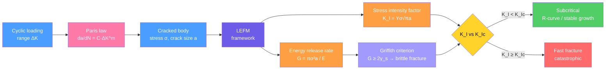

# Fracture Mechanics and Toughness

> [!abstract] TL;DR
> Fracture mechanics quantifies when a crack becomes catastrophic. The stress intensity factor $K_I = Y\sigma\sqrt{\pi a}$ measures crack-tip stress amplification; fast fracture occurs when $K_I$ reaches the material's plane-strain fracture toughness $K_{Ic}$. Fatigue cracks grow subcritically according to the Paris law $da/dN = C(\Delta K)^m$. Ignorance of these principles caused the Comet crashes (1954), Liberty ship failures (WWII), and the Titanic disaster.

---

## Intuition

**Analogy:** Tearing a sheet of paper is easy if you first nick the edge with scissors — that tiny notch is a stress amplifier. Without the notch, the applied force spreads across the full width. With it, all the force crowds into a microscopic tip, raising local stress a hundredfold. A sharper notch amplifies more than a rounded one: the stress at the tip scales as $\sim \sqrt{a/\rho}$, where $a$ is crack length and $\rho$ is tip radius. An atomically sharp crack has $\rho \approx 0.1$ nm — the sharpest possible amplifier.

Alan Griffith (1921) asked a deeper question: even if the local stress is enormous, *when* does the crack actually run? His answer was thermodynamic: a crack grows only if the elastic strain energy released by its advance exceeds the surface energy cost of creating new crack faces. That energy balance gives the critical stress — the Griffith criterion. Irwin later rephrased it as a stress intensity factor, making it directly computable for engineering geometries.

---

## How It Works

The field is called **Linear Elastic Fracture Mechanics (LEFM)**: we assume the plastic zone at the crack tip is small relative to the crack and component dimensions, so the bulk response is elastic. Two complementary views — energy and stress — give equivalent results.



**The Griffith energy balance.** For a through-crack of half-length $a$ in an infinite plate under remote stress $\sigma$, the elastic strain energy released per unit thickness as the crack extends by $\delta a$ is:

$$G = \frac{\pi \sigma^2 a}{E} \quad \text{(plane stress)}$$

The energy cost of creating new surfaces is $2\gamma_s$ per unit crack advance (two new faces). Fracture occurs when $G \geq 2\gamma_s$, giving the **Griffith critical stress**:

$$\boxed{\sigma_f = \sqrt{\frac{2E\gamma_s}{\pi a}}}$$

Larger crack $\Rightarrow$ lower $\sigma_f$. This explains why flawed glass fails at a tiny fraction of its theoretical strength ($E/10$).

**Irwin's stress intensity factor.** The crack-tip stress field in Mode I (opening) is:

$$\sigma_{ij} = \frac{K_I}{\sqrt{2\pi r}}\, f_{ij}(\theta) + \text{higher order terms}$$

where $r$ is distance from the tip, $\theta$ is angle, and $K_I$ completely characterises the amplitude of the singular field. For a through-crack of half-length $a$ under remote tension:

$$\boxed{K_I = Y\sigma\sqrt{\pi a}}$$

$Y$ is a dimensionless geometry factor ($Y = 1$ for a central crack in an infinite plate; $Y \approx 1.12$ for an edge crack). Fracture occurs when $K_I = K_{Ic}$, the **fracture toughness** — a material constant.

**Connecting the two frameworks:**

$$G = \frac{K_I^2}{E} \quad \text{(plane stress)}, \qquad G = \frac{K_I^2 (1-\nu^2)}{E} \quad \text{(plane strain)}$$

---

## Key Concepts

### Secondary Level

**Ductile vs brittle fracture**

The two failure modes differ in how much plastic deformation precedes failure.

| Feature | Ductile fracture | Brittle fracture |
|---------|-----------------|-----------------|
| Plastic deformation | Extensive | Little or none |
| Fracture surface | Fibrous, dull grey (cup-and-cone) | Granular, shiny, flat |
| Crack path | Transgranular (through grains) | Transgranular (cleavage) or intergranular |
| Warning before failure | Yes — necking, stretching | No — sudden |
| Energy absorbed | High | Low |

*Cup-and-cone fracture* in a tensile test: the neck develops a central flat region (Mode I fracture of internal voids) surrounded by a shear lip at ~45° (shear-lip zone) — hence "cup" on one piece and "cone" on the other.

*Cleavage fracture* in brittle materials: crack runs along specific crystallographic planes (e.g., {100} in BCC iron) — facets glint in light, giving a "crystalline" appearance.

**Charpy V-notch impact test**

A notched bar is struck by a pendulum; the energy absorbed is measured from the change in pendulum height. Reported in joules (or ft·lb). The test is simple, cheap, and widely used in structural steel specifications.

**Ductile-to-Brittle Transition Temperature (DBTT)**

BCC metals (iron, carbon steel, tungsten, chromium) have a sharp DBTT: they are tough at room temperature but absorb little energy below the transition. FCC metals (copper, aluminium, austenitic stainless steel, nickel) do *not* show a DBTT — they remain tough at cryogenic temperatures.

Physical reason: dislocation mobility in BCC metals drops sharply at low temperature (Peierls stress is temperature-sensitive in BCC), so plastic work at the crack tip becomes impossible — fracture becomes brittle.

DBTT is raised by: high carbon content, high strain rate, increased grain size, radiation embrittlement.
DBTT is lowered by: nickel additions, grain refinement, normalising heat treatment.

### Undergraduate Level

**Three fracture modes**

- **Mode I (opening):** tensile stress perpendicular to crack plane — most common and most dangerous. $K_I = Y\sigma\sqrt{\pi a}$.
- **Mode II (in-plane sliding):** shear stress parallel to crack, in crack plane. $K_{II} = Y\tau\sqrt{\pi a}$.
- **Mode III (anti-plane tearing):** shear stress perpendicular to crack plane. $K_{III} = Y\tau\sqrt{\pi a}$.

Most structural failures involve Mode I; mixed-mode fracture (Mode I + II) occurs under oblique loading.

**Fracture toughness $K_{Ic}$: plane strain lower bound**

$K_{Ic}$ is measured under plane-strain conditions (thick specimen) to obtain the most conservative (minimum) value. The ASTM E399 validity requirement is:

$$B,\ a,\ (W-a) \;\geq\; 2.5\left(\frac{K_{Ic}}{\sigma_y}\right)^2$$

where $B$ is specimen thickness, $W$ is width, and $\sigma_y$ is yield strength. In plane strain, the through-thickness constraint suppresses plastic deformation, giving lower toughness than plane stress (thin sheet), where the material shear-lips freely.

**Representative $K_{Ic}$ values:**

| Material | $K_{Ic}$ (MPa $\sqrt{\text{m}}$) | Character |
|----------|----------------------------------|-----------|
| Soda-lime glass | 0.7–0.8 | Very brittle |
| Alumina ($\text{Al}_2\text{O}_3$) | 3–5 | Brittle ceramic |
| Silicon carbide (SiC) | 3–4 | Brittle ceramic |
| Concrete | 0.3–1.5 | Quasi-brittle |
| PMMA (acrylic) | 1–2 | Brittle polymer |
| Nylon 66 | 2.5–3 | Semi-ductile polymer |
| Aluminium alloys (2024-T3) | 24–37 | Ductile metal |
| Structural steel (A36) | 50–100 | Ductile metal |
| High-strength steel (4340) | 50–60 | Moderate toughness |
| Ti-6Al-4V | 55–115 | Aerospace alloy |
| Maraging steel | 80–180 | Very tough |

The range for metals reflects heat treatment — a harder alloy is stronger but tougher in absolute terms only if $K_{Ic}$ doesn't drop proportionally.

**Critical crack size in service**

Rearranging $K_{Ic} = Y\sigma\sqrt{\pi a}$ gives the maximum tolerable crack size at operating stress $\sigma$:

$$a_c = \frac{1}{\pi}\left(\frac{K_{Ic}}{Y\sigma}\right)^2$$

**Example:** High-strength steel with $K_{Ic} = 55$ MPa$\sqrt{\text{m}}$, operating at $\sigma = 700$ MPa, $Y = 1$:

$$a_c = \frac{1}{\pi}\left(\frac{55}{700}\right)^2 \approx 2.0 \text{ mm}$$

A 2 mm crack is invisible to the naked eye but enough to cause catastrophic failure at full service load. Non-destructive evaluation (NDE) must reliably detect cracks smaller than $a_c$.

### Graduate Level

**Small-scale yielding (SSY) and the plastic zone**

LEFM is valid only when the plastic zone radius $r_p$ is small relative to crack dimensions:

$$r_p \approx \frac{1}{2\pi}\left(\frac{K_I}{\sigma_y}\right)^2 \quad \text{(plane stress)}$$

In plane strain, constraint triples the yield stress at the tip, shrinking $r_p$ by ~3×. When $r_p$ becomes comparable to $a$, LEFM breaks down — one needs $J$-integral or CTOD approaches.

**$J$-integral (Rice 1968)**

For a path $\Gamma$ encircling the crack tip (any path, by path-independence):

$$J = \int_\Gamma \left(W\, dy - \mathbf{T}\cdot\frac{\partial\mathbf{u}}{\partial x}\, ds\right)$$

where $W$ is strain energy density and $\mathbf{T}$ is traction vector. $J$ is the energy release rate generalised to nonlinear (elastic-plastic) materials. Under SSY: $J = G = K_I^2/E$. Critical value $J_{Ic}$ governs fracture initiation when large-scale yielding prevents $K_{Ic}$ testing.

**R-curve behaviour**

The fracture resistance $R$ is not always a constant (as Griffith assumed). For ductile materials, $R$ rises with crack extension $\Delta a$ due to crack bridging, process zone wake shielding, or plastic zone enlargement:

- **Flat R-curve** (glass, brittle ceramics): $R = G_c$ constant; fracture is always unstable once $G \geq G_c$.
- **Rising R-curve** (toughened ceramics, metals, composites): $G_R(\Delta a)$ increases with crack advance.

Stability condition for a loading configuration with compliance $C$:
- **Stable growth:** $dG/da < dR/da$
- **Instability (fast fracture):** $dG/da = dR/da$ (tangency) — the crack accelerates to the speed of sound.

**Paris law for fatigue crack growth (1963)**

Under cyclic loading with stress range $\Delta\sigma = \sigma_{max} - \sigma_{min}$, the stress intensity range is $\Delta K = Y\Delta\sigma\sqrt{\pi a}$ and the crack grows per cycle as:

$$\boxed{\frac{da}{dN} = C (\Delta K)^m}$$

$C$ and $m$ are material constants (for structural steels: $C \approx 3 \times 10^{-12}$ [units: m/cycle, MPa$\sqrt{\text{m}}$], $m \approx 3$).

Three regimes in the $\log(da/dN)$–$\log(\Delta K)$ diagram:
1. **Threshold region** ($\Delta K < \Delta K_{th}$): crack is dormant; $\Delta K_{th} \approx 3$–5 MPa$\sqrt{\text{m}}$ for steels.
2. **Paris regime** (central linear region): power-law growth dominates.
3. **Fast fracture region** ($K_{max} \to K_{Ic}$): growth accelerates to unstable fracture.

Integrating the Paris law from initial crack $a_0$ to critical crack $a_c$ gives the **fatigue life** $N_f$:

$$N_f = \int_{a_0}^{a_c} \frac{da}{C(\Delta K)^m} = \int_{a_0}^{a_c} \frac{da}{C (Y\Delta\sigma\sqrt{\pi a})^m}$$

For $m \neq 2$:

$$N_f = \frac{2}{C(Y\Delta\sigma)^m \pi^{m/2}(m-2)} \left[ a_0^{1-m/2} - a_c^{1-m/2} \right]$$

**Key insight:** because $da/dN \propto (\Delta K)^m$ and $m \approx 3$, doubling the stress range increases crack growth rate eightfold. Most fatigue life is spent growing the crack from $a_0$ to $a_0/2 \times 10^1$ — the final doubling to $a_c$ consumes only a few percent of total cycles.

**Weibull statistics for brittle fracture**

The fracture strength of brittle ceramics has statistical scatter because flaw sizes are distributed. The probability of survival at stress $\sigma$ is:

$$P_s = \exp\left[-\left(\frac{\sigma}{\sigma_0}\right)^m\right]$$

where $m$ is the Weibull modulus (ceramics: $m \approx 5$–20; higher $m$ means less scatter; metals: $m > 50$). Engineering design with ceramics requires specifying a failure probability (e.g., $P_f < 10^{-4}$) and working backwards to an allowable stress.

---

## Python Demo

```python
import numpy as np
import matplotlib.pyplot as plt

# Fracture toughness K_Ic (MPa * sqrt(m)) for three material classes
materials = {
    "Soda-lime glass":  {"K_Ic": 0.75,  "color": "royalblue",  "ls": "-"},
    "Alumina ceramic":  {"K_Ic": 4.0,   "color": "darkorange", "ls": "-"},
    "Structural steel": {"K_Ic": 55.0,  "color": "firebrick",  "ls": "-"},
}

# Crack half-length range (metres): 0.05 mm to 100 mm
a = np.linspace(0.05e-3, 100e-3, 1000)
Y = 1.0  # geometry factor: central crack in infinite plate

fig, (ax1, ax2) = plt.subplots(1, 2, figsize=(13, 5))

# --- Panel 1: critical stress vs crack size (log-log) ---
for name, props in materials.items():
    K_Ic = props["K_Ic"]          # MPa sqrt(m)
    sigma_f = K_Ic / np.sqrt(np.pi * a)   # MPa
    ax1.loglog(a * 1e3, sigma_f, label=name,
               color=props["color"], lw=2.5, ls=props["ls"])

# Reference yield/tensile strength lines
ax1.axhline(70,  color="royalblue",  ls=":", alpha=0.7, lw=1.5,
            label="Glass tensile strength ~70 MPa")
ax1.axhline(300, color="firebrick",  ls=":", alpha=0.7, lw=1.5,
            label="Steel yield strength ~300 MPa")

ax1.set_xlabel("Crack half-length  a  (mm)", fontsize=12)
ax1.set_ylabel("Critical fracture stress  σ_f  (MPa)", fontsize=12)
ax1.set_title("Griffith–Irwin: σ_f = K_Ic / sqrt(π·a)\n"
              "Larger crack → lower fracture stress", fontsize=11)
ax1.legend(fontsize=9)
ax1.grid(True, which="both", alpha=0.25)

# --- Panel 2: Paris law - crack growth rate vs Delta K for steel ---
# da/dN = C * (Delta_K)^m  [units: m/cycle, MPa sqrt(m)]
C = 3e-12    # typical structural steel
m = 3.0
Delta_K = np.logspace(np.log10(1), np.log10(80), 300)   # MPa sqrt(m)
dadN = C * Delta_K**m                                     # m/cycle

K_Ic_steel = 55.0    # MPa sqrt(m)
K_th       = 4.0     # threshold

ax2.loglog(Delta_K, dadN * 1e6, color="firebrick", lw=2.5, label="Paris regime")
ax2.axvline(K_th,       color="steelblue", ls="--", lw=1.8, label=f"Threshold ΔK_th = {K_th} MPa√m")
ax2.axvline(K_Ic_steel, color="darkred",   ls="--", lw=1.8, label=f"K_Ic = {K_Ic_steel} MPa√m")

ax2.fill_betweenx([dadN.min()*1e6, dadN.max()*1e6],
                  Delta_K.min(), K_th,
                  alpha=0.12, color="steelblue", label="No-growth zone")
ax2.fill_betweenx([dadN.min()*1e6, dadN.max()*1e6],
                  K_Ic_steel, Delta_K.max(),
                  alpha=0.12, color="darkred", label="Fast fracture zone")

ax2.set_xlabel("Stress intensity range  ΔK  (MPa·√m)", fontsize=12)
ax2.set_ylabel("Crack growth rate  da/dN  (μm/cycle)", fontsize=12)
ax2.set_title(f"Paris Law: da/dN = C·ΔK^m\n"
              f"Structural steel: C={C:.0e}, m={m}", fontsize=11)
ax2.legend(fontsize=9)
ax2.grid(True, which="both", alpha=0.25)

plt.tight_layout()
plt.show()
```

---

## Real-World Applications

> **de Havilland Comet (1954):** The world's first commercial jet had square windows with rivet holes — both features create stress concentrations ($K_t$ up to ~3 at corners). Each pressurisation cycle grew fatigue cracks at the window corners. After ~1000 flights the cracks reached $a_c$ and catastrophic explosive decompression destroyed the aircraft. The BOAC Comet disasters directly produced modern aircraft certification requiring fatigue and damage tolerance analysis, and drove Irwin to formalise the stress intensity factor.

> **Liberty ships (WWII):** The US produced ~2700 all-welded cargo ships rapidly during WWII. In contrast to riveted ships (where a crack arrests at every rivet hole), welded hulls provided continuous crack paths. Worse, the steel had a DBTT around 0°C; in cold North Atlantic waters, welded ships fractured in harbour with a sharp crack running from bow to stern. Root cause: BCC steel below DBTT + welding residual stresses + long uninterrupted crack paths. Fix: notch-toughness specifications on ship plate steel.

> **Titanic (1912):** Metallurgical analysis of recovered hull plate showed steel with high sulfur content (~0.069 wt% S), which forms manganese sulfide stringers acting as crack nucleation sites. Combined with the sub-zero North Atlantic water (well below DBTT for that composition), the hull plate fractured in brittle cleavage on iceberg impact rather than denting plastically — accelerating flooding and sinking.

> **Pressure vessels and leak-before-break:** Modern pressure vessel codes (ASME VIII, ASTM) require that wall thickness be chosen so that a through-wall crack (leak) is detectable before $K_I$ reaches $K_{Ic}$ — "leak before break" rather than "burst". This requires $2t < a_c$ — the wall thickness must be less than half the critical crack length.

> **Ceramic engineering (turbine blades, cutting tools):** $K_{Ic}$ values of 3–10 MPa$\sqrt{\text{m}}$ in ceramics mean that flaws of only tens of micrometres are critical at service stress. Weibull analysis governs design; surface finishing, proof testing, and flaw-tolerant microstructures (crack bridging by SiC whiskers or $\text{ZrO}_2$ transformation toughening) are used to raise effective toughness.

---

## Common Pitfalls

- **Confusing toughness with hardness or strength.** Toughness ($K_{Ic}$ or area under stress-strain curve) is resistance to crack propagation. A hard, high-strength material can be brittle (low $K_{Ic}$). High-carbon martensite has UTS > 2 GPa but $K_{Ic} \approx 20$ MPa$\sqrt{\text{m}}$ — far more dangerous than a tough steel at lower strength.

- **Applying LEFM when the plastic zone is large.** If $r_p \sim a$, the $K_I$ field is not valid — you are in large-scale yielding territory. Use $J_{Ic}$ or CTOD. Thin sheets and very tough metals often violate SSY; beware of blindly applying $K_{Ic}$ tabulated values to thin cross-sections.

- **Forgetting the geometry factor $Y$.** The formula $K_I = \sigma\sqrt{\pi a}$ is only exact for a centre crack in an infinite plate. An edge crack has $Y \approx 1.12$; a semicircular surface crack has $Y \approx 0.73$; a corner crack near a stress concentration can have $Y > 3$. Using $Y=1$ for an edge crack underestimates $K_I$ by 12%.

- **Treating $K_{Ic}$ as temperature- and rate-independent.** Toughness drops with decreasing temperature (DBTT in BCC) and with increasing strain rate (Charpy measures high rate; slow loading gives higher apparent toughness). Always check that test conditions match service conditions.

- **Misinterpreting the Charpy energy as a fracture mechanics quantity.** Charpy energy (in joules) is not directly convertible to $K_{Ic}$ in general — empirical correlations exist (Rolfe-Barsom, etc.) but they are approximate. Charpy is a screening test; $K_{Ic}$ requires proper fracture mechanics specimens.

- **Neglecting the stress ratio $R = K_{min}/K_{max}$ in fatigue.** The Paris law is often stated without $R$: at higher $R$ (mean load closer to peak load), crack growth is faster because the crack stays more open on the compressive half-cycle (crack closure effect). Ignore $R$ and you can underestimate fatigue crack growth rate by an order of magnitude.

---

## Related Concepts

- [[Stress_Strain_and_Elastic_Moduli]] — elastic modulus $E$ and Poisson's ratio $\nu$ appear directly in $G = K^2/E$; the stress-strain framework underpins Griffith's energy derivation
- [[Fatigue_Creep_and_High_Temperature_Failure]] — Paris law connects fracture mechanics to cyclic fatigue; creep crack growth at high temperature follows analogous $C^*$-integral framework
- [[Ceramics_and_Glasses]] — brittle fracture, Weibull statistics, and transformation toughening are central to ceramic design
- [[Composite_Materials_and_Fiber_Reinforcement]] — fibre bridging raises the R-curve; delamination fracture is analysed with $G_{Ic}$ and Mode I/II mixed-mode criteria
- [[_MOC_Mechanical_Properties]] — section map of mechanical properties notes
- [[Laws_of_Thermodynamics]] *(Physics vault)* — Griffith's criterion is a thermodynamic energy balance; the connection between free energy minimisation and crack driving force is a direct application of the first and second laws
- [[_MOC_Physics_Master]] *(Physics vault)* — condensed matter physics of dislocations, plasticity, and atomic bonding underlie the difference between ductile and brittle behaviour

---

## Review Questions

1. **Secondary — conceptual:** A steel ship hull fractures catastrophically in cold Arctic waters but the same ship survives tropical routes at full load. Explain in terms of DBTT and the Charpy test. What alloying addition would you specify to lower the DBTT, and why?

2. **Undergraduate — quantitative:** An aluminium alloy pressure vessel ($K_{Ic} = 35$ MPa$\sqrt{\text{m}}$, $\sigma_y = 500$ MPa) operates at hoop stress $\sigma = 250$ MPa. (a) Calculate the critical surface crack half-length $a_c$ (use $Y = 0.73$ for a semicircular surface crack). (b) Check whether LEFM is valid. (c) If the NDE detection limit is 1 mm, is the vessel safe if the detected crack is 0.8 mm deep?

3. **Graduate — design and trade-off:** You are designing an aircraft wing spar from a high-strength titanium alloy ($K_{Ic} = 60$ MPa$\sqrt{\text{m}}$, $\sigma_y = 900$ MPa, Paris constants $C = 1.5 \times 10^{-11}$, $m = 3.2$ in SI units). The spar experiences $\Delta\sigma = 200$ MPa per flight cycle, and NDE can reliably detect cracks of $a_0 = 0.5$ mm. (a) Using the Paris law, estimate the number of flight cycles to grow from $a_0 = 0.5$ mm to critical $a_c$. (b) If the aircraft is certificated for 30,000 cycles, is a factor-of-2 scatter in $C$ acceptable? (c) How does switching to a tougher but lower-strength alloy ($K_{Ic} = 90$ MPa$\sqrt{\text{m}}$, $\sigma_y = 700$ MPa) change the answer, considering both $a_c$ and $N_f$?

---

## Sources

- Callister, W. D. & Rethwisch, D. G. — *Materials Science and Engineering: An Introduction*, 10th ed., Chapters 8–9 (fracture, fatigue, creep)
- Anderson, T. L. — *Fracture Mechanics: Fundamentals and Applications*, 4th ed. (CRC Press) — the standard graduate-level reference
- Griffith, A. A. (1921) — "The Phenomena of Rupture and Flow in Solids," *Phil. Trans. R. Soc. A* 221, 163–198 — original paper
- Irwin, G. R. (1957) — "Analysis of Stresses and Strains Near the End of a Crack Traversing a Plate," *J. Appl. Mech.* 24, 361–364
- Paris, P. & Erdogan, F. (1963) — "A Critical Analysis of Crack Propagation Laws," *J. Basic Eng.* 85, 528–534

---

#MaterialsScience #FractureMechanics #Toughness #Fracture #MechanicalProperties #Griffith #LEFM #ParisLaw #DBTT #secondary #undergraduate #graduate
