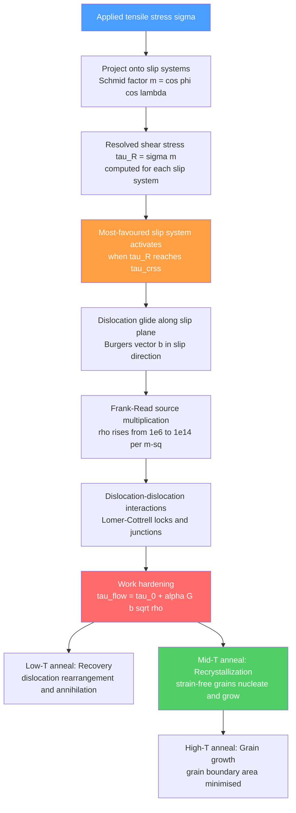

# ⚙️ Plastic Deformation and Slip Systems

> [!abstract] TL;DR
> Metals deform plastically not by shearing every atomic bond simultaneously — which would require stress ~G/30 ≈ 3 GPa for copper — but by gliding **dislocations** one atomic step at a time along specific crystallographic planes and directions called **slip systems**. This lowers the required stress by three to five orders of magnitude. **Schmid's law** identifies which slip system activates first; increasing dislocation density causes **work hardening** ($\sigma_y = \sigma_0 + K\varepsilon^n$); and thermal annealing restores ductility through recovery and recrystallization.

---

## Intuition

**Analogy:** Moving a heavy rug across a floor by shoving it wholesale requires fighting friction across every square centimetre simultaneously. Instead, wrinkle one edge forward, roll the wrinkle to the far end, and smooth it flat — the rug has moved one wrinkle-width with far less effort. A **dislocation** is exactly that wrinkle in the crystal lattice: one extra half-plane of atoms advancing through the solid, displacing it by one Burgers vector while breaking and remaking only a single line of atomic bonds at a time.

This is why the theoretical shear strength of a perfect crystal ($\approx G/30 \approx 3\ \text{GPa}$ for copper) is roughly 1 000 times larger than the measured yield stress of annealed pure copper ($\approx 1\ \text{MPa}$). Dislocations are the mobile defects that make metals formable, not brittle.

---

## How It Works

A dislocation moves under an applied shear stress, glides across a slip plane, and when it exits the crystal it shifts the lattice above the plane by one Burgers vector **b** relative to the lattice below — producing a step on the surface. Collective glide of many dislocations on many parallel planes adds up to macroscopic plastic strain.

### Core Mechanics

**Step 1 — Resolve stress onto slip system.**
For a tensile specimen with applied stress $\sigma$, the resolved shear stress on a slip system whose plane normal makes angle $\phi$ and whose slip direction makes angle $\lambda$ with the tensile axis is:

$$\boxed{\tau_R = \sigma \cos\phi \cos\lambda}$$

The product $m = \cos\phi\cos\lambda$ is the **Schmid factor**. The slip system with the largest $m$ (maximum $= 0.5$ when $\phi = \lambda = 45°$) activates first.

**Step 2 — Critical resolved shear stress (CRSS).**
Slip initiates when $\tau_R$ reaches $\tau_\text{crss}$, the material's intrinsic resistance to dislocation motion. For pure annealed FCC metals, $\tau_\text{crss}$ is typically 0.5–2 MPa.

**Step 3 — Dislocation multiplication.**
Pinned dislocation segments bow out under stress (Frank-Read mechanism), loop around their pin points, and regenerate new dislocation rings. Starting from $\rho_0 \sim 10^{6}\ \text{m}^{-2}$ in an annealed crystal, heavy cold work drives $\rho \sim 10^{14}\ \text{m}^{-2}$.

**Step 4 — Work hardening.**
As dislocation density rises, dislocations block each other. The **Taylor relation** quantifies this at the microstructural level:

$$\tau_\text{flow} = \tau_0 + \alpha G b \sqrt{\rho}$$

where $G$ is the shear modulus, $b = |\mathbf{b}|$ is the Burgers vector magnitude, and $\alpha \approx 0.3$–$0.5$ is a geometric constant. At the macroscopic level the **Hollomon equation** fits tensile data:

$$\sigma_y = \sigma_0 + K\varepsilon^n$$

where $n$ (strain-hardening exponent, $0.1$–$0.5$ for metals) measures the rate of hardening; large $n$ delays necking.

**Step 5 — Annealing.**
- **Recovery** (low $T$): Dislocations annihilate in pairs or rearrange into low-energy tilt walls (polygonization). Stored elastic strain energy drops; hardness decreases slightly.
- **Recrystallization** (medium $T \gtrsim 0.4\,T_m$): New strain-free grains nucleate at sites of high stored energy and consume the deformed microstructure. Strength drops sharply; ductility is restored.
- **Grain growth** (high $T$): Strain-free grains coarsen to reduce total grain-boundary area. Hall-Petch strengthening decreases.



---

## Key Concepts

### Secondary Level

**What is plastic deformation?** When a metal is stretched beyond its elastic limit, atoms permanently shift positions — it cannot spring back to its original shape. In everyday terms: bending a paper clip past its elastic range. In metals, this permanent shift happens by dislocations moving, not by catastrophic fracture (as in glass), because metals have enough slip systems to redistribute stress.

**What is a slip system?** Atoms in a metal sit on crystal planes. The most tightly packed planes are smoothest to slide along (fewest bumps). A **slip system** is one particular smooth plane (the **slip plane**) paired with one closely packed sliding direction (the **slip direction**). It is the crystal's preferred "track" for dislocations.

**Why do FCC metals like copper and aluminium bend so easily?** FCC crystals have 12 independent slip systems — many different orientations can accommodate plastic flow no matter how the crystal is loaded. HCP metals like magnesium and zinc have only 3 basal slip systems at room temperature, so they crack rather than bend.

**Work hardening in everyday life:** A copper wire becomes stiffer and springier the more it is bent back and forth. Each bending cycle multiplies the dislocation density inside, making the next bending cycle harder. Eventually it fractures — that is fatigue-assisted work hardening.

### Undergraduate Level

**Slip systems by crystal structure:**

| Structure | Primary slip plane | Slip direction | Independent systems | Ductility |
|-----------|-------------------|----------------|---------------------|-----------|
| FCC | $\{111\}$ | $\langle 110 \rangle$ | 12 | High |
| BCC | $\{110\}$ | $\langle 111 \rangle$ | 12 (+ $\{112\}$, $\{123\}$) | Moderate |
| HCP | $\{0001\}$ | $\langle 11\bar{2}0 \rangle$ | 3 | Low at RT |

FCC: 4 distinct $\{111\}$ planes $\times$ 3 $\langle 110 \rangle$ directions per plane = 12. The von Mises criterion requires 5 independent systems for homogeneous polycrystal deformation; FCC satisfies this easily. HCP's 3 basal systems do not, which is why Mg and Ti alloys need prismatic or pyramidal slip (activated by alloying or elevated temperature) to be ductile.

**Schmid's law and orientation dependence.**
In a tensile test on a single crystal, yield stress varies dramatically with orientation. The **Schmid factor** $m = \cos\phi\cos\lambda$ reaches its maximum of $0.5$ when both angles equal $45°$. A crystal with $m = 0.5$ yields at the lowest applied stress; one aligned with the slip direction along the tensile axis ($\lambda = 0$, $m = 0$) cannot yield by that slip system at all — a different system must activate. This is directly measured in FCC copper single crystals and used to extract $\tau_\text{crss}$.

**Three stages of single-crystal work hardening (FCC):**
- **Stage I (easy glide):** A single slip system is active. Dislocations glide long distances without interacting. Very low hardening rate $\theta_\text{I} \approx G/3000$.
- **Stage II (linear hardening):** Multiple slip systems activate; dislocations on intersecting systems interact and form locks. Hardening rate $\theta_\text{II} \approx G/300$, nearly temperature-independent and nearly universal for FCC metals.
- **Stage III (dynamic recovery):** Cross-slip of screw dislocations allows bypass of obstacles. Hardening rate $\theta_\text{III}$ decreases continuously; strongly temperature- and strain-rate-dependent.

**Dislocation density and the Taylor relation.**
Dislocation density $\rho$ (line length per unit volume, m$^{-2}$) links microscopic structure to macroscopic strength. X-ray line broadening (Warren-Averbach method) and TEM can measure $\rho$ directly. Fitting $\tau = \tau_0 + \alpha Gb\sqrt{\rho}$ to experimental data gives consistent $\alpha \approx 0.3$–$0.5$ across many FCC metals — validating the underlying forest-hardening mechanism.

**Recovery and recrystallization:**
- Recovery removes long-range internal stress fields without creating new grain boundaries; hardness drops ~10–20%.
- Recrystallization is a thermally activated nucleation-and-growth process. The recrystallized fraction obeys the Johnson-Mehl-Avrami equation: $X = 1 - \exp(-kt^n)$.
- Recrystallization temperature is roughly $0.4\,T_m$ (absolute) for heavily worked metals; alloying, second-phase particles, and purity all shift this value.

### Graduate Level

**Taylor factor and polycrystal plasticity.**
Von Mises (1928) showed that for a polycrystal grain to deform compatibly with its neighbours, 5 independent strain components must be accommodated — requiring at least 5 independent slip systems per grain. Taylor (1938) proposed that the set of 5 active systems in each grain is the one minimising total plastic work, leading to the **Taylor factor** $M$:

$$\sigma_y^\text{poly} = M\,\tau_\text{crss}$$

For a randomly textured FCC polycrystal, $M \approx 3.06$. For BCC, $M \approx 2.75$. For rolled or drawn textures, $M$ depends on the orientation distribution function (ODF) and must be computed from crystal plasticity simulations (finite-element or Taylor-Bishop-Hill models). Texture evolution under rolling, forging, and drawing determines the anisotropy of the final product.

**Dislocation geometry: jogs, kinks, and cross-slip.**
- **Kinks** are steps in the dislocation line that remain in the slip plane. Kink-pair nucleation is the rate-limiting step for BCC glide at low temperatures, explaining the strong temperature dependence of BCC yield stress (Peierls mechanism: $\tau_P \propto \exp(-2\pi w/b)$ where $w$ is dislocation width).
- **Jogs** are steps that rise out of the slip plane. Jogs on screw dislocations require non-conservative motion (vacancy or interstitial dragging) → viscous drag → contributes to creep and high-temperature strain-rate sensitivity.
- **Cross-slip**: A screw dislocation can transfer from one slip plane to another that shares the same Burgers vector (e.g., from $(111)$ to $(1\bar{1}1)$ in FCC). Cross-slip requires constriction of the extended dislocation stacking-fault ribbon; it is thermally activated and provides the main dynamic recovery mechanism in Stage III.

**Lomer-Cottrell locks.**
When dislocations on two intersecting $\{111\}$ planes in FCC react, the product Burgers vector $\mathbf{b}_3 = \mathbf{b}_1 + \mathbf{b}_2$ may lie in neither original slip plane → sessile (immobile) **Lomer-Cottrell lock**. Locks are primary obstacles in Stage II hardening. Their density saturates the flow stress at high strains and controls the Stage II hardening rate.

**Kocks-Mecking model.**
A continuum model connecting dislocation density evolution to macroscopic hardening:

$$\frac{d\rho}{d\gamma} = \frac{1}{b\Lambda} - k_2 \rho$$

where $1/(b\Lambda)$ is the athermal storage term ($\Lambda$ = mean free path) and $k_2\rho$ is the dynamic recovery term (proportional to cross-slip probability). The resulting hardening rate $\theta = d\tau/d\gamma$ decreases linearly with $\tau$:

$$\theta = \theta_0\left(1 - \frac{\tau}{\tau_\text{sat}}\right)$$

This captures Stage III and predicts the Voce saturation stress $\tau_\text{sat}$, consistent with experiment across a wide range of FCC metals and alloys.

---

## Python Demo

```python
import numpy as np
import matplotlib.pyplot as plt

# ─────────────────────────────────────────────────────────────
# Demo: Schmid factor landscape + FCC single-crystal hardening
# ─────────────────────────────────────────────────────────────

# ── Part 1: Schmid factor m = cos(phi) * cos(lambda) ──────────
phi_deg = np.linspace(0, 90, 300)
lam_deg = np.linspace(0, 90, 300)
PHI, LAM = np.meshgrid(np.radians(phi_deg), np.radians(lam_deg))
M = np.cos(PHI) * np.cos(LAM)

# ── Part 2: FCC single-crystal work-hardening stages ──────────
# Model parameters for pure copper single crystal
# Resolved shear stress tau in MPa vs shear strain gamma
tau_0   = 1.0    # CRSS of annealed copper, MPa
eps_I   = 0.12   # end of Stage I (easy glide)
eps_II  = 0.32   # end of Stage II (linear hardening)
eps_max = 0.60   # end of Stage III shown

theta_I  = 5.0   # Stage I hardening rate, MPa  (G/~10000 for Cu)
theta_II = 150.0 # Stage II hardening rate, MPa (G/~320 for Cu)

# End-of-stage stresses
tau_I_end  = tau_0 + theta_I  * eps_I
tau_II_end = tau_I_end + theta_II * (eps_II - eps_I)

# Stage III: Kocks-Mecking: theta decreases linearly to zero at tau_sat
tau_sat    = tau_II_end + 30.0     # saturation stress
theta_III0 = 0.6 * theta_II        # initial Stage III slope

def stage_iii_stress(gamma, gamma_start, tau_start, theta0, tau_sat):
    dg = gamma - gamma_start
    # theta = theta0 * (1 - tau/tau_sat)  → closed-form Voce integral:
    # tau = tau_sat - (tau_sat - tau_start) * exp(-theta0 / (tau_sat) * dg)
    return tau_sat - (tau_sat - tau_start) * np.exp(-theta0 / (tau_sat - tau_start + 1e-12) * dg)

gamma_I   = np.linspace(0, eps_I, 200)
gamma_II  = np.linspace(eps_I, eps_II, 200)
gamma_III = np.linspace(eps_II, eps_max, 200)

tau_I   = tau_0 + theta_I * gamma_I
tau_II  = tau_I_end + theta_II * (gamma_II - eps_I)
tau_III = stage_iii_stress(gamma_III, eps_II, tau_II_end, theta_III0, tau_sat)

gamma_all = np.concatenate([gamma_I, gamma_II, gamma_III])
tau_all   = np.concatenate([tau_I, tau_II, tau_III])

# ── Plotting ──────────────────────────────────────────────────
fig, axes = plt.subplots(1, 2, figsize=(13, 5))

# Left: Schmid factor contour map
im = axes[0].contourf(phi_deg, lam_deg, M, levels=25, cmap='RdYlGn')
plt.colorbar(im, ax=axes[0], label='Schmid factor  m = cosφ cosλ')
axes[0].contour(phi_deg, lam_deg, M, levels=[0.5], colors='black',
                linewidths=2.0, linestyles='--')
axes[0].plot(45, 45, 'w*', markersize=16, label='Maximum m = 0.5  at φ = λ = 45°')
axes[0].set_xlabel('φ — angle between stress axis and slip-plane normal (°)', fontsize=10)
axes[0].set_ylabel('λ — angle between stress axis and slip direction (°)', fontsize=10)
axes[0].set_title("Schmid Factor Landscape\n(dashed contour: m = 0.5)", fontsize=11)
axes[0].legend(fontsize=10, loc='upper right')

# Right: Work-hardening stages
axes[1].plot(gamma_I   * 100, tau_I,   color='#2ecc71', linewidth=3, label='Stage I — easy glide')
axes[1].plot(gamma_II  * 100, tau_II,  color='#e67e22', linewidth=3, label='Stage II — linear hardening')
axes[1].plot(gamma_III * 100, tau_III, color='#e74c3c', linewidth=3, label='Stage III — dynamic recovery')
axes[1].axvspan(0, eps_I * 100,  alpha=0.10, color='#2ecc71')
axes[1].axvspan(eps_I * 100, eps_II * 100, alpha=0.10, color='#e67e22')
axes[1].axvspan(eps_II * 100, eps_max * 100, alpha=0.10, color='#e74c3c')
axes[1].axhline(tau_sat, color='gray', linestyle=':', linewidth=1.5,
                label=f'Saturation stress τ_sat = {tau_sat:.0f} MPa')
axes[1].set_xlabel('Shear strain γ (%)', fontsize=12)
axes[1].set_ylabel('Resolved shear stress τ (MPa)', fontsize=12)
axes[1].set_title('FCC Single-Crystal Work Hardening\n(pure copper, schematic)', fontsize=11)
axes[1].legend(fontsize=10)
axes[1].grid(True, alpha=0.3)

plt.tight_layout()
plt.savefig('plastic_deformation_demo.png', dpi=150, bbox_inches='tight')
plt.show()

# Report key values
print(f"Schmid factor extremes:")
print(f"  φ=45°, λ=45° → m = {0.5:.3f}  (maximum, easiest to slip)")
print(f"  φ=0°,  λ=45° → m = {np.cos(0)*np.cos(np.radians(45)):.3f}  (hard orientation)")
print(f"\nWork-hardening stages (copper single crystal):")
print(f"  Stage I  ends at γ = {eps_I*100:.0f}%,  τ = {tau_I_end:.1f} MPa")
print(f"  Stage II ends at γ = {eps_II*100:.0f}%,  τ = {tau_II_end:.1f} MPa")
print(f"  Stage III saturates near τ_sat = {tau_sat:.0f} MPa")
```

---

## Real-World Applications

> **Deep-drawing of automotive steel panels:** The sheet must plastically deform without necking or fracturing over complex curvature. Engineers specify $n$ (Hollomon exponent) and the normal anisotropy ratio $r = \varepsilon_\text{width}/\varepsilon_\text{thickness}$ (directly controlled by crystallographic texture through the Taylor factor). High-$n$ steel delays necking; high $r$ resists thinning in the flange — both emerge from controlling the slip-system activity and texture during hot/cold rolling and annealing.

> **Aluminium beverage cans (FCC, 12 slip systems):** A flat disc is deep-drawn and ironed (wall-thinned by a factor of ~3×) in milliseconds. The high symmetry of FCC aluminium, combined with intentional work hardening during ironing, gives the final can wall both thinness (cost reduction) and the hoop strength to hold carbonation pressure (120 psi). The process works only because FCC aluminium has enough slip systems for compatible grain deformation.

> **Titanium alloys in aerospace (HCP at RT):** Ti-6Al-4V has limited basal slip at room temperature. The vanadium stabilises a BCC beta phase that provides additional slip systems, turning a near-brittle HCP metal into a highly formable alloy. Understanding slip-system activation under the Taylor framework is essential to designing thermo-mechanical processing routes for Ti blades and airframes.

> **Recrystallization in transformer cores:** Grain-oriented silicon steel (Fe-3%Si) is processed so that recrystallization produces the Goss texture $\{110\}\langle 001\rangle$ — a single preferred orientation in which magnetic domains align with the rolling direction. The result is a 50–100× reduction in magnetic hysteresis loss compared with random texture, saving gigawatts of standby power in global electrical grids.

---

## Common Pitfalls

- **Confusing theoretical shear strength with actual yield stress.** The Frenkel model ($\tau_\text{th} \approx G/30$) assumes atoms slide simultaneously over the full slip plane — physically equivalent to moving the rug all at once. Real crystals always contain pre-existing dislocations; the relevant energy barrier is the Peierls stress for a single dislocation, orders of magnitude lower.

- **Treating Schmid factor as fixed for a polycrystal.** In a polycrystal each grain has a different orientation and different active slip systems. The macroscopic yield stress is governed by the Taylor factor $M \approx 3.06$ (random FCC), not the single-crystal Schmid factor. Using $m = 0.5$ for a polycrystal significantly underestimates yield stress.

- **Ignoring the constraint $\phi + \lambda \geq 90°$ possibility.** There is no strict geometric constraint between $\phi$ and $\lambda$ for an arbitrary 3D orientation — they are independently determined by the crystal orientation. Some textbooks incorrectly state $\phi + \lambda = 90°$, which applies only to the special case where the tensile axis, slip-plane normal, and slip direction are coplanar.

- **Conflating recovery with recrystallization.** Recovery (dislocation rearrangement) occurs below the recrystallization temperature, restores some ductility, but the original grains survive — the microstructure is still deformed. Recrystallization creates entirely new grains; optical microscopy shows completely different grain boundaries. Calling any post-deformation heat treatment "annealing" without specifying which regime leads to wrong predictions of final strength.

- **Assuming Stage II hardening rate is material-specific.** $\theta_\text{II}/G \approx 1/300$ is remarkably universal across FCC metals (Cu, Ag, Au, Al, Ni). It reflects the geometry of forest-dislocation interactions, not a specific chemical bond. This universality is a powerful check: if a measured $\theta_\text{II}$ deviates strongly, it usually indicates solute drag, precipitate strengthening, or experimental error in strain measurement.

- **Overlooking cross-slip in BCC vs FCC.** In BCC metals, screw dislocations have a compact core spread across multiple $\{110\}$ planes simultaneously (non-planar core) → cross-slip is easy and thermally activated → BCC yield stress is strongly temperature-dependent below $\sim 0.25\,T_m$. FCC dislocations have planar, extended cores (split into partials) → cross-slip requires constriction energy → FCC yield stress is nearly temperature-independent. Mixing up these behaviours leads to errors in constitutive modelling.

---

## Related Concepts

- [[Defects_and_Dislocations_in_Crystals]] — Foundational note: Burgers vector, edge vs screw vs mixed character, Peierls stress, elastic energy $\propto Gb^2$; plastic deformation is the macroscopic consequence of dislocation motion described there
- [[Stress_Strain_and_Elastic_Moduli]] — Elastic regime and the onset of plasticity; Young's modulus $E$, shear modulus $G$, and Poisson's ratio $\nu$ are the material constants that appear in Schmid's law and the Taylor relation
- [[Strengthening_Mechanisms_in_Metals]] — The direct engineering continuation: how to suppress dislocation glide via solid-solution hardening, precipitation hardening, grain-boundary strengthening, and composite reinforcement; all mechanisms ultimately raise $\tau_\text{crss}$
- [[Fracture_Mechanics_and_Toughness]] — When slip systems are insufficient to accommodate stress concentrations, cracks nucleate; the competition between slip and cleavage governs ductile-to-brittle transition
- [[Heat_Treatment_and_Microstructure]] — Annealing schedules (recovery, recrystallization, grain growth) and phase transformations are designed to control dislocation density, texture, and grain size simultaneously
- [[_MOC_Mechanical_Properties]] — Section map for all mechanical-properties notes in this vault
- [[Crystal_Structure_and_Band_Theory]] — Crystallography foundations: Bravais lattices, Miller indices, close-packed planes and directions that define the slip systems discussed here
- [[Laws_of_Thermodynamics]] — Driving force for recovery and recrystallization is reduction of stored elastic strain energy (effectively a free-energy minimisation under the second law); grain growth is further driven by reduction of grain-boundary energy

---

## Review Questions

1. **(Secondary/Undergraduate)** A copper single crystal is loaded in tension with its tensile axis at $\phi = 45°$ to the slip-plane normal and $\lambda = 45°$ to the slip direction. If $\tau_\text{crss} = 1.8\ \text{MPa}$, what applied tensile stress $\sigma$ is needed to initiate slip? Now rotate the crystal so $\phi = 30°$, $\lambda = 60°$ — does yield occur at higher or lower $\sigma$, and why?

2. **(Undergraduate)** Explain why polycrystalline magnesium (HCP) fractures at small strains at room temperature while polycrystalline aluminium (FCC) deforms extensively. What alloying or processing strategy would you use to improve the ductility of magnesium, and what slip systems are you trying to activate?

3. **(Graduate)** A fully cold-worked FCC metal has dislocation density $\rho = 10^{14}\ \text{m}^{-2}$, $\alpha = 0.35$, $G = 80\ \text{GPa}$, $b = 0.25\ \text{nm}$. Estimate the forest-hardening contribution to the flow stress. If the metal is then annealed until $\rho$ drops to $10^{10}\ \text{m}^{-2}$, by how much does the flow stress decrease? Using the Taylor factor $M = 3.06$, translate both resolved shear stresses to tensile yield stresses and compare with a typical mild-steel tensile test.

---

## Sources

- Callister, W. D. & Rethwisch, D. G. *Materials Science and Engineering: An Introduction*, 10th ed. Wiley, 2018 — undergraduate-level slip systems, Schmid's law, work hardening
- Hull, D. & Bacon, D. J. *Introduction to Dislocations*, 5th ed. Butterworth-Heinemann, 2011 — definitive treatment of dislocation geometry, Peierls stress, jogs, kinks, locks
- Dieter, G. E. *Mechanical Metallurgy*, 3rd ed. McGraw-Hill, 1986 — detailed coverage of work hardening stages, Taylor factor, recrystallization
- Kocks, U. F., Tomé, C. N. & Wenk, H.-R. *Texture and Anisotropy*, Cambridge University Press, 2000 — Taylor factor, ODF, crystal plasticity modelling
- Taylor, G. I. "The mechanism of plastic deformation of crystals," *Proc. R. Soc. A* **145**, 362–387 (1934) — original Taylor relation and forest-hardening model

---

#MaterialsScience #PlasticDeformation #SlipSystems #Dislocations #WorkHardening #Recrystallization #SchmidsLaw #TaylorFactor
