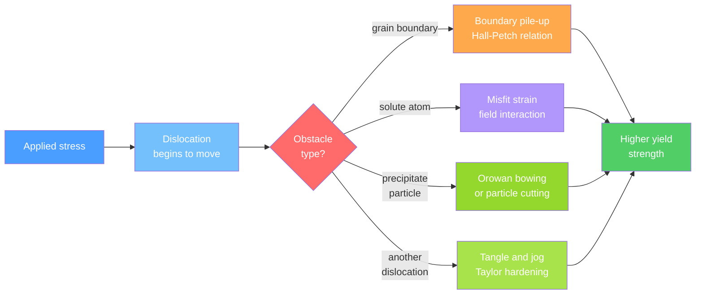

# ⚙️ Strengthening Mechanisms in Metals

> [!abstract] TL;DR
> Metals are strengthened by one universal strategy — **obstruct dislocation motion** — delivered via four mechanisms: grain boundary strengthening (Hall-Petch: $\sigma_y = \sigma_0 + k_y d^{-1/2}$), solid solution hardening ($\Delta\sigma \propto c^{1/2}$), precipitation/age hardening (Orowan bowing or particle cutting), and work hardening (Taylor: $\sigma \propto \sqrt{\rho}$). These mechanisms can be superimposed and form the quantitative foundation for designing every engineering alloy from mild steel to aerospace-grade 2024-T4 aluminium.

---

## Intuition — analogy FIRST

Imagine trying to sweep a crowd of people through a large hall. If the hall is empty the crowd flows freely. Now scatter heavy furniture around the room (solute atoms distorting the lattice), build internal partition walls that force the crowd to stop and reorganize before passing through (grain boundaries), bolt obstacles to the floor that the crowd must either squeeze around or knock over (precipitate particles), and let the crowd grow so dense that individuals constantly collide with each other (dislocation-dislocation interactions). The force required to keep the crowd moving increases with every obstacle type you add.

In a metal, the crowd is a **dislocation** — a line defect at which atomic bonds are partially broken and re-formed one step at a time, allowing permanent plastic deformation at stresses far below the theoretical shear strength of a perfect lattice ($\tau_{th} \approx G/30$, typically 3–10 GPa). Every strengthening mechanism works by making it harder to sustain that dislocation motion, raising the macroscopic yield stress.

---

## How It Works



---

## Key Concepts / Details

### Secondary Level

**Why dislocations are the key.** The theoretical shear stress to deform a perfect crystal is $\tau_{th} \approx G/30$ — roughly 3 GPa for iron. Real metals yield at 100–500 MPa, one to two orders of magnitude lower. Dislocations are line defects that allow slip to propagate one atomic bond at a time, like inching a carpet across a room by pushing a ruck through it rather than dragging the entire carpet at once. Strengthening means impeding those dislocations.

**The four mechanisms in plain language:**

- **Grain boundaries** — polycrystalline metals contain many grains with different orientations; a dislocation in grain A cannot easily cross into grain B. Smaller grains mean more boundaries per unit length, hence stronger metal.
- **Solute atoms** — a foreign atom of a different size or valence distorts the local lattice, creating a stress field that resists a passing dislocation. Bronze (Cu + Sn), stainless steel (Fe + Cr), and rebar (Fe + C interstitial) all exploit this effect.
- **Precipitates** — finely dispersed particles of a second phase (e.g. Al₂Cu in aluminium alloys) either force dislocations to bow around them or are sheared through, both requiring extra energy input.
- **Work hardening** — deforming a metal multiplies the dislocation density; those dislocations then trip over each other, and further deformation becomes progressively harder. This is why bending a paper clip repeatedly eventually snaps it.

**Strength–ductility trade-off.** Every mechanism reduces ductility alongside raising yield stress. A heavily cold-worked steel wire is strong but brittle. Annealing at $0.3$–$0.5\,T_{\text{melt}}$ recrystallizes new strain-free grains, restoring ductility at the cost of some strength.

### Undergraduate Level

**1. Grain Boundary Strengthening — Hall-Petch Relation**

$$\sigma_y = \sigma_0 + k_y \, d^{-1/2}$$

| Symbol | Meaning | Typical values |
|--------|---------|----------------|
| $\sigma_0$ | Lattice friction stress (Peierls-Nabarro); single-crystal yield stress | 16–80 MPa |
| $k_y$ | Hall-Petch slope (material constant) | 0.07–0.74 MPa·m$^{1/2}$ |
| $d$ | Mean grain diameter | 1 μm–1 mm |

**Hall-Petch parameters for common metals:**

| Metal | $\sigma_0$ (MPa) | $k_y$ (MPa·m$^{1/2}$) |
|-------|-----------------|----------------------|
| Aluminium | 16 | 0.07 |
| Copper | 25 | 0.11 |
| Titanium | 80 | 0.40 |
| Mild steel | 70 | 0.74 |

*Physical origin:* dislocations pile up at a grain boundary. The pile-up creates a stress concentration at the boundary. The boundary transmits slip only when the local stress is large enough to nucleate a dislocation in the adjacent grain. Smaller $d$ → fewer dislocations per pile-up → higher required applied stress to propagate plasticity.

> [!warning] Inverse Hall-Petch
> Below $d \approx 10$–20 nm, grain boundary **sliding** dominates over dislocation glide, and strength paradoxically decreases with further grain refinement. The Hall-Petch relation is inapplicable in the nanocrystalline regime.

---

**2. Solid Solution Hardening**

Two geometries of misfit:

- **Substitutional** (foreign atom replaces host, e.g. Cr in Fe): spherical size-misfit creates a hydrostatic strain field that interacts strongly with edge dislocations; tetragonal misfit (non-spherical atoms) interacts with both edge and screw dislocations and is much stronger per atom
- **Interstitial** (atom sits in lattice gap, e.g. C or N in Fe): tetragonal distortion in BCC iron is very large → strong hardening even at low concentrations (0.01 wt% C raises steel yield stress by ~50 MPa)

**Fleischer-Friedel model** for a random substitutional solid solution:
$$\Delta\sigma_{ss} = M\,G\,\varepsilon_s^{3/2}\,c^{1/2}$$

where $\varepsilon_s$ is the misfit parameter (fractional size difference) and $c$ is the solute concentration (atomic fraction). For strong or ordered obstacles: $\Delta\sigma \propto c^{2/3}$.

**Cottrell atmosphere (dislocation locking):** interstitial solutes (C, N in iron) diffuse slowly to dislocation cores at or below room temperature, forming a segregated "atmosphere" that must be broken free before macroscopic slip begins. This produces a sharp **upper yield point** followed by a lower yield plateau in mild steel tensile tests. Lüders band fronts propagate at the lower stress, giving serrated stress-strain curves (Portevin-Le Chatelier effect at elevated temperature).

---

**3. Precipitation Hardening (Age Hardening)**

Three-stage heat treatment cycle:
1. **Solutionize** (e.g. 495 °C for Al 2024): dissolve all solute into a single-phase solid solution
2. **Quench** (rapid water/air quench): freeze in a supersaturated solid solution (SSSS)
3. **Age** (artificial: 120–190 °C for Al alloys; natural: room temperature): allow controlled, fine-scale precipitation

Precipitation sequence for the Al–Cu system (most studied):
$$\text{SSSS} \;\rightarrow\; \text{GP zones} \;\rightarrow\; \theta''\,(\text{metastable coherent}) \;\rightarrow\; \theta'\,(\text{semicoherent}) \;\rightarrow\; \theta\,(\text{Al}_2\text{Cu, equilibrium})$$

- **GP zones** (Guinier-Preston): Cu-rich monolayers on {100} planes, 1–2 atoms thick, fully coherent — small hardening, fast to form
- **$\theta''$** (metastable): thin discs, coherent, optimal obstacle size — peak hardening in many tempers
- **$\theta'$** (semicoherent): larger discs, partial misfit — transition regime
- **$\theta$** (incoherent equilibrium): large, widely spaced → overaged, soft

**Two dislocation-particle interaction regimes:**

| Regime | Condition | Mechanism | Strength vs particle size |
|--------|-----------|-----------|--------------------------|
| Cutting | Small, coherent particles ($r < r^*$) | Dislocation shears through precipitate | $\tau \propto r^{1/2}f^{1/2}$ — increases with $r$ |
| Orowan bowing | Large, incoherent particles ($r > r^*$) | Dislocation bows between particles, leaves Orowan loop | $\tau = Gb/L \propto f^{1/2}/r$ — decreases with $r$ |

Here $r$ is particle radius, $f$ is volume fraction, and $L \propto r/\sqrt{f}$ is the inter-particle spacing. **Peak hardness occurs at the crossover radius $r^*$** where both mechanisms give equal stress — this is the target state for optimal temper.

The Orowan bypass stress, more precisely:
$$\tau_{\text{Orowan}} = \frac{0.81\,Gb}{2\pi\sqrt{1-\nu}\,L}\ln\!\left(\frac{\bar{r}}{b}\right)$$

where $\nu$ is Poisson's ratio, $\bar{r}$ is mean particle radius, and $b$ is the Burgers vector magnitude.

---

**4. Work Hardening (Strain Hardening)**

**Power-law empirical fit** (Hollomon relation):
$$\sigma = \sigma_0 + K\,\varepsilon^n$$

where $K$ is the strength coefficient and $n$ (0.1–0.5) is the strain-hardening exponent. High $n$ (≥ 0.3) means good formability — deformation spreads uniformly instead of localizing into a neck.

**Taylor's relation** (physical basis):
$$\sigma = M\,\alpha\,G\,b\,\sqrt{\rho}$$

| Symbol | Meaning | Typical value |
|--------|---------|---------------|
| $\rho$ | Dislocation density | $10^{10}$ m$^{-2}$ (annealed) → $10^{15}$–$10^{16}$ m$^{-2}$ (heavy cold work) |
| $M$ | Taylor factor (crystal orientation averaging) | ≈ 3.1 for polycrystalline FCC |
| $\alpha$ | Numerical constant (dislocation interaction strength) | 0.3–0.5 |
| $G$ | Shear modulus | 26 GPa (Al), 80 GPa (Fe) |
| $b$ | Burgers vector magnitude | 0.25–0.29 nm |

*Mechanism:* Frank-Read sources multiply dislocations during straining. As $\rho$ increases, dislocation mean free path decreases — dislocations tangle, form cell walls, and create jogs — causing hardening rate $d\sigma/d\varepsilon$ to decrease from stage II (linear, athermal) to stage III (parabolic, thermally activated cross-slip).

**Annealing sequence to restore ductility:**

| Stage | Temperature | Mechanism | Effect |
|-------|-------------|-----------|--------|
| Recovery | $< 0.3\,T_m$ | Dislocation rearrangement (polygonization) into sub-grain walls | Slight softening, no new grains |
| Recrystallization | $0.3$–$0.5\,T_m$ | Strain-free nuclei grow from high-energy sites | Dramatic softening, grain refinement possible |
| Grain growth | $> 0.5\,T_m$ | Grain boundary migration minimizes area | Hall-Petch softening if uncontrolled |

### Graduate Level

**Superposition of Strengthening Mechanisms**

For mechanisms involving the same type of dislocation-obstacle interaction (all long-range or all short-range), **linear superposition** applies:
$$\sigma_{\text{total}} = \sigma_0 + \Delta\sigma_{\text{gb}} + \Delta\sigma_{\text{ss}} + \Delta\sigma_{\text{ppt}} + \Delta\sigma_{\text{wh}}$$

For statistically independent mechanisms operating at different length scales, a **Pythagorean sum** is more physically rigorous:
$$\sigma_{\text{total}} \approx \sqrt{\Delta\sigma_{\text{gb}}^2 + \Delta\sigma_{\text{ss}}^2 + \Delta\sigma_{\text{ppt}}^2 + \Delta\sigma_{\text{wh}}^2}$$

In HSLA (high-strength low-alloy) steels, first-principles models (e.g. Gladman's model) compute each contribution separately and sum them, predicting $\sigma_y$ within ~20 MPa of experiment without free fitting parameters.

**Kocks-Mecking dislocation density evolution:**
$$\frac{d\rho}{d\varepsilon} = M\!\left(\frac{1}{b\,L_{\text{mfp}}} - k_2\,\rho\right)$$

The first term is athermal storage (accumulation at obstacles); the second is dynamic recovery (annihilation by cross-slip or climb). At steady state ($d\rho/d\varepsilon = 0$): saturation density $\rho_s = (k_2\,b\,L_{\text{mfp}})^{-1}$. Temperature increases $k_2$ (thermal activation of recovery), lowering $\rho_s$ and the saturation flow stress — explaining the temperature dependence of work hardening rates.

**Misfit-strain field (Eshelby inclusion theory):**
The hydrostatic stress field of a misfitting spherical inclusion of radius $r$ decays as $(r/R)^3$ at distance $R$ — faster than the $r^{-1}$ decay of electrostatic fields. Precipitate hardening is therefore sensitive to volume fraction $f$ (total integrated misfit over all particles) and to particle spacing $L$. At fixed $f$, finer particles give smaller $L$ and thus higher Orowan stress — but below $r^*$ they switch to the cutting regime.

**Ostwald ripening (LSW coarsening theory):**
During overaging, the mean particle radius grows as:
$$\langle r \rangle^3 - \langle r_0 \rangle^3 = \frac{8\,\gamma\,D\,c_\infty\,V_m}{9\,R\,T}\,t$$

where $\gamma$ is the precipitate-matrix interfacial energy, $D$ is solute diffusivity, and $c_\infty$ is the equilibrium solute concentration. Since $\tau_{\text{Orowan}} \propto 1/\langle r \rangle \propto t^{-1/3}$, overaging softening follows a $t^{-1/3}$ power law — consistent with high-temperature service data for aged aluminium alloys.

**Precipitate-free zone (PFZ):**
Adjacent to grain boundaries, solute depletion during quenching (slow local cooling) and vacancy depletion (vacancies required for GP zone nucleation) create a soft, precipitate-free zone of width ~50–500 nm. PFZs are the preferred crack initiation sites in stress-corrosion cracking of high-strength Al alloys; narrowing them requires very rapid quenching and controlled pre-aging treatments.

---

## Python Demo

```python
import numpy as np
import matplotlib.pyplot as plt

# ------------------------------------------------------------------ #
# 1. Hall-Petch: yield stress vs d^{-1/2} for three metals
# ------------------------------------------------------------------ #
# sigma_0 in MPa, k_y in MPa * sqrt(m)
metals = {
    "Copper":     {"sigma0":  25.0, "ky": 0.11, "color": "#e07b39"},
    "Mild Steel": {"sigma0":  70.0, "ky": 0.74, "color": "#4a7ebf"},
    "Titanium":   {"sigma0":  80.0, "ky": 0.40, "color": "#6ab187"},
}

d_m = np.logspace(-6, -3, 300)      # grain diameter, metres (1 micron to 1 mm)
d_inv_sqrt = 1.0 / np.sqrt(d_m)     # m^{-1/2}

fig, (ax1, ax2) = plt.subplots(1, 2, figsize=(13, 5))

for name, p in metals.items():
    sigma_y = p["sigma0"] + p["ky"] * d_inv_sqrt
    ax1.plot(d_inv_sqrt, sigma_y,
             label=f"{name}  (k_y = {p['ky']} MPa·m^0.5)",
             color=p["color"], linewidth=2)

ax1.axvspan(30, 316,  alpha=0.06, color="green")     # 10 um to 1 mm (coarse)
ax1.axvspan(316, 3162, alpha=0.06, color="blue")     # 0.1 to 10 um (fine)
ax1.text(120,  90, "coarse grain\n(10 um - 1 mm)", ha="center", fontsize=8, color="darkgreen")
ax1.text(1000, 90, "fine grain\n(<10 um)",          ha="center", fontsize=8, color="darkblue")
ax1.set_xlabel("d^(-1/2)  [m^(-1/2)]")
ax1.set_ylabel("Yield Strength sigma_y  [MPa]")
ax1.set_title("Hall-Petch Relationship")
ax1.set_xlim([0, 3200])
ax1.set_ylim([0, 2500])
ax1.legend(fontsize=8)
ax1.grid(True, alpha=0.3)

# ------------------------------------------------------------------ #
# 2. Age-hardening curves — Al 2024 (schematic model)
# ------------------------------------------------------------------ #
t_h = np.logspace(-1, 4, 600)    # aging time in hours (0.1 to 10000)

def age_curve(t, sigma_ss, sigma_peak, t_peak):
    """
    Phenomenological two-phase age-hardening model:
      Rise  — GP zones and coherent precipitates nucleate and grow
              modelled as exponential approach to peak
      Decay — Ostwald ripening coarsens particles;
              Orowan stress ~ 1/r ~ t^{-1/3} (LSW theory)
    """
    sigma_floor = sigma_ss + 0.35 * (sigma_peak - sigma_ss)   # equilibrium overaged strength
    rise  = sigma_ss + (sigma_peak - sigma_ss) * (1.0 - np.exp(-2.3 * t / t_peak))
    decay = sigma_floor + (sigma_peak - sigma_floor) * (t_peak / t) ** (1.0 / 3.0)
    return np.where(t <= t_peak, rise, decay)

sigma_ss = 200.0    # MPa: quenched supersaturated solid solution baseline
conditions = [
    {"label": "190 C  (T6 temper, fast)",   "t_peak":  1.5, "sigma_peak": 415, "color": "#e07b39"},
    {"label": "150 C  (intermediate)",       "t_peak": 12.0, "sigma_peak": 460, "color": "#4a7ebf"},
    {"label": "120 C  (slow / natural age)", "t_peak": 90.0, "sigma_peak": 490, "color": "#6ab187"},
]

for c in conditions:
    s = age_curve(t_h, sigma_ss, c["sigma_peak"], c["t_peak"])
    ax2.semilogx(t_h, s, label=c["label"], color=c["color"], linewidth=2)
    ax2.axvline(c["t_peak"], color=c["color"], linestyle="--", alpha=0.35)

ax2.axhline(sigma_ss, color="gray", linestyle=":", linewidth=1.2,
            label=f"Quenched SSSS  ({sigma_ss} MPa)")
ax2.set_xlabel("Aging Time  [hours]")
ax2.set_ylabel("Yield Strength  [MPa]")
ax2.set_title("Age-Hardening Curves — Al 2024 (schematic)")
ax2.legend(fontsize=8)
ax2.grid(True, alpha=0.3)

plt.tight_layout()
plt.savefig("strengthening_mechanisms.png", dpi=150, bbox_inches="tight")
plt.show()
# Expected: Hall-Petch plot shows three straight lines of different slopes; mild steel
# has the steepest slope (largest k_y). Age-hardening plot shows rise to peak then
# slower overaging decay; higher temperature gives faster peak but lower maximum strength.
```

---

## Real-World Applications

> **2024-T4 / T6 Aluminium (aerospace airframe):** The Al–4.4%Cu–1.5%Mg alloy achieves ~325 MPa yield stress through precipitation hardening (vs ~75 MPa for pure Al). Solution treatment at 495 °C, water quench, then natural aging (T4) develops GP zones; artificial aging at 190 °C for 8–12 h (T6) grows $\theta''$ precipitates to peak hardness. Almost the entire commercial aviation industry relies on this precipitation sequence for wing skins, fuselage stringers, and structural components.

> **HSLA Steel (bridges, pipelines, pressure vessels):** High-strength low-alloy steels (e.g. API X70, $\sigma_y \approx 490$ MPa) combine all four mechanisms simultaneously. A simplified additive estimate: $70\,(\sigma_0) + 230\,(\text{solid solution: Mn, Si}) + 90\,(\text{grain refinement via Nb, V micro-alloying}) + 100\,(\text{precipitation: NbC, VC nano-carbides}) \approx 490$ MPa. Controlled thermomechanical rolling in the austenite + ferrite two-phase field refines grain size to 5–10 μm.

> **Maraging Steels (tool steels, rocket motor casings):** Ultra-high-strength steels ($\sigma_y$ up to 2.4 GPa) use intermetallic precipitation (Ni₃Mo, Ni₃Ti) in a soft Fe-18Ni martensitic matrix. The matrix itself contains no carbon ("maraging" = martensite + aging). This demonstrates that precipitation hardening operates in BCC matrices too, and that a soft ductile matrix can coexist with very fine hard precipitates.

> **Nickel Superalloys (jet turbine blades, 900–1100 °C service):** γ' (Ni₃Al, $L1_2$ structure) precipitates at ~70 vol% in a γ (Ni, FCC) matrix provide strength at temperatures where aluminium alloys would have long since overaged. The γ/γ' lattice mismatch is engineered to near-zero ($\delta < 0.1\%$) to suppress Ostwald ripening — a direct application of LSW theory under extreme service conditions requiring component lifetimes of tens of thousands of flight hours.

---

## Common Pitfalls

- **Confusing hardness with yield strength** — Vickers hardness HV and yield stress are correlated ($\sigma_y \approx HV/3$ in MPa) but are not equivalent. Hardness measures resistance to indentation (constraint factor included); yield stress governs bulk plastic onset. Hall-Petch data in the literature are sometimes reported in HV units without explicit conversion.

- **Applying the Hall-Petch relation outside its valid range** — The $d^{-1/2}$ linearity holds for grain sizes of ~1 μm to ~1 mm. It fails below 10–20 nm (inverse Hall-Petch from grain-boundary sliding) and is only an average over a grain-size distribution; bimodal distributions require weighted or modified expressions.

- **Confusing overaging with annealing** — Both reduce strength, but overaging is coarsening at aging temperature (diffusion of solute, precipitate ripening — reversible only by re-solutionizing), while annealing is dislocation annihilation and recrystallization (removes work hardening). Choosing the wrong heat treatment to recover strength fails entirely.

- **Using linear superposition universally** — Combining precipitation hardening and work hardening via simple addition overestimates total strength because dislocations that shear precipitates also destroy them (cutting reduces obstacle density). Use Pythagorean addition or a coupled model.

- **Treating peak hardness as a stable state** — The peak-hardened condition is a metastable structure. Even at 100–150 °C (wheel hub bearings, desert environments), gradual overaging occurs over months to years. Life-limited components must account for in-service softening.

- **Ignoring precipitate-free zones** — Grain boundaries in precipitation-hardened alloys are flanked by a soft PFZ (50–500 nm wide) depleted of both solute and vacancies. Under stress-corrosion conditions this is the primary crack initiation path; tight quench-rate control and alloy micro-chemistry are essential to minimize PFZ width.

---

## Related Concepts

- [[Crystal_Structure_and_Band_Theory]] — Bravais lattices, FCC/BCC/HCP structures, and the crystallographic framework that defines slip systems and grain boundary character
- [[Solid_State_and_Crystal_Structures]] — Close-packing, point defects (vacancies, interstitials), and the ionic/metallic bonding framework that underpins dislocation physics in real lattices
- [[Phase_Transitions_and_Critical_Phenomena]] — Nucleation and growth theory governs precipitate formation; the GP zone → θ'' → θ' → θ sequence is a cascade of first-order phase transitions driven by supersaturation
- [[Chemical_Thermodynamics]] — Gibbs free energy and supersaturation ($\Delta G = RT\ln(c/c_{\text{eq}})$) provide the thermodynamic driving force for aging; interfacial energy sets the nucleation barrier
- [[Chemical_Kinetics]] — Diffusion-limited kinetics (Arrhenius) controls aging rates and the LSW coarsening rate constant $K \propto D\,e^{-Q/RT}$; time-temperature-transformation (TTT) diagrams are kinetics maps for phase transformations
- [[_MOC_Physics_Master]] — Cross-vault entry point for condensed-matter and mechanics topics bridging to this vault
- [[Plastic_Deformation_and_Slip_Systems]] — Slip systems, Schmid factor, and dislocation glide: the microscopic process that strengthening mechanisms are designed to impede
- [[Heat_Treatment_and_Microstructure]] — Solution treatment, quenching, tempering, and annealing protocols: the engineering processes that activate or remove each strengthening mechanism
- [[Fatigue_Creep_and_High_Temperature_Failure]] — Overaging under cyclic load and elevated-temperature coarsening are failure modes driven by the same dislocation and diffusion physics as strengthening
- [[_MOC_Mechanical_Properties]] — Section map of all mechanical properties notes in this vault

---

## Review Questions

1. **(Secondary / Undergraduate)** A copper alloy has a grain size of 100 μm and a yield stress of 36 MPa. After grain refinement to 1 μm, what does the Hall-Petch equation predict for the new yield stress? Use $\sigma_0 = 25$ MPa, $k_y = 0.11$ MPa·m$^{1/2}$. Why does the Hall-Petch relation break down at grain sizes below ~10 nm, and what mechanism takes over?

2. **(Undergraduate / Graduate)** An Al–4.4%Cu alloy is solution-treated, quenched, and then aged at two temperatures: 120 °C and 190 °C. Sketch the expected hardness-vs-time curve for each temperature on the same axes. On each curve identify the regions corresponding to GP zone formation, coherent-precipitate peak hardness, and overaging. Why does the higher-temperature curve reach peak hardness faster but at a lower value? What does this imply for alloy selection in a component that operates continuously at 150 °C?

3. **(Graduate)** Using a force-balance argument, derive the Orowan bypass condition $\tau_{\text{Orowan}} = Gb/L$ for a dislocation bowing between two rigid obstacles separated by spacing $L$. How does the result change qualitatively when the obstacles are coherent and can be sheared? State the crossover condition that maximizes yield strength, and use LSW coarsening theory ($\langle r \rangle^3 \propto t$ at fixed $T$) to estimate how the peak-strength temper evolves after extended exposure at 150 °C — and what this implies for component retirement criteria.

---

## Sources

- Callister, W. D. & Rethwisch, D. G. — *Materials Science and Engineering: An Introduction*, 10th ed. (Wiley, 2018)
- Ashby, M. F. & Jones, D. R. H. — *Engineering Materials 1: An Introduction to Properties, Applications and Design*, 4th ed. (Butterworth-Heinemann, 2012)
- Reed-Hill, R. E. & Abbaschian, R. — *Physical Metallurgy Principles*, 3rd ed. (PWS-Kent, 1992)
- Gladman, T. — *The Physical Metallurgy of Microalloyed Steels* (Maney, 1997)
- Ardell, A. J. — "Precipitation hardening," *Metallurgical Transactions A* 16, 2131 (1985) — comprehensive review of Orowan and particle-cutting models
- Hall, E. O. — "The deformation and ageing of mild steel," *Proc. Phys. Soc. B* 64, 747 (1951) — original Hall-Petch paper
- Petch, N. J. — "The cleavage strength of polycrystals," *J. Iron Steel Inst.* 174, 25 (1953) — independent derivation of the same relation

---

#MaterialsScience #Strengthening #HallPetch #AgeHardening #WorkHardening #GrainBoundary #SolidSolution #Dislocations #Orowan #Precipitation #undergraduate #graduate
