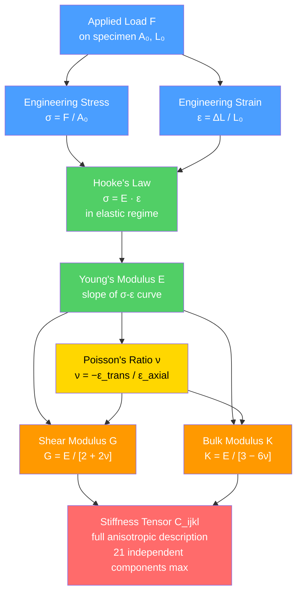

# Stress, Strain, and Elastic Moduli

> [!abstract] TL;DR
> Stress ($\sigma = F/A_0$) is force per unit area; strain ($\varepsilon = \Delta L / L_0$) is fractional deformation. Hooke's law ($\sigma = E\varepsilon$) governs the linear elastic regime: Young's modulus $E$ encodes axial stiffness, Poisson's ratio $\nu$ couples lateral to axial deformation, shear modulus $G = E/[2(1+\nu)]$ governs shear, and bulk modulus $K = E/[3(1-2\nu)]$ governs volumetric compression. A tensile test maps the full material lifecycle — elastic region, yield, strain hardening, necking, fracture — encoding resilience and toughness in its area. At the graduate level, the stiffness tensor $C_{ijkl}$ generalizes all of this to anisotropic single crystals.

---

## Intuition — analogy FIRST

Think of a coil spring on your desk. Pull it gently: extension doubles when you double the force — that is Hooke's law ($F = kx$). Release it and it snaps back perfectly: the energy you stored is returned. Now pull harder, past the point where the coils begin to permanently spread apart: the spring **yields**, and when you release it, it stays stretched. That threshold — the yield point — is the most important single number in structural design.

The transition from spring constant $k$ (N/m, for a macroscopic spring) to Young's modulus $E$ (N/m² = Pa, for a material) is pure normalization: $E$ is the stiffness per unit cross-section per unit length, so the same intrinsic property describes a thin wire and a thick column equally. Every material has its own "spring constant per atom layer" — diamond's is enormous; rubber's is tiny.

---

## How It Works



---

## Key Concepts / Details

### Secondary Level

**Engineering Stress and Strain**

The two fundamental quantities recorded in a tensile test:

$$\sigma = \frac{F}{A_0} \qquad \varepsilon = \frac{\Delta L}{L_0} = \frac{L - L_0}{L_0}$$

where $A_0$ is the original cross-sectional area and $L_0$ is the original gauge length. Stress has units of Pa (= N/m²); strain is dimensionless. Practical engineering stresses are in MPa ($10^6$ Pa) or GPa ($10^9$ Pa).

**Hooke's Law**

In the elastic (fully recoverable) regime, stress and strain are proportional:

$$\sigma = E\varepsilon$$

The proportionality constant $E$ is **Young's modulus** — a material property independent of specimen geometry. It equals the slope of the linear portion of the stress-strain curve.

| Material | Young's Modulus $E$ |
|----------|---------------------|
| Diamond | ~1 000 GPa |
| Steel (various alloys) | ~190–210 GPa |
| Titanium alloys | ~100–120 GPa |
| Aluminium alloys | ~69–73 GPa |
| Glass (borosilicate) | ~60–90 GPa |
| Concrete | ~25–35 GPa |
| Cortical bone | ~15–25 GPa |
| HDPE polymer | ~0.6–1 GPa |
| Natural rubber | ~0.01–0.1 GPa |

**The Tensile Test: a first look**

A dog-bone specimen is gripped and pulled at a constant displacement rate. Load $F$ and gauge-length extension $\Delta L$ are recorded and converted to $\sigma$ and $\varepsilon$:

1. **Elastic region**: linear slope = $E$; remove the load and deformation recovers completely.
2. **Yield point**: slope deviates; permanent (plastic) deformation begins; dislocations move.
3. **Fracture**: specimen breaks; the total strain at that point is the **elongation-to-fracture** (a ductility measure).

---

### Undergraduate Level

**True Stress and True Strain**

Engineering definitions use the *original* dimensions. Beyond the elastic regime — especially near and beyond the ultimate tensile strength — the cross-section shrinks and the gauge length grows appreciably:

$$\sigma_{true} = \frac{F}{A} = \sigma_{eng}(1 + \varepsilon_{eng}) \qquad \varepsilon_{true} = \ln\!\left(\frac{L}{L_0}\right) = \ln(1 + \varepsilon_{eng})$$

The true-stress / true-strain curve rises monotonically to fracture with no apparent drop. The engineering curve drops after UTS because $A$ shrinks faster than $F$ decreases during necking.

**Poisson's Ratio**

A uniaxial pull in the $z$-direction contracts the specimen in the transverse ($x$, $y$) directions:

$$\nu = -\frac{\varepsilon_{transverse}}{\varepsilon_{axial}}$$

For isotropic materials: $-1 < \nu \leq 0.5$. The upper bound $\nu = 0.5$ is the **incompressible limit** — no volume change (rubber, soft tissue). Metals cluster near 0.25–0.35. Auxetic materials have $\nu < 0$ and expand laterally when stretched.

**Shear Modulus and Bulk Modulus**

Shear modulus $G$ relates shear stress $\tau$ to engineering shear strain $\gamma$:

$$\tau = G\gamma$$

Bulk modulus $K$ relates hydrostatic pressure $P$ to volumetric strain $\theta = \Delta V/V$:

$$P = -K\,\frac{\Delta V}{V}$$

For an **isotropic** material, only **two independent elastic constants** exist. Given $E$ and $\nu$:

$$G = \frac{E}{2(1+\nu)} \qquad K = \frac{E}{3(1-2\nu)}$$

These interrelations mean that specifying any two of $\{E,\, \nu,\, G,\, K\}$ fully determines the others.

**Full Tensile Test Anatomy**

| Stage | Physical mechanism | Key design parameter |
|-------|--------------------|---------------------|
| Elastic region | Bond stretching; fully reversible | $E$ (stiffness) |
| Proportional limit | Last point with exact linearity | — |
| Yield point | Dislocation glide begins; permanent set | $\sigma_y$ (yield strength) |
| Strain hardening | Dislocation density rises; material strengthens | $n$ (hardening exponent) |
| Ultimate tensile strength | Maximum load; diffuse necking initiates | $\sigma_{UTS}$ |
| Necking | Local area reduction; engineering stress drops | — |
| Fracture | Void nucleation, coalescence, final failure | $\varepsilon_f$ (ductility) |

**0.2% Offset Yield Convention**

Many alloys (especially FCC metals) show no sharp yield drop. The **0.2% proof stress** is defined by constructing a line through $\varepsilon = 0.002$ with slope $E$, and reading where it intersects the stress-strain curve. This is the universally reported $\sigma_y$ for design.

**Resilience and Toughness**

*Modulus of resilience* $u_r$: elastic strain energy per unit volume storable without permanent deformation — ability to absorb energy reversibly:

$$u_r = \frac{\sigma_y^2}{2E} = \frac{1}{2}\sigma_y\varepsilon_y$$

*Modulus of toughness* $u_T$: total energy per unit volume absorbed to fracture — ability to absorb energy including irreversible plastic work:

$$u_T = \int_0^{\varepsilon_f} \sigma\, d\varepsilon$$

High toughness demands both high strength *and* high ductility simultaneously — a trade-off that drives most alloy design decisions.

**Material Class Comparison**

| Class | Example | $E$ (GPa) | $\sigma_y$ (MPa) | $\nu$ | Failure mode |
|-------|---------|-----------|------------------|-------|--------------|
| Structural steel | AISI A36 | 200 | 250 | 0.29 | Ductile |
| Aluminium alloy | 6061-T6 | 69 | 276 | 0.33 | Ductile |
| Titanium alloy | Ti-6Al-4V | 114 | 880 | 0.34 | Ductile |
| Alumina ceramic | Al₂O₃ | 390 | — | 0.22 | Brittle |
| Borosilicate glass | Pyrex | 64 | — | 0.20 | Brittle |
| HDPE polymer | — | 0.8 | 25 | 0.46 | Ductile / crazing |
| Natural rubber | — | 0.05 | — | ~0.50 | Elastic (large strain) |

---

### Graduate Level

**The Stiffness Tensor**

The general linear elastic constitutive law (generalized Hooke's law) is:

$$\sigma_{ij} = C_{ijkl}\,\varepsilon_{kl}$$

where $C_{ijkl}$ is the **stiffness tensor** (elasticity tensor), a rank-4 tensor with $3^4 = 81$ components. Symmetry of the stress and strain tensors ($\sigma_{ij} = \sigma_{ji}$, $\varepsilon_{kl} = \varepsilon_{lk}$) reduces independent components to 36. Existence of a strain energy density function requires $C_{ijkl} = C_{klij}$, which further reduces to **21 independent components** for the most general (triclinic) crystal.

Higher crystal symmetry reduces the count further: monoclinic → 13; orthorhombic → 9; hexagonal → 5; cubic → 3; isotropic → 2.

**Voigt Notation**

The Voigt mapping contracts the index pair into a single index:

$$1\leftrightarrow 11,\quad 2\leftrightarrow 22,\quad 3\leftrightarrow 33,\quad 4\leftrightarrow 23,\quad 5\leftrightarrow 13,\quad 6\leftrightarrow 12$$

This replaces $C_{ijkl}$ with a $6\times 6$ matrix $C_{\alpha\beta}$. For a **cubic** crystal (FCC, BCC, diamond cubic) symmetry demands $C_{11} = C_{22} = C_{33}$, $C_{12} = C_{13} = C_{23}$, $C_{44} = C_{55} = C_{66}$, leaving only 3 independent constants: $C_{11}$, $C_{12}$, $C_{44}$.

**Zener Anisotropy Factor**

For cubic crystals the isotropic condition is:

$$A_Z = \frac{2C_{44}}{C_{11} - C_{12}} = 1$$

| Metal | $C_{11}$ (GPa) | $C_{12}$ (GPa) | $C_{44}$ (GPa) | $A_Z$ |
|-------|--------------|--------------|--------------|-------|
| Iron (BCC) | 237 | 141 | 116 | 2.42 |
| Copper (FCC) | 168 | 121 | 75 | 3.21 |
| Aluminium (FCC) | 108 | 62 | 28 | 1.22 |
| Tungsten (BCC) | 501 | 198 | 151 | 0.99 |

$A_Z > 1$: the $\langle 111\rangle$ direction is stiffest (iron, copper). $A_Z < 1$: the $\langle 100\rangle$ direction is stiffest (molybdenum, $A_Z \approx 0.77$). Tungsten is nearly isotropic.

**Direction-Dependent Young's Modulus**

Given the compliance matrix $S_{\alpha\beta} = C_{\alpha\beta}^{-1}$, the Young's modulus along unit vector $\hat{n} = (l, m, n)$ in a cubic crystal is:

$$\frac{1}{E(\hat{n})} = S_{11} - 2\!\left(S_{11} - S_{12} - \tfrac{1}{2}S_{44}\right)\!\left(l^2 m^2 + m^2 n^2 + n^2 l^2\right)$$

Along $\langle 100\rangle$: $E = 1/S_{11}$. Along $\langle 111\rangle$: $l^2m^2 + m^2n^2 + n^2l^2 = 1/3$, giving the maximum (if $A_Z > 1$) or minimum (if $A_Z < 1$) modulus.

**Polycrystal Averaging**

A polycrystal with random grain orientations behaves isotropically in the large-grain-number limit. Three classical bounds/estimates:

- **Voigt** (iso-strain, upper bound): each grain deforms identically; averages stiffness.
- **Reuss** (iso-stress, lower bound): each grain carries the same stress; averages compliance.
- **Hill** (arithmetic mean): $E_H = (E_V + E_R)/2$ — the standard practical estimate.

For iron: $E_{[100]} = 125$ GPa, $E_{[111]} = 272$ GPa; the polycrystalline average $\approx 211$ GPa falls between these bounds, consistent with the measured value of 210 GPa.

---

## Python Demo

```python
import numpy as np
import matplotlib.pyplot as plt

def tensile_curve(eps_arr, E, sigma_y, sigma_uts, eps_uts, eps_frac, n=0.25):
    """
    Piecewise engineering stress-strain model.
      Stage 1 (elastic):       0 to eps_y          sigma = E * eps
      Stage 2 (hardening):     eps_y to eps_uts     power-law: sigma_y + (sigma_uts - sigma_y) * t^n
      Stage 3 (necking drop):  eps_uts to eps_frac  linear drop to 0.45 * sigma_uts
    All stresses in MPa; E in MPa; strains dimensionless.
    """
    eps_y = sigma_y / E
    sigma_frac = 0.45 * sigma_uts
    sigma = np.zeros_like(eps_arr, dtype=float)
    for i, eps in enumerate(eps_arr):
        if eps <= eps_y:
            sigma[i] = E * eps
        elif eps <= eps_uts:
            t = (eps - eps_y) / (eps_uts - eps_y)
            sigma[i] = sigma_y + (sigma_uts - sigma_y) * t**n
        elif eps <= eps_frac:
            t = (eps - eps_uts) / (eps_frac - eps_uts)
            sigma[i] = sigma_uts - (sigma_uts - sigma_frac) * t
    return sigma

materials = {
    "Steel AISI 1020": dict(
        E=200_000, sigma_y=350, sigma_uts=500,
        eps_uts=0.14, eps_frac=0.28, color="#4a9eff"
    ),
    "Aluminum 6061-T6": dict(
        E=69_000, sigma_y=276, sigma_uts=310,
        eps_uts=0.07, eps_frac=0.12, color="#ff9900"
    ),
}

fig, axes = plt.subplots(1, 2, figsize=(13, 6))

for ax, (name, mat) in zip(axes, materials.items()):
    eps = np.linspace(0, mat["eps_frac"] * 1.02, 1200)
    sig = tensile_curve(eps, mat["E"], mat["sigma_y"], mat["sigma_uts"],
                        mat["eps_uts"], mat["eps_frac"])

    eps_y = mat["sigma_y"] / mat["E"]
    toughness = np.trapz(sig, eps)                        # MJ/m^3
    resilience = mat["sigma_y"]**2 / (2 * mat["E"])       # MJ/m^3

    # Shade toughness (full area) and resilience (elastic triangle)
    ax.fill_between(eps, sig, alpha=0.12, color=mat["color"], label="Toughness area")
    mask = eps <= eps_y
    ax.fill_between(eps[mask], sig[mask], alpha=0.40, color="#51cf66", label="Resilience")

    ax.plot(eps, sig, color=mat["color"], lw=2.5, label=name)

    # Annotate yield strength and UTS
    ax.axhline(mat["sigma_y"],   ls="--", color="gray", lw=1.0, alpha=0.8)
    ax.axhline(mat["sigma_uts"], ls=":",  color="red",  lw=1.0, alpha=0.8)
    ax.text(mat["eps_uts"] * 0.04, mat["sigma_y"] * 1.04,
            "sy = " + str(mat["sigma_y"]) + " MPa", fontsize=9, color="gray")
    ax.text(mat["eps_uts"] * 0.04, mat["sigma_uts"] * 1.04,
            "UTS = " + str(mat["sigma_uts"]) + " MPa", fontsize=9, color="red")

    ax.set_xlabel("Engineering Strain", fontsize=11)
    ax.set_ylabel("Engineering Stress (MPa)", fontsize=11)
    ax.set_title(
        name + "\n"
        "Toughness = " + f"{toughness:.1f}" + " MJ/m3"
        "  |  Resilience = " + f"{resilience*1000:.2f}" + " kJ/m3",
        fontsize=10
    )
    ax.legend(fontsize=9)
    ax.grid(True, alpha=0.3)

plt.suptitle(
    "Tensile Stress-Strain: Elastic -> Plastic -> Necking -> Fracture",
    fontsize=13, fontweight="bold"
)
plt.tight_layout()
plt.show()
```

---

## Real-World Applications

- **Aerospace aluminium (2024-T3, $E = 73$ GPa, $\sigma_y = 345$ MPa)**: aircraft fuselage skins are designed to stay elastic under normal flight loads. Switching from steel to aluminium reduces structural weight by ~60% at the cost of a 3× lower $E$. Toughness — not just yield strength — governs whether fatigue cracks can grow to critical size before the next inspection.
- **Structural steel (AISI A36, $E = 200$ GPa, $\sigma_y = 250$ MPa)**: building frames exploit strain hardening. A column that yields locally does not immediately collapse; energy is redistributed to adjacent members. The ~23% elongation-to-fracture provides ductility that absorbs seismic energy without sudden brittle failure.
- **MEMS silicon sensors**: single-crystal silicon is strongly anisotropic ($A_Z \approx 1.57$). On a [100] wafer, $E_{[100]} = 130$ GPa while $E_{[111]} = 187$ GPa. Piezoresistive pressure sensors are photolithographically aligned to exploit the direction of maximum gauge factor, where modulus is highest.
- **Alumina armour ceramics ($E \approx 390$ GPa)**: modulus is twice that of steel at 40% of the density. The absence of dislocation plasticity means toughness is near zero (~3–5 MPa$\sqrt{\text{m}}$ vs. ~50 MPa$\sqrt{\text{m}}$ for steel). Composite tile-plus-polymer-backing designs pair the ceramic's stiffness and hardness with the polymer matrix's toughness.
- **Rubber tyres ($\nu \approx 0.499$, $E \approx 0.01$–$0.1$ GPa)**: near-incompressibility means $K \gg G$; tyres resist volumetric compression (supporting the vehicle weight) while shearing easily (conformal road contact). Tyre engineers design against fatigue crack growth at the belt-tread interface, where stress concentration amplifies the cyclic $\sigma$.

---

## Common Pitfalls

- **Mixing engineering and true quantities after yield** — engineering stress/strain are sufficient for elastic design; true quantities are mandatory for forming simulations, post-necking analysis, and constitutive models. The Bridgman correction additionally accounts for triaxial stress in the neck.
- **Treating $E$, $G$, $K$, and $\nu$ as four independent constants** — for an isotropic material, only two are independent. Specifying $E$ and $\nu$ fully determines $G$ and $K$. Over-specifying leads to inconsistency and non-physical constitutive matrices.
- **Misapplying the 0.2% offset line** — the offset line must start from $\varepsilon = 0.002$ on the strain axis and run *parallel to the initial elastic slope*. Starting from the origin or using the wrong slope underestimates $\sigma_y$.
- **Confusing toughness with hardness or strength** — toughness is energy absorbed per unit volume (MJ/m³); hardness is resistance to surface indentation (Vickers, Brinell — empirical dimensionless scales); strength is a stress (MPa). High-strength, low-ductility materials (hardened tool steels) can have low toughness.
- **Ignoring anisotropy in textured polycrystals** — cold-rolled sheet develops crystallographic texture, causing the effective modulus to vary by 15–30% with in-plane orientation even in a nominally "isotropic" alloy. Isotropic elastic constants apply strictly only to truly random-texture polycrystals.
- **Assuming $\nu \approx 0.3$ universally** — metals cluster near 0.25–0.35, but ceramics are often 0.15–0.25, polymers near 0.40–0.50, auxetic foams can be negative, and rubber approaches 0.50. Always use material-specific data in any precision structural or thermal analysis.

---

## Related Concepts

- [[Laws_of_Thermodynamics]] — elastic deformation is a reversible thermodynamic process; the strain energy density $u = \frac{1}{2}C_{ijkl}\varepsilon_{ij}\varepsilon_{kl}$ is the Helmholtz free energy per unit volume at constant temperature; thermoelastic coupling causes a material to cool slightly on elastic tension
- [[Fluid_Statics_and_Properties]] — bulk modulus $K$ and its inverse (compressibility) appear identically for solids and fluids; both contexts use the same continuum mechanics framework; sound speed $c = \sqrt{K/\rho}$ applies to both
- [[Crystal_Structure_and_Band_Theory]] — atomic bonding geometry and crystal symmetry directly set the stiffness tensor components; stronger interatomic bonds and denser packing give larger $E$; crystal point-group symmetry determines how many independent $C_{ijkl}$ exist
- [[_MOC_Physics_Master]] — parent vault; solid mechanics bridges thermodynamics, electromagnetism (piezoelectrics), fluid mechanics, and quantum mechanics (phonons, band gaps)
- [[Plastic_Deformation_and_Slip_Systems]] — what happens beyond the yield point; dislocation glide on slip systems governs $\sigma_y$, the strain-hardening exponent $n$, and ductility *(forward link — same vault)*
- [[Fracture_Mechanics_and_Toughness]] — stress-intensity factor $K_{Ic}$, the Griffith energy-release rate, and the link between $E$, surface energy, and critical flaw size *(forward link — same vault)*
- [[Polymer_Mechanics_and_Viscoelasticity]] — time- and frequency-dependent modulus in polymers; storage modulus $E'$ and loss modulus $E''$ replace the single real $E$ of linear elasticity *(forward link — same vault)*
- [[Composite_Materials_and_Fiber_Reinforcement]] — Voigt and Reuss rule-of-mixtures bounds on composite modulus are the direct macroscopic analog of the single-crystal averaging procedure *(forward link — same vault)*
- [[_MOC_Mechanical_Properties]] — section map for the Mechanical Properties topic cluster *(forward link — same vault)*

---

## Review Questions

1. **Secondary**: A steel rod ($E = 200$ GPa, original length 2 m, cross-sectional area $1\,\text{cm}^2$) is subjected to a tensile load of 50 kN. (a) Compute the engineering stress, (b) compute the engineering strain, (c) find the elongation. (d) How much elastic strain energy is stored in the rod? If the load is removed, what happens?
2. **Undergraduate**: A tensile test of an aluminium alloy gives $E = 70$ GPa, $\sigma_y = 300$ MPa (0.2% offset), $\sigma_{UTS} = 420$ MPa, $\varepsilon_f = 15\%$. (a) Compute the resilience and estimate the toughness. (b) Compute $G$ and $K$ assuming $\nu = 0.33$. (c) Two brackets, one made of this alloy and one of a high-strength steel ($\sigma_y = 1\,500$ MPa, $\varepsilon_f = 2\%$), have similar cross-sections. The steel has twice the yield strength; should it be preferred for an impact-loaded application? Justify using toughness arguments.
3. **Graduate**: A BCC iron single crystal has $C_{11} = 237$ GPa, $C_{12} = 141$ GPa, $C_{44} = 116$ GPa. (a) Compute the Zener anisotropy factor $A_Z$ and state whether $\langle 111\rangle$ or $\langle 100\rangle$ is stiffer. (b) Invert the $6\times6$ Voigt stiffness matrix to obtain the compliance $S_{\alpha\beta}$ and calculate $E_{[100]}$ and $E_{[111]}$. (c) For a large polycrystalline iron sample with random grain texture, the measured $E \approx 211$ GPa. Show this lies between the Voigt and Reuss bounds and explain conceptually why the Hill average is a better estimate than either bound alone.

---

## Sources

- Callister, W. D. & Rethwisch, D. G. — *Materials Science and Engineering: An Introduction*, 10th ed., Chs. 6–7 (stress-strain, tensile test, elastic moduli, resilience, toughness)
- Ashby, M. F. & Jones, D. R. H. — *Engineering Materials 1*, 4th ed., Chs. 3–8 (material property charts, modulus-density maps, Ashby maps)
- Nye, J. F. — *Physical Properties of Crystals*, Oxford University Press, Chs. 5–8 (stiffness tensor, Voigt notation, crystal symmetry)
- Bower, A. F. — *Applied Mechanics of Solids*, CRC Press, Ch. 3 (constitutive equations, anisotropic elasticity)

#materialsscience #mechanicalproperties #stress #strain #youngsmodulus #hookeslaw #poissonsratio #shearmodulus #bulkmodulus #stiffnesstensor #tensiletest #toughness #resilience #anisotropy #voigtnotation #secondary #undergraduate #graduate
