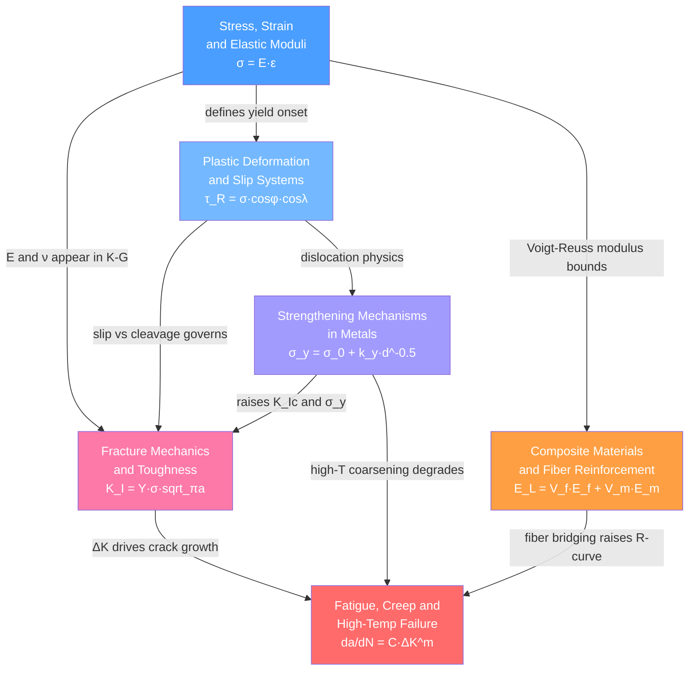

# 🗺️ Mechanical Properties — Map of Content

> [!info] How to use this map
> Start with **Fundamentals**, follow the arrows, and use the Learning Path below as your guide.
> Each node links to a full note. Come back to this map when you feel lost.

Mechanical properties describe how a material responds to applied forces — elastically, plastically, or by fracturing. This section builds from the linear elastic baseline through dislocation-controlled plasticity, microstructural strengthening strategies, fracture mechanics, time-dependent failure modes, and finally the engineered composites that combine materials to transcend the limits of any single phase. Every structural engineering decision — from aircraft wing spars to turbine blades to wind turbine blades — draws on these six topics together.

---

## Concept Map

*(Blue = fundamental entry point, Red = most advanced; arrows indicate "leads to" or "provides foundation for")*

---

## Learning Path

*Recommended order for a first pass through this section — beginner to advanced:*

1. [[Stress_Strain_and_Elastic_Moduli]] — Begin here: defines stress, strain, Hooke's law, and the four elastic moduli (E, G, K, ν). The tensile test anatomy (elastic region → yield → strain hardening → necking → fracture) is the conceptual backbone for every note that follows.

2. [[Plastic_Deformation_and_Slip_Systems]] — Extends the tensile test beyond the yield point. Explains why real metals yield at 100–1000× lower stress than a perfect lattice predicts: dislocations glide on crystallographic slip systems, governed by Schmid's law and the Taylor factor for polycrystals.

3. [[Strengthening_Mechanisms_in_Metals]] — Builds directly on dislocation physics: four strategies to impede dislocation motion — grain boundary strengthening (Hall-Petch), solid solution hardening, precipitation/age hardening (Orowan bowing), and work hardening (Taylor relation). The quantitative foundation for alloy design.

4. [[Fracture_Mechanics_and_Toughness]] — Shifts from plastic flow to fracture. Covers the Griffith energy balance, Irwin's stress intensity factor K_I = Y·σ·√πa, plane-strain fracture toughness K_Ic, the Paris law for fatigue crack growth, and the ductile-to-brittle transition. Requires familiarity with elastic moduli and dislocation concepts from notes 1–3.

5. [[Fatigue_Creep_and_High_Temperature_Failure]] — Time- and cycle-dependent failure that the static tensile test misses entirely. Covers the S-N (Wöhler) curve, Goodman mean-stress criterion, Paris law integration for inspection intervals, Norton creep power law, the Larson-Miller rupture parameter, and single-crystal superalloy design. Builds heavily on fracture mechanics.

6. [[Composite_Materials_and_Fiber_Reinforcement]] — Treats multi-phase material systems: rule of mixtures (Voigt/Reuss bounds), Halpin-Tsai transverse modulus, critical fiber length, classical lamination theory, and natural composites. Draws on elastic moduli (note 1) and fracture mechanics (note 4) for interpreting fiber bridging and delamination toughness.

---

## All Notes in This Section

| Note | Core Idea | Key Equation | Level |
|------|-----------|-------------|-------|
| [[Stress_Strain_and_Elastic_Moduli]] | Elastic response, tensile test anatomy, four moduli, stiffness tensor for anisotropic crystals | σ = E·ε | Beginner |
| [[Plastic_Deformation_and_Slip_Systems]] | Dislocation glide on slip systems; Schmid's law; work hardening stages; recovery and recrystallization | τ_R = σ·cosφ·cosλ | Intermediate |
| [[Strengthening_Mechanisms_in_Metals]] | Four dislocation-blocking mechanisms; Hall-Petch grain refinement; precipitation age hardening; Orowan bypass | σ_y = σ_0 + k_y·d^-½ | Intermediate |
| [[Fracture_Mechanics_and_Toughness]] | Crack-tip stress amplification; Griffith energy balance; K_Ic; Paris fatigue crack growth law; DBTT | K_I = Y·σ·√πa | Intermediate–Advanced |
| [[Fatigue_Creep_and_High_Temperature_Failure]] | Cyclic damage accumulation; S-N curves; Paris law integration; Norton creep; Larson-Miller life prediction | da/dN = C·ΔK^m | Advanced |
| [[Composite_Materials_and_Fiber_Reinforcement]] | Rule of mixtures; Halpin-Tsai; critical fiber length; classical lamination theory; specific stiffness | E_L = V_f·E_f + V_m·E_m | Advanced |

---

## Key Questions This Section Answers

- Why does diamond have a Young's modulus of 1000 GPa while rubber sits at 0.01 GPa — and what atomic-scale property is responsible for this 100 000-fold difference?
- Why do real metals yield at stresses 100–1000× below the theoretical shear strength of a perfect lattice, and how do dislocations make that possible?
- Which combination of grain refinement, solid solution, precipitation hardening, and cold work gives the highest yield strength for a given alloy system, and what are the trade-offs with ductility?
- When a crack is detected in a pressure vessel or aircraft spar, what is the maximum tolerable crack size before catastrophic fracture — and how does the material's K_Ic determine this limit?
- Why do aircraft structures, bridges, and rotating shafts fail under cyclic loads far below static yield strength, and how is inspection interval derived from the Paris law?
- How can combining brittle carbon fibers with a tough epoxy matrix produce a structural material with specific stiffness 4× that of steel, and what governs the anisotropy?

---

## Connections to Other Topics

- [[_MOC_Crystal_Structure_and_Bonding]] — The crystallographic foundation: Bravais lattices, close-packed planes and directions that define slip systems, point group symmetry that determines the independent components of the stiffness tensor, and atomic bonding strength that sets the intrinsic value of E and G.
- [[_MOC_Thermal_and_Phase_Behavior]] — Phase diagrams and heat treatment control the microstructures (grain size, precipitate size and spacing, phase fractions) that the strengthening and failure notes analyse; the GP zone → θ'' → θ precipitation sequence and recrystallization kinetics are governed by thermodynamic driving forces and Arrhenius kinetics covered there.
- [[_MOC_MaterialsScience_Master]] — Master entry point for the full Materials Science vault; this section sits at the core of structure-property relationships alongside electronic, thermal, and processing topics.
