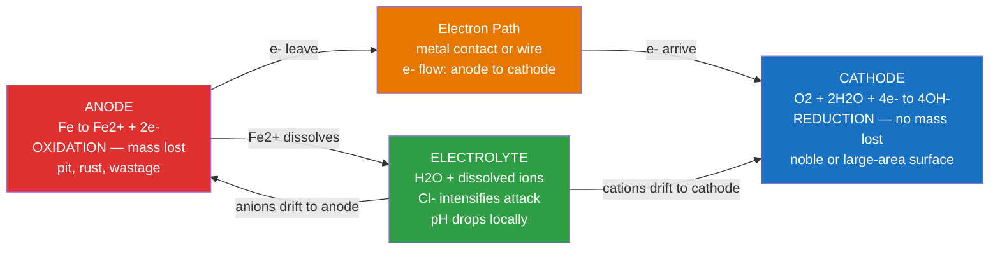

# ⚗️ Corrosion and Electrochemical Degradation

> [!abstract] TL;DR
> Corrosion is spontaneous electrochemical oxidation of a metal driven by its tendency to return to the lower-energy oxide or ion state from which it was smelted; it requires an anode (metal oxidises, dissolves), a cathode (a species is reduced), an electrolyte (ionic path), and an electrical connection (electron path) — remove any one and corrosion stops. The **Nernst equation** sets the driving force, the **galvanic series** predicts which metal corrodes in a couple, the **Pilling–Bedworth ratio** governs whether a surface oxide is protective, and **cathodic protection** — either sacrificial anodes or impressed current — is the dominant industrial defence.

---

## Intuition

**Analogy:** Rusting iron is the slow-motion reversal of the blast furnace. In the furnace, we spend enormous energy to strip oxygen away from iron ore (Fe₂O₃) and produce pure iron. Left in a humid, salty environment, nature simply runs the reaction backwards at no energy cost — the iron "wants" to return to its lower-energy oxide form. The only difference between the two processes is the timescale and the physical path: in the blast furnace the reaction happens at a single fiery location; in corrosion it happens electrochemically, with the oxidation half-reaction (at the anode, where the metal dissolves) and the reduction half-reaction (at the cathode, where oxygen or protons are consumed) physically separated but wired together.

This spatial separation is the key insight: **corrosion is a short-circuit galvanic cell**. The metal is simultaneously the fuel and the fuel container, and the environment is both the electrolyte and the oxidant supply. Every measure that blocks one of the four circuit elements — anode, cathode, electrolyte, or electron path — interrupts the circuit and stops degradation.

---

## How It Works

### Core Electrochemistry

A corroding system is always a spontaneous galvanic cell. For iron in aerated seawater:

**Anodic half-reaction (oxidation, metal dissolves):**
$$\text{Fe} \rightarrow \text{Fe}^{2+} + 2e^- \qquad E^\circ = -0.44\ \text{V vs SHE}$$

**Cathodic half-reaction (reduction, no mass loss):**
$$\text{O}_2 + 2\text{H}_2\text{O} + 4e^- \rightarrow 4\text{OH}^- \qquad E^\circ = +0.40\ \text{V vs SHE (pH 7)}$$

The overall cell potential $E^\circ_{cell} = E^\circ_{cathode} - E^\circ_{anode} = 0.40 - (-0.44) = +0.84\ \text{V}$ is positive, confirming the reaction is thermodynamically spontaneous ($\Delta G = -nFE < 0$). In acid, the alternative cathodic reaction is hydrogen evolution: $2\text{H}^+ + 2e^- \rightarrow \text{H}_2$.

### Nernst Equation and Electrode Potentials

Real corroding systems are never at standard conditions. The **Nernst equation** adjusts the equilibrium potential for actual ion activities:

$$E = E^\circ - \frac{RT}{nF}\ln Q \approx E^\circ - \frac{0.0592}{n}\log Q \quad (25\,^\circ\text{C})$$

For the iron half-cell: $E_{\text{Fe/Fe}^{2+}} = -0.44 - 0.0296\log[\text{Fe}^{2+}]$. At $[\text{Fe}^{2+}] = 10^{-6}\ \text{M}$ (very dilute), $E = -0.44 + 0.178 = -0.26\ \text{V}$ — the driving force is larger when the product concentration is low, which is why corrosion is fastest when the dissolved metal is continuously swept away.

### Galvanic Series

The **galvanic series** ranks alloys by their practical corrosion potential (not just pure-metal $E^\circ$) measured in seawater — the real-world electrolyte of concern for marine engineering:

| Active (anodic) end → corrodes | Potential (V, SCE) |
|--------------------------------|--------------------|
| Magnesium alloys | $-1.60$ |
| Zinc | $-1.03$ |
| Galvanized steel | $-0.98$ |
| Aluminium alloys | $-0.75$ |
| Steel / Cast iron | $-0.61$ |
| Lead | $-0.50$ |
| Tin | $-0.42$ |
| Naval brass | $-0.30$ |
| Copper | $-0.26$ |
| Nickel (passive) | $-0.18$ |
| 316 Stainless steel (passive) | $-0.08$ |
| Titanium alloys | $-0.05$ |
| Platinum | $+0.19$ |
| **Noble (cathodic) end → protected** | |

**Galvanic corrosion** occurs whenever two metals from different positions in this series are in electrical contact in an electrolyte. The more active metal becomes the anode and corrodes preferentially; the more noble metal becomes the cathode and is protected. The driving force scales with the separation in the series; the damage concentrates at the anode, especially if the anode area is small relative to the cathode area.

### Flow / Architecture



---

## Key Concepts

### Secondary Level

**Eight types of corrosion** — the classic taxonomy:

| Type | Mechanism | Classic Example |
|------|-----------|-----------------|
| **Galvanic** | Two dissimilar metals in contact; active one corrodes | Steel bolt in brass fitting |
| **Crevice** | O₂ depletion in a confined gap creates a concentration cell | Under gasket, bolt head |
| **Pitting** | Localised breakdown of passive film; autocatalytic, deep narrow holes | Cl⁻ attack on 304 SS |
| **Intergranular** | Grain boundaries depleted in Cr by carbide precipitation ("sensitisation") | Welded 304 SS, ~500–800 °C |
| **Selective leaching** | One alloy component dissolves preferentially | Dezincification of brass (Zn leaves, porous Cu skeleton) |
| **Erosion-corrosion** | Fluid flow mechanically removes protective oxide, renewing bare surface | Copper pipe elbows, impellers |
| **Stress corrosion cracking (SCC)** | Tensile stress + specific corrosive environment → crack propagation | Brass in ammonia, SS in Cl⁻ |
| **Uniform / general** | Even dissolution across whole surface; most predictable, least dangerous | Iron in dilute acid |

**Prevention at the system level:**
- **Coatings** (paint, epoxy, anodising, hot-dip galvanising) — physical barrier to electrolyte
- **Alloying** (add Cr, Ni, Mo for stainless steel) — promote passivation
- **Cathodic protection** (sacrificial anodes or impressed current)
- **Inhibitors** — adsorb on surface, block active sites (chromates, now largely replaced by organic inhibitors)
- **Design** — avoid dissimilar metal couples, eliminate crevices, keep surfaces dry

**Corrosion rate units in practice:**
- **mdd** (milligrams per decimetre² per day) — mass-loss rate per unit area per day
- **mpy** (mils per year, 1 mil = 0.0254 mm) — penetration rate; used for structural life assessment
- Conversion: $\text{mpy} = \frac{534\,W}{D\,A\,T}$ where $W$ = mass loss (mg), $D$ = density (g/cm³), $A$ = area (in²), $T$ = exposure time (hr)

---

### Undergraduate Level

#### Passivation and the Active–Passive Transition

Certain metals — aluminium, chromium, titanium, nickel, and iron under the right conditions — form a thin (1–10 nm), adherent, ionically insulating oxide film that dramatically slows further dissolution. This is **passivation**.

The **active–passive transition** is visible on an anodic polarisation curve: as the applied potential increases, dissolution current first rises (active region), then plummets by several orders of magnitude at the **Flade potential** $E_F$ (also called the passivation potential $E_{pp}$), as the oxide film establishes. At higher potentials still, a **transpassive** region can appear where the oxide dissolves (e.g., Cr₆⁺ formation in stainless steel).

Key passivating oxides:

| Metal / Alloy | Protective Film | Why it works |
|---------------|-----------------|--------------|
| Aluminium | Al₂O₃ | Dense, adherent, self-healing; PBR = 1.28 |
| Stainless steel | Cr₂O₃ (Cr > 10.5 wt%) | Very low ionic conductivity; PBR ≈ 2.01 |
| Titanium | TiO₂ | Extremely stable; used in aggressive acids |
| Iron (alkaline) | Fe₃O₄ / Fe₂O₃ | Passive only at pH > 9; unstable in neutral Cl⁻ |

**Flade potential (iron in H₂SO₄):** $E_F \approx +0.58\ \text{V vs NHE}$ — below this value iron is in the active-dissolving state; above it, the passive film is thermodynamically stable.

#### Pilling–Bedworth Ratio

The **Pilling–Bedworth ratio (PBR)** predicts whether a surface oxide will be mechanically protective by comparing the molar volume of oxide produced to the molar volume of metal consumed:

$$\text{PBR} = \frac{V_{\text{oxide}}}{V_{\text{metal}}} = \frac{M_{\text{ox}}/\rho_{\text{ox}}}{n \cdot M_{\text{metal}}/\rho_{\text{metal}}}$$

where $n$ is the number of metal atoms per formula unit of oxide, $M$ are molar masses, and $\rho$ are densities.

| Metal | Oxide | PBR | Oxide behaviour |
|-------|-------|:---:|-----------------|
| K | K₂O | 0.45 | Very porous — no protection |
| Mg | MgO | 0.81 | Porous — no protection |
| Al | Al₂O₃ | 1.28 | Dense, adherent — **protective** |
| Cu | Cu₂O | 1.64 | Protective |
| Ni | NiO | 1.65 | Protective |
| Cr | Cr₂O₃ | 2.01 | Adherent despite >2 — **protective** |
| Fe | Fe₂O₃ | 2.15 | Compressive stress → flaking, **not protective** |
| W | WO₃ | 3.40 | Severe spalling |

**Physical logic:** PBR < 1 means the oxide is too small to cover the underlying metal (tensile stress → cracks and gaps). PBR in the range ~1.0–2.0 is ideal. PBR >> 2 generates large compressive stresses in the oxide, causing it to buckle and spall — which is why ordinary iron rust (Fe₂O₃, PBR 2.15) flakes off and exposes fresh metal, whereas aluminium oxide (PBR 1.28) stays put and self-terminates oxidation.

*Note:* Cr₂O₃ on steel is an exception to the "PBR > 2 = bad" rule — the film is thin enough and the interface adhesion strong enough that spalling does not occur under normal conditions.

#### Evans Diagram and Mixed Potential Theory

The **Evans diagram** (also called a mixed potential diagram) is the central tool for predicting corrosion kinetics. It plots electrode potential $E$ on the $y$-axis against $\log_{10}|I|$ on the $x$-axis, overlaying the anodic and cathodic Tafel lines:

$$E_{\text{anodic}}  = E^\circ_a + \beta_a \log_{10}\!\left(\frac{I}{i_{0,a}}\right)$$
$$E_{\text{cathodic}} = E^\circ_c - \beta_c \log_{10}\!\left(\frac{I}{i_{0,c}}\right)$$

where $\beta_a, \beta_c$ are the **Tafel slopes** (typically 0.06 V/decade anodic, 0.12 V/decade cathodic for oxygen reduction) and $i_0$ are the **exchange current densities** at each half-cell equilibrium.

The intersection of the two Tafel lines defines:
- **$E_{\text{corr}}$** — the **mixed corrosion potential** (also called the rest potential), which the freely corroding surface adopts spontaneously. No external current flows at this point.
- **$I_{\text{corr}}$** — the **corrosion current**, which is equal to both the anodic dissolution current and the cathodic reduction current at that potential. Proportional to the corrosion rate.

**Galvanic coupling** on an Evans diagram: joining the corroding metal to a more noble metal (higher $E^\circ_c$) shifts the cathodic Tafel line upward. The new intersection moves to higher current, so the corrosion rate of the active metal increases — sometimes dramatically. Conversely, a sacrificial anode (lower $E^\circ_a$) shifts the anodic line down, depressing $I_{\text{corr}}$ of the protected structure.

#### Cathodic Protection

**Sacrificial anode method:** Attach a metal more active than steel (Mg, Al, or Zn, depending on environment) to the structure. The sacrificial anode becomes the anode of the galvanic cell; the steel structure becomes the cathode and is protected. Zinc is used in seawater (ships, offshore platforms); magnesium is used in freshwater or soil (buried pipelines, water heaters).

**Impressed current cathodic protection (ICCP):** An external DC power supply forces the steel structure to be the cathode by driving current through an inert anode (platinised titanium, mixed metal oxide) buried nearby. The required protective current density for steel in seawater is typically 50–200 mA/m². ICCP is used for large structures (ships, tank farms, bridge decks) where sacrificial anodes would be impractical.

**Design criterion:** the structure is protected when its potential is driven to the **protection potential**, which for steel is approximately $E = -0.85\ \text{V vs Cu/CuSO}_4$ reference electrode (CSE) in soil, or $-0.80\ \text{V vs SCE}$ in seawater.

---

### Graduate Level

#### Stress Corrosion Cracking (SCC)

SCC requires the **simultaneous** presence of:
1. A susceptible material (e.g., high-strength steel, aluminium alloys, sensitised stainless steel)
2. A specific corrosive environment (not all environments cause SCC in a given alloy)
3. Tensile stress (applied or residual)

Two competing mechanistic models:

**Anodic dissolution model:** Stress concentrates at a crack tip, rupturing the passive film locally. Bare metal dissolves anodically at the tip faster than the film can reform, advancing the crack. Crack velocity is proportional to the anodic current at the tip.

**Hydrogen embrittlement model (for high-strength steels):** Cathodic reaction at the crack flanks produces adsorbed hydrogen atoms that diffuse to the highly stressed region ahead of the crack tip, reducing cohesive strength of the metal lattice (lattice decohesion) or pinning dislocations (hydrogen-enhanced localised plasticity, HELP). Crack advances by brittle fracture rather than dissolution.

In many systems both mechanisms operate, and distinguishing them requires careful polarisation experiments: anodic polarisation accelerates SCC if anodic dissolution dominates; cathodic polarisation accelerates SCC if hydrogen embrittlement dominates.

**Threshold stress intensity** $K_{\text{ISCC}}$: below this value, cracks do not propagate in the corrosive environment regardless of exposure time. Engineering structures are designed so that the maximum possible crack (detectable by NDT) gives $K < K_{\text{ISCC}}$.

#### Electrochemical Impedance Spectroscopy (EIS)

EIS applies a small AC voltage perturbation ($\pm 5$–$10\ \text{mV}$) at frequencies from $10^{-3}$ Hz to $10^5$ Hz and measures the complex impedance $Z(\omega) = Z' + jZ''$. The resulting Nyquist plot ($-Z''$ vs $Z'$) or Bode plot ($|Z|$ and phase vs $\log \omega$) is fitted to an equivalent circuit model:

- **Charge-transfer resistance** $R_{ct}$: inversely proportional to $I_{\text{corr}}$ (corrosion rate)
- **Double-layer capacitance** $C_{dl}$ (or constant-phase element CPE): reveals passive film thickness and defect density
- **Warburg element** $Z_W$: diffusion-controlled mass transport (dominant at low frequency for thick films)

EIS is non-destructive, in-situ, and can monitor coating degradation or passive film growth in real time — essential for testing inhibitor effectiveness and predicting service life.

#### Pourbaix Diagrams

A **Pourbaix diagram** (E–pH diagram) maps the thermodynamically stable phases of a metal–water system as a function of electrode potential and pH, constructed from Nernst-equation boundaries:

- **Corrosion domain** (dissolved ions stable): active dissolution; metal ions in solution
- **Passivation domain** (protective oxide/hydroxide stable): oxide film forms spontaneously
- **Immunity domain** (pure metal stable): metal does not corrode at all; achievable by cathodic protection

For iron, the passivation domain exists roughly at pH > 9 and potentials between ~$-0.6$ V and ~$+0.6$ V vs SHE. Below that potential lies immunity (achievable by cathodic protection); above it lies the transpassive Fe(VI) regime (ferrate, strongly oxidising conditions). Chloride ions are not shown on Pourbaix diagrams but shrink the passive region by enabling pitting at potentials above the **pitting potential** $E_{pit}$.

---

## Python Demo

```python
import numpy as np
import matplotlib.pyplot as plt

# ---------------------------------------------------------------
# Evans Diagram for Iron Corrosion
# Shows: anodic Tafel line, cathodic Tafel line, their intersection
#        (E_corr, I_corr), and the effect of galvanic coupling
#        to a more noble metal (higher cathodic equilibrium potential)
# ---------------------------------------------------------------

# Half-cell parameters — iron in aerated near-neutral solution
E_eq_a  = -0.44    # V vs SHE — Fe/Fe2+ equilibrium potential
E_eq_c  =  0.40    # V vs SHE — O2 reduction at pH 7
i0_a    =  1e-7    # A  — exchange current, anodic half-cell
i0_c    =  1e-10   # A  — exchange current, cathodic half-cell
beta_a  =  0.060   # V/decade — anodic Tafel slope
beta_c  =  0.120   # V/decade — cathodic Tafel slope

log_I = np.linspace(-13, -2, 1000)
I     = 10.0 ** log_I

# Tafel lines (referenced to each half-cell exchange current)
E_anodic    = E_eq_a + beta_a * (log_I - np.log10(i0_a))
E_cathodic  = E_eq_c - beta_c * (log_I - np.log10(i0_c))

def find_intersection(E_eq_a, E_eq_c, i0_a, i0_c, beta_a, beta_c):
    """Analytical E_corr and I_corr from Tafel line intersection."""
    log_Ic = (E_eq_c - E_eq_a
              + beta_a * np.log10(i0_a)
              + beta_c * np.log10(i0_c)) / (beta_a + beta_c)
    E_c = E_eq_a + beta_a * (log_Ic - np.log10(i0_a))
    return log_Ic, E_c

log_Ic,  E_corr  = find_intersection(E_eq_a, E_eq_c,  i0_a, i0_c, beta_a, beta_c)
I_corr  = 10 ** log_Ic

# Galvanic couple: iron coupled to copper (E_eq_c2 = +0.80 V, larger cathode area)
E_eq_c2 = 0.80
E_cathodic2 = E_eq_c2 - beta_c * (log_I - np.log10(i0_c))
log_Ic2, E_corr2 = find_intersection(E_eq_a, E_eq_c2, i0_a, i0_c, beta_a, beta_c)
I_corr2 = 10 ** log_Ic2

# Only plot Tafel lines in the physically meaningful overpotential region
# (I >= exchange current density for each half-cell)
mask_a  = log_I >= np.log10(i0_a)   # anodic line: I >= i0_a
mask_c  = log_I >= np.log10(i0_c)   # cathodic lines: I >= i0_c

fig, ax = plt.subplots(figsize=(9, 6))

ax.plot(log_I[mask_a],  E_anodic[mask_a],    'r-',  lw=2.5,
        label='Anodic Tafel: Fe to Fe2+ + 2e-')
ax.plot(log_I[mask_c],  E_cathodic[mask_c],  'b-',  lw=2.5,
        label='Cathodic Tafel: O2 reduction (iron alone)')
ax.plot(log_I[mask_c],  E_cathodic2[mask_c], 'b--', lw=2.5,
        label='Cathodic Tafel: O2 reduction (galvanic couple, Cu)')

# Mark intersections and draw reference lines
ax.axhline(E_corr,  color='black', ls=':', lw=0.9, alpha=0.6)
ax.axvline(log_Ic,  color='black', ls=':', lw=0.9, alpha=0.6)
ax.plot(log_Ic,  E_corr,  'o', color='black', ms=10, zorder=6,
        label=f'Iron alone: E_corr={E_corr:.2f}V, I_corr={I_corr:.1e}A')
ax.annotate(f'E_corr = {E_corr:.2f} V\nI_corr = {I_corr:.1e} A',
            xy=(log_Ic, E_corr),
            xytext=(log_Ic - 2.2, E_corr - 0.16),
            fontsize=8.5, color='black',
            arrowprops=dict(arrowstyle='->', color='black', lw=1.2))

ax.axhline(E_corr2, color='navy', ls=':', lw=0.9, alpha=0.6)
ax.axvline(log_Ic2, color='navy', ls=':', lw=0.9, alpha=0.6)
ax.plot(log_Ic2, E_corr2, '^', color='navy', ms=10, zorder=6,
        label=f'Galvanic couple: E_corr={E_corr2:.2f}V, I_corr={I_corr2:.1e}A')
ax.annotate(f'E_corr = {E_corr2:.2f} V\nI_corr = {I_corr2:.1e} A\n({I_corr2/I_corr:.0f}x faster)',
            xy=(log_Ic2, E_corr2),
            xytext=(log_Ic2 - 2.8, E_corr2 - 0.16),
            fontsize=8.5, color='navy',
            arrowprops=dict(arrowstyle='->', color='navy', lw=1.2))

ax.set_xlabel('log$_{10}$(Current I) [A]', fontsize=12)
ax.set_ylabel('Electrode Potential E [V vs SHE]', fontsize=12)
ax.set_title('Evans Diagram: Corrosion of Iron\n'
             'Galvanic coupling to Cu shifts cathodic line up, '
             'raising I_corr by ~170x', fontsize=12)
ax.legend(loc='upper left', fontsize=9)
ax.grid(True, alpha=0.25)
ax.set_xlim(-13, -2)
ax.set_ylim(-0.80, 1.05)

plt.tight_layout()
plt.show()

print(f"Iron alone:       E_corr = {E_corr:.3f} V,  I_corr = {I_corr:.2e} A")
print(f"Galvanic couple:  E_corr = {E_corr2:.3f} V,  I_corr = {I_corr2:.2e} A")
print(f"Corrosion rate increase: {I_corr2/I_corr:.0f}x")
```

**What the output shows:** The anodic (red) and cathodic (blue solid) Tafel lines intersect at $E_{\text{corr}} \approx -0.28\ \text{V}$, giving $I_{\text{corr}} \approx 4.6 \times 10^{-5}\ \text{A}$. When iron is galvanically coupled to copper (blue dashed), the cathodic line shifts upward by 0.40 V; the new intersection moves right to $I_{\text{corr}} \approx 7.7 \times 10^{-3}\ \text{A}$ — roughly 170 times higher corrosion current — while $E_{\text{corr}}$ rises to $-0.15\ \text{V}$ (iron is anodically polarised). This is the quantitative basis for the rule "never bolt steel to copper without isolation."

---

## Real-World Applications

> **Stainless steel and pitting in marine environments:** Type 304 stainless steel (18% Cr, 8% Ni) owes its corrosion resistance entirely to the ~2 nm Cr₂O₃ passive film, which maintains PBR ≈ 2.01 and collapses the corrosion current by a factor of $10^5$–$10^6$. In chloride-rich seawater, however, Cl⁻ ions competitively adsorb on the oxide surface, displacing oxygen and locally destabilising the film at potentials above the **pitting potential** $E_{\text{pit}}$. Once a pit initiates, its interior acidifies (Fe²⁺ + 2H₂O → Fe(OH)₂ + 2H⁺) and chloride migrates in to maintain electroneutrality, creating a locally acidic, chloride-rich, occluded cell that is impossible to repassivate. This autocatalytic mechanism is why 316L SS (with 2–3% Mo, which raises $E_{\text{pit}}$ by ~200 mV) is mandatory for marine hardware, heat exchangers, and implantable medical devices.

> **Cathodic protection of trans-Alaska pipeline:** The 1,288 km TAPS pipeline uses ICCP with impressed current anodes every few kilometres and sacrificial Mg anodes at river crossings and insulating flanges. The required protection potential ($-0.85\ \text{V vs CSE}$) is verified by thousands of test points annually. Without CP, the estimated general corrosion rate of bare steel in Arctic soil would exceed 5 mpy, perforating the 12.7 mm wall in under 3 years.

> **Dezincification of brass fittings:** Yellow brass (70Cu–30Zn) used in plumbing fittings can suffer selective leaching of zinc in soft, slightly acidic waters — leaving a porous, weak copper plug with the original shape but no structural integrity. The mechanism is either selective Zn dissolution or simultaneous dissolution and re-deposition of Cu. Inhibited brass (with 0.02–0.08% As) prevents dezincification by adsorbing on the zinc-rich grain boundaries.

> **Intergranular corrosion in welded 304 SS:** When 304 SS is held at 450–850 °C (the "sensitisation" range), Cr diffuses to grain boundaries to form Cr₂₃C₆ carbides, depleting the adjacent zone below the ~10.5% Cr threshold for passivation. The "knife-line attack" visible beside welds is exactly this grain-boundary corrosion. Solutions: use low-carbon 304L or 316L grades, stabilise with Ti (321) or Nb (347) to tie up carbon as stable carbides, or post-weld anneal above 1050 °C to redissolve the carbides.

---

## Common Pitfalls

- **Area ratio trap** — Galvanic corrosion severity depends critically on the anode-to-cathode area ratio, not just the potential difference. A small steel bolt in a large copper plate is catastrophic; a large steel sheet with a small copper rivet is relatively benign. Textbooks list the galvanic series but students often ignore area.
- **PBR as a sufficient condition** — PBR in the range 1–2 is necessary but not sufficient for a protective oxide. Adhesion, thermal expansion mismatch, ductility, and defect density all matter. Cr₂O₃ at PBR ≈ 2.01 is protective; in pure theory it should not be. Always pair PBR with microstructure and phase stability data.
- **Crevice vs pitting confusion** — Both produce localised attack, but crevice corrosion is driven by a differential oxygen concentration cell (oxygen depletion inside the crevice) and can occur on alloys that are immune to pitting in open solution. They require different prevention strategies.
- **Misapplying Nernst to rate** — The Nernst equation gives the **equilibrium potential** (a thermodynamic quantity), not the **corrosion current** (a kinetic quantity). A large $E^\circ_{cell}$ means the reaction is thermodynamically favoured but says nothing about rate — passivation or low exchange current density can keep $I_{\text{corr}}$ negligible even when the driving force is enormous.
- **Cathodic protection over-protection** — Driving the potential too negative (below ~$-1.10\ \text{V vs CSE}$ for steel) causes hydrogen evolution at the surface, which can lead to hydrogen embrittlement of high-strength steels and damage to organic coatings by blistering. Over-protection is especially dangerous for high-strength bolts and tendons.
- **Ignoring residual stresses for SCC** — SCC failures in stainless steel piping most often occur not at the nominal stress from pressure but at residual tensile stresses from welding or cold forming that exceed the threshold stress intensity $K_{\text{ISCC}}$. Post-weld stress relief is a mandatory process step in nuclear and chemical plant fabrication.

---

## Related Concepts

- [[Electrochemistry]] — (Chemistry) the galvanic cell mechanics, Nernst equation, Tafel slopes, and Butler–Volmer kinetics that underpin all corrosion thermodynamics and rate theory
- [[Acids_Bases_and_pH]] — (Chemistry) pH governs which cathodic reaction dominates (oxygen reduction vs. hydrogen evolution) and sets the Pourbaix diagram boundaries
- [[Chemical_Thermodynamics]] — (Chemistry) $\Delta G = -nFE$ connects cell voltage to spontaneity; passivation is a $\Delta G < 0$ oxide formation reaction
- [[Chemical_Kinetics]] — (Chemistry) exchange current densities, Tafel slopes, and mixed potential theory are kinetic concepts layered on top of thermodynamics
- [[Inorganic_Acids_Bases_and_Redox]] — (Chemistry) oxidation-state bookkeeping and metal redox chemistry from the inorganic perspective
- [[Dissolved_Oxygen_and_Redox_Chemistry]] — (Oceanography) the redox ladder in seawater and oxygen minimum zones determines which cathodic reactions dominate corrosion in marine and subsea environments
- [[_MOC_Chemistry_Master]] — (Chemistry) master index for all supporting electrochemistry and physical chemistry notes
- [[Heat_Treatment_and_Microstructure]] — (*forward link*) sensitisation, quenching, and tempering directly control grain-boundary carbide distributions and thus intergranular corrosion susceptibility
- [[Biomaterials_and_Biocompatibility]] — (*forward link*) implant corrosion in physiological saline is a life-critical application; fretting corrosion at modular junctions in hip prostheses is an active failure mode
- [[Sustainable_Materials_and_Circular_Economy]] — (*forward link*) corrosion is estimated to cost ~3–4% of global GDP annually; corrosion prevention is central to extending material service life and reducing primary metal demand
- [[_MOC_Thermal_and_Phase_Behavior]] — (*forward link*) section map for the thermal and phase behaviour module of this vault

---

## Review Questions

1. **Secondary — Conceptual:** A plumber installs a brass valve fitting directly onto a steel water pipe. Six months later, the pipe near the fitting has corroded badly but the brass is undamaged. Identify the anode, cathode, and electrolyte in this system, and explain why the damage is concentrated near the fitting rather than spread along the pipe.

2. **Undergraduate — Quantitative:** An aluminium alloy panel (density 2.70 g/cm³) loses 85 mg of mass over 30 days of seawater immersion on a 5 cm × 5 cm exposed face. (a) Calculate the corrosion rate in mdd and mpy. (b) Using the Nernst equation, predict whether the corrosion driving force increases or decreases as Al³⁺ accumulates in stagnant water, and explain the physical consequence for pitting under a crevice.

3. **Graduate — Mechanism trade-off:** A high-pressure hydrogen pipeline is made from X65 steel (yield strength 448 MPa). Cathodic protection is being evaluated to prevent external soil corrosion. Explain the two competing failure mechanisms that set upper and lower bounds on the protective potential range, state a typical range for each bound, and describe a microstructural feature of the steel that determines which mechanism sets the more constraining limit.

---

## Sources

- Callister, W.D. & Rethwisch, D.G. — *Materials Science and Engineering: An Introduction*, 10th ed., Wiley (2018), Chapters 17–18
- Jones, D.A. — *Principles and Prevention of Corrosion*, 2nd ed., Prentice Hall (1996) — Tafel slopes, Evans diagrams, cathodic protection design
- Fontana, M.G. — *Corrosion Engineering*, 3rd ed., McGraw-Hill (1986) — eight-form taxonomy, practical case studies
- Pilling, N.B. & Bedworth, R.E. — "The Oxidation of Metals at High Temperatures," *Journal of the Institute of Metals* 29, 529–591 (1923) — original PBR paper
- Pourbaix, M. — *Atlas of Electrochemical Equilibria in Aqueous Solutions*, NACE (1974) — E–pH diagrams for all metals
- NACE International / AMPP — *Corrosion Costs and Preventive Strategies in the United States* (2002) — 3.1% GDP cost estimate

---

#materialsscience #corrosion #electrochemistry #passivation #galvanic #pittingcorrosion #cathodicprotection #EvansDigram #PillingBedworth #stresscorrosioncracking #secondary #undergraduate #graduate
