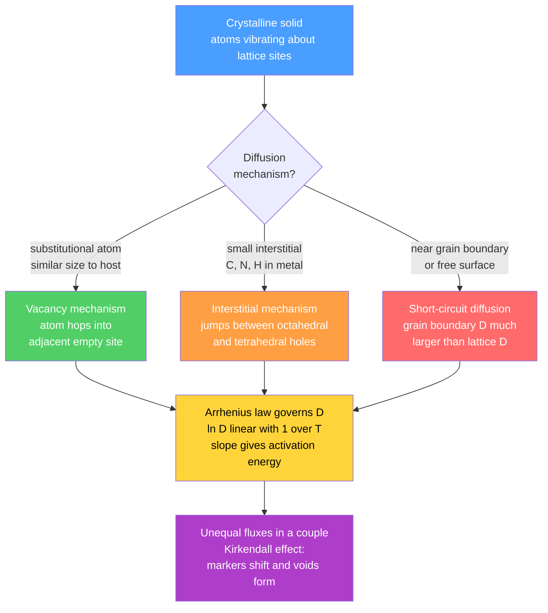

# ⚗️ Diffusion in Solids and Fick's Laws

> [!abstract] TL;DR
> Diffusion is the net transport of atoms driven by a concentration gradient. In solids it is described by **Fick's First Law** ($J = -D\,\partial C/\partial x$, flux proportional to gradient, steady state) and **Fick's Second Law** ($\partial C/\partial t = D\,\partial^2 C/\partial x^2$, evolving profiles). The diffusivity $D$ obeys the **Arrhenius law** $D = D_0\exp(-Q_d/RT)$, changing by orders of magnitude with temperature. Mechanisms are vacancy-mediated (substitutional atoms) or interstitial (C, N, H in metals). The **Kirkendall effect** — unequal diffusion fluxes in a binary couple causing interface-marker shift and void formation — proved that diffusion proceeds by vacancies rather than direct atom exchange, and underpins modern understanding of interdiffusion, brass welding, and nanoscale void failures in microelectronics.

---

## Intuition

**Analogy:** Drop a bead of food coloring into a glass of water. Within minutes the color spreads through the whole glass — you can watch it happen in real time. Now imagine the same molecule trapped inside a steel ingot at room temperature. It would take millions of years to move even a nanometre, because every hop requires enough thermal energy to push past neighboring iron atoms locked in a rigid crystal lattice. Raise that steel to 1000 °C, however, and those same atomic hops happen billions of times per second per atom — and measurable carbon penetration (millimetres deep) develops in hours.

Diffusion in solids is **the same random walk as in a liquid**, but on a time scale controlled by the density and height of energy barriers between lattice sites. The mathematics of that random walk — averaged over an enormous number of hops — produces Fick's equations, and the Boltzmann distribution of hop energies produces the steep Arrhenius temperature dependence that makes solid-state diffusion both so sluggish at room temperature and so powerful at elevated temperature.

---

## How It Works

### Fick's First Law — Steady-State Flux

In the steady state the concentration profile $C(x)$ is not changing in time. The **diffusion flux** $J$ (moles of atoms crossing unit area per unit time, mol m⁻² s⁻¹) is proportional to the local concentration gradient:

$$J = -D\,\frac{dC}{dx}$$

The negative sign reflects that flux flows **down** the gradient (from high to low concentration). The **diffusion coefficient** or **diffusivity** $D$ (m² s⁻¹) is a material property that depends on temperature, the diffusing species, and the host lattice structure.

In three dimensions this generalises to $\mathbf{J} = -D\,\nabla C$, and for non-isotropic crystals $D$ becomes a second-rank tensor.

**Example — steady-state membrane permeation:** If one face is held at $C_1$ and the other at $C_2 < C_1$, the concentration profile is linear and the flux is simply $J = D(C_1 - C_2)/L$. This is the basis of gas-separation membrane calculations.

### Derivation of Fick's Second Law — Non-Steady State

In a non-steady situation, mass must be conserved locally. Consider a thin slab of thickness $dx$: the incoming flux is $J(x)$ and the outgoing flux is $J(x + dx)$. The **continuity equation** (mass conservation) gives:

$$\frac{\partial C}{\partial t} = -\frac{\partial J}{\partial x}$$

Substituting Fick's First Law $J = -D\,\partial C/\partial x$ with constant $D$:

$$\boxed{\frac{\partial C}{\partial t} = D\,\frac{\partial^2 C}{\partial x^2}}$$

This **parabolic PDE** is one of the most important in mathematical physics. It is structurally identical to the heat-conduction equation (Fourier) with thermal diffusivity $\alpha$ replacing $D$ — so every analytical solution to one is a solution to the other.

### Solution for the Semi-Infinite Solid (Carburization)

For a solid of semi-infinite extent with:
- **Initial condition:** $C(x,\,0) = C_0$ (uniform bulk composition throughout)
- **Surface boundary condition:** $C(0,\,t) = C_s$ for $t > 0$ (surface carbon fixed)

The exact solution involves the **Gaussian error function** $\operatorname{erf}(z) = \tfrac{2}{\sqrt{\pi}}\int_0^z e^{-u^2}\,du$:

$$\boxed{C(x, t) = C_s - (C_s - C_0)\,\operatorname{erf}\!\left(\frac{x}{2\sqrt{Dt}}\right)}$$

Key consequences:

- The **diffusion length** $\sqrt{Dt}$ is the natural length scale; every concentration profile is self-similar when plotted against $x / \sqrt{Dt}$.
- **Case depth scales as $\sqrt{t}$**: doubling the case depth requires four times the annealing time at the same temperature.
- At $x = 0$: $\operatorname{erf}(0) = 0$, so $C = C_s$ ✓. At $x \to \infty$: $\operatorname{erf}(\infty) = 1$, so $C \to C_0$ ✓.

The **case depth** $x^*$ to a target composition $C^*$ is found by inversion:

$$x^* = 2\sqrt{Dt}\;\operatorname{erfinv}\!\!\left(\frac{C_s - C^*}{C_s - C_0}\right)$$

Since the $\operatorname{erfinv}$ factor is a pure number, $x^* \propto \sqrt{Dt}$.

### Arrhenius Diffusivity

The temperature dependence of $D$ follows the Arrhenius law:

$$D = D_0\,\exp\!\left(-\frac{Q_d}{RT}\right)$$

where $D_0$ (m² s⁻¹) is the **pre-exponential factor** (related to the jump attempt frequency and jump distance), $Q_d$ (J mol⁻¹) is the **activation energy for diffusion**, $R = 8.314$ J mol⁻¹ K⁻¹, and $T$ is absolute temperature (K).

Plotting $\ln D$ versus $1/T$ gives a straight line of slope $-Q_d/R$ and intercept $\ln D_0$ — the **Arrhenius plot**, used to extract $Q_d$ from measured diffusivities at two or more temperatures.

**Tabulated values (Callister, Table 5.2):**

| Diffusing species | Host metal | Structure | $D_0$ (m² s⁻¹) | $Q_d$ (kJ mol⁻¹) |
|---|---|---|---|---|
| C | $\alpha$-Fe (ferrite) | BCC | $6.2 \times 10^{-7}$ | 80 |
| C | $\gamma$-Fe (austenite) | FCC | $2.3 \times 10^{-5}$ | 148 |
| Fe | $\alpha$-Fe (self-diffusion) | BCC | $2.8 \times 10^{-4}$ | 251 |
| Cu | Cu (self-diffusion) | FCC | $7.8 \times 10^{-5}$ | 211 |
| Cu | Ag | FCC | $1.2 \times 10^{-4}$ | 193 |
| Zn | Cu | FCC | $2.4 \times 10^{-5}$ | 189 |

Notice that interstitial C in iron has much lower $Q_d$ than substitutional metal-in-metal pairs (80 vs. 200+ kJ mol⁻¹), reflecting the smaller barrier for squeezing through a gap versus requiring a vacancy.

### Diffusion Mechanisms and the Kirkendall Effect



---

## Key Concepts / Details

### Secondary Level

**What is diffusion?**
Atoms in a solid are not stationary — they vibrate continuously with kinetic energy $\sim k_B T$. Occasionally a thermal excitation is large enough to push an atom over the energy barrier to a neighbouring site. Each individual hop is random, equally likely in any direction. However, if there is a **concentration gradient** (more atoms of species A on the left than the right), the net statistical drift of A is toward the right. Averaged over billions of hops and billions of atoms, this net drift is what we call diffusion.

**Fick's First Law in plain language:** The rate at which atoms cross a surface (flux $J$) is proportional to how steeply the concentration drops across that surface. A steep gradient drives a large flux; a flat profile drives no net flux.

**Why solids diffuse so slowly:**
In a gas or liquid, atoms are free to move; in a solid they are bound to lattice sites. Each hop requires activation energy $Q_d$ (typically 80–250 kJ mol⁻¹), so only the exponentially small Boltzmann-weighted tail of the energy distribution — a tiny fraction of atoms at room temperature — can hop at any given moment. Raise the temperature and exponentially more atoms have sufficient energy; $D$ can span 10 or more orders of magnitude between room temperature and the melting point.

**Units (must be consistent):**

| Quantity | Symbol | SI unit |
|---|---|---|
| Diffusion flux | $J$ | mol m⁻² s⁻¹ |
| Diffusivity | $D$ | m² s⁻¹ |
| Concentration | $C$ | mol m⁻³ (or wt% for engineering) |
| Depth | $x$ | m |
| Time | $t$ | s |

### Undergraduate Level

**Fick's First and Second Laws — full treatment.**

First law (vector form): $\mathbf{J} = -D\,\nabla C$.

Second law derivation: apply the divergence theorem to the continuity equation. With constant $D$:

$$\frac{\partial C}{\partial t} = D\,\nabla^2 C$$

In 1-D: $\partial C/\partial t = D\,\partial^2 C/\partial x^2$.

When $D$ depends on composition (the general case in a binary alloy), the PDE becomes nonlinear:

$$\frac{\partial C}{\partial t} = \frac{\partial}{\partial x}\!\left[D(C)\,\frac{\partial C}{\partial x}\right]$$

**Error function solution — carburization.**

For the semi-infinite solid ($C_s$ fixed at surface, $C_0$ uniform initially):

$$C(x, t) = C_s - (C_s - C_0)\,\operatorname{erf}\!\left(\frac{x}{2\sqrt{Dt}}\right)$$

A useful table of erf values for quick hand calculations:

| $z$ | $\operatorname{erf}(z)$ |
|---|---|
| 0.0 | 0.000 |
| 0.2 | 0.223 |
| 0.4 | 0.428 |
| 0.6 | 0.604 |
| 0.8 | 0.742 |
| 1.0 | 0.843 |
| 1.2 | 0.910 |
| 1.5 | 0.967 |
| 2.0 | 0.995 |

**Vacancy mechanism.**

Every real crystal above 0 K contains **Schottky vacancies** (missing lattice atoms) in equilibrium with the crystal surface. The equilibrium vacancy fraction is:

$$\frac{n_v}{N} = \exp\!\left(-\frac{Q_v}{k_B T}\right)$$

where $Q_v$ is the vacancy formation energy ($\sim$1 eV in metals). For a substitutional atom to hop, a vacancy must exist at a nearest-neighbour site AND the atom must have enough energy to squeeze past the surrounding atoms (migration energy). The measured $Q_d$ is therefore approximately the sum:

$$Q_d \approx Q_v\text{(formation)} + Q_m\text{(migration)}$$

**Interstitial mechanism.**

Small atoms — C, N, B, H — that occupy the interstices between host atoms do not require a vacancy. The diffusing atom simply hops to an adjacent interstitial site. Because no lattice atom must move out of the way, only the migration energy $Q_m$ enters, and $Q_d$ is correspondingly lower. This is why C diffuses through iron orders of magnitude faster than Fe diffuses through Fe (80 vs. 251 kJ mol⁻¹).

**Diffusion couple and interdiffusion.**

When two materials A and B are bonded together and annealed, both species diffuse into the other. The quantity measured by electron microprobe or SIMS is the **interdiffusion coefficient** $\tilde{D}$ (also called $D_{AB}$ or the mutual diffusion coefficient), which describes the evolution of the composition profile. For ideal solutions, $\tilde{D}$ is a simple composition-weighted average of the intrinsic diffusivities (Darken equation, see graduate section).

**Calculating case depth — worked recipe:**

1. Look up $D_0$ and $Q_d$ for the diffusing pair at the target temperature.
2. Compute $D = D_0 \exp(-Q_d/RT)$.
3. Compute the dimensionless concentration $(C_s - C^*)/(C_s - C_0)$.
4. Find $z = \operatorname{erfinv}\bigl[(C_s-C^*)/(C_s-C_0)\bigr]$ from the table above.
5. Compute $x^* = 2z\sqrt{Dt}$.

### Graduate Level

**Kirkendall effect — history and mechanism.**

In 1947, Ernest Kirkendall placed inert molybdenum wire markers at the interface of a brass (Cu–Zn)/copper diffusion couple. After annealing at 785 °C, he observed that the markers had shifted toward the brass side. The implication was profound: Zn diffuses into Cu faster than Cu diffuses into Zn ($D_{\text{Zn}} > D_{\text{Cu}}$), which means more atoms leave the Zn-rich side per unit time than enter it. Mass balance requires a **net vacancy flux** into the Zn-rich side, which supersaturates it with vacancies. Those vacancies condense into **Kirkendall voids** — microscopic pores at or near the original interface.

This experiment definitively ruled out the "ring-exchange" mechanism (two atoms swapping directly) and established the vacancy mechanism as the operative process in substitutional diffusion. The practical consequence is that Kirkendall voids degrade bonding reliability in Cu–Al wire bonds in microelectronics and in any brazed or soldered joint involving fast/slow diffusing couples.

**Darken equations — interdiffusion from intrinsic diffusivities.**

Darken (1948) showed that the measured interdiffusion coefficient and the Kirkendall marker velocity $v_K$ are related to the intrinsic (frame-fixed) diffusivities $D_A^*$ and $D_B^*$ by:

$$\tilde{D} = X_B D_A^* + X_A D_B^*$$

$$v_K = \left(D_B^* - D_A^*\right)\frac{\partial X_B}{\partial x}$$

When $D_A^* = D_B^*$, there is no marker shift and $\tilde{D} = D_A^* = D_B^*$. The Darken equations are the starting point for calculating interdiffusion in real alloys and for designing diffusion barriers in thin-film metallisation stacks.

**Grain boundary diffusion — Hart equation and Fisher–Whipple model.**

Grain boundaries are regions of local disorder where atomic packing is less efficient; their diffusivity $D_{gb}$ exceeds the lattice value $D_L$ by a factor of $10^4$–$10^8$ depending on temperature and boundary structure. The **effective diffusivity** measured in a polycrystal is:

$$D_{\text{eff}} = (1 - f)\,D_L + f\,D_{gb}$$

where $f$ is the fraction of atoms residing in grain boundaries ($f \approx 3\delta / d$ for grain boundary width $\delta \approx 0.5$ nm and grain diameter $d$). For $d = 10\,\mu$m, $f \approx 1.5 \times 10^{-4}$; for $d = 10\,\text{nm}$ (nanocrystalline), $f \approx 0.15$.

The **Fisher–Whipple** model provides the concentration profile in a bicrystal: in the grain boundary itself the profile is approximately Gaussian; outside it decays more slowly, giving a characteristic "tailing" in SIMS depth profiles with the functional form $C \propto \exp(-x^{6/5})$ in the grain-boundary-dominated region.

At temperatures above $\sim 0.75\,T_m$, lattice diffusion dominates (large $D_L$); below $\sim 0.5\,T_m$, grain boundary and surface diffusion dominate — which is why sintering of fine powders and thin-film annealing proceed effectively at temperatures that would leave bulk material nearly frozen.

**Boltzmann–Matano analysis.**

When $D$ depends on composition (as it does in most binary alloys — Cu–Ni, Fe–Cr, etc.), the diffusion equation is nonlinear and cannot be solved analytically. The Boltzmann–Matano method extracts $D(C)$ directly from a measured concentration profile without assuming any functional form:

$$D(C^*) = -\frac{1}{2t}\left.\frac{dx}{dC}\right|_{C=C^*}\!\!\int_{C_0}^{C^*} x\, dC$$

The **Matano plane** (the plane satisfying $\int_{C_0}^{C_s} x\, dC = 0$, which conserves total solute) serves as the reference origin. In practice, the profile is measured by electron microprobe, digitised, and differentiated numerically.

**Nernst–Planck and stress-driven diffusion.**

In a multicomponent system under a chemical potential gradient (not just a concentration gradient), the correct driving force for diffusion is:

$$J_i = -\frac{D_i C_i}{RT}\,\frac{\partial \mu_i}{\partial x}$$

where $\mu_i$ is the chemical potential of species $i$. When a hydrostatic stress field $\sigma$ exists (e.g., in a constrained thin film or near a dislocation), it contributes to $\mu_i$ via a molar volume term $V_m \sigma$, coupling mechanical stress and mass transport. This is the physical basis for **electromigration** (electron-wind force adds a drift term) and **stress-migration** void growth in interconnects — failure modes in every advanced microprocessor.

---

## Python Demo

```python
import numpy as np
import matplotlib.pyplot as plt
from scipy.special import erf

# ---------------------------------------------------------------
# Carburization of steel at 1000 °C — Fick's 2nd Law solution
# Semi-infinite solid with constant surface concentration:
#   C(x, t) = C_s - (C_s - C_0) * erf(x / (2 * sqrt(D * t)))
# ---------------------------------------------------------------

# Surface and bulk carbon concentrations (wt %)
C_s = 1.20
C_0 = 0.25

# Diffusivity of C in austenite (gamma-Fe) — Callister Table 5.2
D_0 = 2.3e-5        # m^2/s  pre-exponential factor
Q_d = 148e3         # J/mol  activation energy
R   = 8.314         # J/(mol·K)
T   = 1273.15       # K  (= 1000 °C)
D   = D_0 * np.exp(-Q_d / (R * T))   # ≈ 1.9e-11 m^2/s

# Depth array 0–3 mm, converted to metres for SI consistency
x_mm = np.linspace(0.0, 3.0, 500)
x    = x_mm * 1e-3

# Three annealing times
times_h = [1, 4, 9]
colors  = ["#e64980", "#f76707", "#2f9e44"]

fig, ax = plt.subplots(figsize=(8, 5))

for t_h, color in zip(times_h, colors):
    t  = t_h * 3600                                          # hours to seconds
    Cx = C_s - (C_s - C_0) * erf(x / (2.0 * np.sqrt(D * t)))
    ax.plot(x_mm, Cx, color=color, linewidth=2, label=f"t = {t_h} h")
    # Annotate the depth at which C = 0.80 wt% (typical case-depth spec)
    idx = np.argmin(np.abs(Cx - 0.80))
    ax.annotate(
        f"{x_mm[idx]:.2f} mm",
        xy=(x_mm[idx], 0.80),
        xytext=(x_mm[idx] + 0.18, 0.86),
        fontsize=8, color=color,
        arrowprops=dict(arrowstyle="-", color=color, lw=0.8)
    )
    ax.plot(x_mm[idx], 0.80, "o", color=color, markersize=5)

ax.axhline(C_0, color="steelblue", linestyle="--", linewidth=1.2,
           label=f"C₀ = {C_0} wt% C (bulk steel)")
ax.axhline(0.80, color="gray", linestyle=":", linewidth=1.0,
           label="Case-depth threshold (0.80 wt%)")

ax.set_xlabel("Depth  x  (mm)", fontsize=12)
ax.set_ylabel("Carbon content  (wt %)", fontsize=12)
ax.set_title(
    "Carburization profiles — C in γ-Fe at 1000 °C\n"
    "(Fick’s 2nd Law, semi-infinite solid, error-function solution)",
    fontsize=11
)
ax.legend(fontsize=9)
ax.set_xlim(0.0, 3.0)
ax.set_ylim(0.15, 1.35)
ax.grid(True, alpha=0.3)

print(f"D(1000 °C) = {D:.3e} m²/s")
for t_h in times_h:
    dl = np.sqrt(D * t_h * 3600) * 1e3
    print(f"  √(Dt) at t = {t_h} h  =  {dl:.3f} mm")

plt.tight_layout()
plt.show()
```

The three profiles show the carbon front penetrating deeper as time increases. The $\sqrt{t}$ scaling is explicit in the annotations: the case depth at 4 h is exactly twice that at 1 h, and at 9 h exactly three times — a direct consequence of the diffusion length $\sqrt{Dt}$.

---

## Real-World Applications

> **Carburizing steel gears.** Automobile transmission gears are carburized in a controlled-atmosphere furnace at 900–1000 °C for 4–12 hours. The process precisely controls $C_s$ (via carbon potential of the furnace atmosphere), temperature, and time to achieve a case depth of 0.5–2.0 mm with high-carbon, high-hardness surface (after quenching) on a tough, low-carbon steel core. Every process engineer designs this with the error-function formula above, then confirms the profile by microhardness traverse or EPMA.

> **Semiconductor doping — drive-in anneal.** Ion implantation places dopant atoms (B for p-type, P or As for n-type) near the silicon surface with a roughly Gaussian distribution. A subsequent "drive-in" anneal at 900–1100 °C in an inert atmosphere uses Fick's Second Law (Gaussian source boundary condition) to redistribute the dopant to the desired junction depth. The junction depth and surface concentration set the transistor threshold voltage, contact resistance, and leakage current. Every transistor in a modern chip was designed this way.

> **Sintering of ceramics and powder metals.** When powder compacts are heated to 60–90% of $T_m$, mass transport by diffusion closes pores, grows inter-particle necks, and densifies the compact. Surface diffusion dominates early stages (neck growth); grain boundary and lattice diffusion control later densification. Fine powders sinter faster and at lower temperatures because their large grain-boundary area per volume elevates $D_{\text{eff}}$ — the basis for the entire field of sintered ceramics, cemented carbides, and powder metallurgy.

> **High-temperature oxidation and parabolic kinetics.** When iron or steel oxidises, the oxide film acts as a diffusion barrier: either oxygen diffuses inward through the scale or metal cations diffuse outward (e.g. Fe²⁺ in FeO scales). Wagner's oxidation theory shows that, as the scale thickens, the diffusion path grows, so the growth rate slows: oxide thickness $x \propto \sqrt{t}$ — **parabolic kinetics**, a direct signature of Fickian control. Engineering stainless steels and superalloys with Cr or Al to form thin, slowly growing, protective Cr₂O₃ or Al₂O₃ scales is the primary strategy for high-temperature corrosion resistance.

---

## Common Pitfalls

- **Confusing the two laws** — Fick's First Law ($J = -D\,\partial C/\partial x$) is for steady state; Fick's Second Law ($\partial C/\partial t = D\,\partial^2 C/\partial x^2$) is for transient profiles. Applying the steady-state flux formula to a carburization calculation gives nonsense because the profile is evolving throughout the process.
- **Treating $D$ as constant when it is composition-dependent** — In real binary alloys $D = D(C)$, making Fick's Second Law nonlinear. The error-function solution is valid only when $D$ is truly constant. In Cu–Ni or Fe–Cr interdiffusion, ignoring composition dependence can produce errors of an order of magnitude in predicted case depths.
- **Unit errors** — $D$ is m² s⁻¹ in SI; many textbook tables list cm² s⁻¹. Mixing cm² s⁻¹ with depths in metres or times in minutes is the single most common numerical error in process calculations. Always convert to SI before computing.
- **Ignoring grain boundary diffusion at low temperatures** — At $T \lesssim 0.75\,T_m$, grain boundary diffusion can exceed lattice diffusion by many orders of magnitude, especially in fine-grained or nanocrystalline materials. Using bulk $D_L$ values for a thin-film anneal or a sintering calculation at moderate temperature will be wildly non-conservative.
- **Violating the semi-infinite approximation** — The error-function solution assumes the diffusion front has not reached the far face. When $\sqrt{Dt}$ becomes comparable to the sample thickness $L$, a Fourier-series solution with finite-length boundary conditions is required. Applying the error-function solution in this regime overestimates the case depth.
- **Neglecting stress-driven diffusion in thin films** — Hydrostatic stress from thermal mismatch or electromigration adds a chemical-potential-gradient term that Fick's Law alone misses. In narrow copper interconnects, this drives void nucleation and growth — the dominant reliability failure in sub-100 nm transistor nodes.

---

## Related Concepts

- [[Chemical_Kinetics]] — the Arrhenius equation $k = A\,e^{-E_a/RT}$ is structurally identical to $D = D_0\,e^{-Q_d/RT}$; both are thermally activated rate processes, and the same Arrhenius-plot technique extracts the activation energy.
- [[Laws_of_Thermodynamics]] — the true thermodynamic driving force for diffusion is the gradient of **chemical potential**, not concentration; the Second Law (entropy increase) is what drives atoms from high to low chemical potential, and entropy production is proportional to flux times driving force.
- [[Chemical_Thermodynamics]] — chemical potential, activity, and the Darken–Hartley–Crank formulation that connects the thermodynamic factor to the interdiffusion coefficient; non-ideal solution behaviour can cause uphill diffusion against a concentration gradient.
- [[Solid_State_and_Crystal_Structures]] — Schottky vacancies and interstitial sites are the atomic vehicles that carry substitutional and interstitial diffusion; the crystal structure (BCC vs. FCC) determines which interstitial sites are available, their size, and therefore which atoms fit.
- [[Semiconductors_and_Devices]] — p-n junction engineering relies on the drive-in diffusion of ion-implanted dopants; junction depth, doping profile, and channel length are all set by Fick's Second Law solutions (with Fermi-level-dependent $D$ corrections at graduate level).
- [[Phase_Transitions_and_Critical_Phenomena]] — nucleation of a new phase and subsequent growth require solute redistribution by long-range diffusion; the competition between nucleation driving force and diffusion kinetics determines microstructure.
- [[Nucleation_Growth_and_Solidification]] *(planned Materials Science note)* — solidification front velocity and dendrite spacing are controlled by solute redistribution; the ratio of diffusion length $\sqrt{Dt}$ to solidification time scale appears in the constitutional supercooling criterion.
- [[Heat_Treatment_and_Microstructure]] *(planned)* — carburising, nitriding, decarburisation, and precipitation hardening all rely on controlled diffusion; TTT and CCT diagrams encode the kinetics of diffusion-controlled phase transformations.
- [[Semiconductors_Intrinsic_and_Extrinsic]] *(planned)* — dopant concentration profiles that set carrier density and junction location are computed directly from the semi-infinite solid solution of Fick's Second Law.
- [[_MOC_Thermal_and_Phase_Behavior]] *(planned)* — parent section map covering thermally activated and phase-change phenomena in the Materials Science vault.

---

## Review Questions

1. **Conceptual:** Fick's Second Law implies that a region where the concentration profile is **concave upward** (positive second derivative $\partial^2 C/\partial x^2 > 0$) will have its local concentration *increase* over time, even if the region already has a higher concentration than adjacent zones. Explain this physically using the concept of flux divergence — specifically, why does more flux enter a concave-up region than leaves it?

2. **Scenario:** A steel shaft must be carburised to $C \geq 0.80$ wt% C at a depth of $x^* = 2.0$ mm. The surface is maintained at $C_s = 1.20$ wt% C and the bulk is $C_0 = 0.25$ wt% C. Using $D_0 = 2.3 \times 10^{-5}$ m² s⁻¹ and $Q_d = 148$ kJ mol⁻¹ for C in $\gamma$-Fe: (a) calculate the required annealing time at 1000 °C; (b) by how much is the time reduced if the temperature is raised to 1050 °C? What process constraint might limit raising the temperature indefinitely?

3. **Trade-off:** The Kirkendall effect demonstrates that Cu and Zn diffuse at different rates in brass, producing voids that degrade bond reliability in Cu–Al wire bonds in microelectronics. Propose and physically justify **two engineering strategies** — one compositional (alloying) and one structural (geometry or microstructure) — to suppress Kirkendall void formation, explaining the diffusion physics behind each choice.

---

## Sources

- [Callister, W. D. & Rethwisch, D. G. — *Materials Science and Engineering: An Introduction*, 10th ed., Wiley (2018), Ch. 5](https://www.wiley.com/en-us/Materials+Science+and+Engineering+An+Introduction+10th+Edition-p-9781119405498)
- [Shewmon, P. — *Diffusion in Solids*, 2nd ed., TMS/Springer (1989/2016)](https://link.springer.com/book/10.1007/978-3-319-48206-4)
- [Crank, J. — *The Mathematics of Diffusion*, 2nd ed., Oxford University Press (1975)](https://global.oup.com/academic/product/the-mathematics-of-diffusion-9780198534112)
- [Porter, D. A., Easterling, K. E. & Sherif, M. Y. — *Phase Transformations in Metals and Alloys*, 3rd ed., CRC Press (2009), Ch. 2](https://www.taylorfrancis.com/books/mono/10.1201/9781439883570)
- [Darken, L. S. — "Diffusion, Mobility and Their Interrelation through Free Energy in Binary Metallic Systems", *Trans. AIME* 175, 184 (1948)](https://www.osti.gov/biblio/4413965)

---

#MaterialsScience #Diffusion #FicksLaws #SolidStateDiffusion #Carburization #KirkendallEffect #ArrheniusDiffusivity #HeatTreatment
