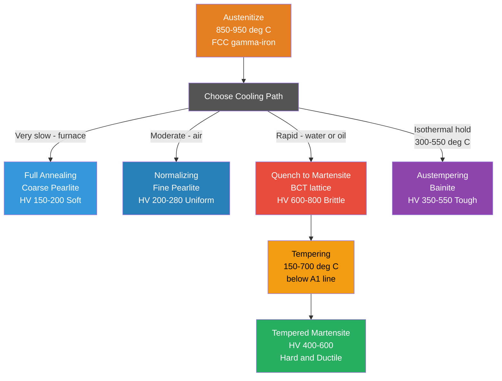

# Heat Treatment and Microstructure

> [!abstract] TL;DR
> Heat treatment controls the microstructure of metals by choosing austenitizing temperature, cooling rate, and hold time — the same steel can become soft pearlite (slow cool), razor-hard martensite (fast quench), or tough bainite (interrupted quench), and subsequent tempering or aging fine-tunes the property balance.

---

## Intuition

**Analogy:** Heat treating steel is exactly like tempering chocolate. Melt chocolate (austenite), then cool it slowly while stirring (annealing) and you get stable, glossy chocolate with a satisfying snap (coarse, well-ordered microstructure). Cool it too fast without control (quenching) and you get dull, crumbly chocolate (martensite — hard and brittle). The master chocolatier holds the melt at a precise intermediate temperature before final cooling (tempering/austempering) to nucleate the right crystal form — yielding the ideal balance of hardness and toughness.

In steel, the "crystal form" is a phase: face-centered cubic austenite above 727°C transforms, depending on how you cool it, into lamellar pearlite, needle-like bainite, or strained body-centered tetragonal martensite. Every heat treatment path through the time-temperature space is a deliberate choice about which transformation product — and therefore which combination of strength, ductility, and toughness — you want in the finished part.

---

## How It Works



---

## Key Concepts / Details

### Secondary Level

#### Annealing: Recovery, Recrystallization, and Grain Growth

When cold-worked (plastically deformed) metal is heated, three sequential stages restore the microstructure:

**Stage 1 — Recovery** (T below recrystallization temperature)

Dislocations rearrange into lower-energy configurations (sub-grain boundaries) by climb and glide, driven by increased atomic diffusivity. Residual stress drops significantly; hardness changes little.

**Stage 2 — Recrystallization**

New strain-free equiaxed grains nucleate and grow, consuming the deformed matrix. The driving force is the stored energy of cold work. Yield strength drops sharply; ductility recovers.

Key empirical rule:

$$T_r \approx 0.4\, T_m \quad \text{(both in Kelvin)}$$

where $T_m$ is the melting point in Kelvin. For iron ($T_m = 1811$ K): $T_r \approx 724$ K = 451°C.

Recrystallization temperature decreases with:
- Greater prior cold work (more stored energy)
- Longer annealing time (kinetics)
- Smaller original grain size (more nucleation sites)
- Fewer solute atoms / second-phase particles (they pin grain boundaries)

**Stage 3 — Grain Growth**

After recrystallization completes, grains coarsen to reduce total grain boundary energy. Grain size $D$ follows:

$$D^2 - D_0^2 = K\,t$$

where $D_0$ is the initial grain size, $t$ is time, and $K = K_0\exp(-Q/RT)$ is an Arrhenius rate constant. Coarser grains lower strength (Hall-Petch: $\sigma_y = \sigma_0 + k_y D^{-1/2}$) but improve creep resistance.

---

#### Basic Steel Heat Treatments

All three start by **austenitizing** — heating above the $A_3$ (hypoeutectoid) or $A_{cm}$ (hypereutectoid) or $A_1$ (eutectoid) line to convert steel to single-phase austenite. What follows determines the final microstructure.

| Treatment | Cooling Method | Product | Hardness | Use Case |
|-----------|---------------|---------|----------|----------|
| Full annealing | Furnace cool (very slow) | Coarse pearlite + ferrite | Low (HRB 60-80) | Improve machinability before machining |
| Normalizing | Air cool (moderate) | Fine pearlite | Medium (HRB 80-95) | Refine grain, homogenize after forging |
| Quenching | Water or oil quench (rapid) | Martensite | High (HRC 60-66) | Maximum hardness for wear resistance |
| Austempering | Quench to bainite temp, hold | Bainite | Medium-high (HRC 45-55) | Tough, distortion-free parts |

---

### Undergraduate Level

#### Martensite Formation

Martensite is not formed by diffusion. When austenite is cooled faster than the critical cooling rate, carbon atoms have no time to redistribute. Instead, the FCC lattice shears **diffusionlessly** into a body-centered tetragonal (BCT) structure, trapping all carbon in interstitial sites.

Key features:
- **BCT lattice**: the $c/a$ ratio (tetragonality) increases linearly with carbon content — more carbon, more lattice distortion, more hardness.
- **Driving force**: the chemical free energy difference $\Delta G^{\gamma \to \alpha'}$ between austenite and martensite.
- **Athermal transformation**: martensite fraction depends on temperature reached, not time. Two critical temperatures:
  - $M_s$ = martensite start temperature (austenite becomes unstable)
  - $M_f$ = martensite finish temperature (transformation complete)

For eutectoid steel: $M_s \approx 230°C$, $M_f \approx -30°C$.

Koistinen-Marburger equation for fraction martensite:

$$f_M = 1 - \exp[-0.011\,(M_s - T)]$$

where $T$ is the quench temperature in °C.

Martensite is the hardest steel microstructure (HRC up to 66 for high-carbon steel) but also the most brittle — high dislocation density, massive lattice strain from trapped carbon, and internal stresses from the volume expansion on transformation.

---

#### TTT and CCT Diagrams

A **Time-Temperature-Transformation (TTT) diagram** (also called an isothermal transformation diagram) maps transformation products for austenite held isothermally at various temperatures below $A_1$:

- Upper region: pearlite (lamellar ferrite + cementite)
- Middle region: bainite (acicular, finer ferrite + carbide)
- Lower horizontal lines: $M_s$ and $M_f$
- The "nose" of the C-curve marks the temperature of maximum transformation rate (minimum incubation time), typically around 550°C for eutectoid steel

The three heat treatment paths in the diagram:
- **Quenching**: vertical line through the austenite field, missing the C-curve nose entirely → martensite
- **Normalizing**: diagonal path that intersects the pearlite region around the nose → fine pearlite
- **Annealing**: slow diagonal far to the right, cutting the pearlite region at high temperature → coarse pearlite

A **Continuous Cooling Transformation (CCT) diagram** is more practical: it maps the microstructure for continuous (non-isothermal) cooling. CCT curves are displaced to longer times and lower temperatures compared to TTT curves of the same steel. Engineers use CCT diagrams to select quench rates for production conditions.

---

#### Tempering

As-quenched martensite is too brittle for most applications. **Tempering** — reheating below $A_1$ — allows controlled carbon diffusion and stress relief:

| Tempering Stage | Temperature Range | What Happens |
|----------------|------------------|--------------|
| Stage 1 | 100-200°C | Epsilon carbide precipitates; tetragonality reduces |
| Stage 2 | 200-300°C | Retained austenite decomposes to bainite |
| Stage 3 | 300-500°C | Epsilon carbide dissolves; cementite (Fe₃C) forms |
| Stage 4 | 400-700°C | Cementite spheroidizes; grain recovery |

The higher the tempering temperature, the lower the hardness and the higher the ductility. The trade-off is captured by the **Hollomon-Jaffe parameter**:

$$P = T\,(C + \log t)$$

where $T$ is tempering temperature (K), $t$ is time (hours), and $C$ is a steel-specific constant (~20 for most steels).

**Tempering embrittlement** (350-550°C range): impurity segregation (P, Sb, Sn) to prior austenite grain boundaries can cause intergranular fracture. Avoid by tempering above 600°C or below 350°C.

High-carbon steels temper faster than low-carbon steels for the same temperature, because more carbon means more supersaturation and more driving force for carbide precipitation.

---

#### Hardenability and the Jominy End-Quench Test

**Hardenability** is the ability of steel to form martensite at depth (not just at the surface) during quenching. It is not the same as hardness.

The **Jominy end-quench test** (ASTM A255) is the standard measurement:
1. Austenitize a standardized cylindrical bar (25.4 mm diameter, 101.6 mm long)
2. Quench one end with a water jet (fast cooling) while the other end air-cools (slow)
3. Measure hardness at intervals along the bar

The resulting **Jominy hardenability curve** shows HRC vs distance from quenched end. Steels with high hardenability maintain high hardness far from the quenched end (shallow cooling rate gradient).

Hardenability increases with:
- **Alloy additions** that slow the C-curve (Cr, Mo, Ni, Mn, V) — they shift the TTT nose to longer times
- **Higher carbon content** (up to eutectoid)
- **Larger austenite grain size** (fewer nucleation sites for pearlite)

The ideal critical diameter $D_I$ is the diameter of a bar that produces 50% martensite at its center when quenched in an ideal medium.

---

### Graduate Level

#### Bainite: Upper and Lower

Bainite forms by an intermediate mechanism — partly diffusional, partly displacive — between 250°C (lower bainite) and 550°C (upper bainite):

- **Upper bainite** (350-550°C): ferrite laths with cementite precipitates between them. The morphology resembles a feathery structure. Toughness is lower than lower bainite because cementite is coarser.
- **Lower bainite** (250-350°C): ferrite plates with fine carbides inside them (angled ~55° to the plate habit plane). High hardness (HRC 50-58) with much better toughness than martensite, because carbides are fine and well-dispersed.

The bainite transformation is incomplete in many steels — a fraction of austenite stabilized by carbon enrichment remains untransformed. This **retained austenite** can transform later during service (transformation-induced plasticity, TRIP effect).

---

#### Precipitation Hardening (Age Hardening)

Used for non-ferrous alloys (Al-Cu, Al-Mg-Si, Ti-6Al-4V, Ni superalloys). Three steps:

**Step 1 — Solution Treatment**: Heat to single-phase region (e.g., 540°C for Al-Cu at 4 wt% Cu) to dissolve all solute. Hold until homogeneous supersaturated solid solution forms.

**Step 2 — Quench**: Rapidly cool to room temperature, trapping solute atoms in solution. The alloy is now a **supersaturated solid solution** (SSSS).

**Step 3 — Aging**: Hold at an intermediate temperature (or at room temperature for "natural aging") to allow precipitation:

$$\text{SSSS} \rightarrow \text{GP zones} \rightarrow \theta'' \rightarrow \theta' \rightarrow \theta\,(\text{equilibrium CuAl}_2)$$

**Guinier-Preston (GP) zones**: coherent Cu-rich discs, one unit cell thick, on {100} planes. Maximum coherency strain, maximum hardness. Formed at room temperature or low aging temperature.

$\theta''$ (metastable): ordered Cu-Al structure, still coherent, coherency strain large.

$\theta'$ (metastable): partially coherent, coarser. Hardness near peak.

$\theta$ (equilibrium CuAl₂): incoherent, coarse. Loss of coherency strain — hardness drops. This is **over-aging**.

**Peak hardness** occurs at an aging time/temperature that maximizes the number density of fine, coherent precipitates. The strengthening mechanism is dislocation cutting (fine coherent precipitates) transitioning to Orowan looping (coarse incoherent precipitates).

$$\sigma_{peak} \sim \sqrt{f}\, r_c \quad \text{(cutting regime)}$$

where $f$ is volume fraction and $r_c$ is critical radius for the cut-to-loop transition.

**Over-aging** occurs when precipitates coarsen (Ostwald ripening): large particles grow at the expense of small ones, reducing number density and losing coherency. The activation energy for over-aging follows an Arrhenius relationship:

$$\tau_{over} = A\,\exp\!\left(\frac{Q_{coarsen}}{RT}\right)$$

---

#### Austempering and Martempering

**Austempering**: Quench austenite to a temperature in the bainite range (typically 260-400°C) and hold isothermally until transformation to bainite is complete. Avoids martensite entirely. Result: bainite, excellent combination of strength and toughness, minimal distortion.

**Martempering** (marquenching): Quench to just above $M_s$, hold until temperature equalizes throughout the section (but before bainite forms), then air-cool through the martensite range. All sections transform to martensite simultaneously, minimizing thermal gradients and residual stress. Follow with conventional tempering.

---

#### Case Hardening

Used when only the surface needs to be hard (wear resistance) while the core remains tough (impact resistance):

- **Carburizing**: Expose low-carbon steel to a carbon-rich atmosphere at 900-950°C. Carbon diffuses in to depth of 0.5-3 mm. Quench to convert case to high-carbon martensite.
- **Nitriding**: Expose to nitrogen at 500-600°C (below $A_1$ — no phase change in core). Iron nitrides form in the surface layer. Very hard (HV 900-1100), corrosion-resistant; no quenching needed.
- **Induction hardening**: Local austenitizing by induction heating, followed by immediate quench. Only surface (skin depth) heats, preserving tough core. Used for gear teeth and crankshafts.

---

## Python Demo

```python
import numpy as np
import matplotlib.pyplot as plt

# -----------------------------------------------------------------------
# Schematic TTT diagram for eutectoid steel (0.77 wt% C)
# Data approximate from Callister & Rethwisch "Materials Science and
# Engineering: An Introduction", 10th ed., Fig. 10.13
# -----------------------------------------------------------------------

fig, ax = plt.subplots(figsize=(10, 7))
ax.set_xscale('log')

# --- Transformation curves (start and finish) ---
# Temperature array (deg C) and approximate log10(time/s)
T_vals = np.array([700, 680, 650, 620, 580, 550, 520, 480, 430, 380, 330, 280, 250])

# Transformation start times (seconds) — schematic
t_start = np.array([800, 150, 20, 4, 1.2, 0.7, 0.9, 2.5, 10, 60, 400, 3000, 15000])

# Transformation finish times (seconds) — schematic
t_finish = np.array([8e4, 1.5e4, 2000, 300, 80, 40, 60, 200, 1500, 2e4, 3e5, 3e6, 1.5e7])

# Smooth the curves with interpolation for plotting
T_interp = np.linspace(T_vals.min(), T_vals.max(), 300)
log_ts = np.interp(T_interp[::-1], T_vals[::-1], np.log10(t_start)[::-1])
log_tf = np.interp(T_interp[::-1], T_vals[::-1], np.log10(t_finish)[::-1])

ts_smooth = 10**log_ts
tf_smooth = 10**log_tf

ax.plot(ts_smooth, T_interp, 'navy', lw=2.5, label='Transformation start')
ax.plot(tf_smooth, T_interp, 'navy', lw=2.5, ls='--', label='Transformation finish')

# --- Key temperatures ---
T_A1 = 727   # eutectoid temperature
T_Ms = 230   # martensite start
T_Mf = 20    # martensite finish (schematic; actual is ~-30 C, shown at 20 for clarity)

ax.axhline(T_A1, color='gray',   lw=1.2, ls=':', alpha=0.7)
ax.axhline(T_Ms, color='firebrick', lw=2.0, ls='-',  label=f'$M_s$ = {T_Ms}°C')
ax.axhline(T_Mf, color='darkred',   lw=2.0, ls='--', label=f'$M_f$ ~ {T_Mf}°C (schematic)')

ax.text(1.5e7, T_A1 + 6,  '$A_1$ = 727°C', ha='right', fontsize=9, color='gray')

# --- Region labels ---
props_p = dict(boxstyle='round,pad=0.25', fc='lightblue', alpha=0.75)
props_b = dict(boxstyle='round,pad=0.25', fc='plum',      alpha=0.75)
props_m = dict(boxstyle='round,pad=0.25', fc='#ffcccb',   alpha=0.75)

ax.text(2e5, 660, 'Pearlite\n(coarse at top, fine near nose)',
        ha='center', va='center', fontsize=9, bbox=props_p)
ax.text(2e5, 430, 'Upper Bainite\n(feathery, lower toughness)',
        ha='center', va='center', fontsize=9, bbox=props_b)
ax.text(2e5, 290, 'Lower Bainite\n(fine carbides, tough)',
        ha='center', va='center', fontsize=9, bbox=props_b)
ax.text(2e5, 120, 'Martensite\n(BCT, hard, brittle)',
        ha='center', va='center', fontsize=9, bbox=props_m)

# --- Cooling paths ---
# 1. Quench (vertical at t ~ 0.3 s, fast)
ax.annotate('', xy=(0.3, T_Ms - 20), xytext=(0.3, T_A1 - 5),
            arrowprops=dict(arrowstyle='->', color='red', lw=2.5))
ax.text(0.18, 490, 'Quench', color='red', fontsize=9,
        rotation=90, va='center', fontweight='bold')

# 2. Normalizing (diagonal, misses nose just barely)
t_norm = np.array([0.8, 200])
T_norm = np.array([T_A1 - 5, 350])
ax.annotate('', xy=(200, 350), xytext=(0.8, T_A1 - 5),
            arrowprops=dict(arrowstyle='->', color='green', lw=2.5))
ax.text(8, 590, 'Normalizing\n(air cool)', color='green', fontsize=9,
        ha='center', fontweight='bold')

# 3. Full annealing (slow diagonal)
ax.annotate('', xy=(3e5, 400), xytext=(30, T_A1 - 5),
            arrowprops=dict(arrowstyle='->', color='purple', lw=2.5))
ax.text(5e3, 660, 'Annealing\n(furnace cool)', color='purple', fontsize=9,
        ha='center', fontweight='bold')

# --- Nose annotation ---
nose_t = t_start[np.argmin(t_start)]
nose_T = T_vals[np.argmin(t_start)]
ax.annotate('Nose\n(~550°C, ~0.7 s)',
            xy=(nose_t, nose_T), xytext=(15, 480),
            fontsize=8, color='navy',
            arrowprops=dict(arrowstyle='->', color='navy', lw=1.2))

# --- Axes ---
ax.set_xlabel('Time (seconds)', fontsize=12)
ax.set_ylabel('Temperature (°C)', fontsize=12)
ax.set_title('Schematic TTT Diagram — Eutectoid Steel (0.77 wt% C)', fontsize=13)
ax.set_xlim(0.1, 2e7)
ax.set_ylim(0, 760)
ax.legend(loc='upper right', fontsize=9)
ax.grid(True, which='both', alpha=0.25)
plt.tight_layout()
plt.savefig('TTT_eutectoid_steel_schematic.png', dpi=150)
plt.show()
```

The output shows the characteristic C-curve with the nose near 550°C at ~0.7 s. The quench path (red arrow) misses the nose entirely and crosses into the martensite region. The normalizing path (green) clips through the fine-pearlite region just above the nose. The annealing path (purple) traverses the coarse-pearlite region at high temperature.

---

## Real-World Applications

> **Example 1 — Crankshafts and Gears:** Automotive gears are case-carburized (AISI 8620 steel): the core, at 0.20 wt% C, stays tough under bending impact; the case, enriched to ~0.80 wt% C, is quenched to martensite and tempered to HRC 58-62 for wear resistance on tooth flanks. The dual microstructure (tough core / hard case) cannot be achieved with a single heat treatment of a uniform composition.

> **Example 2 — Boeing 787 Titanium Fasteners (Ti-6Al-4V):** These are precipitation-hardened by solution treatment at 960°C, rapid quench, then aging at 480-540°C for 4-8 hours. The fine alpha + Ti₃Al precipitates push yield strength to ~1100 MPa — roughly the same as high-strength steel at 60% of the weight.

> **Example 3 — 2024-T3 Aluminum (Aircraft skins):** Al-4.4Cu alloy solution-treated at 495°C, quenched, then naturally aged at room temperature (T3 temper). GP zones harden the alloy to 345 MPa yield strength. If over-aged (T8 — artificially aged), the equilibrium CuAl₂ forms, and yield strength drops and corrosion resistance degrades.

> **Example 4 — Jominy Testing for Tool Steel Selection:** A machine shop comparing AISI 4140 and 4340 for a large die block. The Jominy curves diverge sharply at 15-20 mm from the quenched end: 4340 (with Ni) maintains HRC 50 while 4140 has dropped to HRC 35. The hardenability difference, driven by Ni stabilizing austenite, determines which alloy will through-harden a 100 mm section.

---

## Common Pitfalls

- **Confusing hardenability with hardness** — hardness is the maximum hardness achievable; hardenability is how deeply it is achieved. High-hardenability steel (4340) can make a uniform HRC 50 through a 100 mm bar; low-hardenability steel (1080) will be HRC 65 at the surface but HRC 30 at the center of the same bar.
- **Ignoring retained austenite** — rapid quenching of high-carbon steels often leaves 20-40% retained austenite (because $M_f$ is below room temperature). Retained austenite is softer and can transform to martensite in service, causing dimensional instability. Fix: cryogenic treatment below $M_f$ or destabilize by tempering.
- **Tempering embrittlement in the 350-550°C range** — steels containing Mn, Si, Ni, Cr become embrittled when tempered in this range due to P/Sn/Sb segregation to prior austenite grain boundaries. The impact energy can drop by 80% with no hardness change. Add Mo to suppress the phenomenon or avoid the temperature range.
- **Over-aging in precipitation-hardened alloys** — aging at too high a temperature or for too long dissolves GP zones and grows coarse, incoherent precipitates. The alloy softens irreversibly and cannot be re-hardened without a full re-solution treatment followed by re-aging.
- **Decarburization during austenitizing** — exposing steel to air at high temperature causes surface carbon loss to depths of 0.1-0.5 mm. The decarburized layer has lower hardenability and hardness; it is a common source of fatigue failures from the surface.
- **Quench cracking** — martensite forms with a volume expansion of ~4%. Rapid, non-uniform cooling creates tensile stresses at the surface during transformation. High-carbon steels, complex shapes, and sharp corners are especially susceptible. Mitigation: use oil or polymer quench instead of water; apply martempering.

---

## Related Concepts

- [[Phase_Diagrams_and_the_Iron_Carbon_System]] — the Fe-Fe₃C phase diagram defines the austenitizing temperatures ($A_1$, $A_3$, $A_{cm}$) and the thermodynamic basis for all steel heat treatments
- [[Diffusion_in_Solids_and_Ficks_Laws]] — carbon diffusion governs carburizing case depth, recovery/recrystallization kinetics, and the time-temperature dependence of precipitation sequences
- [[Strengthening_Mechanisms_in_Metals]] — precipitate cutting and Orowan looping (precipitation hardening), solid-solution and grain boundary strengthening all interact with heat treatment choices
- [[Plastic_Deformation_and_Slip_Systems]] — dislocation density created by cold work is the driving force for recovery and recrystallization; martensite hardness is partly a dislocation effect
- [[Fatigue_Creep_and_High_Temperature_Failure]] — tempered martensite temper embrittlement, over-aging at service temperature, and case hardening all directly affect fatigue and creep life
- [[Laws_of_Thermodynamics]] — free energy differences between phases drive all transformations; Gibbs energy minimization determines equilibrium phase fields in the Fe-C system
- [[_MOC_Thermal_and_Phase_Behavior]] — section map of thermal and phase behavior topics in this vault

---

## Review Questions

1. **Conceptual** — A eutectoid steel bar is austenitized and then cooled at a rate that just misses the pearlite nose on the TTT diagram. Describe the microstructure at room temperature and explain why the cooling rate, not the temperature, is the controlling variable.

2. **Scenario** — You need to produce a 75 mm diameter 4140 steel shaft with HRC 40 at the center. The Jominy curve for 4140 shows HRC 40 at 20 mm from the quenched end. Using the Grossmann multiplying factors, determine whether a water quench or oil quench is needed, and what surface hardness you expect. What would change if you switched to 4340?

3. **Trade-off** — An Al-Cu component that was aged to peak hardness has been inadvertently exposed to 200°C for 500 hours in service. Explain in terms of the precipitation sequence what has happened to the microstructure and mechanical properties, whether the damage is recoverable, and what process change you would recommend to prevent recurrence.

---

## Sources

- Callister, W.D. & Rethwisch, D.G. — *Materials Science and Engineering: An Introduction*, 10th ed. (Wiley, 2018), Ch. 10-11
- Krauss, G. — *Steels: Processing, Structure, and Performance*, 2nd ed. (ASM International, 2015)
- Totten, G.E. (ed.) — *Steel Heat Treatment Handbook*, 2nd ed. (CRC Press, 2006)
- Porter, D.A., Easterling, K.E. & Sherif, M.Y. — *Phase Transformations in Metals and Alloys*, 3rd ed. (CRC Press, 2009)
- ASM Handbook Vol. 4A — *Steel Heat Treating Fundamentals and Processes* (ASM International, 2013)

---

#MaterialsScience #HeatTreatment #Microstructure #Steel #Martensite #Pearlite #Bainite #TTT #AgeHardening #PrecipitationHardening #Annealing #Hardenability #Intermediate
