# ❄️ Nucleation, Growth, and Solidification

> [!abstract] TL;DR
> Solidification is not instantaneous — the liquid must first form a **critical nucleus** of solid, surmounting an energy barrier that shrinks as undercooling $\Delta T = T_m - T$ increases. The critical radius is $r^* = 2\gamma_{SL}\,T_m/(L_f\,\Delta T)$ and the homogeneous barrier is $\Delta G^* = \frac{16\pi}{3}\,\gamma_{SL}^3/\Delta G_v^2$. Nucleation on walls, particles, or grain boundaries is **heterogeneous** and far easier because a contact angle $\theta$ multiplies the barrier by $f(\theta) = (2+\cos\theta)(1-\cos\theta)^2/4 \ll 1$. Once nuclei are present, crystal growth proceeds as planar, cellular, or **dendritic** depending on the constitutional undercooling ahead of the front; secondary dendrite arm spacing $\text{SDAS} \propto t_f^{1/3}$ controls microsegregation and mechanical properties. Post-solidification, fine precipitates coarsen by **Ostwald ripening** ($r^3 - r_0^3 = kt$), and repeated zone melting exploits equilibrium segregation for semiconductor-grade purification.

---

## Intuition — analogy FIRST

**Analogy:** Packing a snowball. You cannot clump a single flake into a ball and expect it to survive — you need a **critical mass**. Below that size the fragile surface of the ball costs more energy than the compactness gains; above it the bulk cohesion wins and the snowball grows on its own. The "critical mass" is exactly the critical nucleus radius $r^*$.

In a cooling liquid, tiny clusters of atoms assemble and dissolve constantly. Each cluster faces the same trade-off: the solid interior gains energy from the liquid-to-solid transformation (volume free energy, which is the driving force), but the new solid–liquid interface costs energy (surface penalty). The total free energy rises to a peak at $r^*$; clusters smaller than $r^*$ are **embryos** that dissolve back; those that fluctuate past $r^*$ become stable **nuclei** and grow without bound. The deeper the cooling below $T_m$ — the larger the undercooling $\Delta T$ — the smaller $r^*$ becomes and the lower the barrier, so nucleation accelerates dramatically.

Heterogeneous nucleation is like packing your snowball on a rough glove rather than in mid-air: the surface pre-wets the snow, and you need far less material to form a stable cluster.

---

## How It Works

### Thermodynamic Driving Force

Below the melting point $T_m$, the volumetric (per-unit-volume) Gibbs free energy difference between liquid and solid is, to first order in $\Delta T = T_m - T$:

$$\Delta G_v = \frac{L_f \,\Delta T}{T_m}$$

where $L_f$ (J m$^{-3}$) is the volumetric latent heat of fusion. $\Delta G_v > 0$ is the **thermodynamic driving force** favoring solidification.

### Total Free Energy of a Spherical Embryo

For a spherical nucleus of radius $r$:

$$\Delta G(r) = 4\pi r^2\,\gamma_{SL} - \frac{4}{3}\pi r^3\,\Delta G_v$$

The surface energy term ($\propto r^2$) **opposes** nucleation; the volume energy term ($\propto r^3$) **drives** it. Their competition creates a maximum at the critical radius:

$$\frac{d\,\Delta G}{dr} = 0 \implies \boxed{r^* = \frac{2\,\gamma_{SL}}{\Delta G_v} = \frac{2\,\gamma_{SL}\,T_m}{L_f\,\Delta T}}$$

Substituting back gives the **nucleation barrier**:

$$\boxed{\Delta G^* = \frac{16\pi}{3}\,\frac{\gamma_{SL}^3}{\Delta G_v^2}}$$

Both $r^*$ and $\Delta G^*$ decrease as $\Delta T$ increases: deeper undercooling lowers the barrier.

### Nucleation Rate

Classical nucleation theory gives:

$$I = A\,\exp\!\left(-\frac{\Delta G^*}{k_B T}\right)$$

Because $\Delta G^* \propto \Delta T^{-2}$, the rate rises exponentially once $\Delta T$ exceeds a material-dependent threshold — typically $\sim 0.2\,T_m$ for homogeneous nucleation in pure metals, but orders of magnitude lower for heterogeneous.

### Heterogeneous Nucleation

On a substrate with wetting contact angle $\theta$, the barrier is reduced by the shape factor:

$$f(\theta) = \frac{(2+\cos\theta)(1-\cos\theta)^2}{4}, \qquad \Delta G^*_\text{het} = \Delta G^*_\text{hom}\cdot f(\theta)$$

At $\theta = 0°$ ($f = 0$) there is no barrier; at $\theta = 180°$ ($f = 1$) it equals homogeneous nucleation. TiB$_2$ inoculant particles in aluminium have $\theta \approx 10°$, giving $f \approx 5\times10^{-4}$ — five orders of magnitude lower barrier, reducing the required undercooling from $\sim$200 K to $\sim$0.5 K.

### Crystal Growth Morphology and Constitutional Undercooling

Solute is rejected at the solid–liquid interface as solidification proceeds. If the resulting solute pile-up raises the liquidus temperature of the liquid ahead of the front above the actual temperature, that liquid is locally **constitutionally undercooled** even though the bulk temperature gradient is positive. The criterion for a planar front to become unstable (Tiller, 1953) is:

$$\frac{G}{V} < \frac{m_L\,C_0\,(1-k_0)}{k_0\,D_L}$$

where $G$ is the thermal gradient, $V$ the front velocity, $m_L$ the liquidus slope, $C_0$ the bulk composition, $k_0 = C_s/C_L$ the equilibrium partition coefficient, and $D_L$ the liquid diffusivity. Progressively increasing undercooling transitions the morphology from planar to cellular to fully dendritic.

### Dendritic Arm Spacing and Microsegregation

Primary dendrite arms align with the thermal gradient; secondary arms branch perpendicular. Secondary arms coarsen during solidification by surface-energy-driven dissolution of fine arms:

$$\text{SDAS} = A\cdot t_f^{\,1/3}$$

where $t_f$ is the **local solidification time** and $A$ is a material constant. Faster cooling means finer SDAS, which reduces microsegregation length scales and improves mechanical properties.

### Columnar vs Equiaxed Grains

Near the mould wall, large temperature gradients produce **columnar grains** aligned toward the heat sink. At the casting centre, where gradients are small and heterogeneous nuclei are plentiful, **equiaxed grains** form. The **columnar-to-equiaxed transition** (CET) is controlled by grain refiners (inoculants) or electromagnetic stirring.

### Ostwald Ripening (Coarsening)

A dispersion of fine precipitates is thermodynamically unstable: small particles have higher surface curvature → higher chemical potential (Gibbs–Thomson effect) → higher local solubility → they dissolve and feed larger particles. The **LSW (Lifshitz–Slyozov–Wagner) coarsening law** is:

$$r^3 - r_0^3 = k\,t, \qquad k = \frac{8\,D\,\gamma_{SL}\,V_m^2\,C_e}{9\,RT}$$

where $D$ is matrix diffusivity, $V_m$ is the precipitate molar volume, and $C_e$ is equilibrium solubility. Coarsening degrades precipitation-hardened alloys during high-temperature service.

### Nucleation–Growth–Morphology Flow

```mermaid
graph LR
    MELT["LIQUID MELT<br/>T below Tm<br/>undercooled by dT"]
    HOM["HOMOGENEOUS<br/>nucleation in bulk melt<br/>large dG_star_hom"]
    HET["HETEROGENEOUS<br/>nucleation on substrate<br/>dG_star = f_theta x dG_star_hom"]
    EMBRYO["EMBRYO<br/>r below r_star<br/>dissolves back to melt"]
    NUCLEUS["CRITICAL NUCLEUS<br/>r equals r_star<br/>peak of dG barrier"]
    GROWTH["STABLE CRYSTAL<br/>r above r_star<br/>grows spontaneously"]
    PLANAR["PLANAR FRONT<br/>stable interface<br/>G/V above threshold"]
    CELLULAR["CELLULAR<br/>onset of<br/>constitutional undercooling"]
    DENDRITIC["DENDRITIC<br/>primary and secondary arms<br/>SDAS ~ tf ^ 1/3"]

    MELT --> HOM
    MELT --> HET
    HOM --> EMBRYO
    HET --> EMBRYO
    EMBRYO -->|"rare: grows past r_star"| NUCLEUS
    NUCLEUS --> GROWTH
    GROWTH -->|"low undercooling"| PLANAR
    PLANAR -->|"increasing dT or V"| CELLULAR
    CELLULAR -->|"large undercooling"| DENDRITIC

    style MELT fill:#2563eb,color:#fff
    style HOM fill:#ea580c,color:#fff
    style HET fill:#dc2626,color:#fff
    style EMBRYO fill:#7c3aed,color:#fff
    style NUCLEUS fill:#ffd43b,color:#000
    style GROWTH fill:#059669,color:#fff
    style PLANAR fill:#0891b2,color:#fff
    style CELLULAR fill:#0d9488,color:#fff
    style DENDRITIC fill:#6d28d9,color:#fff
```



---

## Key Concepts

### Secondary Level

**Why does ice form below 0 °C?** At exactly $T_m$ the driving force $\Delta G_v = 0$, so $r^* \to \infty$ and there is no thermodynamic push to solidify. You must cool *below* $T_m$ to create a positive $\Delta G_v$. In ultrapure, container-free water droplets (levitated in laboratory experiments), homogeneous nucleation of ice requires undercooling to around $-40$ °C — that is how **supercooled clouds** persist at altitude.

**Snowflake shapes and dendritic physics.** Water vapour deposits onto ice preferentially at tips and corners of a growing crystal (local supersaturation is higher there), generating secondary branches that grow faster than the flat faces. Each snowflake records the humidity and temperature of every millimetre of its fall path; no two snowflakes travel the same path, so no two are identical.

**Grain size and strength.** More nuclei → smaller grains → more grain boundaries, which block dislocation motion (Hall–Petch: $\sigma_y \propto d^{-1/2}$). Fast cooling → rapid nucleation → fine grains → stronger casting. Ice cream made in liquid nitrogen has a creamier texture than freezer-made because faster nucleation creates finer ice crystals that do not damage cell membranes.

### Undergraduate Level

**Deriving $r^*$ and $\Delta G^*$.** Setting $d(\Delta G)/dr = 0$ for $\Delta G(r) = 4\pi r^2\gamma_{SL} - \frac{4}{3}\pi r^3\Delta G_v$ gives $r^* = 2\gamma_{SL}/\Delta G_v$. Substituting back yields $\Delta G^* = \frac{4}{3}\pi(r^*)^2\gamma_{SL}$: the barrier equals exactly one-third of the surface-energy term evaluated at $r^*$. Equivalently, at $r^*$ the magnitude of the (negative) volume-energy term is exactly half the (positive) surface-energy term.

**Contact angle and inoculation.** Young's equation at the three-phase contact line: $\gamma_{SV} = \gamma_{SL} + \gamma_{LV}\cos\theta$. Small $\theta$ means the nucleus spreads flat; $f(\theta) \to 0$ as $\theta \to 0$. TiB$_2$ particles added to aluminium at 0.02 wt% give $\theta \approx 10°$, $f \approx 5\times10^{-4}$ — reducing the barrier by 99.95 % and producing grain sizes of 50–200 µm instead of centimetre-scale columnar grains.

**Zone refining.** The equilibrium partition coefficient $k_0 = C_s/C_L \ll 1$ for most metallic impurities in silicon (Fe: $k_0 \approx 8\times10^{-6}$). In **float-zone refining** a narrow molten zone is swept along a polysilicon rod; impurities prefer the melt and are pushed toward the end, which is cut off. After $n$ passes the impurity profile in the purified region falls exponentially. Silicon refined this way reaches metallic impurity concentrations below 1 ppb — required for 300 mm wafers.

**Constitutional undercooling and the Tiller criterion.** A planar front is stable only when the thermal gradient ahead exceeds the liquidus temperature gradient created by solute pile-up: $G/V > m_L C_0(1-k_0)/(k_0 D_L)$. Violate this and the front buckles into cells, then dendrites — the standard cast microstructure in engineering alloys.

### Graduate Level

**Full nucleation rate with Zeldovich factor.** The classical expression is:

$$I = N_1\,Z\,\beta^*\,\exp\!\left(-\frac{\Delta G^*}{k_B T}\right)$$

where $N_1$ is the monomer number density, $\beta^*$ the monomer attachment rate to the critical cluster, and $Z \approx 0.01$–$0.1$ the Zeldovich non-equilibrium factor that accounts for clusters diffusing back over the barrier. At very large undercoolings the melt viscosity rises toward the glass transition, suppressing $\beta^*$ and preventing crystallisation — the origin of **metallic glass** formation.

**Ivantsov dendrite tip solution.** For a paraboloidal tip moving at velocity $V$ with radius $\rho$, the mass-transport solution gives the supersaturation $\Omega = \text{Iv}(Pe)$ where $Pe = V\rho/(2D)$ is the Péclet number. A second stability condition (microscopic solvability) selects the unique operating point on the $V$–$\rho$ curve; the result is $V \propto \Delta T^2$ for typical metallic dendrites, explaining why SDAS $\propto \dot{T}^{-1/3}$ where $\dot{T}$ is the cooling rate.

**LSW coarsening and its limits.** The $t^{1/3}$ law follows rigorously only in the dilute limit (low precipitate volume fraction). At high volume fractions, multi-particle diffusion fields overlap and the effective rate constant is larger than the LSW value. In Ni-base superalloys with $\sim$60 vol% $\gamma'$ precipitates, modified theories (Ardell, Marqusee–Ross) must be used. Interface-controlled coarsening (relevant when $\gamma_{SL}$ is very large) gives a $t^{1/2}$ law rather than $t^{1/3}$.

---

## Python Demo

```python
import numpy as np
import matplotlib.pyplot as plt

# ── Material parameters (approximate for aluminium) ──────────────────────────
gamma_SL = 0.093     # J m⁻²  solid-liquid interfacial energy
L_f      = 9.5e8     # J m⁻³  volumetric latent heat of fusion
T_m      = 933.0     # K      melting point of Al

def delta_Gv(dT):
    """Volumetric driving force (J m⁻³) for undercooling dT (K)."""
    return L_f * dT / T_m

def r_star(dT):
    """Critical nucleus radius (m)."""
    return 2 * gamma_SL / delta_Gv(dT)

def dG_star_hom(dT):
    """Homogeneous nucleation barrier (J)."""
    return (16 * np.pi / 3) * gamma_SL**3 / delta_Gv(dT)**2

def f_theta(theta_deg):
    """Shape factor for heterogeneous nucleation; f(0)=0, f(180)=1."""
    c = np.cos(np.radians(theta_deg))
    return (2 + c) * (1 - c)**2 / 4

def dG_total(r, dT):
    """Total ΔG (J) for a spherical embryo of radius r."""
    dGv = delta_Gv(dT)
    return 4 * np.pi * r**2 * gamma_SL - (4/3) * np.pi * r**3 * dGv

eV = 1.602e-19   # J per eV — convenient unit for single-nucleus energies

fig, (ax1, ax2) = plt.subplots(1, 2, figsize=(12, 5))

# ── Panel 1: ΔG(r) for four undercoolings ────────────────────────────────────
undercoolings = [5, 10, 20, 40]                             # K
colors_left   = ["#2563eb", "#059669", "#ea580c", "#dc2626"]

for dT, col in zip(undercoolings, colors_left):
    rs  = r_star(dT)
    r   = np.linspace(1e-11, 3 * rs, 600)
    dG  = dG_total(r, dT)
    dGs = dG_star_hom(dT)

    ax1.plot(r * 1e9, dG / eV, color=col, lw=2, label=f"ΔT = {dT} K")
    ax1.axvline(rs * 1e9, color=col, ls="--", alpha=0.45)
    ax1.scatter([rs * 1e9], [dGs / eV], color=col, s=55, zorder=5)

ax1.axhline(0, color="black", lw=0.8)
ax1.set(xlabel="Nucleus radius  r  (nm)", ylabel="ΔG  (eV)",
        title="Total ΔG vs radius\n(dashed lines = r*,  dots = ΔG*)",
        ylim=(-5, 22))
ax1.legend()
ax1.grid(alpha=0.3)

# ── Panel 2: ΔG* vs ΔT — homogeneous and heterogeneous ───────────────────────
dT_arr  = np.linspace(1, 80, 400)
dGs_hom = np.array([dG_star_hom(dT) / eV for dT in dT_arr])

ax2.plot(dT_arr, dGs_hom, "k-", lw=2.5, label="Homogeneous  θ = 180°")

het_cases = [(30, "#7c3aed"), (60, "#0891b2"), (90, "#059669"), (120, "#ea580c")]
for theta, col in het_cases:
    f = f_theta(theta)
    ax2.plot(dT_arr, dGs_hom * f, color=col, lw=2,
             label=f"Het.  θ = {theta}°   f = {f:.4f}")

ax2.set(xlabel="Undercooling  ΔT  (K)", ylabel="ΔG*  (eV)",
        title="Nucleation barrier vs undercooling\nHomogeneous vs Heterogeneous",
        ylim=(0, 250))
ax2.legend(fontsize=8)
ax2.grid(alpha=0.3)

plt.tight_layout()
plt.savefig("nucleation_barriers.png", dpi=150, bbox_inches="tight")
plt.show()

# ── Numerical spot-checks ─────────────────────────────────────────────────────
dT_test = 10
print(f"r*  (ΔT = {dT_test} K) = {r_star(dT_test)*1e9:.2f} nm")
print(f"ΔG* hom              = {dG_star_hom(dT_test)/eV:.1f} eV")
print(f"ΔG* het θ=30°        = {dG_star_hom(dT_test)*f_theta(30)/eV:.3f} eV")
print(f"f(10°) = {f_theta(10):.6f},  f(30°) = {f_theta(30):.5f},  f(90°) = {f_theta(90):.4f}")
```

---

## Real-World Applications

> **Continuous casting of steel** — Liquid steel is poured into a water-cooled copper mould at major steel mills worldwide. The solid skin forms within milliseconds by heterogeneous nucleation on the mould wall. The solidification front advances at ~1 mm s$^{-1}$, producing columnar grains near the skin and equiaxed grains at the slab centre. Electromagnetic stirring (EMS) breaks up columnar dendrites and promotes equiaxed formation, reducing centreline segregation. SDAS of 50–200 µm is typical; higher spray cooling intensity gives finer SDAS and better toughness in the final plate.

> **Float-zone refining for semiconductor silicon** — The partition coefficient for Fe in Si is $k_0 \approx 8\times10^{-6}$; for Cu, $k_0 \approx 4\times10^{-4}$. Sweeping a narrow molten zone repeatedly along a polysilicon rod pushes metallic impurities toward the rod end, which is cut off. After 10–20 passes, metallic impurity levels fall below $10^{-9}$ atomic fraction — required for high-resistivity substrates in power electronics.

> **TiB$_2$ grain refinement in aluminium die casting** — Without inoculants, as-cast Al alloys solidify with coarse columnar grains and severe dendrite microsegregation. Adding 0.02 wt% TiB$_2$ provides heterogeneous nucleation sites ($\theta \approx 10°$, $f \approx 5\times10^{-4}$), reducing the effective nucleation undercooling from $\sim$200 K to $\sim$0.5 K and producing fine equiaxed grains of 50–200 µm. This dramatically improves fatigue life in automotive wheel hubs and structural castings.

> **Ostwald ripening in Ni-base superalloy turbine blades** — CMSX-4 and similar single-crystal alloys rely on ordered $\gamma'$ precipitates (Ni$_3$Al, ~60 vol%) for creep strength at 900–1100 °C. During service, $\gamma'$ particles coarsen ($r^3 = kt$); growth from 200 nm to 500 nm roughly halves the Orowan bypass stress and degrades creep life. Alloy designers minimise $k$ by reducing $\gamma'$ equilibrium solubility and interface energy through Re, Ru, and Ta additions.

---

## Common Pitfalls

- **Sign convention for $\Delta G_v$** — Some texts define $\Delta G_v$ as liquid-minus-solid free energy (positive for $T < T_m$, equals the driving force directly); others define it as solid-minus-liquid (negative). Always check the sign before applying $r^* = 2\gamma_{SL}/\Delta G_v$ — the denominator must be positive for $r^*$ to be physical.
- **Assuming homogeneous nucleation in practice** — True homogeneous nucleation requires impurity-free, container-free conditions achievable only in levitated droplet experiments. In any real casting, container walls and suspended particles lower $\Delta G^*$ by orders of magnitude. Designing for a homogeneous $r^*$ will overestimate the required undercooling by 10–100×.
- **Neglecting the kinetic prefactor at large undercooling** — The nucleation rate $I = A\exp(-\Delta G^*/k_BT)$ assumes $A$ is constant, but at very large $\Delta T$ the melt viscosity rises steeply (toward the glass transition), suppressing atomic mobility and reducing $A$. This is why rapidly quenched metallic glasses avoid crystallisation entirely despite a large thermodynamic driving force.
- **Conflating SDAS with grain size** — SDAS is the spacing between secondary dendrite arms *within* a single grain — a microscale segregation metric. Grain size is set by the number of nuclei. Faster cooling reduces both, but SDAS depends on local solidification time $t_f$ while grain size depends on the nucleation rate $I$.
- **Applying LSW coarsening outside its valid range** — The $r^3 - r_0^3 = kt$ law is strictly valid only in the dilute volume-fraction limit and only after the initial growth stage has ended (constant volume fraction of second phase). Applying it during active precipitation overestimates the coarsening rate; applying it at high precipitate volume fractions (like superalloy $\gamma'$) requires modified multi-body theories.

---

## Related Concepts

- [[Phase_Equilibria_and_Colligative_Properties]] — establishes the thermodynamic framework (Gibbs phase rule, coexistence curves, chemical potential equality) that defines $T_m$ and the driving force $\Delta G_v$ for solidification.
- [[Chemical_Thermodynamics]] — Gibbs free energy, chemical potential, and entropy underpin the entire nucleation barrier derivation; $\Delta G = \Delta H - T\Delta S$ determines the volumetric free energy change.
- [[Laws_of_Thermodynamics]] — the second law explains why a supercooled melt is thermodynamically unstable and must eventually solidify; entropy production governs the direction of solidification.
- [[Solid_State_and_Crystal_Structures]] — the crystal structure that forms during solidification (FCC, BCC, HCP) is determined by the nucleation pathway and governs subsequent mechanical and thermal properties.
- [[Phase_Transitions_and_Critical_Phenomena]] — nucleation is a first-order phase transition; critical phenomena near the spinodal decomposition limit connect to the broader physics of phase transitions and order parameters.
- [[Phase_Diagrams_and_the_Iron_Carbon_System]] — binary phase diagrams determine the liquidus and solidus temperatures, the partition coefficient $k_0$, and the degree of constitutional undercooling as a function of alloy composition.
- [[Heat_Treatment_and_Microstructure]] — post-solidification annealing, quenching, and aging manipulate the microstructure created during solidification; understanding the as-cast dendrite network is the starting point for all subsequent heat treatment design.
- [[Diffusion_in_Solids_and_Ficks_Laws]] — solute redistribution during dendritic solidification and Ostwald ripening coarsening are diffusion-controlled; the LSW rate constant $k$ is proportional to the matrix diffusivity $D$.
- [[_MOC_Thermal_and_Phase_Behavior]] — section map for the Thermal and Phase Behavior chapter in this vault.

---

## Review Questions

### Conceptual (Secondary)
1. Water can be cooled to $-40$ °C in a clean glass container before it freezes spontaneously, yet a grain of dust or a scratch on the glass triggers freezing near $0$ °C. Using the concepts of $r^*$, $\Delta G^*$, and $f(\theta)$, explain both observations quantitatively at the qualitative level — why is the undercooling so different in each case?

### Scenario (Undergraduate)
2. A steel casting shows severe centreline porosity and coarse columnar grains extending $\sim$80 % of the way to the slab centre. A metallurgist proposes two independent remedies: (a) inject ceramic inoculant particles into the tundish, and (b) increase the secondary water-spray cooling rate. Using nucleation theory and constitutional undercooling analysis, predict how each change alters grain morphology, SDAS, and microsegregation — and identify which remedy actually addresses the root cause of centreline porosity.

### Trade-off (Graduate)
3. A Ni-base superalloy turbine blade has $\gamma'$ precipitates of mean radius $r_0 = 200$ nm after optimal aging. After 5000 h of service at 1000 °C the mean radius grows to $r = 450$ nm. (a) Calculate the implied coarsening rate constant $k$ from LSW theory. (b) A new alloy design reduces the $\gamma/\gamma'$ interfacial energy $\gamma_{SL}$ by 30 % while keeping $D$, $V_m$, and $C_e$ constant — by what factor does $k$ change and what is the predicted particle size after the same 5000 h service? (c) Identify one practical tradeoff in reducing $\gamma_{SL}$ via alloy chemistry that might limit how far this strategy can be pushed.

---

## Sources

- [Callister, W. D. & Rethwisch, D. G. — *Materials Science and Engineering: An Introduction*, 10th ed., Wiley (2018)](https://www.wiley.com/en-us/Materials+Science+and+Engineering%3A+An+Introduction%2C+10th+Edition-p-9781119405498)
- [Kurz, W. & Fisher, D. J. — *Fundamentals of Solidification*, 4th ed., Trans Tech Publications (1998)](https://www.scientific.net/978-0-87849-034-1)
- [Porter, D. A., Easterling, K. E. & Sherif, M. — *Phase Transformations in Metals and Alloys*, 3rd ed., CRC Press (2009)](https://www.routledge.com/Phase-Transformations-in-Metals-and-Alloys/Porter-Easterling-Sherif/p/book/9781420062106)
- [Christian, J. W. — *The Theory of Transformations in Metals and Alloys*, Pergamon (2002)](https://www.sciencedirect.com/book/9780080440194/the-theory-of-transformations-in-metals-and-alloys)

---

#MaterialsScience #Nucleation #Solidification #PhaseTransformation #CrystalGrowth #DendriticGrowth #OstwaldRipening #ZoneRefining #ConstitutionalUndercooling
