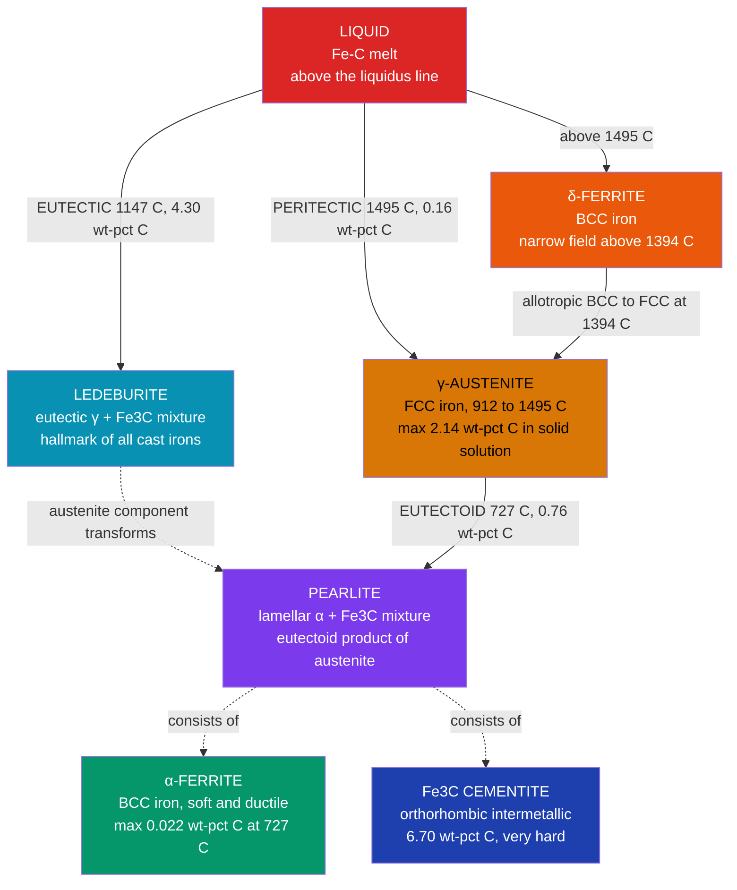

# ⚙️ Phase Diagrams and the Iron-Carbon System

> [!abstract] TL;DR
> A **phase diagram** is a stability map: for any alloy composition and temperature, it identifies which phases coexist and in what proportions. The **Gibbs phase rule** $F = C - P + 2$ governs every diagram; the **lever rule** $W_\beta = (C_0 - C_\alpha)/(C_\beta - C_\alpha)$ converts an overall composition to phase mass fractions from a tie-line. The **Fe-C binary diagram** is the most industrially consequential phase diagram ever drawn — it underlies every steel and cast iron on Earth through two invariant solid-state reactions: the **eutectoid** at 727 °C / 0.76 wt% C (γ-austenite → α-ferrite + Fe₃C = **pearlite**) and the **eutectic** at 1147 °C / 4.3 wt% C (liquid → austenite + cementite = **ledeburite**). Carbon content alone, combined with cooling rate, determines whether the final microstructure is soft ferrite, tough pearlite, hard martensite, or brittle cementite.

---

## Intuition — analogy FIRST

A phase diagram is a **recipe map for a material**: given two inputs — composition (x-axis, how much carbon you have added to iron) and temperature (y-axis, how hot the material is) — the map tells you exactly which "dish" appears. Step into a single-phase field and you get one uniform phase; step into a two-phase field and you get a mixture in proportions set by the lever rule; land on a horizontal invariant line and you hit a fixed three-phase reaction with zero remaining choices.

The iron-carbon system makes this vivid. Iron alone is a relatively weak structural metal. Dissolve a fraction of a percent of carbon into it and the crystal structure changes, interstitial carbon pins dislocations, and suddenly you have steel — strong enough to build bridges and skyscrapers. Push past 2.14 wt% C and the eutectic reaction floods the microstructure with hard iron carbide, giving brittle but pourable cast iron. The entire difference between a surgical scalpel blade, a railway rail, and an engine block comes down to where you sit on this one diagram and how fast you cool from it. The recipe map is not an abstraction — it is the engineering blueprint for the modern world.

---

## How It Works

### Core Mechanics

**Phases.** A *phase* is a region of uniform composition and crystal structure that is physically and chemically distinct from its surroundings. Ice, liquid water, and steam are three phases of the same compound. In the Fe-C system the phases are liquid, δ-ferrite, γ-austenite, α-ferrite, and Fe₃C (cementite).

**Gibbs phase rule.** For a system at thermodynamic equilibrium:
$$\boxed{F = C - P + 2}$$
where $C$ = number of independent chemical components, $P$ = number of phases coexisting, $F$ = degrees of freedom (intensive variables — $T$, pressure, and phase compositions — that can be varied without changing the number of phases). The "+2" accounts for temperature and pressure. At constant pressure (the standard materials-science convention), the rule reduces to:
$$F = C - P + 1$$
For a binary system ($C = 2$): a single-phase field has $F = 2$; a two-phase field has $F = 1$ (fixing temperature fixes both phase compositions); an invariant reaction point has $F = 0$ (three phases, fully constrained temperature and compositions).

**Binary diagram archetypes.**

| Type | What happens | Example |
|------|-------------|---------|
| **Isomorphous** | Complete solid solubility; lens-shaped loop | Cu-Ni |
| **Eutectic** | Partial solubility; liquid → two solids | Pb-Sn solder, Fe-C |
| **Eutectoid** | Solid-state analogue; one solid → two solids | Fe-C at 727 °C |
| **Peritectic** | Liquid + solid → different solid | Fe-C at 1495 °C |

**Lever rule.** Inside a two-phase field, a horizontal *tie line* at a given temperature connects the compositions of the two phases in equilibrium. For an overall alloy composition $C_0$ lying between phase compositions $C_\alpha$ and $C_\beta$, the mass fractions are:
$$W_\beta = \frac{C_0 - C_\alpha}{C_\beta - C_\alpha}, \qquad W_\alpha = \frac{C_\beta - C_0}{C_\beta - C_\alpha}, \qquad W_\alpha + W_\beta = 1$$
This is simply a mass balance: $C_0 = W_\alpha C_\alpha + W_\beta C_\beta$. The name "lever" comes from the analogy of $C_0$ as a fulcrum balancing two weights at $C_\alpha$ and $C_\beta$ — the phase with the longer "arm" to $C_0$ is present in *smaller* fraction.

### Flow — Fe-C Phase Hierarchy



---

## Key Concepts / Details

### Secondary Level

**The five equilibrium phases.**

| Phase | Crystal structure | Max C solubility | Key character |
|-------|-------------------|-----------------|---------------|
| Liquid (L) | — | unlimited | molten iron-carbon alloy |
| δ-ferrite | BCC | 0.09 wt% C at 1495 °C | exists only at very high temperature |
| γ-austenite | FCC | 2.14 wt% C at 1147 °C | the hot-working and heat-treatment phase |
| α-ferrite | BCC | 0.022 wt% C at 727 °C | soft, ductile, magnetic below 770 °C |
| Fe₃C cementite | orthorhombic | 6.70 wt% C (fixed) | extremely hard (~800 HV), brittle |

**Classification by carbon content.**

| Class | wt% C | Dominant room-temperature microstructure |
|-------|--------|------------------------------------------|
| Low-carbon (mild) steel | < 0.25 | mostly α-ferrite |
| Medium-carbon steel | 0.25 – 0.60 | ferrite + pearlite |
| High-carbon steel | 0.60 – 2.14 | pearlite ± proeutectoid cementite |
| Cast iron | 2.14 – 6.70 | ledeburite ± ferrite or cementite |

**Reading a phase diagram.** On any horizontal tie line in a two-phase field, the left endpoint gives the composition of the carbon-poor phase and the right endpoint gives the composition of the carbon-rich phase. The overall alloy composition sits between them. The closer the overall composition is to one endpoint, the more of that phase is present — the lever rule makes this quantitative.

---

### Undergraduate Level

**The three invariant reactions.**

| Name | Temperature | Liquid or solid? | Reaction | Product name |
|------|------------|-----------------|----------|-------------|
| **Peritectic** | 1495 °C | L + δ → γ | liquid + delta-ferrite → austenite | — |
| **Eutectic** | 1147 °C | L → γ + Fe₃C | liquid → austenite + cementite | ledeburite |
| **Eutectoid** | 727 °C | γ → α + Fe₃C | austenite → ferrite + cementite | pearlite |

Every reaction is invariant because $C = 2$, $P = 3$ gives $F = 2 - 3 + 1 = 0$ at constant pressure — temperature and all three phase compositions are fixed simultaneously.

**Hypoeutectoid steel (0.022 – 0.76 wt% C): cooling sequence.**
1. Alloy enters the two-phase (γ + α) field on cooling below the A₃ line.
2. *Proeutectoid ferrite* nucleates at austenite grain boundaries and grows, depleting surrounding austenite of iron and enriching it in carbon.
3. At 727 °C the remaining austenite composition has reached exactly 0.76 wt% C and transforms entirely to **pearlite** via the eutectoid reaction.
4. Final microstructure: islands of white proeutectoid ferrite surrounded by pearlite colonies (alternating α and Fe₃C lamellae).

Mass fractions at the eutectoid isotherm, using the tie-line from $C_\alpha = 0.022$ to $C_\gamma = 0.76$ wt% C:
$$W_\text{pearlite} = \frac{C_0 - 0.022}{0.76 - 0.022}, \qquad W_\text{proeutectoid ferrite} = \frac{0.76 - C_0}{0.76 - 0.022}$$

**Hypereutectoid steel (0.76 – 2.14 wt% C): cooling sequence.**
1. On cooling below the Acm line, *proeutectoid cementite* precipitates as a brittle network along prior austenite grain boundaries.
2. At 727 °C the remaining austenite (still at 0.76 wt% C) transforms to pearlite.
3. Final microstructure: continuous cementite grain-boundary network encasing pearlite grains.
4. The grain-boundary cementite is the primary embrittler — **spheroidizing annealing** (holding just below 727 °C for extended periods) breaks the network into spheroids, dramatically improving toughness.

**Pearlite: coupled diffusion-controlled growth.** Pearlite forms by simultaneous nucleation and growth of alternating ferrite and cementite lamellae. Carbon rejected from growing ferrite diffuses laterally to feed adjacent cementite plates. The interlamellar spacing $\lambda$ is inversely proportional to undercooling below 727 °C: faster cooling → finer spacing → higher hardness and strength, following an approximate Hall-Petch-type relation:
$$\sigma_y \propto \lambda^{-1/2}$$

**Cast irons (> 2.14 wt% C).**

| Type | Microstructure | Tensile strength | Key application |
|------|---------------|-----------------|----------------|
| **White** | ledeburite + cementite (no graphite) | ~350 MPa, very brittle | wear-resistant surfaces, chilled casting rolls |
| **Gray** | graphite flakes in ferrite-pearlite matrix | ~200 MPa, brittle in tension | engine blocks, machine tool bases, pipe |
| **Ductile (nodular)** | graphite spheroids (Mg addition) | ~400 MPa with ~18% elongation | crankshafts, pipe fittings, gears |
| **Malleable** | graphite rosettes (anneal white iron) | ~345 MPa with ~10% elongation | small hardware, brackets |

Silicon is the key alloying element: it destabilizes Fe₃C and promotes stable graphite precipitation. Gray iron has ~2–3 wt% Si; white iron has less.

---

### Graduate Level

**Common tangent construction — thermodynamic basis of the lever rule.** At a given temperature, the molar Gibbs free energy $G_m$ of each phase is plotted as a function of composition. A single-phase region occurs where one curve lies below all others. A two-phase region arises when the **common tangent** to two $G_m$ curves lies below both individual curves: the tangent contact points give the equilibrium phase compositions (the tie-line endpoints), and the lever rule follows directly from the mass-balance condition that the overall composition lies on the tangent line between the two contact points. The eutectoid is the unique composition and temperature where three $G_m$ curves — α, γ, and Fe₃C — share a single simultaneous common tangent, giving the invariant three-phase condition.

**Why FCC austenite dissolves far more carbon than BCC ferrite.** In BCC α-ferrite the largest interstitial void is the tetrahedral site with effective radius ~0.36 Å. In FCC γ-austenite the largest interstitial void is the octahedral site with effective radius ~0.52 Å. The carbon atom radius is ~0.77 Å — it is undersized relative to both holes, causing lattice strain in both structures. However, the octahedral site in FCC produces *less strain per carbon atom* (more symmetric distortion), so more carbon can be accommodated before the chemical potential of carbon in austenite equals that of cementite. This is the fundamental structural reason why the eutectoid carbon content (0.76 wt%) is far closer to the ferrite solvus (0.022 wt%) than to the cementite endpoint (6.70 wt%), and why the austenite field dominates the diagram.

**Metastability: Fe-Fe₃C vs. Fe-graphite.** The standard engineering Fe-C diagram is technically the **Fe-Fe₃C metastable diagram**. The thermodynamically stable system has graphite (not Fe₃C) as the equilibrium carbon phase. Cementite is metastable — but kinetically favored in plain carbon steels because the activation barrier for Fe₃C formation is far lower than for graphite nucleation from austenite. Silicon (and other graphitizers) catalyze the stable reaction, which is why gray iron (high Si) precipitates graphite while white iron (low Si) retains cementite. The stable and metastable diagrams differ in the eutectic temperature (~1153 °C for stable graphite vs. 1147 °C for metastable cementite) and in the identity of the carbon-rich phase.

**Alloying effects on the eutectoid.** Substitutional alloying elements shift both the eutectoid temperature ($T_{eutectoid}$) and the eutectoid composition ($C_{eutectoid}$):

| Element | Effect on $T_{eutectoid}$ | Effect on $C_{eutectoid}$ | Mechanism |
|---------|--------------------------|--------------------------|-----------|
| Cr, Mo, W, V (carbide formers) | raises | lowers | stabilize carbides, retard γ stability |
| Ni, Mn (austenite stabilizers) | lowers | lowers | expand the γ field to lower T |
| Si, Al (ferrite stabilizers) | raises | raises | shrink the γ field |

Practical consequence: a 1% Cr steel has an eutectoid composition near 0.60 wt% C — a steel at 0.76 wt% C is *hypereutectoid* relative to this alloyed diagram, and treating it as eutectoid introduces systematic microstructure prediction errors.

**TTT diagrams and kinetic departure from equilibrium.** The Fe-C diagram describes the *equilibrium* destination; the **TTT (Time-Temperature-Transformation)** and **CCT (Continuous-Cooling-Transformation)** diagrams describe how fast the system gets there. Quenching austenite below the martensite start temperature $M_s$ (~230 °C for 0.8 wt% C steel) freezes the FCC lattice into a body-centered tetragonal (BCT) **martensite** — a supersaturated solid solution with hardness up to ~65 HRC. The carbon trapped in BCT tetragonal distortion is the source of martensite's extreme hardness. See [[Heat_Treatment_and_Microstructure]] for the full TTT treatment.

---

## Python Demo

```python
import numpy as np
import matplotlib.pyplot as plt

# -------------------------------------------------------------------
# Lever Rule in the Fe-C system at the 727 C (eutectoid) isotherm
#
# Two-phase region: alpha-ferrite (C_alpha = 0.022 wt-pct C)
#                   Fe3C cementite  (C_cem   = 6.70  wt-pct C)
#
# Lever rule:  W_cem   = (C0 - C_alpha) / (C_cem - C_alpha)
#              W_alpha = (C_cem - C0)   / (C_cem - C_alpha)
# -------------------------------------------------------------------

C_alpha = 0.022   # wt-pct C in alpha-ferrite at 727 C
C_cem   = 6.70    # wt-pct C in Fe3C cementite

# Sweep the full two-phase field
C0      = np.linspace(C_alpha, C_cem, 500)
W_cem   = (C0 - C_alpha) / (C_cem - C_alpha)
W_alpha = 1.0 - W_cem

# Three reference steel compositions
steels = {
    "Hypo-eutectoid\n0.40 wt-pct C":   0.40,
    "Eutectoid\n0.76 wt-pct C":        0.76,
    "Hyper-eutectoid\n1.20 wt-pct C": 1.20,
}

fig, (ax1, ax2) = plt.subplots(1, 2, figsize=(13, 5))

# --- Panel 1: Lever rule across the full tie-line ----------------------------
ax1.plot(C0, W_alpha * 100, lw=2.5, color="#059669",
         label="alpha-Ferrite  W_alpha")
ax1.plot(C0, W_cem   * 100, lw=2.5, color="#1e40af", linestyle="--",
         label="Fe3C Cementite  W_cem")

for xc, lbl, col in [
    (0.76, "Eutectoid\n0.76", "red"),
    (2.14, "Steel / Cast Iron\n2.14", "darkorange"),
]:
    ax1.axvline(xc, color=col, lw=1.5, linestyle=":", alpha=0.85)
    ax1.text(xc + 0.09, 52.0, lbl, color=col, fontsize=7.5,
             rotation=90, va="center")

ax1.set_xlabel("Overall carbon content  C0  (wt-pct C)")
ax1.set_ylabel("Phase mass fraction  (pct)")
ax1.set_title("Lever Rule at 727 C Isotherm\nalpha-Ferrite + Fe3C two-phase field")
ax1.legend(fontsize=9)
ax1.set_xlim(0.0, 7.0)
ax1.set_ylim(0.0, 105.0)
ax1.grid(alpha=0.3)

# --- Panel 2: Bar chart for three reference steel compositions ----------------
labels       = list(steels.keys())
compositions = list(steels.values())

W_alpha_pct = [(C_cem - c) / (C_cem - C_alpha) * 100 for c in compositions]
W_cem_pct   = [(c - C_alpha) / (C_cem - C_alpha) * 100 for c in compositions]

x  = np.arange(len(labels))
bw = 0.35
ax2.bar(x - bw / 2, W_alpha_pct, bw,
        label="alpha-Ferrite", color="#059669", alpha=0.85)
ax2.bar(x + bw / 2, W_cem_pct,   bw,
        label="Fe3C Cementite", color="#1e40af", alpha=0.85)

for i, (va, vc) in enumerate(zip(W_alpha_pct, W_cem_pct)):
    ax2.text(i - bw / 2, va + 0.8, f"{va:.1f}%", ha="center", fontsize=9)
    ax2.text(i + bw / 2, vc + 0.8, f"{vc:.1f}%", ha="center", fontsize=9)

ax2.set_xticks(x)
ax2.set_xticklabels(labels, fontsize=9)
ax2.set_ylabel("Phase mass fraction  (pct)")
ax2.set_title("Lever Rule: Phase Fractions at\nThree Reference Steel Compositions")
ax2.legend(fontsize=9)
ax2.set_ylim(0.0, 112.0)
ax2.grid(alpha=0.3, axis="y")

plt.tight_layout()
plt.show()

# --- Printed summary ---
print("Lever Rule Summary at 727 C Isotherm (C_alpha=0.022, C_cem=6.70 wt-pct C)")
print(f"{'Composition':>25}  {'W_alpha (pct)':>14}  {'W_cem (pct)':>12}")
print("-" * 56)
for name, c in steels.items():
    wa = (C_cem - c) / (C_cem - C_alpha) * 100
    wc = (c - C_alpha) / (C_cem - C_alpha) * 100
    short = name.replace("\n", " ")
    print(f"{short:>25}  {wa:>14.1f}  {wc:>12.1f}")
```

---

## Real-World Applications

> **Railway rails (pearlitic steel, ~0.8 wt% C).** The global railway network runs on pearlitic rail steel whose entire microstructure is predicted by the eutectoid reaction. Accelerated cooling after hot rolling drives the austenite-to-pearlite transformation to the fine-pearlite nose on the TTT diagram, producing interlamellar spacings of ~150 nm and hardness ~300–350 HV. Rail life correlates directly with pearlite fineness — a direct industrial application of lever rule and eutectoid kinetics.

> **Gray cast iron engine blocks (~3.4 wt% C, ~2 wt% Si).** Gray iron sits well past the 2.14 wt% C cast-iron boundary. Silicon destabilizes cementite and pushes the system toward the stable graphite diagram, so graphite flakes precipitate from the eutectic rather than cementite. The graphite provides vibration damping (critical for reducing noise in engines), excellent machinability (graphite as self-lubricant), and castability (eutectic composition minimizes solidification range). The Fe-C diagram and the Fe-C-Si ternary are essential to designing iron foundry practice.

> **Surgical scalpel blades (martensitic stainless steel, ~0.75 wt% C, ~13 wt% Cr).** Blades are austenitized above 1000 °C (all carbon in FCC solution), then quenched to form martensite. The Fe-C eutectoid composition sets the carbon content required: at ~0.75 wt% C, the steel is near-eutectoid, maximizing carbon in solution for maximum martensite hardness (> 55 HRC) while limiting excess carbides that would blunt the edge. Chromium shifts the eutectoid but the Fe-C framework provides the starting design logic.

> **Ductile iron crankshafts (~3.7 wt% C, 0.05 wt% Mg addition).** Magnesium addition during pouring causes graphite to nucleate as spheroids instead of flakes, eliminating the stress-concentration sites that make gray iron brittle in tension. Ductile iron crankshafts match medium-carbon steel in tensile strength (~800 MPa in austempered ductile iron) at lower cost, with the Fe-C phase diagram directing foundry composition control.

---

## Common Pitfalls

- **Confusing eutectic and eutectoid.** Both are invariant three-phase reactions, but the eutectic (L → α + β) involves liquid; the eutectoid (γ → α + β) is entirely solid-state. In Fe-C: eutectic at 1147 °C gives ledeburite from liquid; eutectoid at 727 °C gives pearlite from solid austenite. The names are related but the phenomena are distinct.
- **Applying the lever rule outside a two-phase field.** The lever rule is valid only when $C_0$ lies strictly between $C_\alpha$ and $C_\beta$ in a two-phase region. Inside a single-phase field there is only one phase (fraction = 1 by definition); at an invariant point three phases coexist but the proportions depend on starting state, not composition alone.
- **Using "+2" vs "+1" in the phase rule.** At constant pressure (nearly always assumed in materials science) the rule is $F = C - P + 1$. Three-phase equilibrium in a binary system is then $F = 0$, correctly predicting a fixed temperature and fixed phase compositions. The full "+2" form requires treating pressure as a variable.
- **Two separate lever rule calculations for hypoeutectoid steel.** The proeutectoid ferrite fraction requires a tie-line from $C_\alpha$ to $C_\gamma$ at the temperature of interest. The total ferrite and cementite fractions at room temperature require a tie-line from $C_\alpha = 0.022$ to $C_{Fe_3C} = 6.70$ at the eutectoid isotherm. These are different lever rules and give different numbers; conflating them is the most common numerical error in undergraduate microstructure problems.
- **Forgetting that Fe-C textbook diagrams show Fe-Fe₃C (metastable).** Cementite is metastable relative to graphite. The Fe-Fe₃C diagram is valid for most steels cooled at practical rates, but adding silicon or slow cooling promotes graphite, shifting to the stable diagram. Using Fe-Fe₃C predictions for silicon-rich cast irons introduces errors.
- **Treating the eutectoid as fixed for all steels.** The 727 °C / 0.76 wt% C eutectoid applies only to plain carbon steel. Every alloying addition shifts both the temperature and the composition. Engineering steels must be treated with their actual multicomponent phase diagrams or with CALPHAD-computed data.

---

## Related Concepts

- [[_MOC_Thermal_and_Phase_Behavior]] — section map for the Materials Science thermal and phase behavior vault
- [[Heat_Treatment_and_Microstructure]] — TTT and CCT diagrams, martensite, bainite, tempering: the kinetic companion to the equilibrium Fe-C diagram; eutectoid kinetics are the shared foundation
- [[Nucleation_Growth_and_Solidification]] — the mechanisms by which pearlite lamellae, proeutectoid phases, and eutectic products actually nucleate and grow from parent phases
- [[Strengthening_Mechanisms_in_Metals]] — pearlite interlamellar spacing, martensite supersaturation, and solid-solution hardening by carbon all originate in Fe-C phase relationships
- [[Diffusion_in_Solids_and_Ficks_Laws]] — carbon diffusion in γ-austenite is the rate-limiting step controlling pearlite spacing, decarburization, and every solid-state transformation on the Fe-C diagram
- **Chemistry** — [[Phase_Equilibria_and_Colligative_Properties]] derives the same $F = C - P + 2$ phase rule from chemical potential equality, and establishes the Clapeyron-slope framework that governs all phase boundaries; [[Chemical_Thermodynamics]] provides the Gibbs free energy minimization and common-tangent construction that underlies every tie-line and invariant reaction; [[Solid_State_and_Crystal_Structures]] covers BCC vs. FCC close packing and interstitial site geometry, which explains why austenite dissolves 100× more carbon than ferrite
- **Earth Science** — [[Mineral_Stability_and_Phase_Diagrams]] applies the identical Gibbs phase rule and free-energy stability framework to silicate mineralogy and mantle phase transitions, including solid-state polymorphic reactions analogous to the Fe-C eutectoid; [[_MOC_Earth_Science_Master]]
- [[_MOC_Chemistry_Master]] — chemistry domain hub cross-linking thermodynamics and solid-state notes

---

## Review Questions

1. **Secondary:** A steel contains 0.40 wt% C. After very slow cooling to room temperature, name the two microstructural constituents present and identify which will occupy the larger area fraction in a micrograph. Explain qualitatively why the proeutectoid phase is ferrite rather than cementite for this composition.

2. **Undergraduate:** Apply the lever rule twice for a 0.40 wt% C hypoeutectoid steel. First, at 750 °C (just above 727 °C), using the tie-line from $C_\alpha \approx 0.020$ wt% C to $C_\gamma \approx 0.76$ wt% C, calculate the mass fractions of proeutectoid ferrite and austenite present. Second, at room temperature, using the eutectoid tie-line ($C_\alpha = 0.022$, $C_{Fe_3C} = 6.70$ wt% C), calculate the total mass fractions of ferrite and cementite. Explain why these two lever rule calculations use different tie-lines and give different results.

3. **Graduate:** Starting from the Gibbs free energy curve picture, explain why the eutectoid composition in pure Fe-C is 0.76 wt% C rather than a value symmetric about some midpoint. Then discuss how the addition of 1 wt% Cr shifts both the eutectoid temperature and composition, identify the physical mechanism (carbide stability and the effect on Fe and C chemical potentials), and explain why a 0.76 wt% C steel with 1 wt% Cr behaves as a hypereutectoid steel despite having the "eutectoid" carbon content of plain carbon steel.

---

## Sources

- Callister, W. D. & Rethwisch, D. G. — *Materials Science and Engineering: An Introduction*, 10th ed. (Wiley, 2018), Ch. 9 (Phase Diagrams) and Ch. 10 (Phase Transformations in Metals): the standard undergraduate reference
- Smith, W. F. & Hashemi, J. — *Foundations of Materials Science and Engineering*, 5th ed. (McGraw-Hill, 2011), Ch. 9: alternative undergraduate treatment with extensive Fe-C worked examples
- Shackelford, J. F. — *Introduction to Materials Science for Engineers*, 8th ed. (Pearson, 2016), Ch. 9
- Porter, D. A., Easterling, K. E. & Sherif, M. — *Phase Transformations in Metals and Alloys*, 3rd ed. (CRC Press, 2009): graduate-level thermodynamics and kinetics of Fe-C transformations
- Bhadeshia, H. K. D. H. & Honeycombe, R. — *Steels: Microstructure and Properties*, 4th ed. (Butterworth-Heinemann, 2017): definitive reference for alloying effects and TTT diagrams
- [ASM Handbook Vol. 1 — Properties and Selection: Irons, Steels, and High-Performance Alloys](https://www.asminternational.org)

---

#materials-science #phase-diagrams #iron-carbon #steel #eutectoid #eutectic #lever-rule #gibbs-phase-rule #cast-iron #microstructure #pearlite #austenite #ferrite #cementite #secondary #undergraduate #graduate
