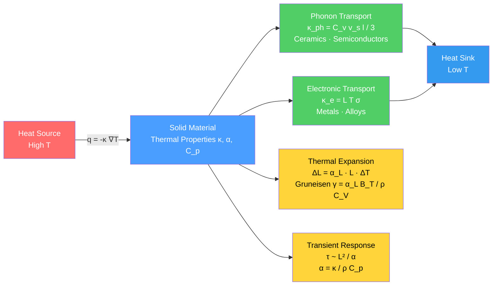

# 🌡️ Thermal Properties and Heat Conduction

> [!abstract] TL;DR
> How quickly and how much heat a material absorbs, conducts, and expands is governed by phonons (quantised lattice vibrations) and conduction electrons. Fourier's law $\mathbf{q} = -\kappa\nabla T$ controls steady-state conduction; thermal diffusivity $\alpha = \kappa/(\rho C_p)$ controls the transient speed of heat penetration. Metals conduct heat primarily through electrons (Wiedemann-Franz law); ceramics and semiconductors rely on phonons. Diamond at ~2200 W/m·K is the highest-$\kappa$ known solid. These properties dictate everything from CPU thermal management to the thermal shock survival of rocket nozzles.

---

## Intuition — analogy FIRST

Sit on a wooden bench and a metal bench on a cold winter morning. Both benches sit in the same air and are at the same temperature — yet the metal instantly feels far colder against your skin. Your skin is the heat source; the bench is the sink. Because metal has a much higher thermal conductivity than wood, it drains heat from your skin at a higher rate, so it *feels* colder even though no thermometer would show a difference.

This is Fourier's law in action: the heat flux — power flowing per unit area — is proportional to the temperature gradient, scaled by thermal conductivity $\kappa$. A high-$\kappa$ material (copper, diamond) spreads heat rapidly and keeps no local hot spots; a low-$\kappa$ material (aerogel, polymer foam) traps heat in place. The same physical picture extends to thermal expansion — anharmonic interatomic bonds stretch asymmetrically as vibration amplitude increases with temperature, so the material expands — and to the time required for heat to penetrate a slab — controlled by thermal diffusivity $\alpha$, not by $\kappa$ alone.

---

## How It Works

### Core Mechanics

**1. Fourier's Law of Heat Conduction**

In any direction and any geometry:
$$\mathbf{q} = -\kappa\,\nabla T \qquad \text{(W/m}^2\text{)}$$

$\mathbf{q}$ is the heat flux vector (power per unit area), $\kappa$ is thermal conductivity (W/m·K), $\nabla T$ is the local temperature gradient. The minus sign enforces that heat flows from hot to cold. In 1D slab geometry: $q = -\kappa\,dT/dx$.

Combined with energy conservation, this gives the **heat equation**:
$$\rho\,C_p\,\frac{\partial T}{\partial t} = \nabla\cdot(\kappa\nabla T) + \dot{Q}_{gen}$$

**2. Thermal Diffusivity**

For transient problems the relevant quantity is:
$$\alpha = \frac{\kappa}{\rho\,C_p} \qquad \text{(m}^2\text{/s)}$$

The characteristic time to equilibrate a slab of thickness $L$ is $\tau \approx L^2/\alpha$. Copper at $\alpha \approx 1.2\times10^{-4}$ m²/s equilibrates a 1 cm slab in ~0.8 s; HDPE at $\alpha \approx 2.7\times10^{-7}$ m²/s takes ~370 s — 450× longer, even though the $\kappa$ ratio is only ~800×, because HDPE also has a much higher heat capacity per unit volume $\rho C_p$.

**3. Mechanisms of Thermal Conductivity**

For most solids $\kappa = \kappa_\text{ph} + \kappa_e$ (phonon plus electronic):

*Phonon contribution — dominates in ceramics, semiconductors:*
$$\kappa_\text{ph} = \frac{1}{3}\,C_v\,v_s\,l$$

$C_v$ is the volumetric heat capacity, $v_s$ is the average speed of sound, $l$ is the phonon mean free path. At high $T$, Umklapp phonon-phonon scattering shortens $l \propto 1/T$, so $\kappa_\text{ph} \propto 1/T$ for most ceramics above the Debye temperature.

*Electronic contribution — dominates in metals:*
$$\kappa_e = L\,T\,\sigma$$

This is the **Wiedemann-Franz law**. $L = \pi^2 k_B^2/(3e^2) = 2.44\times10^{-8}$ W·Ω/K² is the Lorenz number and $\sigma$ is electrical conductivity. It predicts $\kappa_e/(\sigma T) = L = \text{const}$, verified for most pure metals near room temperature. Its validity breaks down at very low $T$ (inelastic phonon scattering decouples $\kappa_e$ from $\sigma$) and in strongly correlated electron systems.

**4. Heat Capacity: $C_p$ vs $C_V$**

Constant-pressure heat capacity always exceeds constant-volume:
$$C_p - C_V = \frac{T\,V\,\alpha_L^2}{\beta_T}$$

where $\alpha_L$ is the linear thermal expansion coefficient and $\beta_T$ is the isothermal compressibility. For solids the correction is typically 1–3% at room temperature but grows substantially at elevated temperatures and must be tracked in accurate thermodynamic modelling.

**5. Thermal Expansion**

The linear thermal expansion coefficient:
$$\alpha_L = \frac{1}{L}\frac{dL}{dT} \qquad \text{(K}^{-1}\text{)}$$

*Microscopic origin:* In a perfectly harmonic interatomic potential $U(r) \propto (r-r_0)^2$, the time-averaged bond length would be $r_0$ at all temperatures — zero expansion. Real bonds are anharmonic: the repulsive wall is steeper than the attractive tail. As temperature rises and vibration amplitude increases, the asymmetry shifts the time-averaged $\langle r \rangle$ outward. The more anharmonic the bond, the larger $\alpha_L$. Stiff covalent materials (diamond, SiC) have small $\alpha_L$; soft metallic or ionic crystals have large $\alpha_L$.

**6. Grüneisen Parameter**

The **Grüneisen parameter** links thermal expansion, phonon anharmonicity, and elastic stiffness into a single dimensionless number:
$$\gamma = \frac{\alpha_L\,V}{\kappa_T\,C_V} = \frac{\alpha_L\,B_T}{\rho\,C_V}$$

$B_T$ is the isothermal bulk modulus. Typical range: $\gamma \approx 1$–$3$ for most solids. Diamond ($\gamma \approx 0.9$) reflects its extremely stiff covalent network and weak anharmonicity. Lead ($\gamma \approx 2.7$) reflects a soft, anharmonic metallic lattice. Negative thermal expansion (NTE) materials such as ZrW₂O₈ have specific transverse phonon modes with negative mode-Grüneisen parameters that dominate the thermal response.

**7. Thermal Shock Resistance**

Brittle ceramics fracture when rapid temperature changes generate internal stresses. The thermal shock figure of merit:
$$R = \frac{\sigma_f\,\kappa}{E\,\alpha_L}$$

$\sigma_f$ is fracture strength, $E$ is Young's modulus. High $R$ requires simultaneously high $\kappa$ (to reduce $\nabla T$), high $\sigma_f$, low $E$, and low $\alpha_L$. Silicon carbide (SiC) and silicon nitride (Si₃N₄) satisfy these requirements, explaining their use in turbine components and heat shields.

### Flow / Architecture



---

## Key Concepts

### Secondary Level

**Thermal conductivity in everyday life:**
Metals like copper and aluminium are excellent conductors — cookware uses them to spread heat uniformly. Aerogel, hollow glass fibres, and still air are near-perfect insulators — used in building insulation and vacuum-flask walls. Diamond is the highest-$\kappa$ solid known; a diamond chip in contact with your skin feels cold instantly because it drains heat so efficiently.

| Material | $\kappa$ (W/m·K) | $C_p$ (J/kg·K) | $\alpha_L$ (10⁻⁶ /K) | $\alpha$ (10⁻⁶ m²/s) |
|----------|-----------------|----------------|----------------------|----------------------|
| Diamond | 2200 | 520 | 1.0 | ~1000 |
| Copper | 401 | 385 | 17 | 116 |
| Aluminium | 237 | 900 | 23 | 97 |
| Steel 304 | 16 | 500 | 17 | 4.0 |
| SiC | 120 | 750 | 4.0 | 61 |
| Alumina Al₂O₃ | 25 | 900 | 8.1 | 7.1 |
| Fused silica | 1.4 | 740 | 0.5 | 0.83 |
| Epoxy | 0.19 | 1050 | 60 | 0.09 |
| HDPE polymer | 0.5 | 1900 | 150 | 0.27 |

**Thermal expansion in engineering:**
- Train tracks have small expansion gaps to prevent summer buckling ($\Delta L \approx \alpha_L\,L\,\Delta T$).
- Bimetallic strips — two metals bonded with different $\alpha_L$ — bend on heating and are used in thermostats.
- Glass thermometers exploit the predictable $\alpha_L$ of mercury or alcohol.

**Heat capacity:**
The specific heat $C_p$ (J/kg·K) is how much energy 1 kg needs to warm by 1°C. Water's high $C_p = 4186$ J/kg·K moderates coastal climates. Most metals are ~400–900 J/kg·K. This determines the energy cost of heating a component and, together with $\kappa$, the thermal inertia.

### Undergraduate Level

**The heat equation and its solutions:**

For uniform $\kappa$ in 1D:
$$\frac{\partial T}{\partial t} = \alpha\,\frac{\partial^2 T}{\partial x^2}$$

For a semi-infinite solid at initial temperature $T_0$, suddenly heated at the surface to $T_s$:
$$T(x,t) - T_0 = (T_s - T_0)\operatorname{erfc}\!\left(\frac{x}{2\sqrt{\alpha t}}\right)$$

The thermal penetration depth scales as $\delta \sim 2\sqrt{\alpha t}$. This confirms that transient problems depend on $\alpha$, not $\kappa$ alone. Two materials with the same $\kappa$ but different $\rho C_p$ will equilibrate at completely different rates.

**Phonon scattering and Matthiessen's rule:**

Phonons scatter from multiple mechanisms: Umklapp phonon-phonon processes ($l_U$), grain boundaries ($l_b$), point defects/impurities ($l_d$), and sample surfaces ($l_s$). Total effective mean free path:
$$\frac{1}{l_\text{eff}} = \frac{1}{l_U} + \frac{1}{l_b} + \frac{1}{l_d} + \frac{1}{l_s}$$

*High T:* Umklapp dominates, $l_U \propto 1/T$, so $\kappa_\text{ph} \propto 1/T$. *Low T:* $l_U$ diverges exponentially and boundary scattering limits $l_\text{eff}$; $\kappa \propto C_v \propto T^3$ (Debye regime). Nanostructuring (thin films, superlattices, embedded nanoparticles) engineers grain-boundary and surface scattering to reduce $\kappa_\text{ph}$ in thermoelectrics without proportionally degrading $\sigma$.

**Wiedemann-Franz in practice:**

For pure copper at 300 K: $\kappa_e \approx 380$ W/m·K, $\sigma \approx 5.96\times10^7$ S/m, giving $L = \kappa_e/(\sigma T) = 2.13\times10^{-8}$ W·Ω/K² — close to the theoretical $L_0 = 2.44\times10^{-8}$. Alloys (brass, stainless steel) deviate because disorder scatters electrons elastically but phonons differently.

**Thermal stresses from mismatch:**

When two dissimilar materials are bonded (solder joint, ceramic-metal seal, CMOS metallisation layer), a difference in $\alpha_L$ generates stress on thermal cycling:
$$\sigma_\text{mismatch} \approx \frac{E_1 E_2}{E_1 + E_2}\,|\alpha_{L,1} - \alpha_{L,2}|\,\Delta T$$

This is the primary mechanism of fatigue failure in solder joints and thermal barrier coating delamination. Low-expansion alloys (Invar, $\alpha_L \approx 1.2\times10^{-6}$/K) are engineered to match glass or ceramic substrates.

**Debye model for heat capacity:**

The Debye model treats phonons as a gas of elastic waves with a maximum frequency $\omega_D$ (Debye cutoff). Heat capacity:
$$C_V = 9Nk_B\left(\frac{T}{\theta_D}\right)^3\int_0^{\theta_D/T}\frac{x^4 e^x}{(e^x-1)^2}dx$$

Low $T$ limit: $C_V \propto T^3$. High $T$ limit (Dulong-Petit): $C_V \to 3Nk_B$. The Debye temperature $\theta_D$ is a direct measure of stiffness: diamond has $\theta_D \approx 2230$ K; lead has $\theta_D \approx 105$ K.

### Graduate Level

**Phonon Boltzmann transport equation:**

The full thermal conductivity tensor from the phonon BTE in the relaxation time approximation:
$$\kappa_{ij} = \sum_\lambda \int \frac{d^3\mathbf{q}}{(2\pi)^3}\,v_{\lambda,i}(\mathbf{q})\,v_{\lambda,j}(\mathbf{q})\,\hbar\omega_\lambda(\mathbf{q})\,\frac{\partial n_0}{\partial T}\,\tau_\lambda(\mathbf{q})$$

where $\lambda$ indexes phonon branches, $v_\lambda = \partial\omega_\lambda/\partial\mathbf{q}$ is group velocity, $n_0$ is the Bose-Einstein distribution, and $\tau_\lambda$ is the mode-resolved relaxation time from density functional perturbation theory (DFPT). Packages such as ShengBTE and ALAMODE compute $\kappa$ from first principles with ~10% accuracy — enabling predictive screening of novel thermal management materials before synthesis.

**Minimum thermal conductivity (Cahill-Pohl model):**

In amorphous materials or heavily disordered crystals, the mean free path approaches the interatomic spacing $a$. The minimum achievable conductivity:
$$\kappa_\text{min} \approx \frac{1}{2}\!\left(\frac{\pi}{6}\right)^{1/3}\!k_B\,n^{2/3}(v_L + 2v_T)$$

$n$ is atom density, $v_L$ and $v_T$ are longitudinal and transverse sound speeds. Achieved experimentally in amorphous SiO₂ ($\kappa \approx 1.4$ W/m·K) and in deliberately disordered crystalline oxides used as thermoelectric fillers.

**Kapitza (interface thermal) resistance:**

At any solid-solid interface, acoustic impedance mismatch scatters phonons, producing a temperature discontinuity $\Delta T$ per unit heat flux:
$$R_K = \frac{\Delta T}{q} \qquad \text{(m}^2\text{·K/W)}$$

Acoustic mismatch model: $R_K^{-1} \approx \frac{1}{2}\rho_1 c_1 t_{12}$ where $t_{12}$ is the phonon power transmission coefficient. In nanoscale electronic devices (gate dielectrics 1–5 nm thick, 2D material contacts), Kapitza resistance across metal-dielectric interfaces often dominates the total device thermal resistance and limits heat removal — a key reliability constraint for GaN-on-Si and III-N power electronics.

**Mode-resolved Grüneisen and negative thermal expansion:**

The mode Grüneisen parameter:
$$\gamma_\lambda(\mathbf{q}) = -\frac{V}{\omega_\lambda}\frac{\partial\omega_\lambda}{\partial V}$$

quantifies how phonon branch $\lambda$ shifts in frequency under volume change. The macroscopic $\gamma$ is the $C_\lambda$-weighted average. Negative thermal expansion (NTE) materials have transverse optical and acoustic modes with $\gamma_\lambda < 0$ (frequency softens on compression, stiffens on expansion). In ZrW₂O₈ these modes dominate from 0.3 K to 1050 K, giving isotropic NTE over a uniquely wide range — exploited to make zero-expansion composites for optical mounts and precision instruments.

**Thermoelectric figure of merit:**

The efficiency of heat-to-electricity conversion via the Seebeck effect is governed by:
$$ZT = \frac{S^2\,\sigma\,T}{\kappa_e + \kappa_\text{ph}}$$

$S$ is the Seebeck coefficient. High $ZT$ demands high $\sigma$ (electron-crystal) and low $\kappa_\text{ph}$ (phonon-glass) — intrinsically contradictory requirements, since electrons and phonons both need periodic structure to propagate. The current record $ZT > 3$ (GeTe-based alloys) is achieved by suppressing $\kappa_\text{ph}$ via nanostructuring and resonant-level doping without comparable degradation of $\sigma$.

---

## Python Demo

```python
import numpy as np
import matplotlib.pyplot as plt

# 1D transient heat conduction: dT/dt = alpha * d2T/dx2  (explicit finite differences)
# Boundary conditions: T(0, t) = 100 C   (hot surface)
#                      T(L, t) = 0   C   (cold surface)
# Initial condition:   T(x, 0) = 0   C   (material initially cold)

# Thermal diffusivity alpha = kappa / (rho * Cp)  [m^2/s]
mat_props = {
    "Copper (kappa=401 W/mK)":  401  / (8960 * 385),   # ~1.16e-4
    "Silicon (kappa=150 W/mK)": 150  / (2330 * 700),   # ~9.2e-5
    "Alumina (kappa=25 W/mK)":  25   / (3900 * 900),   # ~7.1e-6
    "HDPE (kappa=0.5 W/mK)":    0.5  / (960  * 1900),  # ~2.7e-7
}

L  = 0.01   # 1 cm slab [m]
Nx = 200    # spatial grid points

fig, axes = plt.subplots(2, 2, figsize=(11, 8), sharex=True, sharey=True)

for ax, (label, alpha) in zip(axes.flat, mat_props.items()):
    dx         = L / Nx
    dt         = 0.4 * dx**2 / alpha          # explicit Euler: stability requires r = alpha*dt/dx^2 <= 0.5
    tau        = L**2 / alpha                  # diffusion time scale [s]
    n_steps    = int(tau * 1.5 / dt)
    snap_every = max(1, n_steps // 6)

    T      = np.zeros(Nx + 1)                  # initial condition: everywhere cold
    T[0]   = 100.0                             # left BC: hot surface
    T[-1]  = 0.0                               # right BC: cold surface

    x_mm   = np.linspace(0, L * 1000, Nx + 1) # spatial axis in mm
    cmap   = plt.cm.plasma
    snap_n = 0

    for step in range(n_steps + 1):
        if step % snap_every == 0:
            frac     = snap_n / 5
            t_sec    = step * dt
            t_label  = f"t = {t_sec*1e3:.2f} ms" if t_sec < 1.0 else f"t = {t_sec:.2f} s"
            ax.plot(x_mm, T, color=cmap(0.15 + 0.70 * frac),
                    label=t_label, lw=1.6, alpha=0.85)
            snap_n += 1

        r            = alpha * dt / dx**2      # stability number
        T_new        = T.copy()
        T_new[1:-1]  = T[1:-1] + r * (T[2:] - 2.0 * T[1:-1] + T[:-2])
        T_new[0]     = 100.0
        T_new[-1]    = 0.0
        T            = T_new

    tau_str = f"{tau*1e3:.1f} ms" if tau < 1.0 else f"{tau:.2f} s"
    ax.set_title(
        f"{label}\nalpha = {alpha*1e6:.2f} mm^2/s  |  diffusion time = {tau_str}",
        fontsize=8.5
    )
    ax.legend(fontsize=6.5, loc="upper right")
    ax.set_ylim(-5, 110)
    ax.grid(True, alpha=0.25)

for ax in axes[1]:
    ax.set_xlabel("Position x (mm)", fontsize=10)
for ax in axes[:, 0]:
    ax.set_ylabel("Temperature (C)", fontsize=10)

plt.suptitle(
    "1D Transient Heat Conduction — T(x, t) Across Material Classes\n"
    "Left BC = 100 C  |  Right BC = 0 C  |  Initial T = 0 C everywhere",
    fontsize=11
)
plt.tight_layout()
plt.savefig("heat_conduction_transient.png", dpi=100, bbox_inches="tight")
plt.show()
```

The simulation reveals the dramatic effect of thermal diffusivity: copper (top-left) approaches steady-state in under a second; HDPE (bottom-right) takes ~6 minutes for the same 1 cm slab — a factor of ~430× slower, driven purely by $\alpha$. The colour progression from dark purple (early times) to bright yellow (near steady-state) traces the thermal front advancing from left to right.

---

## Real-World Applications

> **CPU and power electronics thermal management:** Modern CPU dies dissipate ~100 W/cm² — higher than a rocket nozzle surface. Heat removal uses a stack of specialised materials: (1) diamond or graphite spreaders ($\kappa \approx 2200$ or 600 W/m·K) bonded directly to the die; (2) thermal interface materials (TIMs — indium foil, phase-change composites, $\kappa \approx 5$–80 W/m·K) to fill nanoscale surface roughness gaps; (3) copper heat sinks with fins; (4) two-phase heat pipes where water evaporates at the hot end, travels to a fin array, and condenses back — effective $\kappa \sim 10,000$ W/m·K. GaN-on-Diamond power amplifiers exploit CVD diamond substrates to keep junction temperature below 250°C at power densities >10 W/mm².

> **Thermal barrier coatings in gas turbines:** Turbine inlet temperatures exceed 1700°C — above the melting point of nickel superalloys. A 100–300 μm layer of yttria-stabilised zirconia (YSZ, $\kappa \approx 2$ W/m·K) drops $\Delta T \approx 100$–200°C across the coating, protecting the metallic substrate. YSZ is chosen for simultaneous low $\kappa$, high thermal shock resistance $R$, and phase stability. Pyrochlore oxides (Gd₂Zr₂O₇) with $\kappa \approx 1.5$ W/m·K are next-generation candidates for even lower $\kappa$.

> **Thermoelectric waste-heat recovery:** Automotive exhaust at ~700°C drives Bi₂Te₃-based modules on the exhaust manifold, generating 100–300 W of electricity with no moving parts. PbTe alloys with $ZT > 2$ operate at 600–900 K. The fundamental challenge — decoupling $\kappa_\text{ph}$ from $\sigma$ — motivates nanostructuring strategies (embedded nano-inclusions, phononic superlattices) that target phonon scattering while preserving electron transport.

> **Cryogenic insulation:** In liquid-helium and liquid-nitrogen dewars, multi-layer insulation alternates thin aluminised Mylar sheets (low emissivity) with glass-fibre spacers under vacuum, achieving effective $\kappa_\text{eff} < 10^{-4}$ W/m·K. At cryogenic temperatures heat conduction shifts from lattice conduction to radiation-dominated transfer, requiring entirely different design logic.

> **Precision optics and metrology:** Zero-expansion glass-ceramics (Zerodur, ULE) achieve $\alpha_L < 10^{-8}$/K near 20°C by balancing a positive-expansion crystal phase (lithium alumino-silicate) against a negative-expansion amorphous matrix. Used for primary mirrors in space telescopes (Hubble, JWST primary support structure) where sub-nanometre dimensional stability over $\Delta T \sim 100$ K is required.

---

## Common Pitfalls

- **Conflating $\kappa$ and $\alpha$:** Thermal conductivity $\kappa$ controls *how much* heat flows per unit area per unit temperature gradient in steady state. Thermal diffusivity $\alpha = \kappa/(\rho C_p)$ controls *how fast* a temperature disturbance propagates. A material can have high $\kappa$ and low $\alpha$ (water: $\kappa = 0.6$ W/m·K, $\alpha \approx 1.4\times10^{-7}$ m²/s) or the reverse. Transient calculations require $\alpha$; steady-state resistance calculations require $\kappa$.

- **Using $C_p$ where $C_V$ is required:** The fundamental thermodynamic identity $C_p - C_V = TV\alpha_L^2/\beta_T$ is often ignored. Phonon modelling and equation-of-state work require $C_V$; calorimetry and heat-exchanger design use $C_p$. For solids at room temperature the difference is ~1–3%, but at high $T$ or high pressure it becomes significant.

- **Assuming isotropy when the material is anisotropic:** Graphite has $\kappa_\parallel \approx 200$ W/m·K in-plane and $\kappa_\perp \approx 5$ W/m·K through-plane — a 40× anisotropy. Carbon fibre composites, rolled metals, and many single crystals (wurtzite GaN, sapphire) are similarly anisotropic. A single scalar $\kappa$ from a data sheet may correspond to the wrong orientation for the application.

- **Ignoring Kapitza resistance at interfaces:** For bulk materials, interface resistance is negligible. In nanoscale devices (2 nm gate dielectric, monolayer MoS₂), the Kapitza resistance across each interface can contribute more thermal resistance than the bulk of the layer. Finite-element thermal models that omit interfacial resistance overestimate heat spreading.

- **Misapplying the Wiedemann-Franz law:** The Lorenz number $L_0 = 2.44\times10^{-8}$ W·Ω/K² is not universal. It applies to free-electron-like metals in the Fermi-liquid regime. Heavy-fermion metals, cuprate superconductors, and disordered metals near a metal-insulator transition can show $L \ll L_0$ or $L \gg L_0$. Using $L_0$ to estimate $\kappa_e$ from measured $\sigma$ in these systems gives physically wrong results.

- **Neglecting thermal expansion mismatch in bonded assemblies:** In any joint between dissimilar materials, $\Delta\alpha_L\,\Delta T$ accumulates strain over thermal cycles, ultimately causing fatigue fracture. Solder joints in PCBs (Cu board at $\alpha_L \approx 17\times10^{-6}$/K, Si chip at $\approx 3\times10^{-6}$/K) can crack after hundreds of thermal cycles. Failure analysis that ignores $\alpha_L$ mismatch will misattribute root cause.

---

## Related Concepts

- [[Laws_of_Thermodynamics]] — Fourier's law is the concrete expression of entropy production in a conducting solid; steady-state heat flow maximises entropy generation rate subject to boundary conditions
- [[Thermodynamic_Potentials]] — the $C_p - C_V$ identity follows from the Maxwell relation $(\partial V/\partial T)_P$; connecting the equation of state to measurable thermal properties
- [[Entropy_and_Second_Law]] — heat conduction is intrinsically irreversible; the local entropy production rate is $\sigma_s = \kappa|\nabla T|^2/T^2 \geq 0$
- [[Kinetic_Theory_of_Gases]] — the kinetic formula $\kappa = \frac{1}{3}C_v v l$ used for phonons is identical in form to the gas thermal conductivity derived from the Boltzmann equation; phonons are the "molecules"
- [[Crystal_Structure_and_Band_Theory]] — phonon dispersion, Brillouin zone geometry, Debye temperature, and Fermi surface topology all directly determine $\kappa$ and $C_v$ magnitude and anisotropy
- [[Semiconductors_and_Devices]] — junction temperature limits, self-heating in high-power transistors, and thermal resistance of device stacks are central to semiconductor reliability engineering
- [[Superconductivity]] — below $T_c$ the electronic heat capacity drops exponentially and the Wiedemann-Franz law breaks down; Cooper pairs carry charge but not entropy
- [[Quantum_Statistical_Mechanics]] — phonon occupation follows the Bose-Einstein distribution; the full temperature dependence of $C_v$ and $\kappa_\text{ph}$ from the Debye and BTE frameworks is a direct quantum statistical result
- [[_MOC_Physics_Master]] — cross-link to condensed matter (band theory, phonons) and thermodynamics sections of the Physics vault
- [[_MOC_Thermal_and_Phase_Behavior|↑ Thermal and Phase Behavior MOC]] — section map for this note's position within the Materials Science thermal and phase behavior module

---

## Review Questions

1. **(Secondary)** A copper pipe ($\kappa = 401$ W/m·K, $\rho = 8960$ kg/m³, $C_p = 385$ J/kg·K) and an identical PVC pipe ($\kappa = 0.19$ W/m·K, $\rho = 1380$ kg/m³, $C_p = 900$ J/kg·K) start at room temperature and are suddenly placed in a 0°C freezer. Which reaches thermal equilibrium faster, and by approximately what factor? Explain why the answer depends on $\alpha = \kappa/(\rho C_p)$ rather than on $\kappa$ alone.

2. **(Undergraduate)** Show that the Grüneisen parameter $\gamma = \alpha_L B_T/(\rho C_V)$ is dimensionless by substituting SI units. Diamond has $\alpha_L = 1.0\times10^{-6}$ K⁻¹, $B_T = 442$ GPa, $\rho = 3510$ kg/m³, $C_V \approx 500$ J/kg·K; estimate $\gamma$ and compare with the literature value of ~0.9. Then explain why a soft polymer has $\gamma \sim 5$–10 while diamond has $\gamma \approx 0.9$, in terms of bond anharmonicity.

3. **(Graduate)** In a nanostructured thermoelectric material, the bulk phonon mean free path is $l_\text{bulk} = 100$ nm at 300 K. Quantum-dot inclusions are introduced with average separation 8 nm. Using Matthiessen's rule, estimate the reduction in $\kappa_\text{ph}$ relative to bulk. Then explain, using the Wiedemann-Franz law and the Bloch mean free path argument, why the electron mean free path is far less affected by these inclusions (typical electron de Broglie wavelength ~0.5 nm vs phonon wavelength ~1–100 nm). Why does this asymmetric scattering underpin the "phonon-glass electron-crystal" design principle for high-$ZT$ thermoelectrics?

---

## Sources

- Callister, W.D. & Rethwisch, D.G. — *Materials Science and Engineering: An Introduction*, 10th ed., Ch. 19 (Thermal Properties) — primary undergraduate reference for materials context
- Incropera, F.P. & DeWitt, D.P. — *Fundamentals of Heat and Mass Transfer*, 7th ed., Ch. 2–5 — definitive engineering treatment of the heat equation and boundary conditions
- Kittel, C. — *Introduction to Solid State Physics*, 8th ed., Ch. 5 (Phonons II: Thermal Properties) — Debye model, phonon scattering, Wiedemann-Franz
- Cahill, D.G. et al. (2003) — "Nanoscale thermal transport," *J. Appl. Phys.* 93, 793 — minimum thermal conductivity, Kapitza resistance, nanostructure effects
- Snyder, G.J. & Toberer, E.S. (2008) — "Complex thermoelectric materials," *Nature Materials* 7, 105 — phonon-glass electron-crystal strategy and $ZT$ engineering
- Ziman, J.M. — *Electrons and Phonons* (1960, OUP) — classic graduate reference for the Boltzmann transport equation and phonon-electron coupling

---

#MaterialsScience #ThermalConductivity #HeatConduction #ThermalExpansion #Phonons #WiedemannFranz #Gruneisen #ThermalManagement #ThermalShock #Thermoelectrics #secondary #undergraduate #graduate
