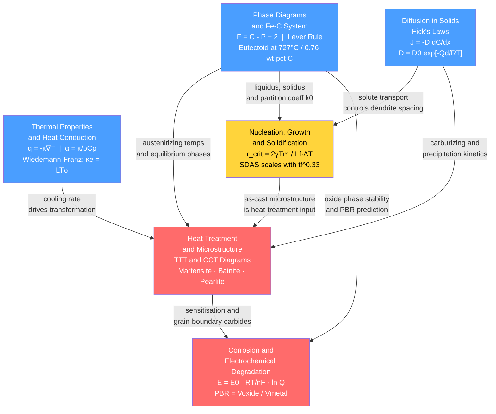

# Thermal and Phase Behavior — Map of Content

> [!info] How to use this map
> Start with **Fundamentals**, follow the arrows, and use the Learning Path below as your guide.
> Each node links to a full note. Come back to this map when you feel lost.

This section bridges thermodynamics and kinetics: it explains how phases form and transform under temperature changes, how atoms migrate through solid lattices, and how the resulting microstructures determine a material's resistance to heat, mechanical load, and electrochemical attack. All six notes converge on steel — the most-engineered alloy on Earth — but the principles extend across every solid material class from aluminium castings to ceramic turbine coatings.

---

## Concept Map

*(Blue = fundamental entry point, Yellow = bridge node, Red = applied/advanced, arrows = "leads to" or "requires")*

---

## Learning Path

*Recommended order for a first pass through this topic:*

1. [[Thermal_Properties_and_Heat_Conduction]] — establishes the physical laws governing heat flow; Fourier's law and thermal diffusivity $\alpha = \kappa/\rho C_p$ are referenced throughout every subsequent topic when cooling rates matter
2. [[Phase_Diagrams_and_the_Iron_Carbon_System]] — builds the equilibrium stability map; the Fe-C eutectoid reaction at 727 °C is the reference point for every transformation discussed later; introduces the Gibbs phase rule and lever rule as universal tools
3. [[Diffusion_in_Solids_and_Ficks_Laws]] — provides the kinetic engine; Fick's laws and the Arrhenius diffusivity underpin carburizing case-depth calculations, precipitation sequences, and solidification solute redistribution
4. [[Nucleation_Growth_and_Solidification]] — explains how phases actually nucleate and grow; connects equilibrium driving force to real microstructures via critical nucleus theory, constitutional undercooling, and dendritic arm spacing
5. [[Heat_Treatment_and_Microstructure]] — synthesises all four prior notes into engineering practice; TTT/CCT diagrams encode the competition between diffusion, nucleation, and cooling rate; covers martensite, bainite, annealing, and age hardening
6. [[Corrosion_and_Electrochemical_Degradation]] — examines long-term electrochemical degradation; microstructure from heat treatment (sensitisation, retained austenite) and phase stability from diagrams (PBR, passivation domains) directly set corrosion resistance

---

## All Notes in This Topic

| Note | Key Equation | Level |
|------|-------------|-------|
| [[Phase_Diagrams_and_the_Iron_Carbon_System]] | $F = C - P + 2$; Lever Rule $W_\beta = (C_0 - C_\alpha)/(C_\beta - C_\alpha)$ | Beginner–Graduate |
| [[Diffusion_in_Solids_and_Ficks_Laws]] | $\partial C/\partial t = D\,\partial^2 C/\partial x^2$; $D = D_0\,e^{-Q_d/RT}$ | Beginner–Graduate |
| [[Nucleation_Growth_and_Solidification]] | $r^* = 2\gamma_{SL}\,T_m / (L_f\,\Delta T)$; SDAS $\propto t_f^{1/3}$ | Intermediate–Graduate |
| [[Heat_Treatment_and_Microstructure]] | $f_M = 1 - \exp[-0.011\,(M_s - T)]$; Hollomon-Jaffe $P = T(C + \log t)$ | Intermediate |
| [[Thermal_Properties_and_Heat_Conduction]] | $\mathbf{q} = -\kappa\nabla T$; $\alpha = \kappa/(\rho C_p)$; Wiedemann-Franz $\kappa_e = LT\sigma$ | Beginner–Graduate |
| [[Corrosion_and_Electrochemical_Degradation]] | Nernst $E = E^\circ - \frac{RT}{nF}\ln Q$; PBR $= V_\text{oxide}/V_\text{metal}$ | Beginner–Graduate |

---

## Key Questions This Topic Answers

- What determines whether a steel becomes hard martensite, tough bainite, or soft pearlite when cooled from austenite — and how fast is fast enough?
- How does carbon diffuse into a steel surface during carburizing, and what time-temperature combination achieves a target case depth?
- Why do aluminium and stainless steel resist corrosion in air while plain iron continues to rust, and what is the role of the Pilling-Bedworth ratio?
- How does the solidification microstructure — dendrite arm spacing, columnar-to-equiaxed grain transition — propagate through heat treatment to affect final mechanical properties?
- What does the Fe-C phase diagram predict about the room-temperature microstructure of a 0.4 wt% C steel cooled at different rates?
- How do alloying elements shift the TTT nose, and what is the physical mechanism by which Cr, Mo, or Ni improve hardenability?

---

## Connections to Other Topics

- [[_MOC_Crystal_Structure_and_Bonding]] — crystal structure controls phase stability and diffusion: BCC vs. FCC iron sets carbon solubility and interstitial site geometry; bonding anharmonicity governs thermal expansion; all notes in this section build on crystal-structure foundations
- [[_MOC_Mechanical_Properties]] — heat treatment choices (martensite hardness, grain size after recrystallization, precipitate distribution from age hardening) directly set the yield strength, toughness, and fatigue life explored in that section; the two sections are inseparable in practice
- [[_MOC_MaterialsScience_Master]] — master entry point for the full Materials Science vault
