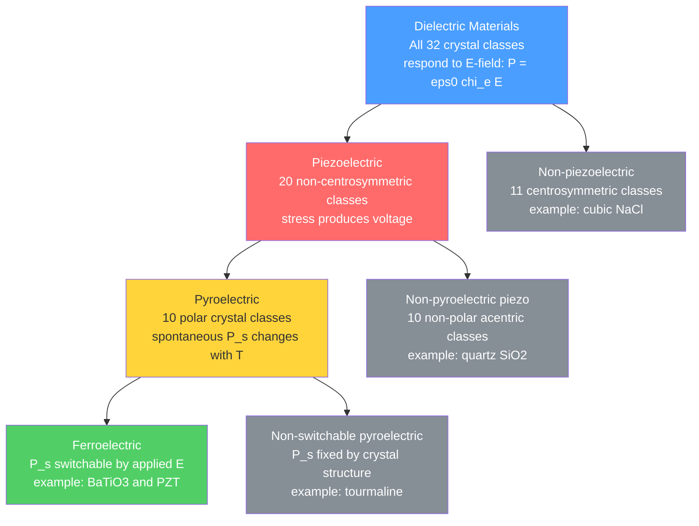

# Dielectrics, Piezoelectrics, and Ferroelectrics

> [!abstract] TL;DR
> A dielectric is any insulator that stores energy by electric polarization; the non-centrosymmetric subset are piezoelectric (stress produces voltage and vice versa); the polar switchable subset are ferroelectric — these three nested material classes underpin capacitors, ultrasound transducers, quartz oscillators, atomic force microscope actuators, and non-volatile ferroelectric RAM.

---

## Intuition

**Analogy:** Squeezing a piezoelectric crystal is like squeezing a lemon: mechanical pressure forces internal charge separation and produces a measurable electrical "juice" at the terminals. Release the pressure and the juice stops. Apply a voltage instead and the lemon physically deforms — that is the converse effect. A ferroelectric goes one step further: it retains a permanent internal charge imbalance (spontaneous polarization) even with no applied field, like a lemon that stays partially squeezed by itself and only fully relaxes when you push hard in the opposite direction.

The three phenomena form nested Russian dolls based on crystal symmetry. All ferroelectrics are pyroelectric (their spontaneous polarization changes with temperature). All pyroelectrics are piezoelectric. All piezoelectrics are dielectrics. But only 20 of the 32 crystal point groups lack an inversion center and are therefore piezoelectric, only 10 of those have a unique polar axis and are pyroelectric, and only those with a switchable polar axis are ferroelectric. Symmetry is the master gatekeeper at every level.

---

## How It Works

### Core Mechanics

**1. Electric polarization and the dielectric constant**

When an electric field $\vec{E}$ is applied to a dielectric, bound charges shift slightly — even by picometres — creating a net dipole moment per unit volume, the polarization $\vec{P}$:

$$\vec{P} = \varepsilon_0 \chi_e \vec{E}$$

where $\chi_e$ is the dimensionless electric susceptibility. The relative permittivity (dielectric constant) is:

$$\varepsilon_r = 1 + \chi_e$$

The electric displacement field $\vec{D} = \varepsilon_0 \varepsilon_r \vec{E}$ replaces $\vec{E}$ in Gauss's law for media. For a parallel-plate capacitor of plate area $A$ and separation $d$:

$$C = \frac{\varepsilon_0 \varepsilon_r A}{d}$$

The dielectric multiplies capacitance by $\varepsilon_r$. Representative values: vacuum $\varepsilon_r = 1$; polyethylene $\approx 2.3$; alumina $\approx 9$; BaTiO₃ near $T_c$: $\approx 10\,000$.

**2. Clausius-Mossotti relation**

Microscopic molecular polarizability $\alpha$ (units C m² V⁻¹) connects to macroscopic $\varepsilon_r$ through the Lorentz local-field correction:

$$\frac{\varepsilon_r - 1}{\varepsilon_r + 2} = \frac{N\alpha}{3\varepsilon_0}$$

where $N$ is the number density of polarizable units (m⁻³). This is the bridge between the microscopic and macroscopic descriptions of a dielectric. For optical frequencies, replacing $\varepsilon_r$ with $n_{\rm opt}^2$ gives the Lorenz-Lorentz relation.

**3. Piezoelectric constitutive relations**

A piezoelectric crystal has no center of inversion symmetry. Mechanical stress produces electric polarization (direct effect — sensor mode) and a field produces mechanical strain (converse effect — actuator mode). In compact matrix (Voigt) form where $i$ = 1,2,3 and $j$ = 1,...,6:

$$D_i = d_{ij}\,T_j \qquad \text{(direct: stress} \to \text{charge)}$$
$$S_j = d_{ij}\,E_i \qquad \text{(converse: field} \to \text{strain)}$$

$d_{ij}$ is the piezoelectric strain coefficient matrix (C N⁻¹ = m V⁻¹). Crystal symmetry determines which of the 18 elements are nonzero. Typical magnitudes: quartz $d_{11} \approx 2.3$ pC N⁻¹; PZT $d_{33} \approx 300$–600 pC N⁻¹.

The dimensionless electromechanical coupling factor $k$ measures the fraction of input energy converted:

$$k^2 = \frac{d_{ij}^2}{\varepsilon_r^T \cdot s^E}$$

where $s^E$ is the elastic compliance at constant field. Values: quartz $k \approx 0.09$; PZT-5H $k_{33} \approx 0.75$.

**4. Ferroelectric order, hysteresis, and Curie-Weiss law**

Below the Curie temperature $T_c$, a ferroelectric crystal adopts a polar structure with spontaneous polarization $\vec{P}_s \neq 0$ in zero field. The polarization direction is switchable by a sufficiently large applied field, producing the signature P–E hysteresis loop with:

- **Saturation polarization** $P_{\rm sat}$: all domains aligned with field
- **Remanent polarization** $P_r$: polarization remaining when field returns to zero
- **Coercive field** $E_c$: field magnitude required to reduce net polarization to zero

Above $T_c$ the dielectric constant diverges following the **Curie-Weiss law**:

$$\varepsilon_r = \frac{C}{T - T_c} \qquad (T > T_c)$$

where $C$ is the material-specific Curie constant. This divergence reflects the softening of the restoring force against polar distortion as the lattice approaches instability.

### Flow / Architecture



---

## Key Concepts

### Secondary

**What is electric polarization physically?**

Every atom has a positive nucleus surrounded by a negative electron cloud. In an external field the cloud shifts one way and the nucleus the other — even by a fraction of a picometre — creating a microscopic dipole. Sum this over ~10²³ atoms per cm³ and you get a macroscopic polarization $P$ (C m⁻²) that partially cancels the applied field inside the material. A larger $P$ for the same $E$ means a larger $\varepsilon_r$, more charge stored per volt, and more energy stored per unit volume. The dielectric is not magic: it is simply the aggregate electrical deformation of a solid.

**Four polarization mechanisms and their frequency cutoffs:**

| Mechanism | Physical process | Upper frequency limit | Example material |
|-----------|-----------------|----------------------|-----------------|
| Space charge (interfacial) | Mobile charges pile up at interfaces or grain boundaries | ~10³ Hz | Polycrystalline ceramics |
| Orientational (dipolar) | Permanent molecular dipoles rotate to align with field | ~10¹⁰ Hz (microwave) | Water, polar polymers |
| Ionic | Positive and negative ion sublattices shift relative to each other | ~10¹³ Hz (infrared) | NaCl, BaTiO₃ |
| Electronic | Electron cloud shifts relative to nucleus | ~10¹⁵ Hz (optical/UV) | All materials |

Each mechanism "drops out" as frequency exceeds its characteristic relaxation frequency — the dipoles can no longer follow the oscillating field. This produces a staircase decrease in $\varepsilon'(\omega)$ with an absorption peak $\varepsilon''(\omega)$ at each relaxation frequency. Water at radio frequencies: $\varepsilon_r \approx 80$ (all mechanisms active). Water at optical frequency: $\varepsilon_r^{\rm opt} = n^2 \approx 1.77$ (only electronic polarization).

**Piezoelectricity in everyday devices:**

- **Quartz crystal oscillators** in watches, microcontrollers, and GPS: a precisely cut quartz disk resonates mechanically at a frequency set by its geometry; the piezo effect converts the resonance into a stable electrical reference signal. Frequency accuracy: parts per million.
- **Gas lighter spark igniters**: a sharp mechanical impact on a PZT ceramic element produces several kilovolts instantaneously, igniting the gas.
- **Ultrasound probes**: PZT discs driven at 1–20 MHz emit acoustic pulses; returning echoes strain the disc and generate voltages that map tissue boundaries.
- **Inkjet print heads**: thermal or piezo (EPSON) heads deflect a PZT membrane to eject precisely controlled droplets.

**Ferroelectric memory (FeRAM):**

A ferroelectric capacitor stores a bit as the direction of $P_r$: "up polarization" = logic 1, "down polarization" = logic 0. Switching requires only ~10⁻¹³ J per bit — far less than a flash cell — and the state survives power-off. Commercial FeRAM (TI FM25V series, Fujitsu MB85RS family) uses SrBi₂Ta₂O₉ or PZT thin films and offers near-unlimited write endurance (>10¹² cycles vs. ~10⁵ for NAND flash).

---

### Undergraduate

**Dielectric loss and complex permittivity:**

In an AC field a lossy dielectric is described by complex permittivity:
$$\varepsilon^* = \varepsilon' - i\varepsilon''$$
where $\varepsilon'$ stores energy and $\varepsilon''$ dissipates it as heat (dielectric heating). The loss tangent:
$$\tan\delta = \frac{\varepsilon''}{\varepsilon'}$$
is the key figure of merit. Low-loss RF substrates (PTFE, Rogers RT/duroid): $\tan\delta \approx 10^{-4}$. Microwave oven water: $\tan\delta \approx 0.2$ — intentionally large. BaTiO₃ near $T_c$: $\tan\delta$ rises steeply due to domain-wall losses.

**Debye relaxation model (single mechanism):**
$$\varepsilon^*(\omega) = \varepsilon_\infty + \frac{\varepsilon_s - \varepsilon_\infty}{1 + i\omega\tau}$$

Separating real and imaginary parts:
$$\varepsilon'(\omega) = \varepsilon_\infty + \frac{\varepsilon_s - \varepsilon_\infty}{1 + (\omega\tau)^2}, \qquad \varepsilon''(\omega) = \frac{(\varepsilon_s - \varepsilon_\infty)\,\omega\tau}{1 + (\omega\tau)^2}$$

$\varepsilon_s$ = low-frequency (static) limit; $\varepsilon_\infty$ = high-frequency limit; $\tau$ = relaxation time. The loss peak $\varepsilon''_{\rm max} = (\varepsilon_s - \varepsilon_\infty)/2$ occurs at $\omega\tau = 1$. For multiple mechanisms, sum Debye terms — giving the staircase dispersion shown in the Python demo.

**Clausius-Mossotti and temperature dependence:**

Total molecular polarizability sums over contributions:
$$\alpha = \alpha_{\rm el} + \alpha_{\rm ion} + \alpha_{\rm orient}$$

The orientational contribution from permanent dipoles of moment $\mu$ (Langevin formula):
$$\alpha_{\rm orient} = \frac{\mu^2}{3k_BT}$$

This $1/T$ dependence is why water's $\varepsilon_r$ falls from 87 at 0°C to 55 at 100°C. Substituting into Clausius-Mossotti gives the Debye equation for polar liquids.

**Piezoelectric tensor — practical reduction by symmetry:**

The full $d_{ijk}$ tensor has 27 components; symmetry of the stress tensor reduces to 18; crystal point group symmetry reduces further:

| Material | Point group | Nonzero $d_{ij}$ | Key values (pC N⁻¹) |
|----------|-------------|------------------|----------------------|
| Quartz SiO₂ | 32 (trigonal) | $d_{11}, d_{12}, d_{26}$ | $d_{11} = 2.3$ |
| PZT (poled) | 4mm (tetragonal) | $d_{33}, d_{31}, d_{15}$ | $d_{33} \approx 400$ |
| PVDF polymer | mm2 | $d_{31}, d_{32}, d_{33}$ | $d_{31} \approx 23$ |
| ZnO | 6mm | $d_{33}, d_{31}, d_{15}$ | $d_{33} \approx 12$ |

For a PZT disc of thickness $t$ and area $A$ loaded by force $F$:

$$V_{\rm oc} = \frac{d_{33}\,F\,t}{\varepsilon_0 \varepsilon_r^T A}$$

The open-circuit voltage is maximised by large $d_{33}/\varepsilon_r$ — the piezoelectric voltage constant $g_{33} = d_{33}/(\varepsilon_0 \varepsilon_r)$.

**BaTiO₃ crystal structures and phase transitions:**

BaTiO₃ is the archetypal ferroelectric with perovskite structure (ABO₃). Above $T_c = 393$ K the Ti⁴⁺ ion sits at the centro-symmetric cube centre — no dipole, no ferroelectricity. Below $T_c$ the Ti⁴⁺ shifts off-centre, breaking symmetry and creating a permanent dipole.

| Temperature range | Structure | P_s direction | Notes |
|-------------------|-----------|---------------|-------|
| $T > 393$ K | Cubic | None | Paraelectric; $\varepsilon_r \approx 10^4$ near $T_c$ |
| 278–393 K | Tetragonal | [001] | P_s ≈ 26 µC cm⁻², $c/a \approx 1.01$ |
| 183–278 K | Orthorhombic | [011] | First-order transition at 278 K |
| $T < 183$ K | Rhombohedral | [111] | Largest $P_s$ |

The large $\varepsilon_r$ near each transition makes BaTiO₃-based ceramics ideal for capacitors. Dopant substitution (Sr²⁺ for Ba²⁺, Zr⁴⁺ for Ti⁴⁺) spreads and broadens the peak — yielding the flat $\varepsilon_r(T)$ of commercial X7R and X5R MLCCs.

**Pyroelectric coefficient:**

In a pyroelectric, the spontaneous polarization changes with temperature:
$$\gamma = \frac{dP_s}{dT}$$
Units: C m⁻² K⁻¹. The short-circuit pyroelectric current from a detector element of area $A$ subjected to temperature rate $dT/dt$:
$$I_{\rm pyro} = \gamma A \frac{dT}{dt}$$

Representative values: LiTaO₃ $\gamma \approx -230\,\mu$C m⁻² K⁻¹; PZT $\approx -380\,\mu$C m⁻² K⁻¹. Pyroelectric IR detectors (passive IR motion sensors in security lights) exploit this effect — no cooling required, unlike photon detectors.

---

### Graduate

**Landau theory of the ferroelectric phase transition:**

Near $T_c$, the Gibbs free energy is expanded in even powers of polarization $P$ (the order parameter, constrained to be even by time-reversal symmetry in a non-magnetic ferroelectric):

$$G = G_0 + \frac{a}{2}P^2 + \frac{b}{4}P^4 + \frac{c}{6}P^6 - EP$$

where $a = a_0(T - T_c^*)$ changes sign at $T_c^*$. Minimising $\partial G/\partial P = 0$:

- **Second-order (continuous) transition** ($b > 0$, e.g., LiNbO₃, KNbO₃): $P_s = \sqrt{-a/b} \propto (T_c - T)^{1/2}$ grows continuously from zero; susceptibility $\chi \propto 1/|T - T_c|$ diverges (Curie-Weiss). No latent heat.

- **First-order (discontinuous) transition** ($b < 0$, e.g., BaTiO₃ cubic–tetragonal): the $c P^6$ term stabilises the expansion; $P_s$ jumps discontinuously at $T_c$; hysteresis in the transition temperature exists on heating vs. cooling. Latent heat is released.

The dielectric susceptibility near the transition: $\chi = \varepsilon_r - 1 \approx C/(T - T_c)$ for $T > T_c$; $\chi = C/[2(T_c - T)]$ for $T < T_c$ (second-order case, where the $T < T_c$ slope is half the $T > T_c$ slope).

**Soft phonon mode and the Cochran rule:**

The ferroelectric instability is microscopically driven by a zone-centre transverse optic (TO) phonon branch softening. Its frequency approaches zero:
$$\omega_{\rm TO}^2 = A(T - T_c) \propto (T - T_c)$$

This is the Cochran rule: the lattice becomes mechanically unstable (the short-range repulsion no longer overcomes the long-range dipole-dipole attraction) and at $T_c$ the soft mode "freezes in," giving the static polar distortion. The Lyddane-Sachs-Teller (LST) relation connects to the dielectric constants:
$$\frac{\omega_{\rm LO}^2}{\omega_{\rm TO}^2} = \frac{\varepsilon_s}{\varepsilon_\infty}$$

As $\omega_{\rm TO} \to 0$, $\varepsilon_s \to \infty$ — the divergence of $\varepsilon_r$ at $T_c$ is the macroscopic signature of the soft phonon.

**Electrocaloric effect:**

An applied field orders dipoles, reducing entropy. Removing the field adiabatically cools the material. Using the Maxwell relation $(\partial S/\partial E)_T = (\partial P/\partial T)_E = \gamma$:

$$\Delta T = -\frac{T}{\rho c_p} \int_{E_1}^{E_2} \left(\frac{\partial P}{\partial T}\right)_E dE \approx -\frac{T\,\gamma\,\Delta E}{\rho c_p}$$

Giant electrocaloric effects ($\Delta T > 10$ K near $T_c$) have been measured in PbZr₀.₉₅Ti₀.₀₅O₃ thin films at modest voltages (~25 V) because the large $\gamma$ near $T_c$ and the small thermal mass of thin films allow rapid, efficient cycling. Solid-state electrocaloric refrigerators (no moving parts, no CFCs) are an active research direction.

**Multiferroics and magnetoelectric coupling:**

Multiferroics simultaneously exhibit two or more ferroic orders (ferroelectric + ferromagnetic, ferroelectric + antiferromagnetic, etc.). The magnetoelectric effect couples them:
$$\Delta P_i = \alpha_{ij}^{\rm ME} \Delta B_j, \qquad \Delta M_i = \alpha_{ij}^{\rm ME} \Delta E_j$$

BiFeO₃ is the prototypical room-temperature multiferroic: $T_c^{\rm FE} \approx 1103$ K, $T_N^{\rm AFM} \approx 643$ K, with the electric polarization driven by a Bi lone-pair mechanism and the magnetic order by Fe–O–Fe superexchange. Applications include four-state logic (two bits per cell: P up/down, M up/down) and electrically written, magnetically read memory cells.

**Domain walls and their physics:**

Ferroelectric domains are regions of uniform $\vec{P}_s$. Domain walls separating them are 1–10 unit cells thick. For BaTiO₃ tetragonal phase, symmetry permits 180° walls (antiparallel P_s, no strain mismatch) and 90° walls (perpendicular P_s, with elastic compatibility constraint $a/c = $ const). Domain wall motion under applied field drives the macroscopic P–E hysteresis loop shape. In thin films, 180° domain walls are sometimes conducting due to charge accumulation (fixed by the bound charge discontinuity $\sigma_b = \vec{P} \cdot \hat{n}$) — enabling domain-wall nanoelectronics where the wall itself is the active device element.

**Key material comparison:**

| Property | Quartz SiO₂ | PZT 52/48 | PVDF | BaTiO₃ ceramic |
|----------|------------|-----------|------|----------------|
| $d_{33}$ (pC N⁻¹) | 2.3 | ~400 | ~-33 | ~190 |
| $\varepsilon_r$ (1 kHz) | 4.5 | ~1300 | ~12 | ~1700 |
| $T_{\rm Curie}$ (°C) | — | ~350 | — | 120 |
| $k_{33}$ | 0.09 | 0.72 | 0.20 | 0.48 |
| $\tan\delta$ | 0.0001 | 0.02 | 0.02 | 0.01 |
| Key use | Frequency reference | Actuators, sonar | Flexible sensors | MLCC capacitors |

---

## Python Demo

```python
import numpy as np
import matplotlib.pyplot as plt

# ── Panel 1: Dielectric dispersion — four polarization mechanisms ────────────
# Debye superposition: eps'(w)  = eps_inf + sum[ Deps_i / (1 + (w*tau_i)^2) ]
#                     eps''(w) = sum[ Deps_i * w*tau_i / (1 + (w*tau_i)^2) ]

freq  = np.logspace(0, 18, 6000)    # 1 Hz to 1e18 Hz
omega = 2 * np.pi * freq

# Each tuple: (label, delta_epsilon, relaxation_time_s)
mechanisms = [
    ("Space charge",   8.0,  1e-3 ),   # ~300 Hz  — interfacial/mobile charges
    ("Orientational", 10.0,  1e-10),   # ~1.6 GHz — dipole rotation (microwave)
    ("Ionic",          5.0,  1e-13),   # ~1.6 THz — ion displacement (infrared)
    ("Electronic",     2.5,  3e-16),   # ~500 THz — electron cloud (optical/UV)
]

eps_inf   = 1.0
eps_prime = np.full_like(freq, eps_inf)
eps_dbl   = np.zeros_like(freq)

for _, delta_e, tau in mechanisms:
    wt2        = (omega * tau) ** 2
    eps_prime += delta_e / (1.0 + wt2)
    eps_dbl   += delta_e * omega * tau / (1.0 + wt2)

fig, (ax1, ax2) = plt.subplots(1, 2, figsize=(14, 5))

ax1.semilogx(freq, eps_prime, "b-",  lw=2.5, label=r"$\varepsilon'(\omega)$ — storage")
ax1.semilogx(freq, eps_dbl,   "r--", lw=2.0, label=r"$\varepsilon''(\omega)$ — loss")

ann_colors = ["#e67e22", "#8e44ad", "#27ae60", "#2980b9"]
for (name, _, tau), col in zip(mechanisms, ann_colors):
    f_r = 1.0 / (2.0 * np.pi * tau)
    ax1.axvline(f_r, color=col, linestyle=":", lw=1.5, alpha=0.7)
    ax1.text(f_r * 2.0, 24.5, name, color=col, fontsize=8, rotation=90, va="top")

ax1.set_xlabel("Frequency (Hz)", fontsize=11)
ax1.set_ylabel("Relative permittivity", fontsize=11)
ax1.set_title("Dielectric Dispersion: Stepwise Dropout of Polarization Mechanisms", fontsize=10)
ax1.legend(fontsize=10)
ax1.set_ylim(-1, 30)
ax1.set_xlim(1, 1e18)
ax1.grid(True, alpha=0.3)

# ── Panel 2: Ferroelectric P-E hysteresis loop ──────────────────────────────
# Upper branch (E swept +Emax to -Emax): P_up(E)   = P_sat * tanh((E + E_c) / w)
# Lower branch (E swept -Emax to +Emax): P_down(E) = P_sat * tanh((E - E_c) / w)
# At E = 0: P_up = P_sat * tanh(E_c/w) = P_r  (remanent polarization)
# P_up = 0 when E = -E_c  (coercive field)  -- correct by construction

E_max = 100.0   # kV/cm  applied field amplitude
E_c   = 25.0    # kV/cm  coercive field  (BaTiO3 ~ 10-100 kV/cm)
P_sat = 26.0    # uC/cm2 saturation polarization  (BaTiO3 ~ 26 uC/cm2)
w     = 20.0    # kV/cm  switching width (controls loop squareness)

E_up   = np.linspace( E_max, -E_max, 1000)
E_down = np.linspace(-E_max,  E_max, 1000)

P_up   = P_sat * np.tanh((E_up   + E_c) / w)
P_down = P_sat * np.tanh((E_down - E_c) / w)

P_r = float(P_sat * np.tanh(E_c / w))   # remanent polarization

ax2.plot(E_up,   P_up,   "C0-", lw=2.5, label="P-E hysteresis loop")
ax2.plot(E_down, P_down, "C0-", lw=2.5)
ax2.axhline(0, color="k", lw=0.8)
ax2.axvline(0, color="k", lw=0.8)

# Mark key features
ax2.scatter([0, 0],        [ P_r, -P_r], color="C3", zorder=5, s=60)
ax2.scatter([ E_c, -E_c], [0,    0   ], color="C2", zorder=5, s=60)

ax2.annotate(f"+P_r = {P_r:.1f}",
             xy=(0,  P_r), xytext=(7,  P_r + 1.5), fontsize=9,
             arrowprops=dict(arrowstyle="->", lw=0.8))
ax2.annotate(f"-P_r = {P_r:.1f}",
             xy=(0, -P_r), xytext=(7, -P_r - 3.5), fontsize=9,
             arrowprops=dict(arrowstyle="->", lw=0.8))
ax2.annotate(f"+E_c = {E_c:.0f}",
             xy=( E_c, 0), xytext=( E_c + 3,  4), fontsize=9)
ax2.annotate(f"-E_c = {E_c:.0f}",
             xy=(-E_c, 0), xytext=(-E_c - 28, 4), fontsize=9)

ax2.set_xlabel("Electric Field E (kV/cm)", fontsize=11)
ax2.set_ylabel(r"Polarization P ($\mu$C/cm$^2$)", fontsize=11)
ax2.set_title(r"Ferroelectric P$-$E Hysteresis Loop (BaTiO$_3$-type)", fontsize=10)
ax2.legend(fontsize=10)
ax2.grid(True, alpha=0.3)

plt.tight_layout()
plt.savefig("dielectrics_piezo_ferro.png", dpi=150, bbox_inches="tight")
plt.show()
```

---

## Real-World Applications

> **Example — Medical Ultrasound (Siemens Healthineers, GE Healthcare):** A phased-array ultrasound probe contains 128–256 PZT elements, each ~0.2 mm wide, driven at 2–18 MHz. The converse piezo effect converts a 100 V electrical pulse into a pressure wave (emitting); reflected echoes strain the PZT and produce voltages (receiving). PZT's $d_{33} \approx 400$ pC N⁻¹ and coupling factor $k_{33} \approx 0.72$ make it ~25× more efficient than quartz for broadband transduction. Acoustic matching layers (quarter-wave impedance transformers) bridge the mechanical impedance gap between PZT ($Z \approx 30$ MRayl) and soft tissue ($Z \approx 1.5$ MRayl).

> **Example — Atomic Force Microscope Z-piezo (Bruker Dimension, Asylum Research):** The Z-axis feedback actuator is a PZT tube scanner. With $d_{33} \approx 300$ pm V⁻¹, a 100 V drive produces $\Delta z \approx 30$ nm of deflection — sufficient for angstrom-resolution topography. PZT creep (logarithmic domain-wall relaxation) and hysteresis require closed-loop capacitive sensing to maintain nanometre-accurate positioning over hours.

> **Example — MLCC High-Capacitance Capacitors (Murata, TDK):** Multi-layer ceramic capacitors use BaTiO₃-based dielectrics ($\varepsilon_r \approx 3000$–4000) with $\sim$500 ceramic layers per component, each 1 µm thick. Codopants (Sr²⁺ for Ba²⁺, Mg²⁺, rare earths) broaden and flatten the $\varepsilon_r(T)$ peak (X5R/X7R specifications require $\Delta C/C < \pm 15\%$ over the rated temperature range). A 10 µF capacitor fits in an 0402 footprint (1.0 × 0.5 mm) — only possible because of BaTiO₃'s giant $\varepsilon_r$.

> **Example — FeRAM Non-Volatile Memory (Texas Instruments, Fujitsu):** A 1T-1C FeRAM cell stores data as the direction of remnant polarization $P_r$ in a PZT or SBT (SrBi₂Ta₂O₉) capacitor. Write endurance exceeds $10^{12}$ cycles vs. $\sim 10^5$ for NAND flash; write speed is $\sim$150 ns; active power is ~10× lower. Used in smart meters, RFID tags, and implantable medical devices where write endurance and low power are critical.

---

## Common Pitfalls

- **Depolarisation above the Curie temperature** — PZT must never be heated above $T_c \approx 350°$C (for soft PZT) or the poling is permanently destroyed. Even prolonged use above 150–200°C causes measurable depoling (logarithmic aging). Always check the maximum operating temperature in the manufacturer datasheet before placing PZT in an autoclave-sterilised medical device or a car engine bay.

- **Selecting material by $d_{33}$ alone** — The piezoelectric coupling factor $k^2$ governs actual energy conversion efficiency. A high-$d_{33}$ material with low $k$ stores most of the mechanical work as parasitic elastic strain. The receivable electrical energy scales as $k^2$, not $d_{33}$. Compare: PVDF has $d_{33} \approx -33$ pC N⁻¹ and $k_{33} \approx 0.20$; hard PZT-4 has $d_{33} \approx 289$ pC N⁻¹ and $k_{33} \approx 0.70$. For power generation, $k^2$ matters more.

- **Ignoring dielectric loss at high frequency** — A high-$\varepsilon_r$ dielectric is not automatically a good high-frequency capacitor. Near $T_c$, BaTiO₃ has $\tan\delta > 0.05$ due to domain-wall losses. For RF decoupling capacitors (>100 MHz), $\tan\delta < 0.001$ is typically required; use NP0/C0G grade (temperature-stable, low-loss) ceramics, not X7R BaTiO₃.

- **PZT aging and creep in precision instruments** — Soft PZT ($d_{33}$ is large) undergoes logarithmic aging: $d_{33}$ decreases ~1–3% per decade of time as domain walls gradually re-pin at defects. Specifications are quoted 24 h post-poling. In sonar arrays or AFM scanners requiring stable sensitivity over years, use hard PZT or quartz. For dynamic operation (AFM in contact mode), implement closed-loop position feedback.

- **Treating ferroelectric polarization as linear near $E_c$** — The small-signal $\varepsilon_r$ is valid only for $E \ll E_c$. As the field approaches $E_c$, the response is strongly nonlinear and hysteretic. Using the linear $\varepsilon_r$ to calculate energy storage in a ferroelectric capacitor at voltages near the switching threshold significantly overestimates the recoverable energy; use the P–E loop area directly.

- **Lead content in PZT — regulatory compliance** — PZT contains ~60 wt% Pb (lead), restricted under EU RoHS and WEEE directives in consumer electronics. Industrial, medical, and aerospace exemptions currently exist, but are under review. For new consumer product designs, consider lead-free alternatives: K₀.₅Na₀.₅NbO₃ (KNN), BaTiO₃, or BNT-BT systems, which now approach $d_{33} \approx 200$–300 pC N⁻¹ with appropriate texturing.

---

## Related Concepts

- [[Crystal_Systems_and_Space_Groups]] — crystal point group symmetry (specifically the absence of an inversion center) is the necessary condition for piezoelectricity; the presence of a unique polar axis is the condition for pyroelectricity
- [[Chemical_Bonding_in_Solids]] — bond ionicity and the degree of d-orbital hybridisation (as in Ti–O bonds) govern how easily ion sublattices can be displaced and thus the magnitude of $P_s$
- [[Phonons_and_Lattice_Dynamics]] — ionic polarization is the response of optical phonon modes to an applied field; the ferroelectric transition is driven by a soft transverse optic phonon whose frequency goes to zero at $T_c$
- [[Electronic_Band_Structure]] — electronic polarizability arises from virtual interband transitions; the high-frequency dielectric constant $\varepsilon_\infty = n_{\rm opt}^2$ encodes the band gap through the Penn model
- [[Stress_Strain_and_Elastic_Moduli]] — piezoelectric effect directly couples the elastic stiffness tensor and the dielectric tensor; the full constitutive relations are a unified system of elastic and dielectric equations
- [[Semiconductors_Intrinsic_and_Extrinsic]] — ferroelectric field-effect transistors (FeFET) replace the gate oxide of a MOSFET with a ferroelectric, enabling non-volatile transistor memory; dielectric screening also modifies carrier behavior in adjacent semiconductors
- [[Electromagnetic_Waves_and_Radiation]] — the complex permittivity $\varepsilon^*(\omega)$ appears directly in the wave equation for EM propagation; $\varepsilon''$ governs attenuation and microwave heating; the Fresnel equations at dielectric interfaces use $\varepsilon_r$
- [[Magnetism_and_Biot_Savart]] — multiferroics combine electric and magnetic order; the magnetoelectric coupling tensor $\alpha_{ij}^{\rm ME}$ is the electric-field analog of the piezoelectric tensor, linking $\Delta P$ to $\Delta H$ and $\Delta M$ to $\Delta E$
- [[Phase_Transitions_and_Critical_Phenomena]] — ferroelectric transitions are canonical soft-mode phase transitions described by Landau theory; the critical exponents, divergence of $\varepsilon_r$, and universality class are central topics in the physics of phase transitions
- [[Thermal_Properties_and_Heat_Conduction]] — the pyroelectric effect (heat → charge) and electrocaloric effect (field → cooling) directly link polarization dynamics to thermal energy; phonon thermal conductivity anomalies near $T_c$ also affect device thermal management
- [[Optical_Properties_and_Photonic_Materials]] — the electro-optic (Pockels) effect in non-centrosymmetric crystals (LiNbO₃, KTP) is the optical-frequency analog of piezoelectricity; second-harmonic generation also requires broken inversion symmetry
- [[Nano_Electronics_and_MEMS_NEMS]] — MEMS piezoelectric energy harvesters, PZT ink-jet actuators, micromirror arrays, and FeRAM are primary application domains for the materials covered in this note
- [[_MOC_Electronic_Magnetic_and_Optical_Properties]] — parent map of content for this vault section

---

## Review Questions

**Secondary (conceptual):**

1. Water has $\varepsilon_r \approx 80$ at radio frequencies but ice has $\varepsilon_r \approx 3$ at the same frequency, even though both are made of H₂O molecules with the same permanent dipole moment $\mu = 1.85$ D. Why does freezing drop the dielectric constant so dramatically, and which polarization mechanism is affected?

2. A gas piezo spark lighter uses a PZT ceramic. Could you replace it with a quartz crystal of the same dimensions and achieve the same spark? Justify using the relevant material properties.

**Undergraduate (scenario-based):**

3. The Curie constant for BaTiO₃ is $C = 1.7 \times 10^5$ K and $T_c = 393$ K. Using the Curie-Weiss law, calculate $\varepsilon_r$ at 423 K (30°C above $T_c$). Why does the experimentally measured value at that temperature fall below your prediction, and what physical process causes the deviation?

4. You are designing a MEMS vibration energy harvester to power a wireless sensor node from 1 kHz ambient vibration. Compare PVDF film ($d_{31} = 23$ pC N⁻¹, $k_{31} = 0.20$, flexible, polymer) with PZT-5A film ($d_{31} = -171$ pC N⁻¹, $k_{31} = 0.35$, ceramic). Beyond the coupling coefficients, list at least three additional engineering factors that would influence your material selection and explain the trade-off each represents.

**Graduate (trade-offs):**

5. The electrocaloric effect in PZT thin films near $T_c$ produces $\Delta T \approx 12$ K at $\Delta E = 750$ kV/cm, whereas bulk PZT ceramics show $\Delta T < 1$ K under the same field. Explain (a) why thin-film geometry is required to reach 750 kV/cm without dielectric breakdown; (b) why proximity to $T_c$ is essential; and (c) what two competing requirements constrain the practical cycle rate of an electrocaloric refrigerator based on this material.

---

## Sources

- [Callister, W. D. & Rethwisch, D. G. — *Materials Science and Engineering: An Introduction*, 10th ed., Chapters 18–19 (Wiley, 2018)](https://www.wiley.com/en-us/Materials+Science+and+Engineering%3A+An+Introduction%2C+10th+Edition-p-9781119405498)
- [Lines, M. E. & Glass, A. M. — *Principles and Applications of Ferroelectrics and Related Materials* (Oxford University Press, 1977; reissued 2001)](https://global.oup.com/academic/product/principles-and-applications-of-ferroelectrics-and-related-materials-9780198507789)
- [Jaffe, B., Cook, W. R. & Jaffe, H. — *Piezoelectric Ceramics* (Academic Press, 1971)](https://www.sciencedirect.com/book/9780123795502/piezoelectric-ceramics)
- [Scott, J. F. — "Applications of Modern Ferroelectrics", *Science* 315 (2007) 954–959](https://doi.org/10.1126/science.1129564)
- [Mischenko, A. S. et al. — "Giant Electrocaloric Effect in Thin-Film PbZr₀.₉₅Ti₀.₀₅O₃", *Science* 311 (2006) 1270–1271](https://doi.org/10.1126/science.1123811)

---

#MaterialsScience #Dielectrics #Piezoelectrics #Ferroelectrics #PZT #BaTiO3 #ElectricPolarization #ElectronicProperties #MEMS #Pyroelectricity #Multiferroics
